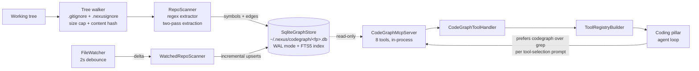
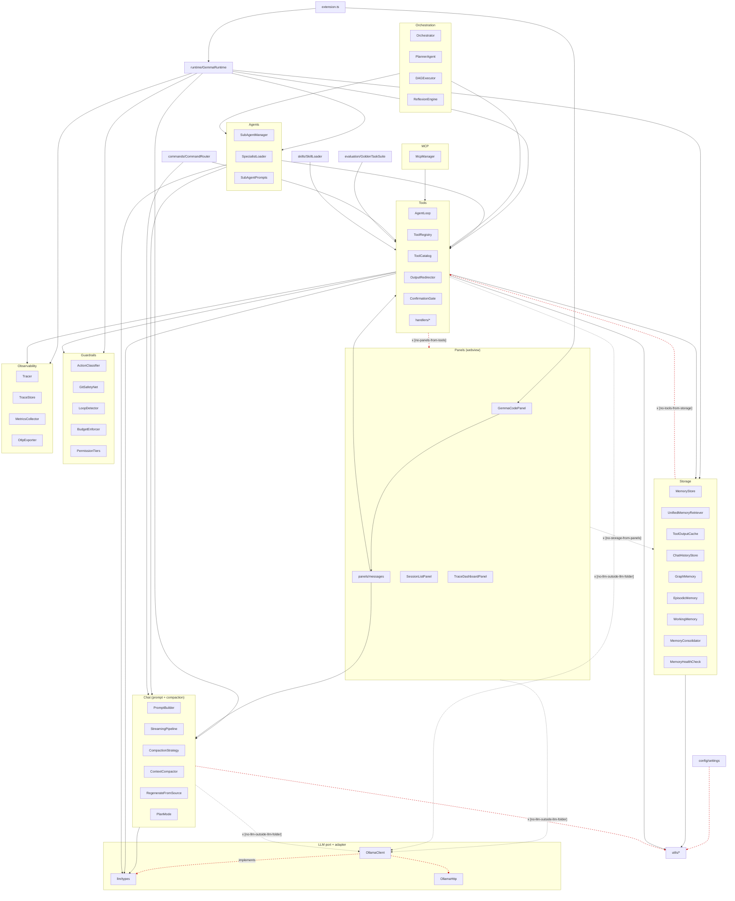

# Architecture

> **Scope of this document.** This file documents the architecture of the **current** code in `src/` — the agentic-coding engine that shipped as Gemma Code v0.1.0 - v0.22.x. The repository is now pivoting to **Nexus**, a four-module local AI desktop application. The v1.0.0 desktop-shell architecture, the `core/` + `modules/coding/` decomposition, the shared-core surfaces (ModelRegistry / MemoryHub / TelemetryBus / SkillCatalog), and the IPC surface are documented under [docs/versions/v1/v1.0.0/architecture.md](docs/v1/v1.0/architecture.md). Until the Phase 2.3 wholesale move lands (tracked in [docs/versions/v1/v1.0.0/known-gaps.md](docs/v1/v1.0/known-gaps.md) under code `MV`), the structures below describe the engine that will become the **Agentic AI Coding** module of Nexus.
>
> For the per-version architecture history, see [docs/archive/versions/v0/v0.2.0/architecture.md](docs/archive/v0/v0.2/architecture.md) through [docs/archive/versions/v0/v0.9.0/](docs/archive/v0/v0.9).

## Layout (v1.0.0)

The v1.0.0 cycle established the canonical top-level layout below. Boundary rules are enforced by [`configs/dependency-cruiser.cjs`](configs/dependency-cruiser.cjs).

```
core/                        shared-core surfaces consumed by every pillar
  registry/ModelRegistry.ts  list / install / remove / inspect models
  memory/MemoryHub.ts        4-layer memory facade
  memory/chunkers/           AST-aware chunker (v1.2.0 Phase 4)
  memory/PrunedDenseIndex.ts LEANN-derived pruned dense index (v1.2.0 Phase 4)
  telemetry/TelemetryBus.ts  in-process pub/sub for GPU + module events
  skills/SkillCatalog.ts     list / load / hot-reload skills (realpath dedup, v1.3.0 Phase 2)
  skills/SkillRenderLine.ts  canonical `- name: desc (file: path)` formatter + budget fallback ladder (v1.3.0 Phase 2/5)
  skills/SkillAuditor.ts     five-report token-budget audit composition (v1.3.0 Phase 3)
  skills/SkillSimilarity.ts  Jaccard-over-shingles near-duplicate detector (v1.3.0 Phase 4)
  skills/SkillUsageScanner.ts session-log usage scanner for the Unused report (v1.3.0 Phase 4)
  storage/                   StorageMigration + canonical ~/.nexus/ paths
  observability/             CommandCompressor (v1.2.0 Phase 2) + redactSecrets + scrubEnv (v1.4.0 Phase 2)
  codegraph/                 SQLite + FTS5 symbol/call-edge graph and 8-tool
                              in-process MCP server (v1.2.0 Phase 3)
  config/MemoryStorageTier.ts  Standard / Pruned tier policy (v1.2.0 Phase 4)

modules/                     per-pillar code (one folder per generative pillar)
  coding/                    Agentic AI Coding (Phase 2.3 wholesale move pending)
  (chat/ added in Phase 4; image/ in Phase 6; video/ in Phase 7)

src/                         pre-v1.0.0 Coding engine (compat host for one cycle)
desktop/                     Tauri shell + Node sidecar (Phase 1)
scripts/installer/           Nexus installer (PyQt5 wizard, renamed from gemma_installer)
bin/nexus-check.mjs          deterministic-checks CLI (renamed from gemma-check)
```

### Local serving gateway + document OCR (v1.16.0)

Later cycles added two sidecar-adjacent surfaces that the v1.0.0 layout above does not name:

- `desktop/sidecar/src/serving/` -- opt-in loopback OpenAI/Anthropic HTTP gateway in front of the model registry (`nexus.serving.enabled`, default off). Loopback bind only, bearer-token auth, inference routes only.
- `core/documents/` -- OCR parse manager used by Chat attachments. Catalog entries: RapidOCR PP-OCRv4 (CPU) and Unlimited-OCR 3B (NVIDIA). The governed `parse_document` agent tool lives at `src/tools/handlers/parseDocument.ts`; composition-root wiring is still deferred (`LSO.P4.B` in [docs/v1/v1.16/known-gaps.md](docs/v1/v1.16/known-gaps.md)).

### Agent-state motion identity (v1.17.0)

The desktop shell (`desktop/src/`) ships an internal motion system with no new frontend dependency:

- `desktop/src/motion/` -- tokens, `useReducedMotion` (halt, not slow), recede-when-active, and precedence (`orb > metal > beam > aurora`).
- `desktop/src/components/agentState/` -- Canvas 2D dotted orbs mapped to Nexus activities.
- `AccentBeam.tsx` -- CSS traveling / breathing border on composers, the idle model dock, and the retained generation-canvas frame.
- `MetalAccent.tsx` -- WebGL liquid-metal ring on Send / Generate / New session, instance-capped at 3, static fallback when WebGL is missing.

Design tokens: [docs/v1/v1.17/design-tokens.md](docs/v1/v1.17/design-tokens.md). Known gaps: [docs/v1/v1.17/known-gaps.md](docs/v1/v1.17/known-gaps.md).

### Code-graph subsystem (v1.2.0 Phase 3)

`core/codegraph/` indexes the working tree into a SQLite + FTS5 graph so the Coding pillar can answer "callers of X", "callees of Y", and "impact radius of Z" via 8 internal MCP tools (`codegraph_search`, `codegraph_context`, `codegraph_trace`, `codegraph_callers`, `codegraph_callees`, `codegraph_impact`, `codegraph_node`, `codegraph_explore`, `codegraph_files`) registered through the in-process `McpHarnessAdapter` defined in [core/coding/McpBridge.ts](core/coding/McpBridge.ts). The data flow is:



The store runs in WAL mode so the MCP tools' reads never block the scanner's writes. The scanner is regex-based (Tree-sitter upgrade tracked in [docs/versions/v1/v1.2.0/known-gaps.md](docs/v1/v1.2/known-gaps.md) `3.3.P2.G`); two-pass extraction (symbols first, edges second) guarantees cross-file call edges land regardless of directory walk order. The server never binds a socket or spawns a child -- it lives entirely inside the Node sidecar process and is reachable only through the in-process adapter contract.

### Memory storage tiers (v1.2.0 Phase 4)

`core/config/MemoryStorageTier.ts` adds a tier policy on top of the existing memory subsystem: `Standard` keeps the full-vector path (`core/memory/DenseIndex.ts`, embedding bytes persisted to disk), and `Pruned` opts into the LEANN-derived `core/memory/PrunedDenseIndex.ts` (kNN graph + chunk text only; embeddings recomputed on the query path with a 512-entry LRU cache). The data flow:

```
HybridRetriever.ingestFile() ──> AstChunker.chunk()  (symbol-aligned chunks)
                                   │
                                   ├── Standard tier ──> embed ──> DenseIndex.add(id, vec)
                                   └── Pruned tier   ──> PrunedDenseIndex.add(id, text)

HybridRetriever._runDense(query) ──> embed(query) ──> dense.search(vec, k)
                                                       │
                                                       ├── DenseIndex: linear-scan cosine
                                                       └── PrunedDenseIndex: best-first
                                                              graph traversal w/ LRU cache
```

The AST chunker reuses the Phase 3 `extractSymbols()` primitive so a future Tree-sitter swap upgrades both subsystems at once. `PrunedDenseIndex` builds an undirected kNN graph (default out-degree 32) at `compact()` time; the all-pairs build is `O(N^2)` and intended for corpora up to ~50k chunks (documented as 4.2.P3.K). The shipped Phase 4 benchmark hits 18.68% of `Standard`'s on-disk bytes with 100% recall on a 2,000-chunk CI fixture; the 100k-chunk canonical sweep is the Phase 7.2 artifact.

The one-way migration script ships as a thin CLI wrapper at [scripts/migrate-dense-index-to-pruned.mjs](scripts/migrate-dense-index-to-pruned.mjs); the testable function lives at [core/memory/migrateDenseToPruned.ts](core/memory/migrateDenseToPruned.ts). Idempotent + backs up the original `DenseIndex` file so rollback is one move.

### Re-partial integrations (v1.2.0 Phase 6)

Three bounded-scope additions from the 2026-05 ecosystem-adoption plan:

1. **File-watcher abstraction at [core/storage/FileWatcher.ts](core/storage/FileWatcher.ts)** wraps Node's built-in `fs.watch` with a 2-second debounce, dedup-by-path (delete-supersedes-modify), and `.nexusignore` / `.gitignore` honoring via the Phase 5.3 shared parser. Patterns refresh before every debounce fire so a mid-session ignore-file edit takes effect without restarting the watcher. The underlying `subscribe` impl is dependency-injected so tests script native events without touching the filesystem. The companion [core/codegraph/scanner/WatchedRepoScanner.ts](core/codegraph/scanner/WatchedRepoScanner.ts) consumes the watcher and re-extracts symbols for the changed delta only, reusing `extractSymbols()` from `RepoScanner.ts`. Full-scan startup remains in `RepoScanner.scan()`; the watcher only handles the delta after that.

2. **LSP client at [core/coding/lsp/LspClient.ts](core/coding/lsp/LspClient.ts)** speaks JSON-RPC over stdio to one of `typescript-language-server`, `pylsp`, or `rust-analyzer`. The minimum LSP subset (initialize -> initialized notification -> didOpen -> definition / references -> shutdown / exit) is intentional -- broader LSP coverage is deferred until a downstream feature needs it (known-gaps `6.2.P3.Y`). Per-language child processes launch lazily on first request and are cached for the session. Missing-binary detection surfaces a structured `ok: false, error: "LSP server for <lang> is not installed ..."` result plus a one-shot `onServerMissing` callback the installer-smoke logs consume. Two MCP tools, `lsp_definition` and `lsp_references`, are wired into the Coding-pillar tool registry via [src/tools/handlers/lsp.ts](src/tools/handlers/lsp.ts) at tier `AUTO_APPROVE` (read-only, never network beyond the localhost stdio channel).

3. **Interactive HTML artifact at [desktop/src/components/InteractiveArtifact.tsx](desktop/src/components/InteractiveArtifact.tsx)** renders any HTML payload containing a `<form data-nexus-artifact="true">`, automatically attaches a "Copy as JSON" button, collects form-state on click (numbers via `valueAsNumber`, checkboxes via `checked`, etc.), serialises to JSON, and copies to the clipboard. Sanitisation is inline (a minimal DOMParser walker that strips `<script>` / `<iframe>` / `<object>` / `<embed>` / `<link>` / `<meta>` / `<base>` tags wholesale, every `on*` attribute, and `javascript:` URLs from `href` / `src` / `action`) rather than importing DOMPurify into the desktop workspace (known-gaps `6.3.P2.Z`). The component is scope-bound to "copy as JSON" round-trips -- no arbitrary in-app HTML editing, no script execution beyond the wrapper's click handler.

Boundary rule: `core/**` MUST NOT import from `modules/**`; modules MUST NOT import from each other.

### Stabilization and benchmarks (v1.2.0 Phase 7)

Phase 7 closes the v1.2.0 adoption track with two end-to-end benchmarks plus the documentation refresh that surfaced the new subsystems above.

* **Token-usage benchmark** at [tests/integration/coding-pillar/phase-7-token-usage.test.ts](tests/integration/coding-pillar/phase-7-token-usage.test.ts) drives a 5-step Coding-pillar workload ("Find callers of `redactSecrets`; run the test suite; inspect one failure; propose a fix; re-run the suite") through both the post-adoption arm (codegraph MCP tools + `CommandCompressor`) and a simulated pre-Phase-1 arm. The CI gate is <=70% on tokens and <=70% on tool calls; the published numbers ([docs/versions/v1/v1.2.0/benchmarks/coding-pillar-token-usage-2026-05-26.md](docs/v1/v1.2/benchmarks/coding-pillar-token-usage-2026-05-26.md)) are 6.24% / 54.55% (delta -93.76% / -45.45%).
* **Storage-size benchmark** at [tests/integration/memory-tier/phase-7-storage-size-extended.test.ts](tests/integration/memory-tier/phase-7-storage-size-extended.test.ts) aggregates the on-disk footprint of the dense index (Standard vs Pruned), the BM25 serialized footprint, and the codegraph SQLite DB. The dense-only gate (Pruned <=20% of Standard) carries over from Phase 4.4; the combined Pruned-vs-Standard ratio is 20.58% at the 2k-chunk CI scale ([docs/versions/v1/v1.2.0/benchmarks/memory-storage-size-2026-05-26.md](docs/v1/v1.2/benchmarks/memory-storage-size-2026-05-26.md)). The canonical 100k sweep is gated behind `NEXUS_PHASE7_BENCH_SIZE=100000` and is documented as a manual replay artifact.

Both benchmarks reuse the same fixture infrastructure as the earlier per-phase stability gates (Phase 2.5, Phase 3.6, Phase 4.4) so the cycle-end numbers compose with the per-phase ones without re-running the full suite.

## Nexus v1.0.0 (target architecture, in planning)

Nexus is a single native desktop application with a permanent left-hand sidebar and a dynamic dashboard. Four generative pillars share a common core (model registry, telemetry, memory, settings, telemetry redaction) and are isolated as modules so a failure in one (e.g. a diffusion OOM in Image Studio) does not take down the others.

```
+--------------------------------------------------------------------------+
|  Nexus Desktop Shell  (Electron / Tauri - decision pending)              |
|                                                                          |
|  +---------------+   +-----------------------------------------------+   |
|  |  Sidebar      |   |  Dashboard / Module Workspace                 |   |
|  |               |   |                                               |   |
|  |  - Chatbot    |   |   Agentic AI Coding   Local Chatbot Explorer |   |
|  |  - Agentic AI |   |   Image Studio        Video Lab              |   |
|  |  - Images     |   |                                               |   |
|  |  - Videos     |   |   Local Model Status (always visible)         |   |
|  |               |   +-----------------------------------------------+   |
|  |  - Settings   |                                                       |
|  |  - Profile    |                                                       |
|  +---------------+                                                       |
|                                                                          |
|  Shared Core: ModelRegistry | MemoryHub | TelemetryBus | SkillCatalog    |
|               SettingsStore | InstallerHooks | SecretRedactor            |
|                                                                          |
|  Module Runtimes:                                                        |
|    coding/    -> inherits today's AgentLoop + ToolRegistry + PlanMode    |
|    chat/      -> nested-folder chat explorer over ChatHistoryStore       |
|    image/     -> local diffusion pipelines (text->image, edit, mask)     |
|    video/     -> local video-synthesis pipelines (text/image -> video)   |
|                                                                          |
|  Local Inference: Ollama / LM Studio / native runners for diffusion +    |
|                   video models. Single-GPU budget, hardware-tier-aware.  |
+--------------------------------------------------------------------------+
```

The four modules consume the same `ModelRegistry`, `MemoryHub`, `TelemetryBus`, and `SkillCatalog` so that, for example, a skill installed for the coding module can also be referenced from chat, and the GPU telemetry shown in the dashboard reflects whichever module currently holds the GPU.

The detailed module-by-module architecture (process model, IPC, GPU scheduling, model-download manager, installer carriage of CUDA / Python / Node / models) is the subject of the v1.0.0 plan in [docs/versions/v1/v1.0.0/](docs/v1/v1.0).

---

## Current engine architecture (the v0.1.0 - v0.22.x design that becomes the Coding module)

## Three-Process Architecture

```
┌────────────────────────────────────────────────────────────────────────┐
│  VS Code                                                                │
│                                                                         │
│  ┌──────────────────────────────────┐  postMessage  ┌────────────────┐ │
│  │  Extension Host (Node.js)        │ ◄────────────► │  Webview       │ │
│  │                                  │                │  (HTML/CSS/JS) │ │
│  │  Core:                           │                └────────────────┘ │
│  │    GemmaCodePanel                │                                   │
│  │    ConversationManager           │                                   │
│  │    StreamingPipeline             │                                   │
│  │    AgentLoop + ToolRegistry      │                                   │
│  │    ChatHistoryStore (SQLite)     │                                   │
│  │                                  │                                   │
│  │  v0.2.0:                         │                                   │
│  │    PromptBuilder + PromptBudget  │    ┌──────────────────────┐      │
│  │    CompactionPipeline            │    │  External MCP        │      │
│  │    MemoryStore + EmbeddingClient │◄──►│  Servers (optional)  │      │
│  │    SubAgentManager               │    └──────────────────────┘      │
│  │    McpManager                    │                                   │
│  │    ToolActivationRules           │                                   │
│  └──────────────┬───────────────────┘                                  │
│                 │ HTTP (REST)                                            │
└─────────────────┼──────────────────────────────────────────────────────┘
                  │
                  v
       ┌─────────────────────────┐
       │  Ollama                  │
       │  (local model runtime)   │
       │  gemma4:e4b              │
       │  :11434                  │
       └─────────────────────────┘
```

All inference runs locally. No data leaves the developer's machine.

## Key Components

### Core (v0.1.0)

| Component | File | Purpose |
|-----------|------|---------|
| OllamaClient | `modules/coding/llm/OllamaClient.ts` | HTTP client for Ollama REST API (implements `LLMClient`) |
| ConversationManager | `modules/coding/chat/ConversationManager.ts` | Message history and system prompt management |
| StreamingPipeline | `modules/coding/chat/StreamingPipeline.ts` | Streaming token relay to webview |
| AgentLoop | `src/tools/AgentLoop.ts` | Multi-turn tool execution loop |
| ToolRegistry | `src/tools/ToolRegistry.ts` | Tool name-to-handler dispatch |
| GemmaCodePanel | `src/panels/GemmaCodePanel.ts` | Webview chat UI provider and orchestrator |
| ChatHistoryStore | `src/storage/ChatHistoryStore.ts` | SQLite session persistence with FTS5 search |

### v0.2.0 Additions

| Component | File | Purpose |
|-----------|------|---------|
| Gemma4ToolFormat | `src/tools/Gemma4ToolFormat.ts` | Native `<\|tool_call>` / `<\|tool_result>` protocol |
| PromptBuilder | `modules/coding/chat/PromptBuilder.ts` | Dynamic system prompt assembly with token budgeting |
| PromptBudget | `modules/coding/config/PromptBudget.ts` | Token budget allocation calculator |
| CompactionPipeline | `modules/coding/chat/CompactionStrategy.ts` | 5-strategy context compaction (cheapest first) |
| MemoryStore | `src/storage/MemoryStore.ts` | Persistent cross-session memory (SQLite FTS5 + embeddings) |
| EmbeddingClient | `src/storage/EmbeddingClient.ts` | Ollama embedding interface for semantic search |
| ToolActivationRules | `src/tools/ToolActivationRules.ts` | Context-dependent tool enable/disable with 15-tool cap |
| McpManager | `modules/coding/mcp/McpManager.ts` | MCP client/server lifecycle and configuration |
| SubAgentManager | `modules/coding/agents/SubAgentManager.ts` | Verification, research, and planning sub-agents |

## Token Budget Allocation

| Section | Budget | Purpose |
|---------|--------|---------|
| System prompt | 10% | Base instructions + tool declarations |
| Memory injection | 3% | Cross-session memory context |
| Skill injection | 2% | Active skill descriptions |
| Conversation | 65% | Message history (compaction target) |
| Response reserve | 20% | Model reply generation |

## Tool Protocol

v0.2.0 uses Gemma 4 native tokens for tool interaction:

- Tool declarations: `<|tool>...<tool|>`
- Tool calls: `<|tool_call>...<tool_call|>`
- Tool results: `<|tool_result>...<tool_result|>`

This replaces the v0.1.0 custom XML protocol. See [docs/archive/versions/v0/v0.1.0/tool-protocol.md](docs/archive/v0/v0.1/tool-protocol.md) for legacy reference.

### v0.3.0 Additions (Phases 1-3)

| Component | File | Purpose |
|-----------|------|---------|
| GpuDetector | `modules/coding/config/GpuDetector.ts` | Multi-platform GPU/VRAM auto-detection |
| HardwareTier | `modules/coding/config/HardwareTier.ts` | 3-tier classification (constrained/balanced/full) |
| BudgetMiddleware | `src/tools/BudgetMiddleware.ts` | Token/iteration budget enforcement per tier |
| LazyToolLoader | `src/tools/LazyToolLoader.ts` | On-demand tool schema loading (40%+ token savings) |
| OutputRedirector | `src/tools/OutputRedirector.ts` | Large tool result redirection to temp files |
| RegenerateFromSource | `modules/coding/chat/RegenerateFromSource.ts` | Compaction via source file re-reading |
| RelevanceScorer | `modules/coding/chat/RelevanceScorer.ts` | Multi-signal prompt section ranking |
| ConversationSync | `src/storage/ConversationSync.ts` | JSONL session sync for grep-based self-search |
| WorkingMemory | `src/storage/WorkingMemory.ts` | Layer 1: ephemeral in-context task state |
| EpisodicMemory | `src/storage/EpisodicMemory.ts` | Layer 2: structured session event logs with provenance |
| GraphMemory | `src/storage/GraphMemory.ts` | Layer 4: entity-relationship triples in SQLite |
| EntityExtractor | `src/storage/EntityExtractor.ts` | Regex-based entity/relation extraction from text |
| GraphQueryEngine | `src/storage/GraphQueryEngine.ts` | Multi-hop graph traversal and context formatting |
| MemoryConsolidator | `src/storage/MemoryConsolidator.ts` | Pattern detection and write-gated promotion |
| UnifiedMemoryRetriever | `src/storage/UnifiedMemoryRetriever.ts` | Cross-layer query merging with budget distribution |

### v0.3.0 Additions (Phases 7-8)

| Component | Location | Purpose |
|-----------|----------|---------|
| InstallEngine | `scripts/installer/src/nexus_installer/engine/installer.py` | Cross-platform install orchestrator |
| PyQt5 installer wizard | `scripts/installer/src/nexus_installer/` | 9-page GUI installer; now supports `--headless` mode |
| Smoke tests | `tests/smoke/` | Cross-platform installer verification |
| Golden task framework | `tests/golden/framework/` | YAML task loader, runner, evaluator, reporter, baseline, regression, comparison |
| Golden task suite | `tests/golden/tasks/` + `tests/golden/snapshots/` | 24 declarative tasks across 5 categories |
| Per-tier benchmarks | `tests/benchmarks/model-tier-matrix.bench.ts` | TTFT and throughput matrix across E2B/E4B/26B/31B |
| Memory recall benchmark | `tests/benchmarks/memory-recall.bench.ts` | Keyword + semantic recall@5 and latency |
| Golden task perf bench | `tests/benchmarks/golden-task-perf.bench.ts` | Per-category wall-clock, iterations, tokens |
| E2E integration tests | `tests/integration/e2e/` | Composed-module checks without live Ollama |

## Tool Catalogue and Help Discovery

Gemma 4 discovers the available tools through the static tool catalogue in [src/tools/ToolCatalog.ts](src/tools/ToolCatalog.ts). Each entry declares the tool's `name` (the exact string the agent emits inside `<|tool_call>`), a one-line `description` with a usage example for non-obvious calls, and a `parameters` map of `{ type, description, required }` per parameter that maps directly onto the JSON Schema the Ollama tool API expects.

[modules/coding/chat/PromptBuilder.ts](modules/coding/chat/PromptBuilder.ts) projects the catalogue (filtered through [src/tools/ToolActivationRules.ts](src/tools/ToolActivationRules.ts) for the current session context) into the system prompt on every turn. The agent therefore sees an up-to-date schema without having to ask. When a model picks a name not in the catalogue, [src/tools/ToolRegistry.ts](src/tools/ToolRegistry.ts) returns a structured error pointing the agent at `get_tool_schema` — the in-extension equivalent of `--help`. The discovery surface is the catalogue metadata itself; `get_tool_schema` is the named recovery handle for the model when it has drifted off the registered names.

When you add a new tool, update [src/tools/ToolCatalog.ts](src/tools/ToolCatalog.ts), document it in [docs/archive/versions/v0/v0.5.0/tool-audit.md](docs/archive/v0/v0.5/tool-audit.md), and ensure every error path in the handler carries the parameter name and a `Usage:` hint per the actionability convention from v0.5.0 Phase 2.

## Module Dependency Graph

The graph below visualizes the top-level module relationships and the **forbidden** edges enforced by [configs/dependency-cruiser.cjs](configs/dependency-cruiser.cjs). Solid arrows are allowed flows; dashed red arrows are rules that fail CI on violation. Module groupings (Storage, Tools, Guardrails, etc.) match the directory layout under `src/`. Keep this diagram and `configs/dependency-cruiser.cjs` in sync — the dependency-cruiser config is authoritative when they disagree.



In v0.6.0 every `BASELINE-2026-04-25; ratchet by v0.6.0` exception was removed from [configs/dependency-cruiser.cjs](configs/dependency-cruiser.cjs); `npm run deps:check` now reports zero violations across 128 modules / 467 dependencies.

## Further Reading

- [Architecture (v0.6.0)](docs/archive/v0/v0.6/architecture.md) -- post-cycle shape: zero baseline exceptions, decomposed panels, unified path-guard, ten ADRs
- [Codebase Analysis (v0.6.0)](docs/archive/v0/v0.6/analysis.md) -- 12-section analysis with import-graph hot spots and reading order
- [Architecture (v0.5.0)](docs/archive/v0/v0.5/architecture.md) -- v0.5.0 deep technical reference (memory hygiene, MCP, sub-agents, Brotli cache stack)
- [Architecture Decision Records](docs/adr/) -- ADR-0001 .. ADR-0010, immutable design history
- [Full Architecture (v0.3.0)](docs/archive/v0/v0.3/architecture.md) -- v0.3.0 design including installer + evaluation framework
- [Full Architecture (v0.2.0)](docs/archive/v0/v0.2/architecture.md) -- comprehensive component descriptions and data flow diagrams
- [Architecture (v0.1.0)](docs/archive/v0/v0.1/architecture.md) -- original architecture document
- [Tool Protocol (v0.1.0)](docs/archive/v0/v0.1/tool-protocol.md) -- legacy XML tool protocol specification
- [Security Audit](docs/archive/v0/v0.1/security-audit.md) -- security findings and remediations
- [Implementation Plan (v0.6.0)](docs/archive/v0/v0.6/plans/v0.6.0-cycle.md) -- v0.6.0 cycle plan
- [Implementation Plan (v0.2.0)](docs/archive/v0/v0.2/development/implementation-plan.md) -- v0.2.0 phase breakdown
- [Implementation Plan (v0.3.0)](docs/archive/v0/v0.3/implementation-plan.md) -- v0.3.0 harness engineering plan
- [Performance Benchmarks (v0.3.0)](docs/archive/v0/v0.3/performance-benchmarks.md) -- targets, regression detection, runner commands
- [Performance Comparison (v0.2.0 vs v0.3.0)](docs/archive/v0/v0.3/performance-comparison.md) -- comparison methodology and template
