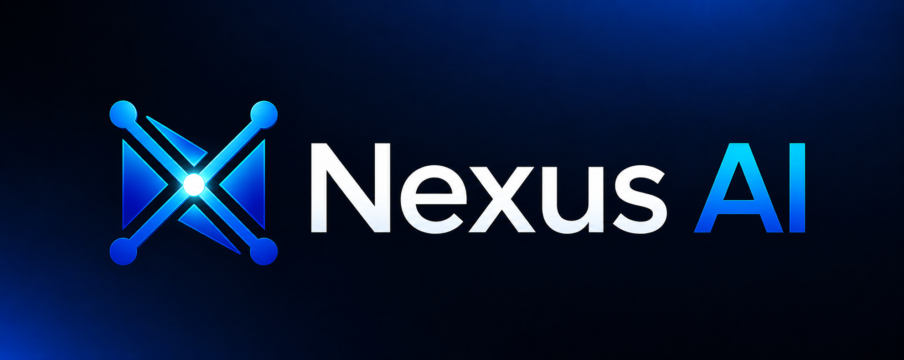

<p align="center"><a href="https://github.com/bendourthe/Nexus-AI"></a></p>

<p align="center"><em>Your Local AI Studio. Four Pillars, One Desktop, Zero Tokens Billed.</em></p>

# Nexus

Nexus is a local-first, native desktop AI Studio that bundles four generative AI pillars behind one cohesive UI: agentic coding, organized local chat, image generation and editing, and short-form video synthesis. Everything runs on the host machine against optimized open-source models (Gemma 4, Llama 3, Qwen 2.5 Coder, SDXL / SANA-class diffusion, video-synthesis architectures), with real-time GPU / VRAM telemetry built into the dashboard. No API keys, no data leaving your machine, no per-token billing.

> **Renamed from Gemma Code at v1.0.0** to reflect the four-pillar pivot. The v0.1.0 - v0.22.x line shipped as a single-purpose local agentic coding VS Code extension; v1.0.0 folded that engine into the "Agentic AI Coding" pillar of a wider desktop app. The VS Code surface is preserved as an optional thin adapter that proxies to the desktop daemon. Historical Gemma Code docs remain under `docs/archive/versions/v0/v0.1.0/` - `docs/archive/versions/v0/v0.9.0/`; every product milestone since the pivot is documented under `docs/v1/v1.<MINOR>/`, from the v1.0.0 pivot through the current **v1.12.0** cycle. The published release track is separate from the milestone track - see [Project Status](#project-status-july-2026).

---

## How Nexus fits with Nexus-Hub

<p align="center">
<a href="https://github.com/bendourthe/Nexus-AI"></a>
&nbsp;&nbsp;&nbsp;<strong style="font-size: 28px;">&harr;</strong>&nbsp;&nbsp;&nbsp;
<a href="https://github.com/bendourthe/Nexus-Hub"></a>
</p>

Nexus and [Nexus-Hub](https://github.com/bendourthe/Nexus-Hub) are two halves of the same idea, split along a deliberate seam.

- **Nexus (this repo)** is the runtime: a native desktop AI Studio with four pillars (Coding, Chat, Image, Video), four-layer local memory, hybrid retrieval (BM25 + dense + graph via RRF), session replay, GPU scheduling, hardware-aware model selection, and a cross-OS installer that provisions CUDA / Metal / ROCm tooling on first launch. It runs against local open-source models via Ollama; no outbound runtime calls without explicit user opt-in.
- **Nexus-Hub** is the catalog: a large curated set of skills, commands, hooks, agents, and language rule families, plus a handful of local-only internal MCP servers (see the [Nexus-Hub repo](https://github.com/bendourthe/Nexus-Hub) for the live counts). It is content-only, platform-agnostic, and installs into every supported AI assistant's per-platform config locations. Nexus consumes the same catalog as its upstream skill feed via the `nexus skills sync` CLI.

The two projects are designed to be useful independently: you can install Nexus-Hub into Claude Code / Codex / Gemini / Cursor without touching Nexus, and Nexus can run with or without the upstream catalog wired in. The combination is what gives a single curated skill set to every agent surface a developer touches: terminal, IDE, and now a dedicated desktop app.

---

## The Four Pillars

### 1. Agentic AI Coding

Autonomous code-generation and terminal environment. Reads local repositories, executes code in isolated environments, debugs, and implements complex features across files. Inherits everything Gemma Code shipped (tool registry, plan mode, four-layer memory, MCP support, skill catalog, sub-agent dispatch) and extends it to all installed local LLMs - not just Gemma 4. Available as a desktop pillar and as an optional VS Code extension (`nexus-coding`) that proxies to the desktop daemon when available and falls back to a legacy in-process engine when not. Later cycles added a local skill self-optimization loop (`nexus skills optimize`, v1.7.0 / v1.12.0) and a per-model harness selector that tunes the agent scaffold profile to each local model (v1.12.0).

### 2. Local Chatbot Explorer

Conversational interface with a filesystem-style organizer: chats live in nested folders and subfolders, contexts can be compartmentalized per project, and the four-layer memory system (working / episodic / semantic / graph) keeps long-running threads coherent. Hybrid retrieval (BM25 + dense + graph via Reciprocal Rank Fusion, `k=60`) replaced the v0.x substring path in v1.1.0 Phase 5; the local `all-MiniLM-L6-v2` embedder is bundled by the installer so production hosts never hit the Hugging Face Hub.

### 3. Image Studio

Text-to-image, image-to-image, inpainting, and outpainting against local diffusion pipelines. Tuned for laptop-class single-GPU hardware. v1.1.0 Phase 12 makes SANA-1.6B the new default 1024px model (~2x faster than SDXL Turbo, Apache-2.0 weights), adds Sana-Sprint as the "Fast Preview" speed tier (~0.3 s on RTX 4090), gates SANA 2K / 4K behind a `DiffusionTier` policy, and ships SANA-ControlNet plus the Flow-DPM-Solver sampler.

### 4. Video Lab

Short-form video synthesis via text prompts or static reference images, with a timeline previewer and granular generation controls. v1.1.0 Phase 13 adds SANA-Video 2B as the "Fast 720p" tier between LTX-Video and CogVideoX. Targets local video-synthesis architectures sized for a single consumer GPU.

### Always-on telemetry

A persistent `Local Model Status` panel reports the active model architecture, parameter size, live GPU utilization, and free VRAM - so dense computational passes do not silently OOM. The same telemetry feeds the GPU scheduler (Phase 3) that prioritizes Coding token generation over background diffusion work when both pillars compete for the same GPU.

---

## Project Status (July 2026)

Nexus runs on two intentionally decoupled version tracks:

- **Milestone track (`v1.x`)** - the product development cycles, each documented under `docs/v1/v1.<MINOR>/` (plan, known-gaps, benchmarks). This track runs from the v1.0.0 pivot through the current **v1.12.0** cycle.
- **Release track (git tags / `package.json`)** - the published, semantic-release-cut versions. `v2.0.0` (2026-06-18) was the GA that consolidated the v1.4.0 -> v1.6.0 line; `v2.1.0` (2026-07-02) folded in v1.7.0. Milestones **v1.8.0 -> v1.12.0** have landed on `main` and ship in the next published release. (The desktop app self-reports its `package.json` version, currently `2.1.0`, which is why the in-app version and the milestone label differ.)

### Milestone ledger

| Milestone | Theme | Status | Docs |
|---|---|---|---|
| v1.0.0 | Four-pillar pivot: Gemma Code -> Nexus desktop AI Studio (Tauri shell + Node sidecar) | Landed | [docs/v1/v1.0/](docs/v1/v1.0/) |
| v1.1.0 | Stabilization + expansion: hybrid retrieval, session replay, SANA image / video tiers | Landed | [docs/v1/v1.1/](docs/v1/v1.1/) |
| v1.2.0 | 2026-05 ecosystem adoption: code-graph MCP, LEANN-derived pruned dense index, command-output compression | Landed | [docs/v1/v1.2/](docs/v1/v1.2/) |
| v1.3.0 | skill-cleaner adoption: `nexus skills audit` token-budget report | Landed | [docs/v1/v1.3/](docs/v1/v1.3/) |
| v1.4.0 | claude-code-harness adoption (A1-A12) + `src/` -> `modules/coding/` move + carryforward closure | Landed | [docs/v1/v1.4/](docs/v1/v1.4/) |
| v1.5.0 | Local Agent Maturity: Gemma 4 quant ladder, credential vault, energy telemetry, planner / critic / worker DAG | Landed | [docs/v1/v1.5/](docs/v1/v1.5/) |
| v1.6.0 | aisuite harness + the offline Nexus-AI interactive guide + opt-in local panel / judge fusion | Landed | [docs/v1/v1.6/](docs/v1/v1.6/) |
| v1.7.0 | Local skill self-optimization loop (golden-task runner, bounded-edit optimizer, Pareto frontier) | Landed | [docs/v1/v1.7/](docs/v1/v1.7/) |
| v1.8.0 | One-shot end-user installer: desktop bundles, Hugging Face weights puller, per-VRAM catalog curation | Landed | [docs/v1/v1.8/](docs/v1/v1.8/) |
| v1.9.0 | Installer + Nexus AI Studio experience overhaul (single-artifact branded wizard + full UI / UX rework) | Landed | [docs/v1/v1.9/](docs/v1/v1.9/) |
| v1.10.0 | Nexus-Hub consumption re-architecture: single-home `~/.nexus-ai/catalog/` + live first-launch fetch | Landed | [docs/v1/v1.10/](docs/v1/v1.10/) |
| v1.11.0 | Installer overhaul: one-shot reliability, clean-machine harness, embedded desktop bundle, background continuation | Landed | [docs/v1/v1.11/](docs/v1/v1.11/) |
| v1.12.0 | Local model-execution scaling (per-model harness, extreme-low-bit + disk-offload tiers) + surface the skill optimizer + exec-sandbox audit | Landed | [docs/v1/v1.12/](docs/v1/v1.12/) |

Each cycle's plan lives under `docs/v1/v1.<MINOR>/plans/`, its deferred work under `docs/v1/v1.<MINOR>/known-gaps.md`, and benchmarks (where run) under `docs/v1/v1.<MINOR>/benchmarks/`.

---

## Design Principles

1. **Local-first.** Inference, embeddings, image and video synthesis, and memory storage all live on the host machine. No outbound calls without explicit user opt-in.
2. **Originality over wrappers.** When an external service or heavy framework can be reverse-engineered into a lean local module, we do that. The codebase follows this rule explicitly (see [AGENTS.md](AGENTS.md) "MCP Registry Policy" and the comparison matrices at [docs/v1/v1.1/comparison-agentmemory.md](docs/v1/v1.1/comparison-agentmemory.md) and [docs/v1/v1.1/comparison-sana.md](docs/v1/v1.1/comparison-sana.md)). The only external project we deliberately link to is [bendourthe/Nexus-Hub](https://github.com/bendourthe/Nexus-Hub), the author's own skill / hook / command catalog and the upstream feed for Nexus's skill harness.
3. **Single-GPU ceiling.** Every pillar must run on a laptop with a single consumer GPU (e.g. RTX 3070 - 4090 class). Hardware tiers are auto-detected at install and context budgets, batch sizes, and pipeline depths adapt accordingly.
4. **Installer carries the burden.** The cross-OS installer (shipped across the v1.8.0 -> v1.11.0 cycles) provisions CUDA / Metal Performance Shaders / ROCm, Python, Node, model runtimes, virtual environments, and the top recommended models so that when the installer finishes, every pillar works on first launch. No post-install scavenger hunt.
5. **Privacy by construction.** Memory writes pass through the [`redactSecrets`](core/observability/redactSecrets.ts) pre-index filter (AWS keys, classic + fine-grained GitHub PATs, Slack tokens, JWTs, PEM blocks, env-style assignments). Telemetry, traces, and logs are local-only by default and redact secret patterns before any opt-in export.
6. **OS parity (new in v1.1.0).** Every claim that works on Windows also works on macOS (Intel + Apple Silicon) and Linux (x86_64), or is explicitly documented in the per-platform notes.

---

## Quick Start (developer workflow)

End users: grab the one-file installer for your OS from the [releases page](https://github.com/bendourthe/Nexus-AI/releases) and follow the [installation guide](docs/install.md) (including the unsigned-binary warnings). Developers work against the source tree:

```bash
# Prereqs: Node 20+, Rust + Cargo (for Tauri core), Ollama for inference.
git clone https://github.com/bendourthe/Nexus-AI.git
cd Nexus-AI
npm ci                       # install root + desktop workspace dependencies
npm run build                # compile shared core + Coding module
npm run test                 # full vitest suite (4,600+ tests)

# Working on the desktop shell:
npm run dev:shell            # opens the Tauri window in dev mode (Vite HMR + sidecar)
npm run build:shell          # produces a platform-native bundle
npm run build:sidecar        # bundles the Node sidecar via esbuild
npm run lint:shell           # eslint --max-warnings=0 on desktop/
npm run test:shell           # vitest run for the desktop workspace
npm run test:shell:coverage  # 80% lines / 80% functions gate
```

The cross-platform CI gate is `.github/workflows/shell-build.yml` (windows-latest / macos-latest / ubuntu-latest).

### CLI tools (already shipped)

```bash
# Sync the Nexus-Hub skill catalog (single-home ~/.nexus-ai/catalog/ since v1.10.0):
nexus skills sync [--tag <tag>] [--apply]
nexus skills list [--namespace <ns>]
nexus skills install <namespace>/<name> --from <url>   # v1.1.0 Phase 8.3
nexus skills remove <namespace>/<name>                 # v1.1.0 Phase 8.3
nexus skills audit [--deep-logs] [--by-root]           # v1.3.0 five-section token-budget report
nexus skills optimize                                  # v1.12.0 surface of the v1.7 self-optimizer (held-out gate + approval)
nexus skills frontier                                  # v1.12.0 Pareto candidate frontier

# Skill / agent evaluation:
nexus golden run                                       # v1.7.0 golden-task live runner over the headless agent

# Memory introspection + maintenance:
nexus memory audit [--since <ISO>] [--tier <t>] [--scope <id>] [--session <id>]
nexus memory export --out <file>                       # JSONL, base64 vectors
nexus memory import --in <file>
nexus memory decay --now                               # manual Ebbinghaus sweep

# Deterministic source-code checks (lint + hook + skill validation):
nexus check ...

# Read-only stale-state inventory (legacy state, caches, dup skills, symlinks, memory):
nexus doctor [--migration-report] [--json]             # v1.4.0 Phase 5; never mutates disk
```

---

## Featured Capabilities

| Capability | Surface |
|---|---|
| **Plan mode** | `/plan` slash command produces a Markdown plan; the agent then walks each step. |
| **Auto mode** | End-to-end tool-using sessions with verification gates and git checkpoints. |
| **Four-layer memory** | Working / episodic / semantic / graph layers with per-tier Ebbinghaus half-lives (24h / 7d / 30d / 365d) and a scope-aware retriever. |
| **Hybrid retrieval** | BM25 + dense + graph via Reciprocal Rank Fusion (`k=60`); local `all-MiniLM-L6-v2` embedder bundled. |
| **Session replay** | Timeline scrubber + compare-two-sessions diff view in the Trace dashboard. |
| **Skill harness** | Nexus-Hub catalog synced via `nexus skills sync` into a single-home `~/.nexus-ai/catalog/`; hot-reload via fs.watch on the ACTIVE pointer; weekly auto-sync worker; allowlist + prompt-injection scanner on every install. |
| **Skill self-optimization** | Local golden-task-graded, held-out-validated, human-approved bounded edits to skills (`nexus skills optimize` / `frontier`, plus a desktop approval panel); opt-in and default-off. |
| **Per-model harness selection** | Auto-tunes the agent scaffold profile per local model with a golden A/B; opt-in (`nexus.coding.harnessSelector.enabled`). |
| **Slash commands** | `/recall`, `/remember`, `/forget`, `/curate`, `/trace`, `/memory`, `/plan`, plus the full skill-backed catalog with `preferUpstream` ordering. |
| **GPU scheduler** | Prioritizes Coding token generation over background diffusion work when both compete for the same GPU; tier-aware (`diffusion-low` / `mid` / `high`). |
| **MCP support** | Stdio MCP servers integrate via the per-project registry; reverse-engineering-first policy bans search / embeddings / scraping / generation as a service. |
| **Trace dashboard** | Tool spans, hook filter, session list side-rail, replay scrubber, side-by-side compare. |
| **Operation log** | Opt-in append-only Markdown line per tool call; secret-path denylist redacts paths before write. |

---

## Repository Layout

```
src/         VS Code extension host surface: activation, webview panels, tool handlers, storage, and the desktop-daemon adapter
core/        Shared-core packages imported by both src/ and desktop/sidecar/ (memory, skills, lifecycle, observability, storage, registry, telemetry, codegraph, scheduler, security, image, video)
modules/     Per-pillar engine code (coding, chat); the agentic-coding engine moved here from src/ in the v1.4.0 cycle
tests/       Unit, integration, e2e, and benchmark suites
desktop/     Tauri 2.x desktop shell + Node sidecar (v1.0.0 Phase 1+)
  src/         Vite + React 19 + TypeScript frontend (four-pillar UI)
  src-tauri/   Rust core (sidecar lifecycle, ipc_call command)
  sidecar/     Node sidecar (esbuild-bundled, JSON-RPC 2.0 over stdio)
docs/        Per-version architecture docs and history (docs/v1/v1.<MINOR>/; the v0 line archived under docs/archive/versions/v0/)
configs/     Linter, build, dependency-cruiser, and vitest configs
scripts/     Build, package, installer, and utility scripts
assets/      Icons, images, fonts, banners
.claude/     Agent-agnostic subagent prompts and slash-command definitions (committed)
bin/         CLI entry points (nexus, nexus-check, nexus-image, nexus-video)
```

The cross-OS installer source tree lives at [scripts/installer/](scripts/installer/) - a PyQt-based, single-artifact branded wizard. The one-shot installer landed across the v1.8.0 -> v1.11.0 cycles: dependency provisioning, an embedded desktop bundle, per-VRAM model curation, a clean-machine test harness, and full background continuation.

---

## Safety and Use in Regulated Industries

Nexus is built on a **local-first** principle: inference, embeddings, memory storage, and image / video synthesis all run on the host machine, and no outbound calls happen without explicit user opt-in. The MCP Registry Policy in [AGENTS.md](AGENTS.md) categorically rejects search-as-service, embeddings-as-service, scraping-as-service, and generation-as-service. The full threat-model breakdown and reporting policy is in [SECURITY.md](SECURITY.md).

Short version:

- **Open-source / hobby / internal commercial software**: green. No restrictions.
- **Regulated industries (healthcare, finance, government, life sciences, automotive, industrial)**: green WITH caveats. Nexus itself is local-only; the caveat is your chosen model and any MCP servers you add. Use a regulated-cloud option (AWS Bedrock, GCP Vertex AI, Azure OpenAI) only if your data-protection obligations require it, otherwise run fully local against Ollama.
- **Defense / classified / air-gapped**: feasible (the whole stack runs offline once the installer payload is staged) but do your own assessment.

What Nexus does NOT do by default: telemetry, analytics, phone-home, third-party data processors, model downloads at runtime, API-key requirements. Memory writes are scrubbed by [`redactSecrets`](core/observability/redactSecrets.ts) before SQLite insert. The `lifecycle.tool.failed` HookBus event redacts the error string at the bus boundary so leaked secrets in tool errors never reach trace consumers.

What is OUT of Nexus's control: your chosen LLM weights, any MCP server you wire in, user-initiated outbound calls (`gh`, `git push`, `curl`), and your own user-authored hooks and rules. Code the agent runs via `run_terminal` executes at your user privilege with tool-layer guardrails (command blocklist, touched-path / secret-path denylists, confirmation gate, env scrubbing) but no OS-level process sandbox - a documented boundary in [SECURITY.md](SECURITY.md). See [SECURITY.md](SECURITY.md) for the full caveats.

To report a security issue: email [benjamin.dourthe@gmail.com](mailto:benjamin.dourthe@gmail.com) or open a private security advisory at [github.com/bendourthe/Nexus-AI/security](https://github.com/bendourthe/Nexus-AI/security).

---

## Roadmap

Nexus evolves in versioned slices. Each item below traces to a concrete plan or known-gaps entry under `docs/v1/v1.<MINOR>/` (the durable source) and resolves once its work lands and the next `[X.Y.Z]` block is cut into [CHANGELOG.md](CHANGELOG.md). No star gates, no sponsor tiers, no paid features.

| Focus | Status | Source |
|-------|--------|--------|
| OS-level process sandbox for agent code execution (Seatbelt / Landlock / seccomp / job object), closing the documented no-sandbox boundary | Tracked | [docs/v1/v1.12/known-gaps.md](docs/v1/v1.12/known-gaps.md) (`EM.P5.A`) |
| Live extreme-low-bit (BitNet-class) + disk-offload "patient" catalog entries, once runtime support + independent benchmarks are confirmed | Gated | [docs/v1/v1.12/known-gaps.md](docs/v1/v1.12/known-gaps.md) (`EM.P3`, `EM.P4.A`) |
| Weak-model harness-selector enablement, pending a live A/B net-win on a low-cost model | Gated | [docs/v1/v1.12/known-gaps.md](docs/v1/v1.12/known-gaps.md) (`EM.P1`) |
| Skill-optimizer live A/B validation (ship the default-on rollout once a net win is measured) | Gated | [docs/v1/v1.7/known-gaps.md](docs/v1/v1.7/known-gaps.md) (`SO003.P3.A`) |
| Clean-machine installer rehearsals + on-device 3-OS visual QA (blocked by the GitHub Actions budget freeze until 2026-08-01) | Blocked | [docs/v1/v1.11/known-gaps.md](docs/v1/v1.11/known-gaps.md) (`IO.P2.A`) |

For narrative-style updates on what changed and why, see [docs/DEVLOG.md](docs/DEVLOG.md). For the formal Keep-a-Changelog log of every release, see [CHANGELOG.md](CHANGELOG.md). For the per-version unfinished-work tracker that the next plan reads to decide what carries forward, see `docs/v1/v1.<MINOR>/known-gaps.md`.

---

## Collaboration

Nexus is a curated open-source project. While pull requests are typically not accepted from outside contributors, suggestions, feedback, and recommendations are more than welcomed. If you have a better prompt, a smarter rule, or a pattern you would like to see in the catalog, please reach out directly:

- **Email**: [benjamin.dourthe@gmail.com](mailto:benjamin.dourthe@gmail.com)
- **GitHub**: [@bendourthe](https://github.com/bendourthe)

I am happy to discuss feature proposals, integration ideas, or specific use cases - especially when the proposal aligns with the policy direction of this project (local-first, reverse-engineering-first, no third-party data leaks).

For internal contributors and AI collaborators, the development workflow lives in [CONTRIBUTING.md](CONTRIBUTING.md); the step-by-step walkthrough for first-time contributors is in [CONTRIBUTING-BEGINNERS.md](CONTRIBUTING-BEGINNERS.md); the agent-agnostic engineering directive is in [AGENTS.md](AGENTS.md).

---

## License

MIT. See [LICENSE](LICENSE).
