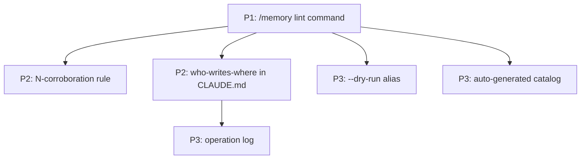

# Cross-Project Comparison: Gemma Code vs. Foundry Vault

**Version**: v0.5.0
**Generated**: 2026-04-24T00:00:00Z
**Analyzer**: Claude Code -- compare-project command
**External Source**: https://github.com/jameesy/foundry-vault
**Source Type**: Repository

---

## Section 1: Executive Summary

Foundry Vault is a personal knowledge-management system implemented as **four Claude Code slash commands** (`/foundry-ingest`, `/foundry-compile`, `/foundry-ask`, `/foundry-lint`) operating over a Markdown vault with a strict authorship contract. It has zero code dependencies, no test suite, and ~321 lines of command definitions plus a 205-line `CLAUDE.md` that encodes the entire system's behavior. The project is a different *kind* of system from Gemma Code (knowledge synthesis vs. agentic coding), but it offers three transferable patterns: (a) the **two-layer authorship contract** (human-curated immutable input vs. LLM-regeneratable output), (b) the **2-source rule** for promoting observations to higher-confidence assertions, and (c) the **`/foundry-lint` health check** for surfacing drift. ~6 adoption candidates, of which 1 is P1 (a `/memory lint` slash command) and 2 are P2 (a 2-source promotion rule for `MemoryConsolidator` + an authorship contract section in `CLAUDE.md`). Recommendation: **selectively adopt** the patterns; do not import the knowledge-management commands themselves (out of scope for a coding assistant).

## Section 2: Project Profiles

| Attribute | Gemma Code (current) | Foundry Vault |
|-----------|----------------------|---------------|
| **Identity** | Local agentic VS Code extension | Personal knowledge vault maintained by Claude Code |
| **Form factor** | VS Code extension (TS) + installer + tests | Markdown files + `.claude/commands/` + Obsidian config |
| **Code dependencies** | better-sqlite3, marked, zod, MCP SDK, DOMPurify, etc. | **Zero** (pure Markdown + git) |
| **Maturity** | v0.4.0 with 90 Vitest files | 1 commit snapshot; no version |
| **License** | MIT | None visible |
| **LOC** | ~90 src/*.ts files | 321 lines of command definitions + 205 lines of `CLAUDE.md` |
| **Author intent** | "Local agentic coding without external API calls" | "Karpathy's LLM wiki pattern: human curates *what to read*, Claude synthesizes *what it means*" |
| **Audience** | VS Code users wanting offline AI coding | Single-user knowledge worker with Obsidian + Claude Code |

The two are fundamentally different in scope (general coding vs. knowledge synthesis) and form (VS Code extension vs. Markdown vault). The interesting overlap is **how each project encodes editorial / authorship rules in `CLAUDE.md`** and **how each manages drift** in long-running stateful artifacts.

## Section 3: Technology Stack Comparison

| Layer | Gemma Code | Foundry Vault | Notes |
|-------|------------|---------------|-------|
| Language | TypeScript 5.4 | None — pure Markdown | Different paradigm |
| Build | tsc + vsce | None | Foundry has no build step |
| Storage | SQLite (chat, memory, traces, graph) | Filesystem + git | Trade-off: Foundry is human-readable; Gemma is queryable |
| Editor integration | VS Code extension (webview + activity bar) | Obsidian (recommended) — auto-discovers commands | Different IDEs |
| Test runner | Vitest + benchmarks + golden tasks | None | Foundry relies on `/foundry-lint` |
| Linter | ESLint | None | Foundry's `/foundry-lint` does its own surface checks |
| Package manager | npm | None | Foundry installs nothing |
| Distribution | VSIX + cross-platform installer | `git clone` | Different |

## Section 4: AI Assistant Configuration Comparison

| Aspect | Gemma Code | Foundry Vault |
|--------|------------|---------------|
| `CLAUDE.md` | Project root (rules, tech stack, communication style) | Project root, **205 lines**, encodes the entire vault behavior |
| `AGENTS.md` | Absent | Absent |
| `.claude/commands/` | Absent | **Present, 4 commands**: `foundry-ingest.md`, `foundry-compile.md`, `foundry-ask.md`, `foundry-lint.md` |
| Authorship contract in `CLAUDE.md` | Implicit (some critical rules) | **Explicit**: directory contract, front-matter schema per note type, tag taxonomy, hard rules ("no companion vault writes", "no single-source concepts", "no speculation") |
| State files | SQLite | `wiki/_meta/index.md` (catalog), `wiki/_meta/log.md` (append-only journal), `wiki/_meta/health.md` (lint output) |
| Slash-command discovery | `src/commands/CommandRouter.ts` | Claude Code's auto-discovery from `.claude/commands/` |

**Most transferable insight:** Foundry's `CLAUDE.md` reads as a *contract*: "X may write here, Y is read-only, Z requires N corroborating sources before promotion". Gemma's `CLAUDE.md` is more rule-list than contract. The pattern of writing the rules as *who-may-write-where* is more durable than rule-by-rule prohibition.

## Section 5: Skills and Capabilities Gap Analysis

### 5a. Present in External, Missing in Current

| Item | Foundry evidence | Adoption signal |
|------|------------------|-----------------|
| **2-source rule for promoting observations to assertions** ("Spin out new concept articles when themes recur across 2+ sources; default to waiting for cross-source signal, never speculate from single sources") | `.claude/commands/foundry-compile.md`; `CLAUDE.md` hard rules | **P2** — direct analog: `MemoryConsolidator.ts` could require N≥2 corroborating signals before promoting an episodic observation to a semantic fact |
| **Authorship contract written as who-writes-where** | `CLAUDE.md` directory contract section | **P2** — short addendum to Gemma's `CLAUDE.md` describing what each module owns ("`src/llm/` is the only Ollama caller", "tools never read from `src/panels/`", "memory is written by `MemoryStore`, not by tool handlers") |
| **`/foundry-lint` health check** that surfaces orphans, broken links, keyword drift, stale candidates, index mismatches | `.claude/commands/foundry-lint.md` (126 lines) | **P1** — direct analog: a `/memory lint` slash command that surfaces stale memory entries, broken file-path references, embedding-failed entries, duplicate facts |
| **Append-only operation log** (`wiki/_meta/log.md`, grep-friendly: `## [YYYY-MM-DD] operation \| title`) | `wiki/_meta/log.md` | **P3** — Gemma has session-level traces in `TraceStore.ts` but no human-readable per-operation journal; `docs/DEVLOG.md` exists but is session-grouped |
| **Catalog file (`wiki/_meta/index.md`)** read first on every operation: lists all assets, keyword glossary, research threads, open questions, prompts, candidates | `wiki/_meta/index.md` | **P3** — interesting pattern but Gemma's project structure is large enough that an auto-generated index is more practical |
| **"Read first" discipline**: Foundry's commands always read `index.md` and `log.md` before writing | `foundry-*.md` step 1 | Already partially implemented — `UnifiedMemoryRetriever` injects relevant memory before each turn |
| **`--dry-run` flag on `/foundry-lint`** | `.claude/commands/foundry-lint.md` line ~5 | **P3** — apply to any future Gemma maintenance command |
| **Output-as-input compounding** (`/foundry-ask` writes its answer back into the wiki so future `/foundry-ask` can see it) | `.claude/commands/foundry-ask.md` | Already implemented in spirit — Gemma's memory persists across sessions; sub-agent output is captured in episodic memory |
| **No CI / no automation** discipline (deliberately local-first, manual-trigger only) | Repo has zero workflows | **Skip** — Gemma actively benefits from CI |
| **Obsidian as IDE** | `.obsidian/` with hider, minimal-settings, style-settings plugins | N/A (Gemma is bound to VS Code) |

### 5b. Present in Current, Missing in External (strengths to preserve)

| Capability | Where in Gemma Code |
|------------|---------------------|
| Live agent loop with tool use | `src/tools/AgentLoop.ts` |
| Sub-agents | `src/agents/SubAgentManager.ts` |
| Plan / DAG / Reflexion orchestration | `src/orchestration/` |
| 4-layer memory | `src/storage/` |
| 6-stage compaction | `src/chat/CompactionStrategy.ts` |
| MCP client + server | `src/mcp/` |
| Comprehensive security architecture | `src/utils/ssrf.ts`, `src/tools/handlers/`, `src/panels/` |
| Test pyramid + golden tasks | `tests/` |
| Cross-platform installer | `scripts/installer/pyqt/` |
| Trace recording + OTLP | `src/observability/` |
| Webview UI for chat | `src/panels/GemmaCodePanel.ts` |
| Hardware-tier auto-detection | `src/config/GpuDetector.ts` |

The asymmetry is enormous. Foundry is ~500 lines of Markdown; Gemma is a multi-module TypeScript application. The point of comparison is not feature parity — it's **discipline transfer**.

### 5c. Present in Both, Quality Comparison

| Capability | Gemma Code | Foundry Vault | Verdict |
|------------|------------|---------------|---------|
| `CLAUDE.md` rules | List-style ("Verify work before marking complete", "No `Co-Authored-By` lines", etc.) | Contract-style (who may write where, what each layer owns, hard rules with rationale) | **Foundry's is more durable**; the contract style survives refactors better |
| Slash commands | 18 (live, tool-use-driven) | 4 (Claude Code-driven, manual-trigger) | Different scopes; not directly comparable |
| Memory / state durability | SQLite stores; consolidation via `MemoryConsolidator.ts` | Markdown files with manual `/foundry-lint` health check | Gemma's is more queryable; Foundry's is more inspectable |
| Drift detection | Implicit (memory consolidation, FTS5 reindex) | Explicit (`/foundry-lint` overwrites `health.md`) | Foundry's explicit health surface is clearer |
| Operation auditability | `TraceStore.ts` + `DEVLOG.md` (session-grouped) | `wiki/_meta/log.md` (per-operation, grep-friendly) | Foundry's is human-readable; Gemma's is queryable |

## Section 6: Commands and Automation Comparison

### 6a. Commands Gap

| Command | Foundry | Gemma analog (if any) | Adoption signal |
|---------|---------|----------------------|-----------------|
| `/foundry-ingest` (URL/file → normalised source notes) | Knowledge management workflow | Not directly relevant; Gemma's "ingest" surface is `read_file` and `web_search` | Skip |
| `/foundry-compile` (sources → concept articles, 2-source rule) | Synthesis workflow | `MemoryConsolidator.ts` partially analogous | Skip the command, **adopt the 2-source rule** |
| `/foundry-ask` (question → cited research report filed back into vault) | Research workflow | `/research` slash command spawns a research sub-agent | Already implemented; the "file back into memory for future recall" is partially implemented via episodic memory |
| `/foundry-lint` (health check) | Maintenance workflow | None | **P1: add `/memory lint`** to surface stale entries, broken file paths, embedding-failed rows, duplicates |

### 6b. CI/CD and Hooks Gap

Foundry has no CI, no GitHub Actions, no pre-commit hooks. The project deliberately rejects automation. **No adoption candidates here.**

## Section 7: Documentation and Developer Experience Comparison

| Item | Gemma Code | Foundry Vault |
|------|------------|---------------|
| README quality | Comprehensive (install, slash commands, troubleshooting) | 83 lines: quick start + 3-layer architecture + schema pointer |
| `CLAUDE.md` | Rules + critical rules + tech stack | **205 lines**: directory contract, front-matter schema, tag taxonomy, authorship boundaries, hard rules |
| Architecture doc | `ARCHITECTURE.md` + per-version | None (CLAUDE.md *is* the architecture doc) |
| ADRs | 1 | None |
| Versioned doc tree | Yes | None |
| Setup | `scripts/dev-setup.sh` / `.ps1` | `git clone` + open in Obsidian |
| Examples | `examples/` (`.gitkeep` only) | 2 source notes + 1 concept article + 1 person page |
| Operation log | `docs/DEVLOG.md` (session-grouped) | `wiki/_meta/log.md` (per-operation, grep-friendly) |
| Health surface | None explicit; relies on tests | `wiki/_meta/health.md` (overwritten by `/foundry-lint`) |
| Catalog/index | None auto-maintained | `wiki/_meta/index.md` (catalog + glossary + threads + open questions + prompts + candidates) |

The most striking pattern is that **Foundry's `CLAUDE.md` documents the system completely**, where Gemma's `CLAUDE.md` is a rules file and the system documentation is split across `ARCHITECTURE.md`, `SECURITY.md`, `CONTRIBUTING.md`, and the per-version `docs/v0.X.0/architecture.md`. Both approaches work; Foundry's is denser per byte.

## Section 8: Testing and Security Posture Comparison

| Aspect | Gemma Code | Foundry Vault |
|--------|------------|---------------|
| Test framework | Vitest + golden tasks | None |
| Health checks | Tests + benchmarks | `/foundry-lint` (link integrity, orphans, keyword drift, index staleness) |
| Security | Documented in `SECURITY.md` (SSRF, path guard, shell, secrets, MCP, CSP) | Implicit ("companion vault is read-only", "no speculative content") — not enforced in code |
| Drift defense | Memory consolidator + FTS5 reindex | Manual `/foundry-lint` runs |

These are not directly comparable; Foundry's threat model is "user accidentally writes confused notes", Gemma's is "agent calls a tool with a malicious path". No security adoption candidates.

## Section 9: Structural and Architectural Differences

1. **Scale and ambition.** Foundry is ~500 lines of Markdown that operate within Claude Code's existing infrastructure. Gemma is a full agentic runtime with its own loop, memory, compaction, and tool catalogue. Most of Foundry's design choices (no tests, no CI, manual triggers) are correct for a personal vault and incorrect for a distributed VS Code extension.

2. **Two-layer authorship.** Foundry strictly separates **inbox + sources** (human-curated, immutable) from **wiki** (LLM-regeneratable). The direct Gemma analog is **source code + project files** (immutable user input) vs. **memory + traces** (LLM/agent-generated). The pattern is already present in Gemma; Foundry articulates it explicitly. Adopting Foundry's `CLAUDE.md` style of stating the contract upfront would strengthen Gemma's discipline.

3. **2-source rule.** Foundry refuses to promote a concept until 2+ sources corroborate. Gemma's `MemoryConsolidator.ts` performs LLM-driven memory consolidation; whether it requires N corroborating signals is implementation-dependent. Adopting an N-source rule reduces hallucinated facts in semantic memory.

4. **Lint as health surface, not as test.** Foundry's `/foundry-lint` writes to `wiki/_meta/health.md` instead of failing. The health file is itself an artifact the user can grep. This is conceptually different from Gemma's tests (binary pass/fail) and worth adopting for *memory health* (a non-binary signal).

5. **Append-only journal.** Foundry's `wiki/_meta/log.md` is grep-friendly (`## [YYYY-MM-DD] operation | title`). Gemma's traces are SQLite rows in `TraceStore.ts`. Both work; the append-only Markdown journal is more durable across machines.

6. **No tools.** Foundry has no tool-use, no agent loop, no terminal, no file editing in the agentic sense. It is effectively a *prompt template runner*. The "agent" exists only in the slash-command definitions. This is the simplest possible agentic system.

## Section 10: Adoption Plan

### P0 (Immediate)

_None. Foundry's patterns are pure discipline transfer; none are urgent._

### P1 (Short-term)

| What | Source | Target | Effort | Dependencies | Risk |
|------|--------|--------|--------|--------------|------|
| Add a `/memory lint` slash command that surfaces stale memory entries, broken file-path references in stored memory, embedding-failed rows, duplicate facts; output written to a fresh `memory-health.md` artifact (not failing) | `.claude/commands/foundry-lint.md` | New command in `src/commands/CommandRouter.ts`; new `src/storage/MemoryHealthCheck.ts` writing to `.gemma-code/memory-health.md` | Medium (1 day) | None | Low — additive; report-only by default |

### P2 (Medium-term)

| What | Source | Target | Effort | Dependencies | Risk |
|------|--------|--------|--------|--------------|------|
| Add an N-corroboration rule to `MemoryConsolidator.ts` (default N=2): an episodic observation must appear in ≥N independent turns before being promoted to a semantic fact; surface single-source observations as "candidates" with lower retrieval priority | Foundry's 2-source rule (`/foundry-compile` + `CLAUDE.md` hard rules) | `src/storage/MemoryConsolidator.ts`; add `corroboration_count` column to memory schema (migration) | Medium-High (2-3 days) | None | Medium — schema migration; existing single-source memories must be backfilled or grandfathered |
| Rewrite the "Critical Rules" section of `CLAUDE.md` as a who-writes-where contract (e.g. "`src/llm/` is the only Ollama caller", "memory is written by `MemoryStore` and `MemoryConsolidator`, never by tool handlers", "the webview is read-only with respect to extension state") | Foundry `CLAUDE.md` directory contract section | `CLAUDE.md` | Low | None | Low — pure documentation; align with the dependency-cruiser config from the routa comparison |

### P3 (Backlog / If easy)

| What | Source | Target | Effort | Dependencies | Risk |
|------|--------|--------|--------|--------------|------|
| Add an append-only per-operation journal at `.gemma-code/operation-log.md` (grep-friendly: `## [YYYY-MM-DD HH:MM] tool=read_file path=src/extension.ts`) — separate from session-grouped `docs/DEVLOG.md` | Foundry `wiki/_meta/log.md` | New `src/observability/OperationLog.ts`; subscribe to tool events | Medium | None | Medium — adds disk write per tool call; keep behind a setting |
| `/memory lint --dry-run` (alias for the report-only mode, makes intent explicit) | Foundry `/foundry-lint --dry-run` | `src/commands/CommandRouter.ts` | Trivial | `/memory lint` (P1) | Low |
| Auto-generated catalog (`docs/index.md`): per-module summary + key types + entry points, regenerated by a `scripts/generate-catalog.mjs` script (analog of Foundry's `index.md`) | Foundry `wiki/_meta/index.md` | New script | Medium | None | Low — risk of drift if regeneration is forgotten |

### Explicitly Not Recommended

| Item | Reason |
|------|--------|
| Adopt `/foundry-ingest` / `/foundry-compile` / `/foundry-ask` as Gemma slash commands | Out of scope — Gemma is a coding assistant, not a knowledge-management system |
| Adopt the "no CI / no automation" discipline | Gemma actively benefits from CI; this is the wrong direction |
| Adopt Obsidian-style plugin recommendations (`obsidian-hider`, `obsidian-minimal-settings`, `obsidian-style-settings`) | Gemma is bound to VS Code |
| Auto-generated wiki under `docs/` | Out of scope — Gemma's docs are versioned implementation plans, not synthesised concepts |

## Section 11: Implementation Sequence

Recommended order: ship `/memory lint` first (it's the highest-value, lowest-risk Foundry pattern). The N-corroboration rule for `MemoryConsolidator` is the conceptual heart of the 2-source rule and should follow once the memory-health surface exists. The `CLAUDE.md` rewrite is independent and can land any time.

## Section 12: Risks and Considerations

1. **N-corroboration tuning.** N=2 is the Foundry default. For a coding assistant, N=2 is probably too aggressive — the agent often makes a single high-confidence observation (e.g. "the project uses Vitest, not Jest") that should be a fact, not a candidate. Consider N=1 with provenance-quality scoring instead, or N=2 only for opinion-style assertions ("user prefers X over Y").

2. **Schema migration risk.** Adding `corroboration_count` to the memory table touches all existing rows. Provide a backfill script that sets `corroboration_count = 1` for legacy rows so they aren't demoted.

3. **`/memory lint` must be cheap.** If it scans every memory entry every run, it will be slow on large vaults. Limit scope by default (last 30 days; first 1000 entries) with a `--full` flag.

4. **Operation log adds I/O cost per tool call.** Test before rolling out: a session with 200 tool calls writes 200 lines. That's fine on SSDs, possibly noticeable on slow disks. Keep behind a `gemma-code.operationLog.enabled` setting.

5. **`CLAUDE.md` who-writes-where rewrite must not contradict the existing rules.** The new contract section is *additive*, not a replacement for the existing critical rules. Run the resulting `CLAUDE.md` through a quick agent test before committing — make sure the agent's behavior on a representative task does not change.

6. **Do not adopt the "no tests" or "no CI" disciplines.** They are correct for Foundry's threat model (single user, manual triggers, low blast radius) and incorrect for Gemma's (distributed extension, automated triggers, high blast radius if a regression ships).

7. **Foundry's compounding-output pattern (output → wiki → future input) is already partially present.** Gemma's research sub-agent results are captured in episodic memory. The further step — promoting them to retrievable semantic facts — is what the N-corroboration rule enables.

---
