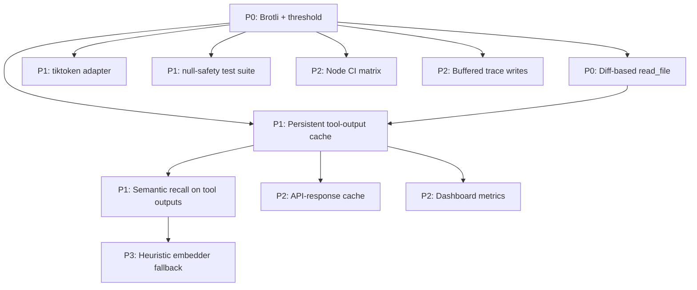

# Cross-Project Comparison: Gemma Code vs. token-optimizer-mcp

**Version**: v0.5.0
**Generated**: 2026-04-24T00:00:00Z
**Analyzer**: Claude Code -- compare-project command
**External Source**: https://github.com/ooples/token-optimizer-mcp
**Source Type**: Repository

---

## Section 1: Executive Summary

token-optimizer-mcp (v5.0.1, MIT, by ooples) is a TypeScript MCP server that intercepts Claude Code's tool calls via a 7-phase global hooks system and applies aggressive token optimizations: Brotli compression (2-4x typical, up to 82x on repetitive content), persistent SQLite caching, semantic caching via 128-D embeddings with cosine similarity at 0.85, diff-based file re-reads (95-99% savings on minor edits), and a multi-tier LRU cache with 6 eviction strategies. The repo claims **60-90% reduction over 38,000+ measured operations** and 300K-700K tokens saved per session. This is the **single most directly relevant** of the five compared sources for Gemma Code's offline-first context-management goals. ~10 adoption candidates, of which 3 are P0 (Brotli on tool outputs, diff-based smart-read, compression-decision threshold) and 3 are P1 (semantic tool-output caching, persistent cache promoted across sessions, tiktoken adapter for precise budgeting). Recommendation: **adopt heavily** — the patterns plug directly into Gemma's existing `OutputRedirector`, `EmbeddingClient`, `MemoryStore`, and `PromptBudget` infrastructure.

## Section 2: Project Profiles

| Attribute | Gemma Code (current) | token-optimizer-mcp |
|-----------|----------------------|---------------------|
| **Identity** | Local agentic VS Code extension running Gemma 4 via Ollama | TypeScript MCP server that transparently optimizes Claude Code's tool calls |
| **Form factor** | VS Code extension; in-process agent loop | MCP server (stdio) + global PowerShell/Bash hooks under `~/.claude-global/hooks/` |
| **Language** | TypeScript 5.4 | TypeScript (12,372 src LOC) |
| **Persistence** | better-sqlite3 12 (chat history, memory, traces, graph) | better-sqlite3 12 (cache engine, semantic vectors, session metrics) |
| **Optimization layer** | Sliding-window compaction + 4-layer memory + 6-stage compaction pipeline | Brotli + SQLite cache + semantic vectors + diff-based reads + 7-phase hook orchestration |
| **Maturity** | v0.4.0; 90 Vitest files, 1,168 cases | v5.0.1; semantic-release; 3-Node-version CI matrix |
| **License** | MIT | MIT |
| **Audience** | Privacy-first individual devs in VS Code | Claude Code / Cursor / Cline / Windsurf users wanting cheaper tool calls |

The two projects share TypeScript, SQLite, and the goal of context efficiency. The shapes diverge: Gemma owns its agent loop end-to-end, while token-optimizer-mcp is a parasite layer that intercepts somebody else's loop. Each technique it ships can be ported into Gemma's owned loop without the hook indirection.

## Section 3: Technology Stack Comparison

| Layer | Gemma Code | token-optimizer-mcp | Notes |
|-------|------------|---------------------|-------|
| Language | TypeScript 5.4 | TypeScript | Same |
| MCP SDK | `@modelcontextprotocol/sdk` ^1.29.0 (client + server) | `@modelcontextprotocol/sdk` ^1.26.0 (server only) | Same family, different role |
| Compression | None on tool output | `zlib` Brotli (sync + async, quality 0-11) | **Adoption candidate** |
| Token counting | Heuristic estimator inside `PromptBudget.ts` | `tiktoken` 1.0.22 + pluggable factory (Google AI, heuristic) | **Adoption candidate** for precision |
| Vector store | `EmbeddingClient` (Ollama nomic-embed-text) for memory | `InMemoryVectorStore.ts` (128-D cosine similarity, 0.85 threshold) | Different scope — Gemma uses for memory, this for tool-output caching |
| Embedding generator | nomic-embed-text via Ollama | `FoundationModelEmbeddingGenerator.ts` (hash + stats + n-grams, 128-D, no model required) | **Adoption candidate** — local-only embedding for cache when Ollama is offline |
| Cache | Memory layer only (semantic + episodic + graph) | `cache-engine.ts` (L1 LRU + L3 SQLite, 6 eviction strategies, ARC, W-TinyLFU, Clock) | **Adoption candidate** for tool-output cache |
| Diff library | `diff` 5.2.2 | `diff` 8.0.2 (newer ESM build) | Equivalent role |
| Test runner | Vitest | Jest 30 + ts-jest ESM | Equivalent |
| CI matrix | Single Node version implicit | Node 18 / 20 / 22 in `ci.yml` | **P2** add Node-version matrix |
| Release automation | Manual (`scripts/build-vsix.ps1`) | semantic-release + commitlint | Out of scope for VSIX |

## Section 4: AI Assistant Configuration Comparison

| Aspect | Gemma Code | token-optimizer-mcp |
|--------|------------|---------------------|
| `CLAUDE.md` | Present at project root | Not present (project is consumed by Claude Code, not a project for Claude Code to maintain) |
| `AGENTS.md` | Absent | Absent |
| `.mcp.json` | Absent | Present at project root + a duplicate `mcp.json` |
| Auto-detect installer | `scripts/installer/pyqt/` | `scripts/postinstall.cjs` auto-detects Claude Code, Claude Desktop, Cursor IDE, Cline (VS Code), GitHub Copilot, Windsurf |
| Global hooks | None | `install-hooks.ps1` / `install-hooks.sh` deploy `dispatcher.ps1` to `~/.claude-global/hooks/` |
| Hook phases | Internal: ConfirmationGate, ActionClassifier, LoopDetector | External: PreToolUse, InputValidation, PostToolUse, SessionTracking, UserPromptSubmit, PreCompact, Metrics |

token-optimizer-mcp's hook architecture is a *transparent interceptor* — Gemma's analog already lives inside `AgentLoop.ts` and `OutputRedirector.ts`, so the patterns can be ported in-process rather than as global hooks.

## Section 5: Token-Reduction Techniques (Primary Section)

This is the most important section of the comparison. Each row maps a token-optimizer-mcp technique to its current state in Gemma Code.

| # | Technique | token-optimizer-mcp implementation | Gemma Code state | Adoption signal |
|---|-----------|------------------------------------|------------------|-----------------|
| 1 | **Brotli compression of large tool outputs** | `src/core/compression-engine.ts` (sync + async, quality 0-11, text vs generic mode, threshold 20% / 500 bytes) | None — tool outputs flow uncompressed through `OutputRedirector.ts` | **P0** — biggest single win |
| 2 | **Diff-based smart-read** (re-reads return only the diff vs cached content) | `src/tools/file-operations/smart-read.ts` + `shared/diff-utils.ts`; claimed 80% on subsequent reads, 95-99% on minor edits | Re-reads return full file via `read_file` tool | **P0** — direct integration with `read_file` handler |
| 3 | **Compression-decision threshold** (skip compression if savings < 20% or input < 500 bytes) | `compression-engine.shouldCompress()` | N/A — no compression today | **P0** — couples with #1 |
| 4 | **Semantic caching via 128-D cosine similarity** at 0.85 threshold | `InMemoryVectorStore.ts` + `FoundationModelEmbeddingGenerator.ts` | Gemma already has embeddings for memory (`EmbeddingClient.ts` with nomic-embed-text); not used for tool-output recall | **P1** — extend `EmbeddingClient` to back a tool-output cache |
| 5 | **Persistent SQLite cache promoted across sessions** | `src/core/cache-engine.ts` (L1 LRU in-memory + L3 SQLite on disk) | Gemma has SQLite stores but no cross-session tool-output cache | **P1** — add `tool_output_cache` table |
| 6 | **Pluggable token counter (tiktoken adapter)** | `src/core/token-counter.ts` + `TokenizerFactory` | Gemma uses heuristic chars/4 estimator inside `PromptBudget.ts` | **P1** — tiktoken would tighten budget accounting |
| 7 | **Predictive caching with ARIMA / LSTM patterns** | `src/tools/advanced-caching/predictive-cache.ts` | None | **P3** — heavy ML; defer; gains unclear for solo offline workflow |
| 8 | **Multi-tier LRU with 6 eviction strategies** (LRU, LFU, FIFO, ARC, W-TinyLFU, Clock) | `smart_cache` tool | Gemma has LRU through `lru-memoize` analog only inside MemoryStore | **P2** — overkill, but a single LRU+TTL layer for tool outputs is reasonable |
| 9 | **Hook batching with in-memory session state** (flush every 5 s or 100 ops, 7x latency improvement) | `dispatcher.ps1` env vars `TOKEN_OPTIMIZER_USE_FILE_SESSION`, `TOKEN_OPTIMIZER_SYNC_LOG_WRITES` | Gemma's `MetricsCollector` writes synchronously per event | **P2** — buffer trace writes to reduce p99 latency |
| 10 | **Diff-utils for compact write notifications** | `shared/diff-utils.ts` | `diff` 5.2.2 used in `RegenerateFromSource.ts` and webview diff render | Already partial |
| 11 | **Per-hook / per-action / per-MCP-server analytics** | `src/analytics/` | `src/observability/MetricsCollector.ts` | Already partial — Gemma is comparable, lacks the hook-phase axis |
| 12 | **PreCompact phase running optimizations before Claude Code's own compactor** | `dispatcher.ps1` | Gemma owns its compactor (`ContextCompactor.ts`) — equivalent leverage point | Already implemented |
| 13 | **API response caching with TTL/ETag/event-based strategies** | `smart_api_fetch` | Gemma's `webSearch.ts` and (future) `fetch_page` do not cache | **P2** — couples with cache infrastructure (#5) |
| 14 | **Brotli decision: text vs generic mode** | `BROTLI_MODE_TEXT` for text content | N/A | Implementation detail of #1 |
| 15 | **chmod 0o600 on cache DB files** | Not visible in inventory | Already present (`src/storage/dbPermissions.ts`) | Already implemented; carry into new cache file |

### 5a. Direct Adoption Wins (P0/P1)

The first three rows above are P0. Combined effect (estimated, conservative):

- **Brotli on tool outputs** — average 2-3x reduction on text-heavy outputs (file reads, grep results, terminal stdout). For a session with 30 file reads averaging 8 KB each, that's roughly 240 KB → 96 KB, freeing ~36 K context tokens.
- **Diff-based smart-read** — when the agent re-reads the same file across iterations, return only the unified diff. Token-optimizer-mcp claims 95-99% savings on minor edits. Realistic Gemma savings: 50-80% on iterative debugging sessions.
- **Compression threshold** — avoids the overhead of compressing 100-byte tool returns.

These three integrate at one place: `src/tools/OutputRedirector.ts` (which already wraps tool stdout) and `src/tools/handlers/filesystem.ts` (which owns `read_file`).

### 5b. Strengths to Preserve in Gemma Code

| Capability | Where in Gemma Code | Why it matters |
|------------|---------------------|----------------|
| 4-layer memory (Working/Episodic/Semantic/Graph) | `src/storage/` | token-optimizer-mcp has caching but no semantic memory |
| 6-stage compaction pipeline | `src/chat/CompactionStrategy.ts` | token-optimizer-mcp relies on Claude Code's compactor; Gemma owns its own |
| Plan/execute orchestration | `src/orchestration/` | Out of scope for token-optimizer-mcp |
| Sub-agent isolation | `src/agents/SubAgentManager.ts` | Out of scope for token-optimizer-mcp |
| Comprehensive security architecture (SSRF, path guard, secret denylist, ReDoS, CSP) | `src/utils/ssrf.ts`, `src/tools/handlers/`, `src/panels/` | token-optimizer-mcp had a JWT leak in v2.20.0 (later remediated) and a UTF-8 BOM injection bug in v3.0.2 (Windows settings.json) |
| Golden-task framework | `tests/golden/` | No equivalent in token-optimizer-mcp |

## Section 6: Commands and Automation Comparison

### 6a. Commands Gap

| Command surface | Gemma Code | token-optimizer-mcp | Adoption signal |
|-----------------|------------|---------------------|-----------------|
| Slash commands | 18 | None | Gemma is richer |
| MCP-exposed tools | Internal tools via MCP server (`src/mcp/McpServer.ts`) | 61 tools across 8 categories | **N/A** — token-optimizer-mcp's tools are *for being called by* Claude Code; Gemma's MCP server already exposes its own tools to other clients |
| `npm run dashboard` | None | Local web UI (`web-server.js`) showing real-time token-savings metrics | **P2** — if Gemma's `TraceDashboardPanel.ts` is augmented with cache-hit and compression-saving metrics, that already lives inside the IDE |
| postinstall auto-detect of AI tools | None | Detects Claude Code, Cursor, Cline, Windsurf, Copilot | N/A — Gemma is itself the AI tool, not a wrap-around |

### 6b. CI/CD and Hooks Gap

| CI element | Gemma Code | token-optimizer-mcp | Adoption candidate |
|------------|------------|---------------------|--------------------|
| Workflows | 5 (ci, nightly, golden-tasks, release, installer-smoke) | 5 (ci, release, quality-gates, codex-autofix, commitlint) | Comparable |
| Node-version matrix | Implicit single version | 18 / 20 / 22 explicit | **P2** add matrix |
| Path-traversal test in CI | Inside unit suite | `src/server/path-traversal.test.ts` (500 ms timeout) | Already implemented (Gemma has `pathGuard.ts` tests) |
| semantic-release + commitlint | None | Yes | **P3** — only worth adopting if `CHANGELOG.md` generation becomes a chore |
| codex-autofix workflow | None | Yes (auto-applies suggested fixes) | **P3** — experimental; observe |

## Section 7: Documentation and Developer Experience Comparison

| Item | Gemma Code | token-optimizer-mcp |
|------|------------|---------------------|
| README | Comprehensive | 29.5 KB; benchmarks table, 60-90% reduction claim, troubleshooting |
| Tools reference | `README.md` slash commands list | `docs/TOOLS.md` (71.5 KB) — every tool's parameters / returns / token-reduction % |
| Quick start guide | `README.md` quick-start section | `docs/QUICK_START_GUIDE.md` |
| Hooks installation guide | N/A | `docs/HOOKS-INSTALLATION.md` (24.5 KB, platform-specific) |
| Performance optimization guide | `docs/archive/versions/v0/v0.3.0/performance-benchmarks.md` | `docs/HOOKS-PERFORMANCE-OPTIMIZATION.md` |
| Session log spec | `src/observability/TraceStore.ts` (code-level) | `docs/SESSION_LOG_SPEC.md` (formal spec) |
| Real-world performance evidence | Internal (per-version comparisons) | `docs/USER-STORY-PERFORMANCE-VALIDATION.md` |
| Versioned doc tree | Yes (`v0.1.0` → `v0.4.0`) | No (single docs/ tree) |
| ADRs | 1 | None |
| Security policy | `SECURITY.md` (full architecture) | None public; secrets remediated reactively (see CHANGELOG) |

## Section 8: Testing and Security Posture Comparison

| Aspect | Gemma Code | token-optimizer-mcp |
|--------|------------|---------------------|
| Test runner | Vitest 1 | Jest 30 + ts-jest ESM |
| Coverage | Target 80% per `CONTRIBUTING.md` | Thresholds disabled (gradual ramp-up) |
| Test types | unit / integration / e2e / golden / benchmarks | unit / integration / benchmarks |
| Benchmark suites | `tests/benchmarks/` (rendering, tool-execution, skill-loading, context-compaction) | `*.bench.ts` benchmarks alongside tests |
| Mock strategy | MSW for HTTP | Jest mocks |
| Path-traversal coverage | `tests/unit/tools/handlers/pathGuard.test.ts` | `src/server/path-traversal.test.ts` |
| Null-safety coverage | Implicit | Dedicated `null-safety.test.ts` |
| Security architecture | Documented (`SECURITY.md`) | Not documented; two past incidents (JWT leak in v2.20.0, BOM injection in v3.0.2) |
| Dep auditing | `npm audit --production --audit-level=high` | npm ci in CI; better-sqlite3 12 stable; zod >=3.25 <5 |

Gemma Code is materially ahead on documented security posture and test pyramid discipline. token-optimizer-mcp's CI matrix and `null-safety.test.ts` are worth borrowing.

## Section 9: Structural and Architectural Differences

1. **In-process owner vs. external interceptor.** Gemma is the agent loop; token-optimizer-mcp is a hook around someone else's. Therefore Gemma can adopt token-optimizer-mcp's *techniques* directly, without the hook indirection. Each PowerShell hook step has a TypeScript analog inside `AgentLoop.ts` and `OutputRedirector.ts`.

2. **Cache file footprint.** A persistent tool-output cache adds a fourth SQLite file (`tool-output-cache.sqlite`) on top of `chat-history.sqlite`, `memory.sqlite`, `traces.sqlite`, `graph.sqlite`. This is fine as long as `dbPermissions.ts` is invoked on the new file too (chmod 0o600).

3. **Embedding policy divergence.** Gemma's embeddings come from Ollama (nomic-embed-text). When Ollama is offline, the embedding-based memory recall degrades to FTS5. token-optimizer-mcp uses a model-free 128-D embedding (hash + statistics + n-grams) that always works. Adopting that as a *fallback* for the tool-output cache (when Ollama is offline) preserves the offline-first guarantee.

4. **Compression cost.** Brotli quality 0-3 is fast (sub-millisecond on KB inputs); quality 11 is slow. Use quality 4 as a default — that's the sweet spot per token-optimizer-mcp's measurements. Skip compression for inputs < 500 bytes.

5. **Cache invalidation discipline.** A persistent cache only helps if entries are correctly invalidated when files change. Use file `mtime` + size as the cache key (token-optimizer-mcp uses content hash, which costs a re-read; mtime+size is cheaper).

6. **Stability of token-optimizer-mcp's API.** v5.0.1 has a chunky changelog (BOM bugs, JWT leak in history, ramping coverage). Treat it as a reference implementation, not a dependency.

## Section 10: Adoption Plan

### P0 (Immediate)

| What | Source | Target | Effort | Dependencies | Risk |
|------|--------|--------|--------|--------------|------|
| Brotli-compress tool outputs above a 500-byte threshold (text mode, quality 4) before they're injected into the conversation as tool results; decompress lazily when truncated by compaction | `src/core/compression-engine.ts` | New `src/tools/Compressor.ts`; integrate in `src/tools/OutputRedirector.ts` | Low (1 day) | None | Low — compression is reversible; add a unit test with random-text + JSON + binary fixtures |
| Diff-based `read_file` re-reads: when the same path was read earlier in the session and its mtime+size are unchanged-or-trivially-changed, return only the unified diff vs. the cached content (with the original tool output remaining in the conversation) | `src/tools/file-operations/smart-read.ts` | `src/tools/handlers/filesystem.ts` (read_file handler); new `src/tools/ReadCache.ts` keyed by absolute path → (mtime, size, content) | Medium (2 days) | None | Medium — must keep the agent able to recover the full file; provide a `read_file(path, full=true)` escape hatch |
| Compression-decision threshold (skip if input < 500 bytes or compressed-savings < 20%) | `compression-engine.shouldCompress()` | `src/tools/Compressor.ts` | Trivial | Brotli adoption | Low |

### P1 (Short-term)

| What | Source | Target | Effort | Dependencies | Risk |
|------|--------|--------|--------|--------------|------|
| Persistent SQLite tool-output cache (`tool_output_cache` table: hash, mtime, content_brotli, hits) with chmod 0o600 | `src/core/cache-engine.ts` | New `src/storage/ToolOutputCache.ts`; register in `dbPermissions.ts` | Medium (2-3 days) | Brotli (P0) | Medium — cache invalidation correctness is the main risk; start with read_file only and expand |
| Semantic recall on tool outputs via existing `EmbeddingClient` (when Ollama is up) at 0.85 cosine threshold; fall back to FTS5 keyword recall otherwise | `InMemoryVectorStore.ts` + `FoundationModelEmbeddingGenerator.ts` | Extend `src/storage/UnifiedMemoryRetriever.ts` to query `ToolOutputCache` | Medium | Persistent cache (P1) | Medium — must guard against retrieving a cached output that's too divergent from the current question |
| Replace the heuristic chars/4 token estimator in `PromptBudget.ts` with a tiktoken-backed counter; keep the heuristic as fallback when tiktoken cannot load | `src/core/token-counter.ts` + `TokenizerFactory` | `src/config/PromptBudget.ts`; new dep `tiktoken` ^1.0.x | Low | None | Medium — must measure: tiktoken's encoder loading is ~15 ms on first call. Cache the encoder instance |
| Add a `null-safety.test.ts` style suite covering tool-output handling for null/undefined/empty/binary | `null-safety.test.ts` | New `tests/unit/tools/null-safety.test.ts` | Low | None | Low |

### P2 (Medium-term)

| What | Source | Target | Effort | Dependencies | Risk |
|------|--------|--------|--------|--------------|------|
| Node-version CI matrix (18 / 20 / 22) | `.github/workflows/ci.yml` | `.github/workflows/ci.yml` strategy.matrix | Low | None | Low |
| Buffered trace writes (in-memory + flush every 5 s or 100 events) | `dispatcher.ps1` env-var pattern | `src/observability/MetricsCollector.ts` | Low | None | Medium — risk of losing the last 5 s of traces on crash; flush on `dispose()` |
| API-response cache for `web_search` and (future) `fetch_page` with TTL + URL key | `smart_api_fetch` | New `src/tools/handlers/webCache.ts` | Medium | Persistent cache (P1) | Medium — cache must respect SSRF guard so cached entries cannot bypass `ssrf.ts` |
| Single LRU layer for tool outputs (max 50 entries, 1 MB, mtime-keyed) | `cache-engine.ts` L1 LRU | `src/tools/OutputRedirector.ts` | Low | None | Low |
| Dashboard metrics: cache-hit rate, compression-savings, top-cached files in `TraceDashboardPanel.ts` | `web-server.js` dashboard | `src/panels/TraceDashboardPanel.ts` | Low | Persistent cache (P1) | Low |

### P3 (Backlog / If easy)

| What | Source | Target | Effort | Dependencies | Risk |
|------|--------|--------|--------|--------------|------|
| Predictive caching (ARIMA / LSTM patterns) | `predictive-cache.ts` | Defer | High | All P0/P1/P2 | High — heavy ML for marginal gain on a single-user workflow |
| Multi-tier eviction (ARC, W-TinyLFU, Clock) | `cache-engine.ts` | Defer | Medium | Persistent cache (P1) | Medium — single LRU+TTL is enough for a 50-entry working set |
| semantic-release + commitlint | `.github/workflows/release.yml` + `commitlint.yml` | Defer | Medium | None | Low — only worth adopting if changelog generation becomes manual toil |
| Foundation-model embedding (model-free 128-D hash+stats+ngrams) as offline fallback | `FoundationModelEmbeddingGenerator.ts` | New `src/storage/HeuristicEmbedder.ts` | Medium | Semantic recall (P1) | Medium — quality is markedly lower than nomic-embed-text; use only when Ollama is offline |

## Section 11: Implementation Sequence

Recommended path: start with the three P0 items in a single PR to maximize the visible win. The persistent cache (P1) follows once the agent loop is comfortable with the diff-based read pattern. Semantic recall builds on the persistent cache. tiktoken and the null-safety test are independent and can land any time.

## Section 12: Risks and Considerations

1. **Cache invalidation is the hardest part.** Use `(absolute_path, mtime, size)` as the cache key for file reads. Do not use content hashes for invalidation — they cost a re-read. Add a "cache check" benchmark to `tests/benchmarks/` so cache lookup latency is tracked.

2. **Decompression on the read path must not block streaming.** Brotli decode is fast but synchronous. Decompress at the moment a cached tool output is *re-injected* into the conversation, not at iteration time. Most cached entries will never need to be decoded.

3. **Diff-based reads need a "full" escape hatch.** When the agent loses context (e.g. after compaction), it must be able to re-read the full file. Provide `read_file(path, full=true)` that bypasses the cache and a `/cache clear` slash command for manual invalidation.

4. **Brotli quality > 4 is a trap.** Quality 4 takes ~1 ms on a 10 KB text input. Quality 11 takes 50-200 ms. token-optimizer-mcp's 82x compression on repetitive content is at quality 11; defaults should be 4.

5. **Persistent cache adds attack surface.** chmod 0o600 the new SQLite file via `dbPermissions.ts`. Make sure `secretPaths.ts` rules apply to *cached* entries too — a `.env` that was read once should not be re-served from cache to a sub-agent that shouldn't see it.

6. **Foundation-model embedding (heuristic 128-D) has materially lower recall than nomic-embed-text.** Use it only as a fallback when Ollama is offline. Document the recall difference; the agent should know to invalidate semantic memory more aggressively in fallback mode.

7. **Do not adopt the global `~/.claude-global/hooks/` pattern.** Gemma already owns the agent loop; in-process integration is cleaner and avoids PowerShell/Bash divergence.

8. **token-optimizer-mcp claims "60-90% reduction" are workload-dependent.** Gemma's golden-task suite (`tests/golden/`) is the right place to measure actual savings. Add a baseline comparison once the P0 changes land.

---
