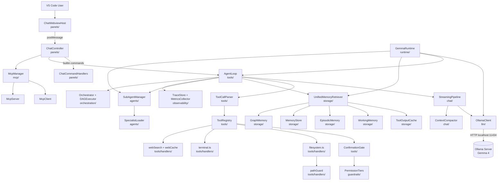
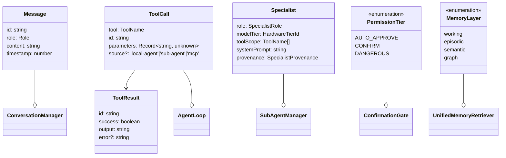
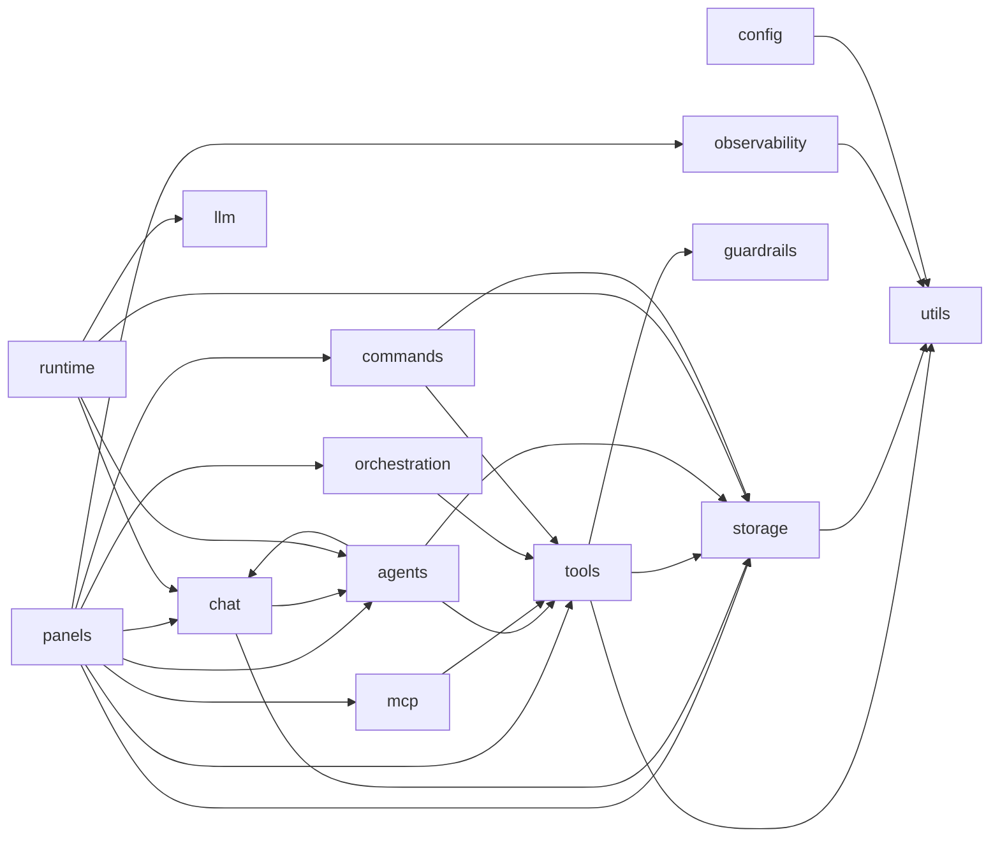

# Codebase Analysis: Gemma Code

**Version**: v0.6.0
**Generated**: 2026-05-04T00:00:00Z
**Analyzer**: Claude Code -- analyze-codebase command

Version detected from `CHANGELOG.md` first heading (`## [0.6.0] -- 2026-05-04`), the in-flight v0.6.0 release entry. The `package.json` field still reads `0.5.5`; sub-task 8.5 of [docs/archive/versions/v0/v0.6.0/plans/v0.6.0-cycle.md](plans/v0.6.0-cycle.md) bumps it to match.

---

## 1. Executive Summary

Gemma Code is a privacy-first, fully offline VS Code extension that wraps Google's Gemma 4 model via Ollama as an agentic coding assistant. It runs the agent loop locally -- tool calls, planning, sub-agent orchestration, memory recall, semantic search -- without any external API calls. The codebase is mid-cycle: v0.5.0 shipped a major capability uplift (memory hygiene, MCP, sub-agents, predictive layer prototype, Brotli-backed cache), and v0.6.0 is the consolidation cycle that pays down v0.5.0's documented technical debt, closes the only chained P0 security finding (Attack Path A), and removes every `BASELINE-2026-04-25; ratchet by v0.6.0` baseline exception. The project is in **active stable development** -- production-ready VSIX packaging, semantic-release wired, 1,500+ tests, but not yet on the VS Code Marketplace.

---

## 2. Architecture Overview

Gemma Code is a **VS Code extension monolith** structured around the **agentic loop**: parse user message -> ask Gemma 4 (locally via Ollama) -> parse tool calls from response -> dispatch through a permission-tiered registry -> feed results back -> repeat until the model emits no further tool calls. Layered defenses (pathGuard, ConfirmationGate, GitSafetyNet, ActionClassifier, LoopDetector) guard each tool dispatch. Cross-cutting subsystems (Memory, Tracing, Skills, MCP) hook into the loop via well-defined ports.



**Component descriptions**:

- **panels/** — VS Code webview surface. `GemmaCodePanel` is the composition root (lifecycle + wiring); `ChatController` owns flow; `ChatWebviewHost` owns surface; `ChatCommandHandlers` dispatches slash commands. See [ADR-0008](../../adr/0008-panel-decomposition.md).
- **tools/** — Agentic-loop core. `AgentLoop` runs the iteration; `ToolRegistry` dispatches; `Gemma4ToolFormat` parses native `<|tool_call>` tokens.
- **tools/handlers/** — Concrete tool implementations. All filesystem operations route through `pathGuard.resolveInsideWorkspace` ([ADR-0006](../../adr/0006-unified-path-guard.md)).
- **guardrails/** — Cross-cutting safety. `PermissionTiers` is read-side-clamped ([ADR-0007](../../adr/0007-permission-tier-floor.md)); `ActionClassifier` decides checkpoint cadence; `GitSafetyNet` produces rollback points; `LoopDetector` stops runaway loops.
- **chat/** — Conversation state, context compaction (5-strategy pipeline; [ADR-0003](../../adr/0003-compaction-strategy-ordering.md)), prompt building, streaming pipeline.
- **storage/** — Memory subsystem ([ADR-0002](../../adr/0002-memory-subsystem-layering.md)) plus the brotli-backed `ToolOutputCache` (SQLite, chmod 0o600). `UnifiedMemoryRetriever` is the single read API.
- **agents/** — Sub-agent isolation ([ADR-0004](../../adr/0004-sub-agent-isolation-contract.md)). `SubAgentManager` spawns scoped agents; `SpecialistLoader` resolves bundled markdown specialists.
- **mcp/** — Model Context Protocol bidirectional support. `McpClient` connects out; `McpServer` exposes a read-only-by-default tool surface.
- **observability/** — `TraceStore` (SQLite-backed; buffered writes), `MetricsCollector`, `OtlpExporter`, optional `OperationLog`.
- **orchestration/** — `Orchestrator` + `DAGExecutor` for plan-and-execute multi-step flows.
- **runtime/** — `GemmaRuntime` is the composition root for shared `OllamaClient` injection.
- **llm/** — `OllamaClient` (high-level chat API) + `OllamaHttp` (transport).
- **skills/** — Skill loader + `assets/specialists/` markdown. `~/.gemma-code/skills/` hot-reloads.
- **commands/** — `CommandRouter` parses slash commands; `memoryLintCommand` is the heaviest dedicated handler.
- **evaluation/** — Golden task suite framework (24-task benchmark; YAML defs).
- **config/** — Settings reader, GPU detection, hardware-tier classifier, prompt budget.

---

## 3. Technology Stack

| Layer | Technology | Version | Notes |
|---|---|---|---|
| Runtime | Node.js | >= 20.0.0 | `engines.node` bumped from 18 to 20 in v0.5.4 |
| Editor host | VS Code | >= 1.90.0 | `engines.vscode` |
| Language | TypeScript | ^5.4.0 | `strict: true`, `noUncheckedIndexedAccess: true` |
| Local model | Gemma 4 (e2b/e4b/26b/31b) | via Ollama | Talks to `http://localhost:11434` only |
| Embedded SQLite | better-sqlite3 | ^12.8.0 | Synchronous; used for chat history, tool-output cache, trace store, memory layers |
| Tokenizer | tiktoken | ^1.0.17 | Replaced character-count heuristic in v0.5.0 Phase 5 |
| HTML sanitiser | isomorphic-dompurify | ^3.9.0 | All webview HTML routes through it |
| Markdown | marked | ^4.3.0 | v12 migration deferred to v0.7.0 (per [docs/archive/versions/v0/v0.6.0/development/history/2026-05_phase-7-polish.md](development/history/2026-05_phase-7-polish.md) §7.5) |
| Glob matcher | minimatch | ^10.2.5 | Replaced hand-rolled `globToRegex` in Phase 7 |
| Schema validation | zod | ^3.23.8 | Specialist frontmatter, MCP messages, settings |
| Diff | diff | ^5.2.2 | Used by `RegenerateFromSource` and edit dry-runs |
| Syntax highlight | highlight.js | ^11.11.1 | Bundled for the webview |
| MCP | @modelcontextprotocol/sdk | ^1.29.0 | stdio transport only |
| HTML parser | node-html-parser | ^6.1.13 | Used by `webSearch` |
| Test runner | vitest | ^1.0.0 | Native ESM; coverage via `@vitest/coverage-v8` |
| Mock service worker | msw | ^2.13.4 | HTTP mocking in integration tests |
| Mutation testing | @stryker-mutator/core | ^9.6.1 | Quarterly run; current score 50.64% overall / 58.92% covered |
| Lint | eslint | ^8.57.0 | + `@typescript-eslint/*` ^7.0.0 |
| Dependency rules | dependency-cruiser | ^16.10.4 | `npm run deps:check`; zero baseline exceptions in v0.6.0 |
| Release | semantic-release | ^25.0.0 | + commitlint, conventional commits |
| VSIX packaging | @vscode/vsce | ^2.24.0 | `scripts/build-vsix.ps1` |
| Husky / lint-staged | husky 9.1.7 / lint-staged 15.5.2 | | Pre-commit + commit-msg hooks |

**Pinned for non-obvious reasons**:

- `marked` is held at v4 deliberately (the v12 `Renderer` API is incompatible with the three custom renderers in `MarkdownRenderer.ts`); migration is logged at [docs/archive/versions/v0/v0.6.0/review/known-gaps.md](review/known-gaps.md) §11.1.
- `@stryker-mutator/vitest-runner` is held at ^8 (v9 requires vitest 2.x; project is on vitest 1.x).

---

## 4. Project Structure

```
/
├── src/                          # Application source -- 17 top-level modules, ~24.7K LoC
│   ├── extension.ts              # VS Code activation entry point (cited in package.json:25)
│   ├── runtime/                  # Composition root -- GemmaRuntime owns the shared OllamaClient
│   ├── panels/                   # VS Code webview surface (ADR-0008 split)
│   │   └── webview/              # HTML/CSS/runtime IIFE -- source-level decomposition
│   ├── chat/                     # ConversationManager, ContextCompactor, PromptBuilder, StreamingPipeline
│   ├── tools/                    # AgentLoop + ToolRegistry + ToolCatalog
│   │   └── handlers/             # filesystem, terminal, web -- all behind pathGuard (ADR-0006)
│   ├── guardrails/               # PermissionTiers, ActionClassifier, GitSafetyNet, LoopDetector
│   ├── storage/                  # Memory layers + ToolOutputCache + GraphMemory
│   │   └── eviction/             # 5 pluggable Evictor strategies (LRU default)
│   ├── agents/                   # SubAgentManager, SpecialistLoader
│   ├── mcp/                      # bidirectional Model Context Protocol
│   ├── observability/            # TraceStore, MetricsCollector, OtlpExporter, OperationLog
│   ├── orchestration/            # Orchestrator + DAGExecutor (plan-and-execute)
│   ├── llm/                      # OllamaClient + OllamaHttp transport
│   ├── skills/                   # SkillLoader + bundled catalog
│   ├── commands/                 # CommandRouter + memoryLintCommand
│   ├── evaluation/               # Golden task suite framework
│   ├── config/                   # settings.ts, GpuDetector, HardwareTier, PromptBudget
│   └── utils/                    # secretPaths, Compressor, logger, errors
│
├── tests/                        # 162 test files (151 unit/integration + 11 bench)
│   ├── unit/                     # Co-organised to mirror src/ tree
│   ├── integration/              # Touches real SQLite + msw HTTP mocks
│   ├── benchmarks/               # vitest bench; perf gates in nightly.yml
│   ├── golden/                   # YAML task suite + baselines/v*.json
│   ├── e2e/                      # VS Code instance smoke tests (manual / nightly)
│   ├── fixtures/                 # Test data
│   ├── helpers/                  # Shared test utilities (e.g. detectRegressions)
│   ├── snapshots/                # Specialist characterization (frozen Phase-8 prompts)
│   └── smoke/                    # Quick start-up checks
│
├── scripts/                      # Build + CI helpers
│   ├── hooks/                    # Agent-agnostic Node ESM hook scripts (Phase 8 v0.5.0)
│   ├── installer/                # PyQt5 cross-platform installer
│   ├── build-vsix.ps1            # PowerShell VSIX packager
│   ├── generate-catalog.mjs      # docs/index.md generator (CI-gated)
│   ├── generate-tool-permission-table.mjs   # ADR-0005 doc generator (CI-gated)
│   ├── generate-golden-tasks.mjs # Pretest hook
│   └── check-bench-regressions.mjs # Nightly benchmark gate
│
├── configs/                      # Tool configs hoisted out of root
│   ├── tsconfig*.json            # Note: tsconfig.json is at root; build uses tsc default
│   ├── vitest.config.ts          # + vitest.stryker.config.ts (narrow Stryker runner)
│   ├── dependency-cruiser.cjs    # Zero baseline exceptions in v0.6.0
│   ├── stryker.config.json       # Mutation testing
│   └── eslint.config.mjs         # Flat config
│
├── docs/                         # Versioned documentation
│   ├── adr/                      # ADRs 0001..0010 (immutable once accepted)
│   ├── v0.1.0..v0.6.0/           # Per-version plans, reviews, history, architecture
│   └── index.md                  # Auto-generated catalog (CI-gated)
│
├── assets/                       # icon, sidebar-icon, specialists/*.md
├── catalog/                      # MCP server registry (DevAI-Hub policy-governed)
└── .github/
    └── workflows/                # 8 workflows (ci, nightly, release, semantic-release, ...)
```

**Organisational pattern**: feature-organised within a domain-layered superstructure. Top-level dirs under `src/` correspond to subsystems (memory, agents, tools); within each subsystem, classes are flat. Cross-cutting types live in `*.types.ts` siblings. Test directory mirrors `src/` topology. Strong convention against deep nesting -- only one directory in `src/` (`tools/handlers/`, `panels/webview/`, `storage/eviction/`, `skills/catalog/`) goes two levels deep.

---

## 5. Core Domain Model

Five domain entities define Gemma Code's vocabulary:

- **`Message`** ([src/chat/types.ts](../../../src/chat/types.ts)) — `{ id, role: 'system'|'user'|'assistant'|'tool', content, timestamp }`. The unit of conversation.
- **`ToolCall` / `ToolResult`** ([src/tools/types.ts](../../../src/tools/types.ts)) — `ToolCall = { tool, id, parameters }`; `ToolResult = { id, success, output, error? }`. The unit of agent action.
- **`Specialist`** ([src/agents/SpecialistLoader.ts](../../../src/agents/SpecialistLoader.ts)) — `{ role, modelTier, toolScope, systemPrompt, provenance: 'workspace'|'bundled'|'hardcoded' }`. The unit of sub-agent identity.
- **`PermissionTier`** ([src/guardrails/PermissionTiers.ts](../../../src/guardrails/PermissionTiers.ts)) — `enum { AUTO_APPROVE = 0, CONFIRM = 1, DANGEROUS = 2 }`. The unit of trust.
- **`MemoryLayer`** ([src/storage/MemoryLayers.types.ts](../../../src/storage/MemoryLayers.types.ts)) — `'working' | 'episodic' | 'semantic' | 'graph'`. The unit of recall.



A reader who has internalised these five names can read any other module without translation. Every other type is built on top of these.

---

## 6. Key Workflows and Entry Points

**Entry points**:

| Surface | File | Trigger |
|---|---|---|
| Extension activation | [src/extension.ts](../../../src/extension.ts) | VS Code `onStartupFinished` ([package.json:23](../../../package.json#L23)) |
| Sidebar webview | `gemma-code.chatView` | First chat message ([package.json:39](../../../package.json#L39)) |
| Trace dashboard webview | `gemma-code.traceDashboard` | View open ([package.json:44](../../../package.json#L44)) |
| MCP stdio server | `mcpEnabled` setting + `mcpServerMode: server` | Activation if enabled |
| Slash command | `CommandRouter.parseSlashCommand` | Webview message |
| Skill execution | `SkillLoader` + `~/.gemma-code/skills/` | Slash command match |

**Key flows**:

### Flow 1 — Agentic loop (user message to tool execution)

```mermaid
sequenceDiagram
    participant User
    participant WebView as ChatWebviewHost
    participant Ctrl as ChatController
    participant Loop as AgentLoop
    participant Pipe as StreamingPipeline
    participant Ollama as OllamaClient
    participant Reg as ToolRegistry
    participant Gate as ConfirmationGate
    participant Tool as filesystem.read_file
    participant Guard as pathGuard

    User->>WebView: type message + Enter
    WebView->>Ctrl: postMessage({type:'sendMessage'})
    Ctrl->>Loop: submitUserMessage(text)
    Loop->>Pipe: streamCompletion(messages)
    Pipe->>Ollama: stream chat
    Ollama-->>Pipe: tokens (incl. <|tool_call>)
    Pipe-->>Loop: parsed ToolCall
    Loop->>Reg: execute(call, source='local-agent')
    Reg->>Gate: shouldRequireConfirmation?
    Gate-->>Reg: false (AUTO_APPROVE)
    Reg->>Tool: read_file(path)
    Tool->>Guard: resolveInsideWorkspace(path)
    Guard-->>Tool: realpath'd absolute
    Tool-->>Reg: {success, output}
    Reg-->>Loop: ToolResult
    Loop->>Pipe: feed result, continue
    Pipe->>Ollama: next turn
    Ollama-->>Pipe: assistant final text
    Pipe-->>WebView: streamed tokens
    WebView-->>User: rendered message
```

### Flow 2 — Permission tier dispatch (DANGEROUS class)

```mermaid
sequenceDiagram
    participant Loop as AgentLoop
    participant Reg as ToolRegistry
    participant Tier as PermissionTiers
    participant Gate as ConfirmationGate
    participant User
    participant Term as terminal.run

    Loop->>Reg: execute({tool:'run_terminal',...})
    Reg->>Tier: getPermissionTier('run_terminal', overrides)
    Tier-->>Tier: clamp if override < CONFIRM
    Tier-->>Reg: DANGEROUS
    Reg->>Gate: confirm(call, getDangerousWarning(...))
    Gate->>User: prompt: "This will execute a shell command..."
    User-->>Gate: approve
    Gate-->>Reg: granted
    Reg->>Term: spawn(cmd)
    Term-->>Reg: {output, exitCode}
    Reg-->>Loop: ToolResult
```

### Flow 3 — Memory retrieval at prompt-build time

`PromptBuilder.build()` calls `UnifiedMemoryRetriever.retrieve({layers, budget})` which fans out to four layers in parallel ([src/storage/UnifiedMemoryRetriever.ts:143-160](../../../src/storage/UnifiedMemoryRetriever.ts#L143-L160)). The retriever distributes the token budget proportionally (working 20%, semantic 30%, graph 25%, episodic 25%; defined in `DEFAULT_BUDGET_WEIGHTS`), trims episodic first if over budget, never trims working. Cosine-similarity recall from the `tool_output_cache` applies the per-provenance threshold elevation ([ADR-0010](../../adr/0010-threshold-elevation-decision.md)).

### Flow 4 — Sub-agent dispatch

`AgentLoop` detects a verification trigger (3+ file edits within window), calls `SubAgentManager.spawn('verification')`, which: (a) loads the specialist via `SpecialistLoader` (workspace -> bundled -> hardcoded); (b) builds an isolated `ConversationManager` + `AgentLoop` + scoped `ToolRegistry` with `toolScope` filter; (c) runs to completion or `subAgentMaxIterations`; (d) returns advisory result; (e) parent loop injects as system advisory message. The sub-agent shares the parent's `OllamaClient` but nothing else.

---

## 7. Module and Dependency Map

`npm run deps:check` reports zero violations across 121+ modules in v0.6.0 (post-Phase-4 ratchet) and zero `BASELINE-2026-04-25` exceptions. Cross-directory import-edge counts (top 10 by outbound count, from `^import.*from "..` analysis):

| File | Cross-dir imports | Role |
|---|---|---|
| `src/panels/GemmaCodePanel.ts` | 44 | Composition root (intentional hot spot) |
| `src/panels/ChatCommandHandlers.ts` | 20 | Slash dispatcher (intentional) |
| `src/tools/AgentLoop.ts` | 16 | Core agent loop |
| `src/agents/SubAgentManager.ts` | 14 | Sub-agent orchestrator |
| `src/panels/ChatController.ts` | 8 | Chat flow |
| `src/panels/messages.ts`, `src/orchestration/Orchestrator.ts`, `src/orchestration/DAGExecutor.ts`, `src/mcp/McpManager.ts`, `src/mcp/McpClient.ts`, `src/chat/PromptBuilder.ts` | 5-6 each | Cross-cutting |

**Hot-spot concentration is intentional**: `GemmaCodePanel.ts` is the composition root (per ADR-0008 it owns the wiring graph; the controller owns flow). `AgentLoop.ts` is the convergence point of every subsystem. The remaining files are 4-or-fewer-imports modules.

**Circular dependencies**: zero. Two cycles closed in v0.6.0 Phase 4: `MemoryStore <-> MemoryConsolidator` (broken via `MemoryShared.types.ts`); `SubAgentManager <-> SubAgentTool` (broken via `SubAgentSpawner.types.ts`).

**Utility / shared infrastructure**: `src/utils/` (secretPaths, Compressor, logger, errors) is the leaf set — imported by many, imports nothing in `src/`. `src/llm/types.ts` and `src/tools/types.ts` are pure type packages. `src/config/settings.ts` is the configuration leaf used by every settings consumer.



---

## 8. Configuration and Environment

44 `gemma-code.*` settings exposed via `package.json` `contributes.configuration.properties`. No environment variables are required at runtime; an offline default works out of the box. CI / scripts use a small set of env vars.

**Runtime settings** (selected; full list in [package.json:84-354](../../../package.json#L84)):

| Setting | Default | Purpose |
|---|---|---|
| `gemma-code.ollamaUrl` | `http://localhost:11434` | Ollama endpoint |
| `gemma-code.modelName` | `gemma4:e4b` | Inference model |
| `gemma-code.maxTokens` | `131072` | Context window |
| `gemma-code.editMode` | `ask` | `auto`/`ask`/`plan` for CONFIRM-tier |
| `gemma-code.toolConfirmationMode` | `always` | `always`/`ask`/`never` for DANGEROUS-tier |
| `gemma-code.permissionOverrides` | `{}` | Per-tool tier override (clamped at floor; ADR-0007) |
| `gemma-code.mcpExposedTools` | `["read_file","list_directory","grep_codebase"]` | New in v0.6.0 |
| `gemma-code.ollamaEmbeddingThreshold` | `0.85` | New in v0.6.0; ADR-0010 |
| `gemma-code.heuristicEmbeddingThreshold` | `0.95` | New in v0.6.0; ADR-0010 |
| `gemma-code.cacheEvictionStrategy` | `lru` | One of 5 pluggable strategies |
| `gemma-code.memoryCorroborationThreshold` | `2` | N-corroboration before fact promotion |
| `gemma-code.gpuTierOverride` | `null` | Manual hardware tier; legacy `gpuTier` removed in v0.6.0 |
| `gemma-code.operationLog.enabled` | `false` | Append-only operation log |

**Environment variables** (CI / scripts only):

| Variable | Required | Default | Purpose |
|---|---|---|---|
| `OLLAMA_URL` | No | -- | Override for golden-task suite + integration tests |
| `OPENAI_API_KEY` | No | -- | Not used at runtime; only in optional benchmark comparison scripts |
| `GEMMA_HOOK_DIRTY_LIMIT` | No | `50` | Dirty-file threshold for `scripts/hooks/lib/git-control.mjs` |
| `OTLP_ENDPOINT` | No | -- | Optional OTLP exporter target |
| `OTLP_HEADERS` | No | -- | Comma-separated OTLP auth headers |

**Secrets**: none required at runtime (offline-first). CI release jobs load a `GITHUB_TOKEN` (provided by GitHub Actions) and an `NPM_TOKEN` (only for `@semantic-release/npm`; not used to publish to npm at runtime). No secrets are read from `process.env` outside CI scripts.

---

## 9. Testing Strategy

| Tier | Count | Location | Run command |
|---|---|---|---|
| Unit | 151 files | `tests/unit/` (mirrors `src/`) | `npm test` |
| Integration | (subset of 162) | `tests/integration/` | `npm run test:integration` |
| Benchmarks | 11 files | `tests/benchmarks/` | `npm run bench` |
| Golden tasks | 24 YAML tasks | `tests/golden/tasks/` | matrix in `.github/workflows/golden-tasks.yml` |
| E2E | smoke | `tests/e2e/` | manual or nightly |

**Runner**: vitest 1.x (native ESM) configured at [configs/vitest.config.ts](../../../configs/vitest.config.ts). Coverage emitted via `@vitest/coverage-v8` with `text`, `lcov`, and `json-summary` reporters. CI gate reads `.total.lines.pct >= 80` and `.total.branches.pct >= 75` from `coverage-summary.json` (per Phase 7 sub-task 7.1).

**Mocking**: `msw` for HTTP; vitest `vi.mock` for module boundary. The `vscode` module is stubbed via `tests/setup.ts` and per-test inline mocks (the bench file uses an inline `StubEventEmitter`).

**Mutation testing**: Stryker with vitest-runner ^8 (v9 needs vitest 2.x). Narrow runner targets `tests/unit/guardrails/**`, `tests/unit/tools/handlers/**`, `tests/unit/utils/secretPaths.test.ts`. Current score: 50.64% overall, 58.92% covered (Phase 7 sub-task 7.6).

**Conspicuously untested**: previous low spots (panels, sub-agents) closed in v0.6.0 Phase 6 (59 new tests). Remaining low-coverage spots: orchestration timing edge cases (`Orchestrator.test.ts` is timing-sensitive and excluded from Stryker); installer scripts (PyQt5; tested by smoke job, not unit).

**Baselines**:

- Golden: `tests/golden/baselines/v0.3.0-{e2b,e4b}.json`, `v0.5.0+{memory-hygiene,agent-friendly}.json`. **`v0.4.0.json` and `v0.6.0.json` not yet captured at the time of this analysis** — release-gate sub-task 8.1 captures `v0.6.0.json` on a quiescent dev workstation against live Ollama.
- Bench: `tests/benchmarks/baselines/v0.3.0.json`, `v0.4.0.json`, `v0.5.0.json`, `v0.6.0.json` exist; the v0.6.0 file will be regenerated post-Phase-7.

---

## 10. Build, Run, and Deploy

**Clean clone to running extension**:

```powershell
# Prereqs: Node 20+, VS Code 1.90+, Ollama installed and `gemma4:e4b` pulled.
git clone https://github.com/bendourthe/Gemma-Code.git
cd Gemma-Code
npm ci
npm run build
# Press F5 in VS Code to launch the Extension Development Host.
# Or build a VSIX:
npm run package        # PowerShell-based; outputs out/gemma-code-<version>.vsix
code --install-extension out/gemma-code-<version>.vsix
```

**Development**:

```bash
npm run watch          # tsc -w in another terminal
npm test               # vitest run
npm run lint           # eslint src
npm run deps:check     # dependency-cruiser (zero baseline exceptions)
npm run perm-tier:check  # asserts ARCHITECTURE.md tier table is in sync
npm run catalog:check  # asserts docs/index.md is in sync
npm run bench          # vitest bench --run (perf gates)
npm run mutate         # Stryker mutation pass (slow; ~20 min)
```

**CI/CD pipeline** (8 GitHub Actions workflows):

| Workflow | Trigger | Purpose |
|---|---|---|
| `ci.yml` | PR / push | lint + test + coverage gate (json-summary) + deps:check + catalog:check + perm-tier:check + audit (moderate) + audit-ts-dev (non-blocking) |
| `commitlint.yml` | PR | Conventional commit format |
| `nightly.yml` | cron 03:00 UTC | Bench regression gate (vs. last baseline) + integration + Ollama integration |
| `golden-tasks.yml` | nightly | Live-Ollama matrix (e2b + e4b); regression report against last baseline |
| `installer-smoke.yml` | release-tag | PyQt5 installer smoke (Windows / macOS / Linux) |
| `release.yml` | manual / tag | VSIX + installer build; GitHub Release |
| `semantic-release.yml` | push to main | Conventional-commit-driven version bump + CHANGELOG + GitHub release |
| `branch-cleanup.yml` | cron | Dry-run prune of stale remote branches |

All Actions pinned to commit SHA per v0.5.0 Phase 10 hardening. `concurrency: cancel-in-progress` on long-running workflows.

---

## 11. Known Complexity and Gotchas

- **Single-OllamaClient sharing.** The agent loop, sub-agent manager, streaming pipeline, embedding client, and ollama poller all share the same `OllamaClient` instance constructed in `GemmaRuntime.getOllamaClient()`. v0.5.0 Phase 9 introduced this pattern after a tick-allocation issue (per [src/extension.ts:44-47](../../../src/extension.ts#L44)); reverting any consumer to construct its own client costs ~17K allocations per 8-hour idle session.
- **Native-cleanup segfault on Node 24 + better-sqlite3.** The Phase 7 history documents that vitest occasionally segfaults during process teardown after all tests finish reporting. It does not affect test results — but masked exit codes pre-v0.6.0. Phase 7 sub-task 7.7 fixed `npm run bench` to pass `--run` so the bench process exits cleanly.
- **Sub-agent `OllamaClient` sharing is intentional but invariant-fragile.** [ADR-0004](../../adr/0004-sub-agent-isolation-contract.md) documents the contract; the sub-agent sees its own `ConversationManager` + `AgentLoop` + scoped `ToolRegistry`, but the same client. Any future change to client state during a request would break sub-agent isolation.
- **PathGuard requires a workspace root.** `workspaceRoot()` throws if `vscode.workspace.workspaceFolders` is empty. Tests must mock `workspaceFolders` correctly; the bench file uses an inline `vi.mock("vscode", ...)` block.
- **`embedding_provenance` is NULL for legacy rows.** [ADR-0010](../../adr/0010-threshold-elevation-decision.md): NULL is conservatively classified as the higher-quality `'ollama'` tier (because heuristic rows are always tagged at write time). New code adding embedding consumers must respect this contract.
- **`it.todo` placeholders are forbidden.** AGENTS.md rule: any `it.todo` blocks ship in tests. The `tests/integration/heuristic-fallback.test.ts` placeholders that survived v0.5.0 Phase 12 were closed in v0.6.0 Phase 5 sub-task 5.2.
- **Webview `index.ts` is a 12-line shim.** [src/panels/webview/index.ts](../../../src/panels/webview/index.ts) re-exports `getWebviewHtml` from `scaffold.ts`. ADR-0008 documents the reason; do not delete the shim without auditing out-of-tree callers.
- **`marked` v4 is intentional.** v12 reshapes the `Renderer` API (single-token-object instead of positional args). The custom code/heading/link renderers in `MarkdownRenderer.ts` would all need rewrites. Logged as v0.7.0 (per Phase 7 §7.5).
- **The catalog lives in two places by design.** `scripts/hooks/lib/secret-paths.mjs` (canonical) and `src/tools/handlers/secretPaths.ts` (mirror). Duplication is required because `scripts/**` is excluded from the packaged VSIX. `tests/unit/hooks/secret-paths-sync.test.ts` enforces equality.
- **Only 2 TODO/FIXME markers in `src/`** (verified via `grep -rn "TODO\|FIXME\|XXX\|HACK" src --include="*.ts"`). The cleanup discipline of v0.5.0 Phase 11 + v0.6.0 holds.

---

## 12. Suggested Reading Order

1. **[src/extension.ts](../../../src/extension.ts)** — Activation hook + Ollama poller + composition. The smallest file that shows the whole system being wired up.
2. **[src/runtime/GemmaRuntime.ts](../../../src/runtime/GemmaRuntime.ts)** — Composition root for shared `OllamaClient`. Once you see what it owns, you understand how everything connects.
3. **[src/tools/AgentLoop.ts](../../../src/tools/AgentLoop.ts)** — The core iteration. Read this before any subsystem; everything else exists to feed or guard it.
4. **[src/tools/ToolRegistry.ts](../../../src/tools/ToolRegistry.ts) + [src/tools/ConfirmationGate.ts](../../../src/tools/ConfirmationGate.ts)** — Dispatch + the safety boundary.
5. **[src/guardrails/PermissionTiers.ts](../../../src/guardrails/PermissionTiers.ts)** — 121 lines, the entire trust model.
6. **[src/tools/handlers/pathGuard.ts](../../../src/tools/handlers/pathGuard.ts) + [filesystem.ts](../../../src/tools/handlers/filesystem.ts)** — One realpath-aware boundary; ADR-0006 makes this the canonical example of a v0.6.0 ratchet.
7. **[src/storage/UnifiedMemoryRetriever.ts](../../../src/storage/UnifiedMemoryRetriever.ts)** — Memory recall API. After reading this you can navigate `WorkingMemory`, `EpisodicMemory`, `MemoryStore`, `GraphMemory`.
8. **[src/agents/SubAgentManager.ts](../../../src/agents/SubAgentManager.ts) + [src/agents/SpecialistLoader.ts](../../../src/agents/SpecialistLoader.ts)** — Sub-agent isolation in concrete code; ADR-0004 is the why.
9. **[src/panels/GemmaCodePanel.ts](../../../src/panels/GemmaCodePanel.ts) -> [ChatController.ts](../../../src/panels/ChatController.ts) -> [ChatWebviewHost.ts](../../../src/panels/ChatWebviewHost.ts) -> [ChatCommandHandlers.ts](../../../src/panels/ChatCommandHandlers.ts)** — In that order. The composition root first, then flow, then surface, then dispatch.
10. **[docs/adr/](../../adr)** — All 10 ADRs. Read in numeric order. After this, every "why is X structured that way" question has an answer in-tree.

Defer until later: `src/orchestration/`, `src/observability/`, `src/mcp/`, `src/skills/`. Each is a self-contained subsystem reachable from `extension.ts` but understandable on its own once the core agent loop is internalised.

---

## Quality checks

- [x] Every architectural claim cites a supporting file path.
- [x] Mermaid diagrams use only nodes defined in the same diagram.
- [x] Version `v0.6.0` matches the first heading in `CHANGELOG.md` exactly.
- [x] `node_modules/`, `out/`, `coverage/`, generated catalog and golden-task fixtures excluded from analysis.
- [x] Output path `docs/archive/versions/v0/v0.6.0/analysis.md` resolves inside the project root.
- [x] Sections that could not be populated state so explicitly (e.g., golden baselines `v0.4.0.json` / `v0.6.0.json` not yet captured).
