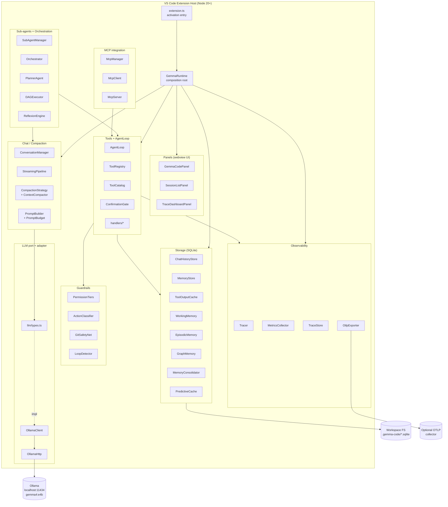
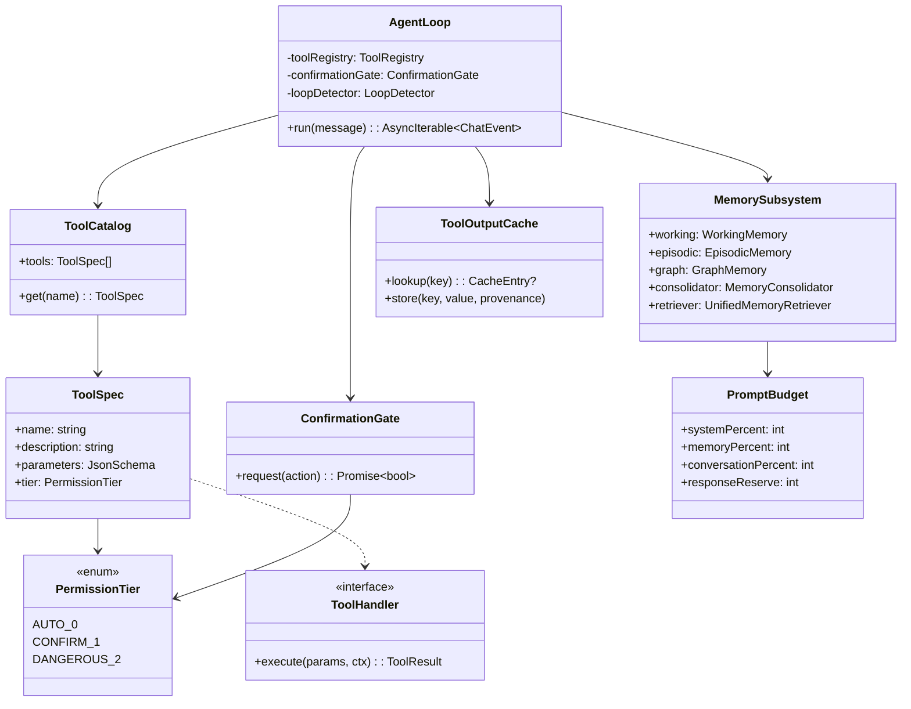

# Codebase Analysis: Gemma Code

**Version**: v0.5.4 (next planned release: v0.6.0)
**Generated**: 2026-04-27T00:00:00Z
**Analyzer**: Claude Code -- analyze-codebase command
**Scope**: Pre-v0.6.0 baseline review. Documented as part of the multi-phase v0.6.0 review workflow under `docs/archive/versions/v0/v0.6.0/review/`.

---

## 1. Executive Summary

Gemma Code is a local, agentic coding assistant for VS Code that runs entirely offline by routing inference through a locally hosted Ollama server fronting Google's Gemma 4 model. The product surface is a webview-based chat panel plus a deep tool catalog (filesystem, terminal, grep, web fetch, MCP) gated by a permission-tier guardrail stack, a multi-layer SQLite-backed memory subsystem, and a context-compaction pipeline tuned for the model's 128K token window. The repository is in active development with twelve completed v0.5.0 phases (identity, tool hardening, compression, persistent cache, semantic recall, mutation safety, memory hygiene, harness externalization, observability, hygiene, documentation discipline, advanced fallbacks) and a documented backlog of v0.6.0 ratchet items in [docs/archive/versions/v0/v0.5.0/known-gaps.md](known-gaps.md). State: actively maturing, with a stable shipped surface and a known set of carry-over technical debt items that motivate the v0.6.0 cycle.

---

## 2. Architecture Overview

The system follows a layered, port-and-adapter pattern in a single-process VS Code extension. Inference is delegated to an out-of-process Ollama HTTP server; persistent state lives in workspace-local SQLite databases. There are no network egress paths in product code beyond Ollama, optional OTLP trace export, and explicit `web_search` / `fetch_page` tool handlers. See [ARCHITECTURE.md](../../../../ARCHITECTURE.md) for the canonical module-dependency mermaid graph.



Component summary:

- **extension.ts / GemmaRuntime** ([src/extension.ts](../../../../src/extension.ts), [src/runtime/GemmaRuntime.ts](../../../../src/runtime/GemmaRuntime.ts)): activation entry and composition root. Owns the Tracer and the settings snapshot subscription.
- **Panels**: three webviews. Chat is the primary surface; Sessions lists prior threads; Traces renders the in-process observability buffer.
- **Chat**: prompt assembly, token budgeting (tiktoken), streaming token relay, sliding-window compaction with regenerate-from-source fallback.
- **Tools**: 10-tool catalog (read, write, edit, create, delete, list, grep, terminal, web search, fetch page) plus the agent loop that drives them.
- **Guardrails**: permission-tier gating, action classification, git destructive-flag block, infinite-loop detection.
- **Storage**: SQLite-backed multi-layer memory (working / episodic / graph / consolidated) plus the tool-output cache, web-response cache, chat history store, and an opt-in predictive prefetch layer.
- **LLM port**: vendor-neutral `LLMClient` interface in [src/llm/types.ts](../../../../src/llm/types.ts) backed by `OllamaClient` / `OllamaHttp`.
- **Observability**: in-process `TraceStore`, `MetricsCollector`, optional OTLP HTTP export.
- **Agents / Orchestration**: verification, research, planning sub-agents; experimental DAG-based orchestrator and reflexion engine.
- **MCP**: optional Model Context Protocol stdio server and client manager for external tool interop.

---

## 3. Technology Stack

| Layer | Technology | Version | Notes |
|---|---|---|---|
| Language | TypeScript | ^5.4 | Strict mode; ESLint enforces no `any`. |
| Runtime | Node.js | >=20 | Bumped from 18 in commit `ad39bc1`; CI matrix `20.x`, `22.x` ([.github/workflows/ci.yml:32](../../../../.github/workflows/ci.yml#L32)). |
| Editor host | VS Code | ^1.90 | Extension API; webview UI. |
| Inference | Ollama | external | HTTP REST on `localhost:11434`; `gemma4:e4b` is the default model. |
| Storage | SQLite | better-sqlite3 ^12.8 | Native module; chmod 0o600 on POSIX via [src/storage/dbPermissions.ts](../../../../src/storage/dbPermissions.ts). |
| Search/index | SQLite FTS5 | bundled | Used by `ChatHistoryStore` and `ToolOutputCache.excerpt`. |
| Tokenizer | tiktoken | ^1.0.17 | Replaced the v0.4.0 char/4 heuristic in Phase 5 of v0.5.0. |
| Compression | brotli | node:zlib | Used by [src/tools/Compressor.ts](../../../../src/tools/Compressor.ts) for cache + transcript payloads. |
| Validation | zod | ^3.23.8 | All tool-call parsing and settings shape checks. |
| HTML rendering | marked + DOMPurify (isomorphic-dompurify) | ^4.3 / ^3.9 | DOMPurify sanitizes every webview HTML sink. |
| Syntax highlight | highlight.js | ^11.11 | Rendered inside the webview only. |
| HTML parsing | node-html-parser | ^6.1 | Used in the `fetch_page` tool. |
| Diff | diff | ^5.2 | Apply-edit tool surface. |
| MCP | @modelcontextprotocol/sdk | ^1.29 | Off by default (`mcpServerMode: 'off'`). |
| Test runner | Vitest | ^1.0 | Co-located unit tests under `tests/unit/`; integration under `tests/integration/`. |
| Bench runner | Vitest bench | ^1.0 | 10 bench files under `tests/benchmarks/`. |
| HTTP mocking | msw | ^2.13 | For `OllamaHttp` and webfetch handlers. |
| Lint | ESLint | ^8.57 | `lint-staged` enforces `--max-warnings=0` on staged TS. |
| Module rules | dependency-cruiser | ^16.10 | 4 hard rules + grandfathered baseline; see [configs/dependency-cruiser.cjs](../../../../configs/dependency-cruiser.cjs). |
| Commit hygiene | husky + commitlint + semantic-release | 9 / 19 / 25 | Conventional commits; auto-release on push to main. |
| Packaging | @vscode/vsce | ^2.24 | `npm run package` builds the VSIX via [scripts/build-vsix.ps1](../../../../scripts/build-vsix.ps1). |
| Installer (legacy) | PyQt5 | bundled venv | Cross-platform install wizard under [scripts/installer/pyqt/](../../../../scripts/installer/pyqt); `--headless` mode supported. |

The `tiktoken` pin is non-obvious: it locks the encoder used by every prompt-budget computation; bumping it can shift token counts by 1-3% which affects compaction trigger thresholds.

---

## 4. Project Structure

The repository follows a feature-by-feature TypeScript layout under `src/` with a parallel test tree under `tests/`. Documentation is versioned per release under `docs/<version>/`. The PyQt5 installer lives under `scripts/installer/` and is treated as a separate project with its own dependency audit (`pip-audit`).

```
/
+-- src/                          # 110 .ts source files
|   +-- extension.ts              # Activation entry; wires runtime + panels
|   +-- runtime/                  # GemmaRuntime composition root
|   +-- panels/                   # 3 VS Code webviews + messaging boundary
|   +-- chat/                     # Prompt build, compaction, streaming, plan mode
|   +-- llm/                      # Vendor-neutral port + Ollama adapter (only place that knows Ollama)
|   +-- tools/                    # AgentLoop + 10-tool catalog + handlers/ + ConfirmationGate
|   |   +-- handlers/             # filesystem, terminal, webSearch, webCache, secretPaths, pathGuard
|   +-- storage/                  # SQLite memory subsystem + ToolOutputCache + eviction strategies
|   |   +-- eviction/             # 5 pluggable eviction strategies (LRU, LFU, ARC, W-TinyLFU, Clock)
|   +-- guardrails/               # Permission tiers, action classifier, git net, loop detector
|   +-- agents/                   # SubAgentManager + SpecialistLoader + prompts
|   +-- orchestration/            # PlannerAgent, DAGExecutor, ReflexionEngine, ComplexityClassifier
|   +-- observability/            # Tracer, MetricsCollector, TraceStore, OtlpExporter, OperationLog
|   +-- mcp/                      # MCP client/server/manager for external tool interop
|   +-- evaluation/               # GoldenTaskSuite -- runs the YAML-declared eval suite
|   +-- skills/                   # SkillLoader for project-local skill packs
|   +-- commands/                 # Slash-command router for /memory, /cache, etc.
|   +-- config/                   # Settings reader, GpuDetector, HardwareTier, PromptBudget
|   +-- utils/                    # logger, errors, MarkdownRenderer, ssrf
+-- tests/
|   +-- unit/                     # 1:1 mirror of src/ structure
|   +-- integration/              # Composed-module checks; some need live Ollama
|   +-- e2e/                      # Extension-load smoke tests
|   +-- benchmarks/               # 10 vitest bench files (rendering, tools, recall, golden-tasks, etc.)
|   +-- golden/                   # 24-task YAML eval suite + framework + snapshots + baselines
|   +-- smoke/                    # Cross-platform installer smoke tests
+-- docs/
|   +-- v0.1.0/ ... v0.5.0/       # Per-release plans, architecture, history
|   +-- v0.6.0/review/            # This document and its sibling reviews
|   +-- adr/                      # 5 architecture decision records
|   +-- harness-integration.md    # External-agent wiring guide
|   +-- index.md                  # Generated module catalog (CI-checked)
+-- configs/                      # vitest.config.ts, dependency-cruiser.cjs
+-- scripts/                      # generate-catalog.mjs, build-vsix.ps1, hooks/, installer/
|   +-- hooks/                    # Agent-agnostic Node ESM hooks (commit-msg, prompt-policy, etc.)
|   +-- installer/pyqt/           # Cross-platform PyQt5 install wizard
+-- assets/                       # Extension icons, sidebar SVG, specialist sub-agent prompts
+-- .github/workflows/            # 8 workflows: ci, semantic-release, golden-tasks, nightly, etc.
+-- AGENTS.md                     # Sole canonical agent directive (no CLAUDE.md anywhere)
+-- ARCHITECTURE.md                # Top-level architecture + mermaid module graph
+-- CHANGELOG.md                  # Semantic-release-managed Keep-a-Changelog file
+-- package.json                  # Manifest; declares all VS Code contributions and 30+ settings
```

The dominant pattern is **layered with hard module-boundary rules**: `src/llm/` is the only module allowed to talk to Ollama; `src/storage/` owns all SQLite handles; `src/tools/handlers/` owns all side effects; `src/panels/` cannot import storage directly. These rules are codified in [configs/dependency-cruiser.cjs](../../../../configs/dependency-cruiser.cjs) and CI-enforced via `npm run deps:check`. Four pre-existing baseline exceptions are tagged `BASELINE-2026-04-25; ratchet by v0.6.0`.

---

## 5. Core Domain Model

The vocabulary of the codebase orbits five core concepts: **the agent loop**, **the tool catalog**, **the memory subsystem**, **the prompt budget**, and **the guardrail stack**.



Where to read each of these:

- **AgentLoop** -- [src/tools/AgentLoop.ts](../../../../src/tools/AgentLoop.ts). Multi-turn loop that drives `<\|tool_call\|>` parsing, executes via `ToolRegistry`, surfaces results via `<\|tool_result\|>`. Capped by `gemma-code.maxAgentIterations` (default 20).
- **ToolCatalog** -- [src/tools/ToolCatalog.ts](../../../../src/tools/ToolCatalog.ts). 10 tools: `read_file`, `write_file`, `edit_file`, `create_file`, `delete_file`, `list_directory`, `grep_codebase`, `run_terminal`, `web_search`, `fetch_page`.
- **MemorySubsystem** -- [src/storage/MemorySubsystem.ts](../../../../src/storage/MemorySubsystem.ts) plus `WorkingMemory`, `EpisodicMemory`, `GraphMemory`, `MemoryConsolidator`, `UnifiedMemoryRetriever`. The corroboration discipline lives in [src/storage/MemoryConsolidator.ts](../../../../src/storage/MemoryConsolidator.ts) and [docs/adr/0002-memory-subsystem-layering.md](../../../versions/v0/adr/0002-memory-subsystem-layering.md).
- **PromptBudget** -- [src/config/PromptBudget.ts](../../../../src/config/PromptBudget.ts). Default split: 10% system, 3% memory, 2% skills, 65% conversation, 20% response reserve.
- **ConfirmationGate / PermissionTiers** -- [src/tools/ConfirmationGate.ts](../../../../src/tools/ConfirmationGate.ts), [src/guardrails/PermissionTiers.ts](../../../../src/guardrails/PermissionTiers.ts), [docs/adr/0005-tool-permission-tiers.md](../../../versions/v0/adr/0005-tool-permission-tiers.md).

---

## 6. Key Workflows and Entry Points

Primary entry points:

- **Extension activation**: [src/extension.ts:77](../../../../src/extension.ts#L77) -- `activate(context)` registers commands, panels, runtime.
- **Chat panel webview**: [src/panels/GemmaCodePanel.ts](../../../../src/panels/GemmaCodePanel.ts) -- the `gemma-code.chatView` provider.
- **Slash commands**: [src/commands/CommandRouter.ts](../../../../src/commands/CommandRouter.ts) -- `/cache`, `/memory`, `/skills`.
- **MCP stdio server**: [src/mcp/McpServer.ts](../../../../src/mcp/McpServer.ts) -- only spawned when `mcpServerMode = 'stdio'`.
- **Eval entry**: [src/evaluation/GoldenTaskSuite.ts](../../../../src/evaluation/GoldenTaskSuite.ts) -- runs the YAML-declared 24-task suite.

### Workflow 1 -- A user message becomes an answer

```mermaid
sequenceDiagram
    participant User
    participant Webview
    participant Panel as GemmaCodePanel
    participant Loop as AgentLoop
    participant PB as PromptBuilder
    participant LLM as OllamaClient
    participant Tools as ToolRegistry
    participant Cache as ToolOutputCache

    User->>Webview: types message
    Webview->>Panel: postMessage(submit)
    Panel->>Loop: run(message)
    Loop->>PB: build(history, memory, tools)
    PB-->>Loop: composedPrompt (within budget)
    Loop->>LLM: stream(composedPrompt)
    LLM-->>Loop: tokens (incl. <\|tool_call\|>)
    Loop->>Tools: dispatch(tool, params)
    Tools->>Cache: lookup(key)
    Cache-->>Tools: hit? value : miss
    alt cache miss
        Tools->>Tools: handler.execute()
        Tools->>Cache: store(key, value)
    end
    Tools-->>Loop: ToolResult
    Loop->>LLM: continue with <\|tool_result\|>
    LLM-->>Loop: final tokens
    Loop-->>Panel: ChatEvent stream
    Panel-->>Webview: postMessage(token)
    Webview-->>User: rendered markdown
```

### Workflow 2 -- Tool call gated by ConfirmationGate

A tool call at tier 1 (confirm) or tier 2 (dangerous) routes through `ConfirmationGate.request()`. The gate consults `gemma-code.toolConfirmationMode` (`always | ask | never`) and the per-tool `permissionOverrides` map. On a "dangerous" tool with `editMode: plan`, the gate also synthesizes a diff preview before any side effect.

### Workflow 3 -- Sliding-window compaction trigger

`ContextCompactor.shouldCompact()` evaluates the tiktoken count of the live conversation against `0.8 * maxTokens`. When it crosses, `CompactionStrategy` runs the cheapest applicable strategy first: drop tool results older than K, then summarize older messages, then regenerate from source files where possible. Five strategies, ordered by cost; see [docs/adr/0003-compaction-strategy-ordering.md](../../../versions/v0/adr/0003-compaction-strategy-ordering.md).

### Workflow 4 -- Memory consolidation

A new candidate observation enters `MemoryStore` with `corroboration_count = 1`. Each subsequent independent sighting bumps the counter. When `corroboration_count >= memoryCorroborationThreshold` (default 2) the row is treated as a fact and surfaces in `UnifiedMemoryRetriever` queries; otherwise it remains a candidate, retrievable only when no fact-tier match exists.

---

## 7. Module and Dependency Map

The dependency graph is constrained by four `error`-severity rules in [configs/dependency-cruiser.cjs](../../../../configs/dependency-cruiser.cjs):

1. `no-llm-outside-llm-folder` -- only `src/llm/` may import `OllamaClient` / `OllamaHttp`. **Baseline exceptions**: `src/storage/EmbeddingClient.ts`, `src/panels/GemmaCodePanel.ts`, `src/extension.ts`.
2. `no-panels-from-tools` -- tool handlers must not import the panel layer.
3. `no-tools-from-storage` -- storage modules must not import tool handlers. **Baseline exceptions**: `ToolOutputCache.ts`, `MemoryHealthCheck.ts` (both reach into `secretPaths` and `Compressor` -- correct fix is to move those into `src/utils/`).
4. `no-storage-from-panels` -- panels route through `panels/messages.ts`. **Baseline exceptions**: `GemmaCodePanel.ts`, `SessionListPanel.ts`, `TraceDashboardPanel.ts`.

Two pre-existing circular dependencies are downgraded to `warn`:

- `MemoryLayers.types <-> MemoryStore.types` (legitimate type co-recursion).
- `SubAgentManager <-> AgentLoop` (sub-agents need the loop; the loop reports up to the manager).

**High-coupling hotspots (qualitative, not yet quantified by depcruise SVG)**:

- `src/utils/` -- pure-utility leaf imported across all layers (correct).
- `src/config/settings.ts` -- read by every module that reads VS Code config (correct; centralized boundary).
- `src/tools/ToolRegistry.ts` -- imported by every handler plus the AgentLoop and SubAgentManager.
- `src/llm/types.ts` -- 12+ importers via the port.

**Confidence note**: this section is inferred from `dependency-cruiser.cjs` and `npm run deps:graph` output. The SVG dependency graph at [docs/archive/versions/v0/v0.5.0/dep-graph.svg](../../v0.5/dep-graph.svg) is the canonical artifact when it is generated.

---

## 8. Configuration and Environment

Configuration is exposed through VS Code's `contributes.configuration` block in [package.json](../../../../package.json) and read centrally via [src/config/settings.ts](../../../../src/config/settings.ts). There is no environment-variable surface in product code; secrets are not expected and there is no `.env` consumption.

| Setting | Default | Purpose |
|---|---|---|
| `gemma-code.ollamaUrl` | `http://localhost:11434` | Ollama server URL. |
| `gemma-code.modelName` | `gemma4:e4b` | Model used for inference. |
| `gemma-code.maxTokens` | 131072 | Context window cap (tier-dependent). |
| `gemma-code.temperature` | 1.0 | Gemma 4 recommended sampling temperature. |
| `gemma-code.topP` | 0.95 | Nucleus sampling. |
| `gemma-code.topK` | 64 | Top-k sampling. |
| `gemma-code.requestTimeout` | 60000 ms | HTTP timeout. |
| `gemma-code.toolConfirmationMode` | `ask` | `always | ask | never`. |
| `gemma-code.maxAgentIterations` | 20 | Per-message tool-loop ceiling. |
| `gemma-code.editMode` | `ask` | `ask | auto | plan`. |
| `gemma-code.thinkingMode` | true | Enables Gemma 4 `<\|think\|>`. |
| `gemma-code.promptStyle` | `concise` | `concise | detailed | beginner`. |
| `gemma-code.systemPromptBudgetPercent` | 10 (5-30) | Fraction of context for system prompt. |
| `gemma-code.compactionKeepRecent` | 10 (2-50) | Recent messages preserved on compaction. |
| `gemma-code.compactionToolResultsKeep` | 8 (0-50) | Recent tool results preserved. |
| `gemma-code.memoryEnabled` | true | Persistent memory toggle. |
| `gemma-code.embeddingModel` | `nomic-embed-text` | Empty disables semantic search. |
| `gemma-code.memoryMaxEntries` | 10000 (100-100000) | Pruning ceiling. |
| `gemma-code.memoryCorroborationThreshold` | 2 (1-5) | Sightings before candidate -> fact. |
| `gemma-code.mcpEnabled` | false | Master MCP toggle. |
| `gemma-code.mcpServerMode` | `off` | `stdio | off`. |
| `gemma-code.verificationEnabled` | true | Auto-verify after edit threshold. |
| `gemma-code.verificationThreshold` | 3 (1-20) | Edits before verification fires. |
| `gemma-code.subAgentMaxIterations` | 10 (1-30) | Sub-agent loop ceiling. |
| `gemma-code.autoDetectGpu` | true | GPU/VRAM auto-detect at startup. |
| `gemma-code.gpuTierOverride` | null | `null | 1 | 2 | 3` -- forces tier. |
| `gemma-code.permissionOverrides` | `{}` | Per-tool tier override map. |
| `gemma-code.otlpEnabled` | false | OTLP HTTP export toggle. |
| `gemma-code.otlpEndpoint` | `http://localhost:4318/v1/traces` | OTLP endpoint. |
| `gemma-code.otlpHeaders` | "" | Comma-separated header list. |
| `gemma-code.secretPathDenyExtra` | [] | Workspace-extra denylist globs. |
| `gemma-code.operationLog.enabled` | false | Append per-call audit log line. |
| `gemma-code.cacheEvictionStrategy` | `lru` | `lru | lfu | arc | wtinylfu | clock`. |
| `gemma-code.predictiveCacheEnabled` | false | Opt-in ARIMA prefetch. |

The legacy `gemma-code.gpuTier` string setting is read with a fallback in [src/config/settings.ts:46](../../../../src/config/settings.ts#L46) (one-release-only migration; documented as "remove in v0.5" -- already overdue for the v0.6 cycle).

---

## 9. Testing Strategy

Tests are organized into a four-tier pyramid co-located at the repository root under `tests/`. Counts as of v0.5.4:

- **Unit**: ~120 files under `tests/unit/`, mirroring `src/` 1:1.
- **Integration**: ~20 files under `tests/integration/`, including a dedicated `tests/integration/e2e/` for composed-module checks (memory across sessions, sub-agent verification, prompt-budget compliance, full pipeline).
- **E2E**: 1 file under `tests/e2e/` (`extension-load.test.ts` smoke).
- **Benchmarks**: 10 files under `tests/benchmarks/` (rendering, tool execution, skill loading, context compaction, memory recall, golden-task perf).
- **Golden eval**: 24 declarative YAML tasks under `tests/golden/tasks/` with `tests/golden/snapshots/` fixtures and `tests/golden/baselines/` historical results.
- **Smoke**: cross-platform installer smoke tests under `tests/smoke/`.

Run commands (resolved from [package.json](../../../../package.json) `scripts`):

```bash
npm run test                  # vitest run --config configs/vitest.config.ts
npm run test:integration      # only tests/integration verbose reporter
npm run bench                 # vitest bench
npm run lint                  # eslint src
npm run deps:check            # dependency-cruiser
npm run package               # builds VSIX via PowerShell
```

CI gates a 80% line-coverage threshold ([.github/workflows/ci.yml:113](../../../../.github/workflows/ci.yml#L113)) on the TS suite plus an `npm audit --production --audit-level=high` step and a `pip-audit --strict` step against the installer venv.

**Conspicuous gaps** (carried forward from [docs/archive/versions/v0/v0.5.0/known-gaps.md](known-gaps.md)):

- 12 token-estimation tests under `tests/unit/chat/CompactionStrategy.test.ts`, `ContextCompactor.test.ts`, `errors/error-handling.test.ts` still assert the v0.4.0 char/4 heuristic and fail against tiktoken (P1).
- No `tests/golden/baselines/v0.4.0.json` ever existed -- the CHANGELOG's `>=40% token savings vs. v0.4.0` claim is unverified (P0 in retrospect).
- Phase 12 release-gate p99 captures (`tests/benchmarks/baselines/v0.5.0.json`) were never run.
- Three plan-required test files were not created: `predictive-cache.bench.ts`, `eviction-strategies.bench.ts`, `heuristic-fallback.test.ts`.

---

## 10. Build, Run, and Deploy

**From clean clone to running extension**:

```bash
# 1. Install dependencies
npm ci

# 2. Build (also runs `prebuild` -> generate-golden-tasks)
npm run build              # tsc

# 3. Pull the model on a separate terminal
ollama serve &
ollama pull gemma4:e4b

# 4. Run the extension in VS Code dev host
#    Open the repo in VS Code, F5, accept the launch profile
```

**Production VSIX** (Windows-host build):

```bash
npm run package            # invokes scripts/build-vsix.ps1 (PowerShell)
# or, OS-agnostic quick-build:
npm run package:quick      # vsce package
```

**CI/CD pipeline** ([.github/workflows/](../../../../.github/workflows)):

| Workflow | Trigger | Purpose |
|---|---|---|
| `ci.yml` | push (non-dependabot), PR to main | lint-ts, test-ts (Node 20/22), build-ts, catalog-sync, coverage-gate (80%), test-installer, audit-ts (`npm audit`), audit-py (`pip-audit`). |
| `commitlint.yml` | PR | Conventional Commits enforcement. |
| `semantic-release.yml` | push to main | Auto-version, changelog, GitHub release; plugin chain `commit-analyzer -> release-notes-generator -> changelog -> npm -> github -> git`. |
| `golden-tasks.yml` | nightly + manual | Runs the 24-task YAML eval suite. |
| `nightly.yml` | nightly | Bench regression check via `scripts/check-bench-regressions.mjs`. |
| `installer-smoke.yml` | release tag | Cross-platform installer smoke. |
| `release.yml` | release tag | VSIX artifact + GitHub release upload. |
| `branch-cleanup.yml` | scheduled | Stale-branch deletion. |

All third-party actions are SHA-pinned. CI matrix dropped Node 18 in `ad39bc1` (commit on 2026-04-27) so the supported runtime matches `engines.node: >=20` in `package.json`.

---

## 11. Known Complexity and Gotchas

This section synthesizes the existing audit document at [docs/archive/versions/v0/v0.5.0/known-gaps.md](known-gaps.md) (which is being moved to `docs/archive/versions/v0/v0.6.0/review/known-gaps.md` as part of this review pass) plus inline TODO/HACK markers and surfacing patterns from the dependency map.

### Inline markers

`grep -nE 'TODO|FIXME|HACK|XXX|BASELINE-' src/` returns only **3** matches across the source tree (a strong signal that comments stay clean):

- [src/tools/handlers/filesystem.ts](../../../../src/tools/handlers/filesystem.ts) -- 1 TODO marker.
- [src/tools/ToolCatalog.ts](../../../../src/tools/ToolCatalog.ts) -- 1 TODO marker.
- `src/skills/catalog/analyze-codebase/SKILL.md` -- 1 marker (skill content, not source).

### Carry-over technical debt (P0/P1 from known-gaps.md)

1. **CHANGELOG token-savings claim is unverified** (P0 in retrospect). The `>=40%` figure has no baseline behind it. Either generate the v0.4.0 baseline retroactively or retract the claim.
2. **`embedding_provenance` threshold elevation is documented but not implemented** (P1). The architecture doc claims heuristic-tagged rows are queried at a higher cosine threshold; in fact `searchByEmbedding` ignores `embedding_provenance`. See [docs/archive/versions/v0/v0.5.0/known-gaps.md](known-gaps.md) section 4.2.
3. **PredictiveCache is built but not wired** (P1). The `gemma-code.predictiveCacheEnabled` flag exists, the module is unit-tested, but no caller invokes `observe()` from the cache lookup path and no idle-timer drives `predict()`. See known-gaps section 4.3.
4. **Pre-existing test failures masked CI** (P1). 12 token-estimation tests fail on tiktoken; CI did not catch them at v0.5.0 cut. Verify the CI pipeline actually fails on `vitest` non-zero exit.
5. **GitHub push-protection caught Slack/Anthropic/OpenAI fixtures** (P1, resolved). Phase 8 was rewritten as `dd111cc` to scope secret patterns to AWS/GitHub/JWT/SSH/PEM only and drop the Slack/Anthropic/OpenAI lures. A leftover example webhook URL in [docs/archive/versions/v0/v0.5.0/plans/routa-harness-adoption.md](../../v0.5/plans/routa-harness-adoption.md) is still flagged for obfuscation.
6. **Four module-boundary baseline exceptions** (P1, scheduled for v0.6.0). All four are tagged `BASELINE-2026-04-25; ratchet by v0.6.0`. The cleanest path: move `secretPaths` and `Compressor` from `src/tools/handlers/` into `src/utils/` to dissolve the storage<-tools dependency, then refactor `EmbeddingClient` to consume the `LLMClient` port instead of `OllamaHttp` directly.
7. **lint-staged `--max-warnings=0` traps** (P2). Pre-existing eslint warnings in `src/panels/GemmaCodePanel.ts` and `src/config/GpuDetector.ts` block any commit that touches those files. Cleanup pass needed.

### Things that look wrong but are intentional

- **`src/extension.ts` and `src/panels/GemmaCodePanel.ts` import `OllamaClient` directly**. This violates `no-llm-outside-llm-folder` but is an explicit baseline exception because the runtime cannot exist before the LLM client is bootstrapped at activation. Marked as a v0.6.0 ratchet target.
- **`MemoryLayers.types <-> MemoryStore.types` cycle**. Genuine type-level co-recursion, downgraded to `warn`. Tolerated.
- **`SubAgentManager <-> AgentLoop` cycle**. Sub-agent spawning has bidirectional ownership semantics. Untangling would require a third coordination object; deferred until the orchestration model stabilizes.
- **`ToolOutputCache.prune()` is FIFO-by-`stored_at`, not LRU-by-access**. The architecture doc papers over this with "LRU eviction on insert". Either correct the doc or add an `accessed_at` column and enforce true access-LRU; tracked under section 8 of known-gaps.

### Historical quirks

- **Legacy `gemma-code.gpuTier` setting fallback** in [src/config/settings.ts:46](../../../../src/config/settings.ts#L46). The file comment says "remove in v0.5" -- already overdue for v0.6.
- **Legacy v0.1.0 XML tool protocol** still documented under [docs/archive/versions/v0/v0.1.0/tool-protocol.md](../../v0.1/tool-protocol.md); product code uses the Gemma 4 native `<\|tool_call\|>` format exclusively since v0.2.0.
- **PyQt5 installer venv** under [scripts/installer/pyqt/.venv/](../../../../scripts/installer/pyqt/.venv) ships in the working tree. It is `.gitignore`d but lives in the workspace and inflates `find` / `glob` results; analysis must explicitly exclude it.

### Documentation inaccuracies (caught during pre-v0.6.0 audit)

- `docs/archive/versions/v0/v0.5.0/architecture.md` references a non-existent meta-test path (`tests/unit/meta/no-claude-md.test.ts`). The actual file is `tests/unit/docs/AGENTS-md.test.ts`.
- The architecture doc claims threshold elevation is wired (it is not; see point 2 above).
- The CHANGELOG v0.4.0 ship-date heading says `2026-04-22` but the actual commit-date of `ef6d8b3` is `2026-04-25`.

---

## 12. Suggested Reading Order

For a developer joining the project, in order of read priority:

1. **[AGENTS.md](../../../../AGENTS.md)** -- the canonical workflow, communication, and authorship contract. Read this before touching any source file.
2. **[ARCHITECTURE.md](../../../../ARCHITECTURE.md)** -- the top-level mermaid module graph and the layering rules they encode.
3. **[docs/archive/versions/v0/v0.5.0/architecture.md](../../v0.5/architecture.md)** -- the v0.5.0 design doc, including the cache stack, eviction strategies, embedding fallback, and the harness layer. Caveat: a few of its claims are inaccurate (see section 11).
4. **[docs/archive/versions/v0/v0.5.0/known-gaps.md](known-gaps.md)** (about to be moved to `docs/archive/versions/v0/v0.6.0/review/known-gaps.md`) -- the brutally honest post-release self-audit. Read this before forming opinions about quality or correctness.
5. **[src/extension.ts](../../../../src/extension.ts)** -- 200ish lines, the single best entry point to understand activation, polling, and the runtime composition.
6. **[src/runtime/GemmaRuntime.ts](../../../../src/runtime/GemmaRuntime.ts)** -- 60 lines, the composition root.
7. **[src/tools/AgentLoop.ts](../../../../src/tools/AgentLoop.ts)** + **[src/tools/ToolCatalog.ts](../../../../src/tools/ToolCatalog.ts)** -- the two files that capture the agent's behavior surface in one read.
8. **[src/chat/PromptBuilder.ts](../../../../src/chat/PromptBuilder.ts)** + **[src/chat/CompactionStrategy.ts](../../../../src/chat/CompactionStrategy.ts)** -- how the model sees its context.
9. **[src/storage/MemorySubsystem.ts](../../../../src/storage/MemorySubsystem.ts)** + **[src/storage/MemoryConsolidator.ts](../../../../src/storage/MemoryConsolidator.ts)** -- the memory layering and the corroboration discipline.
10. **[configs/dependency-cruiser.cjs](../../../../configs/dependency-cruiser.cjs)** -- the rules that explain why files are organized the way they are.
11. **[src/tools/handlers/filesystem.ts](../../../../src/tools/handlers/filesystem.ts)** + **[src/tools/handlers/terminal.ts](../../../../src/tools/handlers/terminal.ts)** -- representative tool handlers; understand `pathGuard.ts` + `secretPaths.ts` + `ConfirmationGate.ts` together.
12. **[docs/adr/](../../../versions/v0/adr)** -- the five architecture decision records (Python backend disposition, memory layering, compaction ordering, sub-agent isolation, permission tiers).

Defer until later:

- The orchestration suite (`PlannerAgent`, `DAGExecutor`, `ReflexionEngine`, `ComplexityClassifier`) -- experimental, not on the default code path.
- The MCP integration -- off by default, only relevant if you target external-tool interop.
- The PyQt5 installer -- lives in `scripts/installer/pyqt/`; it is its own product with its own audit.
- The eviction strategy implementations (`src/storage/eviction/`) -- only relevant if you need to tune cache behavior past LRU.

---

**Confidence flags**:

- Sections 1, 2, 3, 4, 8, 10 are derived from `package.json`, `CHANGELOG.md`, file globs, and direct file reads -- high confidence.
- Section 5 (domain model) is inferred from the architecture doc plus directory layout. The class diagram is illustrative; the actual code does not surface every attribute shown.
- Section 6 (workflows) is inferred from `extension.ts`, `AgentLoop.ts`, and the architecture doc; the sequence diagrams are accurate at the boundaries shown but elide intermediate calls.
- Section 7 (dependency map) is high confidence on the rules (sourced from `configs/dependency-cruiser.cjs`); the high-coupling hotspots are qualitative -- a `npm run deps:graph` run produces the canonical SVG.
- Section 11 leans heavily on `docs/archive/versions/v0/v0.5.0/known-gaps.md`, which is itself a self-audit. Re-validation of its claims is part of the security-audit and code-review passes following this document.
