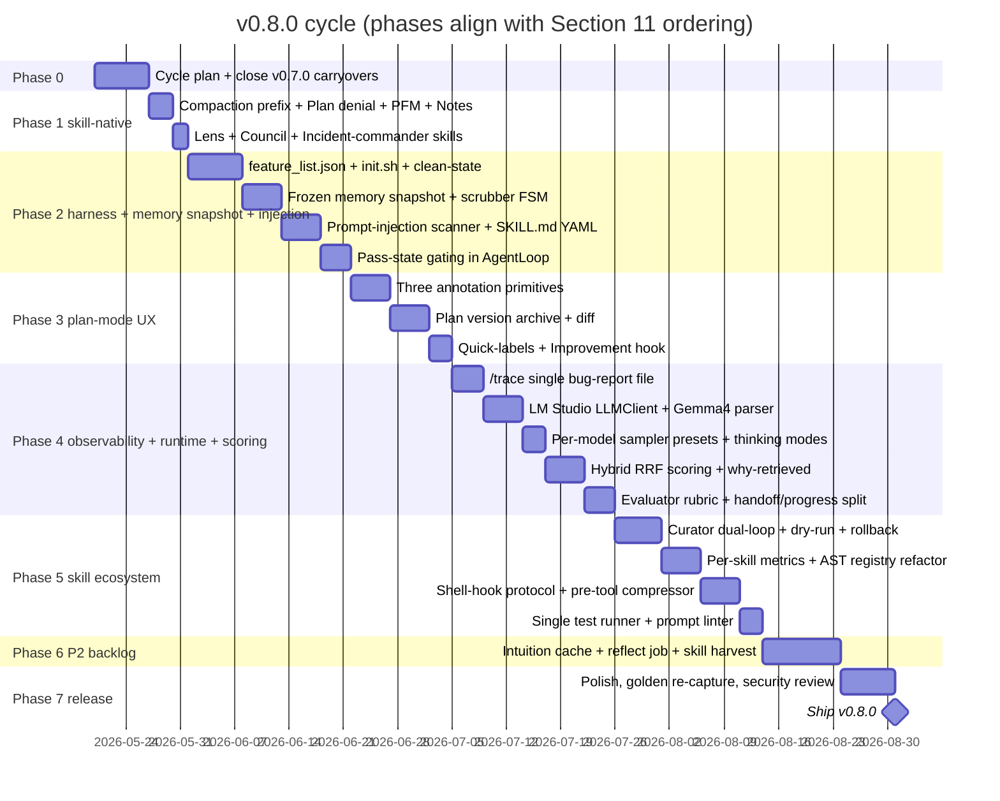

# Multi-Source Comparison v2: Gemma-Code v0.7.0 vs. Seven External Sources (planning for v0.8.0)

**Version**: v0.7.0 (planning cycle, looking forward to v0.8.0)
**Generated**: 2026-05-14
**Analyzer**: Claude Code -- compare-project command (multi-source variant, second pass)
**Source Type**: Mixed (6 GitHub repositories, 1 web article)
**Sibling**: [docs/archive/versions/v0/v0.7.0/comparison-multi-source.md](comparison-multi-source.md) (v0.5.5-era pass, used to seed v0.7.0)

## Sources catalogued

| # | Source | Type | Normalized name | Framework |
|---|---|---|---|---|
| S1 | https://github.com/nousresearch/hermes-agent | Repo (Python, MIT) | hermes-agent | 11-dimension |
| S2 | https://jola.dev/posts/running-local-models-on-m4 | Article | jola-m4 | Article (insights) |
| S3 | https://github.com/walkinglabs/learn-harness-engineering | Repo (TS/Electron, no license) | learn-harness-engineering | 11-dimension |
| S4 | https://github.com/antirez/ds4 | Repo (C, MIT) | ds4 | 11-dimension |
| S5 | https://github.com/0xNyk/awesome-hermes-agent | Repo (curated list) | awesome-hermes-agent | 11-dimension (treated as a catalog) |
| S6 | https://github.com/jundot/omlx | Repo (Python, Apache 2.0) | omlx | 11-dimension |
| S7 | https://github.com/backnotprop/plannotator | Repo (TypeScript/Bun, Apache+MIT) | plannotator | 11-dimension |

S2 is evaluated under the article framework. S1, S3, S4, S5, S6, S7 are evaluated under the 11-dimension repo framework, with S5 condensed because it is itself an aggregated catalog (~75 items) and most extractions trace back to specific items inside it.

---

## Section 1: Executive Summary

This pass surveys seven external sources spanning a production local agent (S1 hermes-agent, the canonical reference for a self-improving agent), a 24 GB M4 case study for local coding agents (S2), an artifact-driven harness-engineering curriculum (S3), antirez's minimal one-model inference engine with disk-KV cache and exact-replay tool protocol (S4), the Hermes community catalog (S5, ~75 items - mined for the strongest local-friendly patterns), an MLX-native Apple-Silicon inference server with a dedicated Gemma 4 parser (S6 omlx), and the most mature open-source plan-annotation surface (S7 plannotator).

The headline findings: **Gemma-Code v0.7.0 is well ahead on local-only privacy, 4-layer memory, sub-agent orchestration, hardware-tier auto-detection, OTLP observability, and tool guardrails**, but is materially behind the field on **(a) prefix-cache-preserving memory snapshots (hermes-agent)**, **(b) discrete harness artifacts a fresh contributor can read and verify against -- `feature_list.json`, `init.sh`, `clean-state-checklist.md`, `evaluator-rubric.md`, `session-handoff.md` (learn-harness-engineering)**, **(c) richer plan-mode review UX -- structured annotations, plan-version diff, strong-framed denial template (plannotator)**, **(d) Apple-Silicon-native inference performance via an MLX-capable second runtime (jola-m4 + omlx)**, **(e) prompt-injection defense at memory and context boundaries (hermes-agent)**, **(f) trace-as-bug-report unification (ds4)**, and **(g) self-improving skill curation and command-rewriting hooks (awesome-hermes-agent ecosystem)**.

The overall recommendation is **focused adoption**: ~30 P0/P1 items consolidating into a v0.8.0 cycle that is the natural successor to v0.7.0 (memory file architecture + render protocol). v0.8.0 should ship a **frozen-memory-snapshot pattern with streaming scrubber**, **SKILL.md YAML frontmatter standard aligned with agentskills.io**, **plannotator-grade plan-mode review (3 annotation primitives + plan-version diff + denial template + PFM reminder)**, **a harness-artifact set (`feature_list.json` + `init.sh` + `clean-state-checklist.md` + `evaluator-rubric.md`)**, **pass-state gating in AgentLoop**, **a prompt-injection scanner at the memory write and context-file boundary**, **a hybrid memory scoring stack (lexical + vector + recency RRF)**, **a second LM Studio LLMClient on Apple Silicon**, **a `--trace` bug-report primitive**, and **a dual-loop curator with dry-run + rollback safety**. v0.8.0 explicitly does NOT adopt messaging gateways, cloud terminal backends, RL training harnesses, network-share plan collaboration, or DSPy/GEPA prompt evolution because they violate the local-only thesis or the complexity budget.

This report has **38 adoption candidates** across the seven sources. **18 are P0/P1** and form the v0.8.0 floor. **9 are P2**. **11 are explicit drops** documented in Section 13.

---

## Section 2: Project Profiles (side-by-side)

| Field | Gemma-Code v0.7.0 (us) | S1 hermes-agent | S3 learn-harness | S4 ds4 | S6 omlx | S7 plannotator |
|---|---|---|---|---|---|---|
| Purpose | Local agentic VSCode extension | Self-improving CLI agent | Tutorial repo for harness engineering | Single-model local inference engine | MLX-native local inference server | Plan annotation + review surface |
| Surface | VSCode extension | CLI + messaging gateways | VitePress course + Electron starters | C library + HTTP server + CLI | FastAPI server + admin web UI | Bun CLI + browser SPA + VSCode webview |
| Language | TypeScript (+ Python installer) | Python 3.11 | TypeScript (Electron, React, VitePress) | C (+ Obj-C Metal, CUDA) | Python | TypeScript (Bun + React) |
| Maturity | v0.6.0 shipped, v0.7.0 in flight | 13 releases, 150K+ stars | 12 lectures + 6 projects, 4K stars, 6 weeks old | 9 days old, 9K stars | Alpha (v0.3.x), 14K stars | Production, 5K stars |
| License | MIT | MIT | Unlicensed | MIT | Apache 2.0 | Apache + MIT dual |
| Local-only | Yes (Ollama, no cloud calls) | No (cloud providers default; LM Studio + Ollama Cloud supported) | N/A (course) | Yes (local model only) | Yes (MLX, macOS) | Yes (optional E2E network share) |
| Memory | 4-layer (working/episodic/semantic/graph) + memory file architecture (Phase 5) | File-backed snapshot (`MEMORY.md` + `USER.md`) + Honcho/Hindsight plugins | Templates (`session-handoff.md`, `claude-progress.md`) | KV cache on disk (SHA1-keyed) | Paged KV + SSD cold tier | Plan version archive at `~/.plannotator/` |
| Plan mode | Numbered list + step approval | No dedicated plan mode | `feature_list.json` + DoD | N/A | N/A | Three annotation primitives + plan diff |
| Test discipline | Vitest + golden tasks + Stryker | Pytest + RL eval (Atropos) | Bash scripts + playwright | Single C runner with sub-modes | Pytest | Vitest + Playwright |
| Hooks | `scripts/hooks/check-*.mjs` (3 hooks) | Shell hooks + Python plugins + cli-config.yaml | None (lecture-only) | None | Plugin system | Claude Code hook config |

---

## Section 3: Technology Stack Comparison

| Layer | Gemma-Code | S1 | S3 | S4 | S6 | S7 |
|---|---|---|---|---|---|---|
| Primary lang | TS | Python 3.11 | TS | C | Python | TS (Bun) |
| Inference | Ollama HTTP | OpenAI/Anthropic/many | (N/A) | Native C kernels | MLX-native | (N/A) |
| Store | SQLite (better-sqlite3 + FTS5) | SQLite + FTS5 | SQLite | Disk KV files | SQLite + paged cache | Filesystem JSON |
| Embeddings | Ollama `nomic-embed-text` + heuristic fallback | External (Honcho/Hindsight) | (N/A) | (N/A) | `mlx-embeddings` | (N/A) |
| Hooks | Node ESM shell hooks | stdin-JSON/stdout-decision shell hooks + plugins | (N/A) | (N/A) | (N/A) | Hook-configured CLI |
| Tool protocol | Gemma4 native + custom XML legacy | OpenAI function-calling spec | (N/A) | Custom DSML + radix-tree exact-replay | OpenAI + Anthropic + Gemma channel parser | (N/A) |
| Linter | ESLint + ruff (Python installer) | ruff + pyright | ESLint | (manual) | ruff | ESLint |
| Test runner | Vitest + Playwright + Stryker mutation | pytest + Atropos RL env | playwright | one C runner | pytest | Vitest + Playwright |
| Packaging | VSIX + PyQt installer | uv + Homebrew + Nix + Docker | (course) | Makefile | uv + Homebrew | Bun build + system tray app |
| Observability | OTLP exporter, TraceStore, MetricsCollector | `insights` engine, SQLite session log | Bash benchmark scripts | `--trace` flat file | `/admin/monitor` | `~/.plannotator/sessions/` JSON |

**Notable convergences**: SQLite + FTS5 is the universal local memory substrate across S1, S6 and Gemma-Code. The OpenAI tool-calling format is the de facto provider-neutral wire format (S1, S6 speak it; S4 emits compatible JSON in `/v1/chat/completions`).

**Notable divergences**: S4 is the only project that owns its own inference path; everyone else routes through a runtime. S7 is the only project whose primary UX surface is a browser SPA (not a chat).

---

## Section 4: AI Assistant Configuration Comparison

| Surface | Gemma-Code v0.7.0 | S1 | S3 | S7 |
|---|---|---|---|---|
| Top-level rules file | `AGENTS.md` + per-version docs/ | `AGENTS.md`, `.cursorrules`, `SOUL.md`, `.hermes.md`/`HERMES.md`, walked from git root | `AGENTS.md` + `CLAUDE.md` (split rules vs quick-ref) | `apps/hook/commands/*.md` |
| Skill format | Markdown (catalog under `src/skills/catalog/`) | YAML-frontmatter `SKILL.md` (agentskills.io standard) | YAML-frontmatter `SKILL.md` + `metadata.json` + `templates/` + `references/` + `evals/` | (N/A) |
| Skill count | 14 catalog folders | 25 categories + 18 optional | 1 skill (harness-creator) | (N/A) |
| Slash commands | 25+ implemented (per README) | 17+ tools self-registering | (N/A) | `plannotator-annotate/last/review` |
| Memory layout | Phase 5: `Instructions.md` / `Memory.md` / `Context.md` + `Archive/` | `MEMORY.md` (frozen snapshot at start) + `USER.md` | `session-handoff.md` + `claude-progress.md` (separate forward-looking vs chronological) | `~/.plannotator/plans/`, `history/`, `sessions/`, `hooks/` |
| Hook scripts | 3 (`check-tool-permission`, `check-git-control-plane`, `check-prompt-policy`) | stdin-JSON/stdout-decision protocol, allowlist gate | None | Pre/Post tool-use hooks with 4-day timeout |
| Lifecycle phase | (no formal init phase) | (no formal init phase) | Mandatory `init.sh` verifies deps + harness files + sample data | (none) |
| Plan mode | Numbered list + step approval | (none) | `feature_list.json` with status/evidence/testedAt | 3 annotation types + plan-version diff |

**Gap signal**: Gemma-Code's skill catalog format is not yet aligned with the agentskills.io YAML-frontmatter standard that S1, S3, and the broader Hermes ecosystem (S5) all converge on. Aligning gives Gemma-Code cross-tool skill portability for free.

**Convergent insight**: S1 freezes its memory snapshot at session start and writes through to disk; S3 separates `session-handoff.md` (forward-looking) from `claude-progress.md` (chronological). The two patterns are complementary -- Gemma-Code v0.7.0 Phase 2 shipped `Instructions.md`/`Memory.md`/`Context.md` but does NOT yet freeze the snapshot for prefix-cache stability, and does NOT separate forward vs chronological views.

---

## Section 5: Skills and Capabilities Gap Analysis

### 5a. Present in External, Missing in Gemma-Code (adoption candidates)

Grouped by theme.

#### Theme A: Memory & context preservation

| # | Capability | Source | Cite |
|---|---|---|---|
| A1 | **Frozen memory-snapshot pattern** (inject `Memory.md`/`Context.md` at session start; write-through to disk mid-session without re-rendering prompt) | S1 | `tools/memory_tool.py` header |
| A2 | **Streaming memory-context scrubber FSM** (chunk-boundary-safe `<memory-context>` span stripper) | S1 | `agent/memory_manager.py:StreamingContextScrubber` |
| A3 | **Structured compaction `SUMMARY_PREFIX`** ("background reference, NOT active instructions") | S1 | `agent/context_compressor.py:SUMMARY_PREFIX` |
| A4 | **Three-state session sync return (`OK` / `ERROR` / `REBUILD_NEEDED`)** for compaction | S4 | `ds4.h:149-167` |
| A5 | **Hybrid memory scoring (vector + lexical + recency RRF / 50-30-20)** | S5 (Mnemosyne, flowstate-qmd) | Mnemosyne README, flowstate-qmd `intuition.json` |
| A6 | **Why-retrieved transparency on every recall** (attach ranking-reason list) | S5 (yantrikdb) | yantrikdb plugin README |
| A7 | **Anticipatory context cache** (prefetch likely-relevant context before query) | S5 (flowstate-qmd) | flowstate-qmd loop |
| A8 | **Plan version archive + diff** (numbered versions per slug + three-mode diff renderer) | S7 | `apps/hook/server/index.ts`, `packages/ui/hooks/usePlanDiff.ts` |
| A9 | **Reflect phase** (nightly memory consolidation into durable user-profile notes) | S5 (hindsight) | hindsight retain/recall/reflect |

#### Theme B: Plan-mode UX

| # | Capability | Source | Cite |
|---|---|---|---|
| B1 | **Three annotation primitives** (DELETION / COMMENT / GLOBAL_COMMENT) bound to text spans | S7 | `packages/ui/types.ts:1-54` |
| B2 | **Strong-framed denial template** ("YOUR PLAN WAS NOT APPROVED. You MUST revise...") | S7 | `packages/shared/prompts.ts:41-42`, `feedback-templates.ts` |
| B3 | **PFM reminder injection on plan-mode entry** (capability hints: what render primitives the webview supports) | S7 | `packages/shared/pfm-reminder.ts` |
| B4 | **Approved-with-notes path** (approve while attaching implementation notes for executor) | S7 | `packages/shared/prompts.ts:47-48` |
| B5 | **Quick-label chips** (reusable one-click annotations like "Out of scope", "Add test") | S7 | `packages/ui/components/QuickLabelDropdown.tsx` |
| B6 | **Plan archive at `~/.gemma-code/plans/`** (`{slug}-{date}-{status}.md` browsable) | S7 | `packages/shared/storage.ts` |
| B7 | **Improvement-hook file** at `~/.gemma-code/hooks/enterplanmode-improve.md` (user-editable rules injected on plan-mode entry) | S7 | `packages/shared/improvement-hooks.ts` |

#### Theme C: Harness artifacts (versioned scope + verification + end-state)

| # | Capability | Source | Cite |
|---|---|---|---|
| C1 | **`feature_list.json` as versioned scope contract** with `status`/`evidence`/`testedAt` per feature, gated by an executable verification command | S3 | `projects/project-06/solution/feature_list.json` |
| C2 | **`init.sh` lifecycle phase** (5-step: install + typecheck + build + harness-file inventory + sample data) | S3 | `projects/project-06/solution/init.sh` |
| C3 | **`clean-state-checklist.md` end-of-session gate** (30 binary checks across 7 categories) | S3 | `projects/project-06/solution/clean-state-checklist.md` |
| C4 | **`evaluator-rubric.md` + `quality-document.md` pair** (1-5 rubric + A-F summary) | S3 | `projects/project-06/solution/{evaluator-rubric,quality-document}.md` |
| C5 | **`session-handoff.md` + `claude-progress.md` separation** (forward-looking vs chronological) | S3 | `projects/project-06/solution/{session-handoff,claude-progress}.md` |
| C6 | **`check-architecture.sh` boundary linter** (grep-based, runs in `init.sh`) | S3 | `projects/project-06/solution/scripts/check-architecture.sh` |
| C7 | **`cleanup-scanner.sh` for orphan artifacts** (memory store, embeddings, FTS rows, session refs) | S3 | `projects/project-06/solution/scripts/cleanup-scanner.sh` |
| C8 | **Pass-state gating in AgentLoop** (task cannot self-declare `done` without exit-0 verification logged) | S3 (L08) | `docs/en/lectures/lecture-08/index.md` |

#### Theme D: Skill format and registry

| # | Capability | Source | Cite |
|---|---|---|---|
| D1 | **SKILL.md YAML-frontmatter standard** (agentskills.io: `name`/`description`/`version`/`platforms`/`metadata.hermes.tags`/`related_skills`) | S1, S5 | `skills/dogfood/SKILL.md` |
| D2 | **AST-scanned tool registry with self-registering modules** (parse module body to detect `registry.register(...)` calls before importing) | S1 | `tools/registry.py:_module_registers_tools` |
| D3 | **30s TTL cache on `check_fn` availability probes** | S1 | `tools/registry.py:_check_fn_cached` |
| D4 | **Auto-skill harvest from repeated workflows** (n-gram tool-sequence detector; propose skill on 3rd recurrence) | S5 (hermes-skill-factory) | hermes-skill-factory README |
| D5 | **Per-skill success metrics** (track success rate, retry loops, user corrections per skill) | S5 (hermes-dojo) | hermes-dojo dojo loop |
| D6 | **Dual-loop curator** (task loop + background curation loop on cron with dry-run by default) | S5 (SkillClaw, hermes-curator-evolver) | SkillClaw README; hermes-curator-evolver |
| D7 | **Curator safety wrapper** (dry-run, evidence-backed, rollback manifests) | S5 (hermes-curator-evolver) | hermes-curator-evolver README |
| D8 | **Lens generation** (agent writes its own analytical prompt before answering) | S5 (super-hermes) | super-hermes README |

#### Theme E: Tool protocol & sampling

| # | Capability | Source | Cite |
|---|---|---|---|
| E1 | **Tool-call exact-bytes replay map** (unguessable ID -> exact sampled text; stop re-rendering tool blocks) | S4 | `README.md:280-310`, `misc/ANTHROPIC_LIVE_CONTINUATION.md` |
| E2 | **Split-sampling** (greedy `temperature=0` on protocol syntax tags; normal sampling on payload strings) | S4 | `README.md:303-310` |
| E3 | **Streaming-aware tool emission** (header SSE event first, then argument bytes streamed as deltas) | S4 | `README.md:269-278` |
| E4 | **Three thinking modes** (`nothink` / `think` / `think-max` with context-aware downgrade) | S4 | `README.md:489-494` |
| E5 | **`pre_tool_call` hook for command compression** (90% token reduction on `cargo test`, `npm test`, `git diff`) | S5 (rtk-hermes) | rtk-hermes README |
| E6 | **Tiered fix ordering with verification** (triage -> diagnose -> remediate -> verify; write playbook after success) | S5 (hermes-incident-commander) | incident-commander README |

#### Theme F: Local inference (Apple Silicon)

| # | Capability | Source | Cite |
|---|---|---|---|
| F1 | **LM Studio as second LLMClient backend** (auto-detect at `:1234`, prefer on Apple Silicon) | S2 | jola-m4 article |
| F2 | **omlx OpenAI-shape adapter** (third LLMClient backend, Apple-Silicon-only, opt-in) | S6 | `omlx/server.py`, `omlx/api/openai_models.py` |
| F3 | **Gemma 4 channel parser** (`<\|channel>thought`, `<\|tool_response>`, `<start_function_call>`, strip leading `<think>` on multi-turn replay) | S6 | `omlx/adapter/gemma4.py` |
| F4 | **Per-model sampler presets including thinking-mode** (`temp 0.6 / top_p 0.95 / top_k 20 / min_p 0.0`) | S2 | jola-m4 article |
| F5 | **Extended per-model context schema** (`tools` / `reasoning` / `max_tokens` / `thinkingFormat` flags) | S2 | jola-m4 OpenCode config |
| F6 | **M-series tier benchmark publication** (measured tok/s and recommended quant for 16/24/36/64 GB unified memory) | S2 | jola-m4 article |
| F7 | **Prefix-aware system-prompt construction** (structure so prefix is identical across tool turns to maximize Ollama KV-cache hit) | S6 (inferred), S1 (frozen snapshot) | `omlx/cache/prefix_cache.py`; `tools/memory_tool.py` header |
| F8 | **Per-model TTL + pinning UI** in MemoryPanel | S6 | `omlx/cli.py` flags + admin panel |

#### Theme G: Security & developer experience

| # | Capability | Source | Cite |
|---|---|---|---|
| G1 | **Prompt-injection scanner for context files and memory writes** (`_CONTEXT_THREAT_PATTERNS` regex + invisible-unicode filter) | S1 | `agent/prompt_builder.py:_scan_context_content`, `tools/memory_tool.py:_MEMORY_THREAT_PATTERNS` |
| G2 | **Context-file discovery via git-root walk** (`.gemma.md` walked from cwd up to `.git` root) | S1 | `agent/prompt_builder.py:_find_git_root` |
| G3 | **Single `--trace` file as bug-report primitive** (one switch logs rendered prompts + cache decisions + generated text + tool-parser events) | S4 | `README.md:739-748` |
| G4 | **One test runner with sub-modes** (`--server`/`--logprob-vectors`/`--long-context`/`--tool-call-quality`/`--metal-kernels`) | S4 | `tests/ds4_test.c` |
| G5 | **lintlang static linter for agent configs/prompts** (HERM v1.1 scoring; pre-commit hook over `.gemma-code/skills/*.md`) | S5 (lintlang) | lintlang README |
| G6 | **Shell-hook bridge with stdin-JSON / stdout-decision protocol** (allowlist gate, `shell=False`, idempotent registration) | S1 | `agent/shell_hooks.py` |
| G7 | **Adversarial multi-perspective debate skill** ("council mode" for major refactors) | S5 (hermes-council) | hermes-council README |

### 5b. Present in Gemma-Code, Missing in External (strengths to preserve)

- **4-layer memory architecture** (working/episodic/semantic/graph) -- broader than S1's `MEMORY.md`/`USER.md` pair.
- **Hardware-tier auto-detection** (GPU/VRAM classification into constrained/balanced/full) -- S2 article implies this manually; S6 does it via `ProcessMemoryEnforcer` but doesn't surface it to the user.
- **6-stage compaction pipeline** with priority ordering -- richer than S1's single context-engine plugin and S4's snapshot/restore.
- **VSCode-native sub-agent orchestration** (verification + research + planning) -- S1 has `delegate_task` but in a CLI/server model.
- **OTLP observability with batched writes** -- S3 only recommends OTel; S1 has `insights` analytics over SQLite; S4 has `--trace`.
- **Tool permission tiers + unified path guard + secret-path denylist** -- more granular than S1's approval system and S4's narrow public header.
- **Module-boundary enforcement via dependency-cruiser** -- stronger than S3's grep-based `check-architecture.sh`.
- **Golden task suite + Stryker mutation testing** -- S4 has logprob regression; S1 has Atropos RL eval; neither does mutation testing.
- **Local-only thesis as a hard product constraint** -- S1, S6, S7 all permit cloud fallbacks; we explicitly do not.

### 5c. Present in Both, Quality Comparison

| Capability | Gemma-Code | External | Verdict |
|---|---|---|---|
| Skill format | Markdown only (no YAML frontmatter) | YAML frontmatter standardized (S1, S5) | **External wins**; align with agentskills.io |
| Hook scripts | 3 Node hooks (path/git/prompt) | S1's stdin-JSON/stdout-decision protocol is more general | **External wins** on protocol shape; ours wins on installed safety nets |
| Tool registry | TypeScript imports + ToolCatalog | S1's AST-scanned self-registration is more decoupled | **External wins** on architecture; ours is fine for current scale |
| Memory snapshot | Phase 5 ships memory file architecture | S1 freezes snapshot at session start for prefix-cache stability | **External wins**; adopt frozen-snapshot semantics |
| Compaction | 6-stage priority pipeline + RegenerateFromSource | S1's `SUMMARY_PREFIX` framing is stronger | **Tie**; adopt S1's prompt framing on top of our pipeline |
| Plan mode | Numbered list + step approval | S7's 3 annotation primitives + plan diff | **External wins decisively**; adopt S7's UX |
| Trace/observability | OTLP + TraceStore + MetricsCollector | S4's single `--trace` file is simpler for bug reports | **Tie**; add `--trace` as a unified user-facing flag on top of our infra |
| Test discipline | Vitest + golden + Stryker | S4's single runner + sub-modes is one entry point | **Tie**; consider a single `gemma-code-test --mode=X` wrapper |

---

## Section 6: Commands and Automation Comparison

### 6a. Commands gap (slash commands and CLI commands)

Gemma-Code currently ships ~25 slash commands. The external sources contribute the following missing concepts:

| # | Command idea | Source | Effort |
|---|---|---|---|
| Cmd1 | `/annotate <file>` -- mark up arbitrary markdown with the same plan-review primitives | S7 | S |
| Cmd2 | `/last` -- annotate the last assistant message | S7 | S |
| Cmd3 | `/council <topic>` -- adversarial multi-perspective debate skill | S5 (hermes-council) | S |
| Cmd4 | `/lens <task>` -- generate analytical lens before answering | S5 (super-hermes) | S |
| Cmd5 | `/trace [--enable | --dump | --clear]` -- single bug-report capture switch | S4 | S |
| Cmd6 | `/feature-list [--add | --status | --verify]` -- manage `feature_list.json` | S3 | M |
| Cmd7 | `/init` -- run the 5-step lifecycle bootstrap script | S3 | S |
| Cmd8 | `/wrap-up-session` (already exists) -- extend with `clean-state-checklist.md` execution | S3 | S |
| Cmd9 | `/curate [--dry-run | --apply]` -- dual-loop skill curation pass | S5 (SkillClaw, curator-evolver) | M |
| Cmd10 | `/thinking-mode [nothink | think | think-max]` -- switch sampler preset and reasoning verbosity | S4 + S2 | S |

### 6b. CI/CD and hooks gap

- **Pre-commit hook `lint-prompt`** running over `.gemma-code/skills/**/*.md` and `src/chat/prompts/**/*.md` -- adopt S5's lintlang concept.
- **`pre_tool_call` shell hook for command compression** -- adopt S5's rtk-hermes pattern: rewrite `npm test`, `git diff`, `cargo test` outputs to lower-context equivalents before they hit Gemma's context window.
- **Pre-tool hook integrated with `check-tool-permission.mjs`** -- enhance existing hook to also run the prompt-injection scanner on tool arguments containing pasted content.

---

## Section 7: Documentation and Developer Experience Comparison

| Aspect | Gemma-Code | S1 | S3 | S7 |
|---|---|---|---|---|
| README quality | Strong (1-page, install + config + 25 commands) | Strong (long-form with quickstart, providers, skills, MCP) | Strong (12 lectures + 6 projects) | Strong (CLI flags + browser UX walkthrough) |
| Architecture docs | `ARCHITECTURE.md` + per-version `docs/v0.X.0/architecture.md` | Docusaurus site at `hermes-agent.nousresearch.com` | VitePress site with 12 lectures | `apps/hook/README.md` |
| ADRs | 14 ADRs in `docs/adr/` | None visible | None | None |
| Onboarding | `CONTRIBUTING.md` + `scripts/dev-setup.{sh,ps1}` | `uv venv` + 4 install steps | `bash init.sh` (5-step verifying script) | Bun monorepo setup |
| Setup verification | None (relies on user running `npm test`) | `hermes diagnose` command | `init.sh` verifies harness files + sample data exist | `plannotator --version` |
| Per-version docs | Excellent (`docs/v0.X.0/{architecture,implementation-plan,known-gaps,development/history}.md`) | Single docs site | Per-project starter/solution | Versioned releases |
| Session continuity docs | `docs/v0.X.0/development/history/*.md` (phase histories) | `MEMORY.md` snapshots | `session-handoff.md` + `claude-progress.md` (separate) | `~/.plannotator/sessions/` |

**Strengths**: Gemma-Code's per-version + ADR documentation discipline is best-in-class across the sample. S3's `init.sh` is a discrete artifact we should adopt to verify the harness on session start (not just on contributor onboarding).

**Gaps**: We have no "diagnose-current-state" command analogous to `hermes diagnose`; the closest is `/memory status` and `npm run deps:check`, but no unified user-facing health check.

---

## Section 8: Testing and Security Posture Comparison

| Dimension | Gemma-Code | S1 | S3 | S4 | S6 | S7 |
|---|---|---|---|---|---|---|
| Unit tests | Vitest, 80% coverage floor | pytest | (course only) | Single C runner | pytest | Vitest |
| Integration | Vitest + live Ollama | pytest | playwright | C runner `--server` mode | pytest | Vitest |
| E2E | Playwright | (N/A) | playwright | (N/A) | (N/A) | Playwright |
| Mutation | Stryker (50.6% mutation score) | (none) | (none) | (none) | (none) | (none) |
| Eval | Golden task suite + cross-check | Atropos RL env + insights | (lecture demos) | Logprob-vector regression | (admin benchmark UI, no committed numbers) | (none) |
| Bench | Phase 7 benchmark suite | (insights cost estimation) | Bash perf benchmarks | Bench-snapshot-restore | Admin panel benchmark | (none) |
| Pen test | `docs/archive/versions/v0/v0.6.0/review/penetration-test.md` | (none committed) | (none) | (none) | (none) | (none) |
| Dep audit | `npm audit` in CI | (none committed) | (none) | (none) | (none) | (none) |
| Secret scan | `check-prompt-policy.mjs` hook | (none) | (none) | (none) | API key auth on endpoint | (none) |
| Prompt injection | (no scanner) | `_CONTEXT_THREAT_PATTERNS` + invisible-unicode | (none) | (none) | (none) | (none) |

**Verdict**: Gemma-Code's test discipline is the strongest in the sample (only project with mutation testing, golden tasks, and a pen-test review). The single security gap with material risk is **prompt-injection at memory and context-file boundaries** -- adopting S1's scanner closes it.

---

## Section 9: Security and Risk Assessment (MANDATORY)

### 9.1 Threat Model Comparison

| Dimension | Gemma-Code (current) | Adoption delta (best case) |
|---|---|---|
| New runtime dependencies | Ollama (local) + Node + Python (installer) + VSCode | + optional LM Studio (local, F1) + optional omlx (local, F2) -- all local, no outbound calls |
| Outbound calls at runtime | Only `web_search` (DuckDuckGo) and `fetch_page` (user-initiated); MCP optional | No change (no source proposes new outbound calls beyond what we already do) |
| Credentials / API keys | None for inference; optional `~/.netrc` for `gh` | LM Studio: no auth; omlx: optional `--api-key`; we'd carry these as opt-in user settings |
| Code/prompts leave the machine | No | No (all adoptions are local) |
| New commercial relationship | No | No |

The risk envelope does not change at the macro level; all adoption candidates either re-implement patterns locally or add optional local-only runtimes.

### 9.2 Per-Item Risk Scorecard

| Item | Risk tier | Justification |
|---|---|---|
| A1-A9 (memory & context patterns) | Low | All local SQLite/FS changes; no network egress |
| B1-B7 (plan-mode UX) | Low | Webview-only; no network calls |
| C1-C8 (harness artifacts) | None | Files in-repo; no runtime risk |
| D1-D8 (skill/registry) | Low | D6/D7 introduce a background curation loop; risk is misclassification of skills, mitigated by D7's dry-run + rollback |
| E1-E6 (tool protocol & sampling) | Low | E2 (split-sampling) and E5 (pre-tool compression) modify tool I/O; E5's command rewriter must whitelist patterns to avoid breaking unexpected commands |
| F1 (LM Studio) | Low | Local HTTP at `:1234`; same trust posture as Ollama at `:11434` |
| F2 (omlx) | Medium | Single-maintainer (jundot, 898/970 commits), alpha-stage; mitigated by making it opt-in macOS-only |
| F3 (Gemma 4 channel parser) | None | Pure string parsing |
| F4-F8 (sampler/context/UI) | None | Config-only |
| G1 (prompt-injection scanner) | None | Defense-in-depth, no new attack surface |
| G2 (`.gemma.md` git-root walk) | Low | Reads files only; protected by existing pathGuard + secretPaths |
| G3 (`--trace` file) | Low | Writes redacted trace to user-specified path; reuse existing `OperationLog` redaction |
| G4 (single test runner) | None | Refactor only |
| G5 (lintlang prompt linter) | None | Static analysis only |
| G6 (shell-hook bridge upgrade) | Low | Extends existing hook protocol; allowlist-gated |
| G7 (council mode skill) | Low | Multi-pass inference adds latency, not security risk |

### 9.3 Reverse-Engineering Viability Analysis

Per the MCP Registry Policy decision tree in [AGENTS.md](../../../../AGENTS.md):

| Item | Classification | Internal deliverable | Effort | Rationale |
|---|---|---|---|---|
| A1 Frozen memory snapshot | re-full | `src/storage/MemorySnapshot.ts` + change to `PromptBuilder` | M | Existing memory file architecture (Phase 5) is the substrate; freeze semantics on top |
| A2 Streaming scrubber FSM | re-full | `src/chat/MemoryContextScrubber.ts` | S | Stateful FSM ~150 LOC |
| A3 `SUMMARY_PREFIX` framing | skill-native | Edit `src/chat/prompts/compaction.md` | XS | Prompt-only |
| A4 Three-state session sync | re-full | Adapt return type in `src/chat/ContextCompactor.ts` | S | Type-level change + caller updates |
| A5 Hybrid RRF scoring | re-full | `src/storage/HybridRanker.ts` (RRF + weights) | M | Build on top of existing `UnifiedMemoryRetriever`; sqlite-vec adoption is a separate decision |
| A6 Why-retrieved transparency | re-full | Add `reason: string[]` to `MemoryEntry`; surface in MemoryPanel | S | Annotate existing retrieval path |
| A7 Anticipatory cache | re-full | `src/storage/IntuitionCache.ts` | M | Background prefetch worker |
| A8 Plan version archive + diff | re-full | `src/storage/PlanArchive.ts` + `src/panels/webview/render/planDiff.ts` | M | Reuse webview render protocol from Phase 4 |
| A9 Reflect phase | re-full | `src/storage/ReflectJob.ts` (cron-style) | M | New scheduled job; reuses MemoryConsolidator |
| B1 Three annotation primitives | re-full | `src/panels/webview/render/planAnnotation.ts` | M | Render primitive |
| B2 Strong-framed denial template | skill-native | Edit `src/chat/PlanMode.ts` denial prompt | XS | Prompt-only |
| B3 PFM reminder injection | skill-native | New `src/chat/prompts/planModeCapabilities.md` | XS | Prompt-only; lists the 7 render primitives from Phase 4 |
| B4 Approved-with-notes path | skill-native | Edit `src/chat/PlanMode.ts` approve handler | XS | Prompt-only |
| B5 Quick-label chips | re-full | `src/panels/webview/render/quickLabels.ts` | S | Add to plan-mode renderer |
| B6 Plan archive | re-full | `src/storage/PlanArchive.ts` | S | Filesystem only |
| B7 Improvement-hook file | re-full | `src/chat/ImprovementHook.ts` | S | Load `~/.gemma-code/hooks/enterplanmode-improve.md` |
| C1 `feature_list.json` | re-full | `feature_list.json` at repo root + `src/evaluation/FeatureList.ts` to flip status on golden-task pass | M | Wire into `GoldenTaskSuite` |
| C2 `init.sh` | re-full | `scripts/init.sh` + `scripts/init.ps1` | S | Cross-platform script |
| C3 `clean-state-checklist.md` | re-full | `clean-state-checklist.md` + `scripts/cleanup-scanner.mjs` | S | Integrate with `/wrap-up-session` |
| C4 Evaluator rubric | re-full | `docs/<version>/review/evaluator-rubric.md` template + wire into `/run-deep-review` | M | Template + automation |
| C5 Handoff/progress split | re-full | Update `/wrap-up-session` to emit both files | S | Filesystem only |
| C6 Architecture linter | re-full | `scripts/check-architecture.sh` reusing dep-cruiser output | S | Wrapper around existing tool |
| C7 Cleanup scanner | re-full | `scripts/cleanup-scanner.mjs` over `MemorySubsystem` + `ChatHistoryStore` | M | Pure JS scan |
| C8 Pass-state gating | re-full | Add verification gate to `src/tools/AgentLoop.ts` and `src/orchestration/Orchestrator.ts` | M | Persisted via `OperationLog` |
| D1 SKILL.md YAML frontmatter | re-full | Extend `src/skills/SkillLoader.ts` to parse YAML frontmatter; migrate existing skills | M | Keep backward compat reading both shapes during a transition |
| D2 AST-scanned tool registry | re-full | Refactor `src/tools/ToolRegistryBuilder.ts` to scan-then-register | M | Defer-loading benefit |
| D3 30s TTL on `check_fn` | re-full | Add TTL cache to `ToolActivationRules.ts` | XS | Pure caching |
| D4 Skill auto-harvest | re-full | `src/skills/WorkflowDetector.ts` (n-gram on tool calls) | M | Read-only over episodic memory |
| D5 Per-skill success metrics | re-full | `src/skills/SkillMetrics.ts` + emit via Tracer | S | Reuse existing metrics infra |
| D6 Dual-loop curator | re-full | `src/skills/CurationLoop.ts` (background timer, dry-run default) | M | Never blocks user loop |
| D7 Curator safety wrapper | re-full | Add backup + rollback manifest to `CurationLoop` | S | Filesystem manifests |
| D8 Lens generation | skill-native | New skill: `src/skills/catalog/lens/SKILL.md` | XS | Prompt-only |
| E1 Tool-call exact-bytes replay | re-full | Add `toolCallId -> rawBytes` map to `src/chat/ConversationManager.ts` | M | Persist in session JSON |
| E2 Split-sampling | re-partial | Requires Ollama per-token sampling control; investigate `options.temperature` in stream chunks | L | Ollama exposes per-request sampling, not per-token; may not be implementable on Ollama alone |
| E3 Streaming-aware tool emission | re-full | Already partial via `StreamingPipeline`; formalize the header-first contract | S | Refactor existing streaming |
| E4 Three thinking modes | re-full | Settings + sampler preset table + UI toggle in MemoryPanel | S | New config keys |
| E5 Pre-tool command compression | re-full | `src/tools/handlers/preToolHook.ts` with pattern table | M | Whitelist-driven rewriter |
| E6 Tiered fix ordering | skill-native | New skill `incident-commander/SKILL.md` | S | Prompt-only |
| F1 LM Studio second LLMClient | re-full | `src/llm/LmStudioClient.ts` + auto-detect | M | Implements existing `LLMClient` port |
| F2 omlx third LLMClient | re-partial | `src/llm/OmlxClient.ts` (deferred to v0.9.0 due to alpha-stage risk) | M | Same shape as F1; gated on stability |
| F3 Gemma 4 channel parser | re-full | `src/llm/Gemma4Parser.ts` reverse-engineered from `omlx/adapter/gemma4.py` | M | Pure parsing logic, MIT-license-clean rewrite |
| F4 Per-model sampler presets | re-full | Extend `src/config/PerModelLimits.ts` with sampler presets | S | Config table |
| F5 Extended per-model schema | re-full | Add `tools`/`reasoning`/`max_tokens`/`thinkingFormat` to `PerModelLimits` | S | Type extension |
| F6 M-series tier benchmarks | re-full | New `tests/benchmarks/baselines/m-series.json` | M | Requires hardware access; operator-action item |
| F7 Prefix-aware system prompt | re-full | Refactor `src/chat/PromptBuilder.ts` to lock prefix ordering | S | Already mostly done in v0.7.0; formalize |
| F8 Per-model TTL + pinning UI | re-full | Extend `src/panels/webview/memoryView.ts` | M | UI work |
| G1 Prompt-injection scanner | re-full | `src/guardrails/PromptInjectionScanner.ts` | M | Pattern table + invisible-unicode filter |
| G2 `.gemma.md` git-root walk | re-full | Extend `src/storage/MemoryFiles.ts` to walk parents | S | Reuse `findGitRoot` if present |
| G3 `--trace` file | re-full | New `src/observability/TraceFile.ts` + slash command `/trace` | M | Unify existing `OperationLog` + `Tracer` into one user-facing dump |
| G4 Single test runner | re-full | `scripts/test.mjs --mode=<unit|integration|golden|bench|mutation>` | S | Wrapper |
| G5 lintlang prompt linter | re-full | `scripts/lint-prompts.mjs` over `src/chat/prompts/**` and `src/skills/catalog/**` | S | Static rules |
| G6 Shell-hook bridge upgrade | re-partial | Extend existing `scripts/hooks/*.mjs` with stdin-JSON/stdout-decision contract | M | We already have hooks; adopt the protocol shape |
| G7 Council mode skill | skill-native | New skill `council/SKILL.md` | S | Prompt-only multi-pass |

**Items NOT in the adoption plan** (classified `drop-outright`): See Section 13.

### 9.4 Recommendation Ordering (RE-first)

Per AGENTS.md MCP Registry Policy, Section 11's adoption plan is sequenced by RE classification before P-tier:

1. **`skill-native` items first** (XS effort, prompt-only): A3, B2, B3, B4, D8, E6, G7. These are seven free wins -- ship them in Phase 1 of v0.8.0.
2. **`re-full` / `re-partial` items** (build internal equivalents): everything else listed above.
3. **`vendor-intrinsic`**: none. No adoption candidate requires a third-party data destination.
4. **`drop-outright`**: itemized in Section 13.

---

## Section 10: Structural and Architectural Differences

| Theme | Gemma-Code today | Strongest source insight | Implication |
|---|---|---|---|
| Inference abstraction | `LLMClient` port in `src/llm/types.ts`; only `OllamaClient` impl | S1's provider profile registry with 5 extension hooks; S6's OpenAI/Anthropic dual-route adapter | Our port is ready for a second adapter (LM Studio); the abstraction cost is low |
| Tool registry | Manual `ToolRegistryBuilder` wiring | S1's AST-scanned self-registering modules | Refactor when tool count grows beyond ~25; not urgent today (14 handlers) |
| Memory writes | `MemoryStore` + `MemoryConsolidator` | S1 freezes snapshot at session start; S5 (yantrikdb) attaches `why_retrieved`; S5 (Mnemosyne) uses 50/30/20 hybrid scoring | Adopt frozen-snapshot semantics on top of existing layered memory |
| Plan mode | `PlanMode.ts` numbered list | S7 demonstrates a side-panel-as-canvas with structured feedback | The current "approve each step" model adds friction without value once a plan has been holistically reviewed; consider an opt-in "plan once, execute" mode |
| Compaction | 6-stage priority pipeline | S1's `SUMMARY_PREFIX` framing; S4's three-state sync return | Wrap existing pipeline with the framing and the explicit `REBUILD_NEEDED` return state |
| Guardrails | Permission tiers + path guard + secretPaths denylist | S1's prompt-injection scanner | Missing layer; adopt at memory and context-file write boundaries |
| Observability | OTLP + TraceStore + MetricsCollector | S4's single `--trace` file is the bug-report primitive | Add `/trace` command that bundles existing trace data into one redacted file |
| Skills | 14 Markdown skills | S1/S5 use YAML-frontmatter SKILL.md (agentskills.io standard) | Adopt for cross-tool portability; cheap |
| Lifecycle | (no explicit init phase) | S3's `init.sh` 5-step boot | Adopt as `scripts/init.sh` + `scripts/init.ps1` |
| Test discipline | Vitest + golden + Stryker | S4's single runner + sub-modes | Wrap existing runners in `scripts/test.mjs --mode=X` |

The pattern across these differences is consistent: Gemma-Code has the harder *primitives* in place (memory layers, compaction stages, hardware tiers, OTLP, mutation testing) but lacks the cheap, user-facing *wrappers* that make those primitives discoverable and ergonomic. v0.8.0 is fundamentally a **wrappers-and-artifacts cycle** that turns existing infrastructure into a productized experience.

---

## Section 11: Adoption Plan (RE-first ordered, then P-tier)

### Phase 1: skill-native (prompt-only, ship first)

| What | Source | Target | Effort | Dependencies | Risk |
|---|---|---|---|---|---|
| A3 Compaction `SUMMARY_PREFIX` framing | S1 | `src/chat/prompts/compaction.md` (new) | XS | -- | None |
| B2 Strong-framed denial template | S7 | `src/chat/PlanMode.ts` denial path | XS | -- | None |
| B3 PFM reminder injection at plan-mode entry | S7 | `src/chat/prompts/planModeCapabilities.md` (new); referenced by `PlanMode.ts` | XS | v0.7.0 Phase 4 render protocol shipped | None |
| B4 Approved-with-notes path | S7 | `src/chat/PlanMode.ts` approve handler | XS | -- | None |
| D8 Lens generation skill | S5 (super-hermes) | `src/skills/catalog/lens/SKILL.md` | XS | -- | None |
| E6 Tiered fix ordering skill | S5 (incident-commander) | `src/skills/catalog/incident-commander/SKILL.md` | S | -- | None |
| G7 Council mode skill | S5 (hermes-council) | `src/skills/catalog/council/SKILL.md` | S | -- | None |

### Phase 2: re-full P0 -- harness artifacts + memory snapshot + prompt-injection defense

| What | Source | Target | Effort | Dependencies | Risk |
|---|---|---|---|---|---|
| C1 `feature_list.json` scope contract | S3 | `feature_list.json` + `src/evaluation/FeatureList.ts` | M | Golden task suite (exists) | None |
| C2 `init.sh` + `init.ps1` lifecycle | S3 | `scripts/init.sh`, `scripts/init.ps1` | S | -- | None |
| C3 `clean-state-checklist.md` + scanner | S3 | `clean-state-checklist.md`, `scripts/cleanup-scanner.mjs` | S | -- | Low |
| C8 Pass-state gating in AgentLoop | S3 | `src/tools/AgentLoop.ts`, `src/orchestration/Orchestrator.ts` | M | OperationLog (exists) | Low |
| A1 Frozen memory snapshot | S1 | `src/storage/MemorySnapshot.ts` + change to `PromptBuilder` | M | Phase 5 memory files (exists) | Low |
| A2 Streaming memory-context scrubber FSM | S1 | `src/chat/MemoryContextScrubber.ts` | S | -- | None |
| G1 Prompt-injection scanner | S1 | `src/guardrails/PromptInjectionScanner.ts` + wire into MemoryStore writes + `MemoryFiles` reads | M | -- | None |
| D1 SKILL.md YAML frontmatter standard | S1, S5 | `src/skills/SkillLoader.ts` extension + migrate 14 existing skills | M | -- | Low (back-compat needed) |

### Phase 3: re-full P0 -- plan-mode UX overhaul

| What | Source | Target | Effort | Dependencies | Risk |
|---|---|---|---|---|---|
| B1 Three annotation primitives | S7 | `src/panels/webview/render/planAnnotation.ts` + ChatMessageRouter wiring | M | Phase 4 render protocol (exists) | Low |
| A8 Plan version archive + diff renderer | S7 | `src/storage/PlanArchive.ts` + `src/panels/webview/render/planDiff.ts` | M | B1 | Low |
| B6 Plan archive at `~/.gemma-code/plans/` | S7 | folded into A8 | S | A8 | None |
| B5 Quick-label chips | S7 | `src/panels/webview/render/quickLabels.ts` | S | B1 | None |
| B7 Improvement-hook file `~/.gemma-code/hooks/enterplanmode-improve.md` | S7 | `src/chat/ImprovementHook.ts` | S | -- | Low |

### Phase 4: re-full P1 -- observability, runtime second-backend, hybrid memory scoring

| What | Source | Target | Effort | Dependencies | Risk |
|---|---|---|---|---|---|
| G3 Single `--trace` file primitive | S4 | `src/observability/TraceFile.ts` + slash command `/trace` | M | Existing Tracer + OperationLog | Low |
| F1 LM Studio second LLMClient | S2 | `src/llm/LmStudioClient.ts` + auto-detect at `:1234` | M | Existing `LLMClient` port | Low |
| F3 Gemma 4 channel parser | S6 | `src/llm/Gemma4Parser.ts` | M | -- | Low |
| F4 Per-model sampler presets (incl. thinking-mode) | S2, S4 | `src/config/PerModelLimits.ts` extension | S | -- | None |
| F5 Extended per-model schema | S2 | `src/config/PerModelLimits.ts` (tools/reasoning/max_tokens/thinkingFormat) | S | -- | None |
| F7 Prefix-aware system-prompt construction | S1, S6 | Refactor `src/chat/PromptBuilder.ts` to lock prefix order | S | -- | Low |
| E4 Three thinking modes (nothink/think/think-max) | S4 | `src/config/settings.ts` + UI toggle | S | F4 | None |
| A5 Hybrid memory scoring (RRF + weights) | S5 (Mnemosyne) | `src/storage/HybridRanker.ts` | M | `UnifiedMemoryRetriever` (exists) | Low |
| A6 Why-retrieved transparency | S5 (yantrikdb) | Add `reason: string[]` to MemoryEntry; surface in MemoryPanel | S | A5 | None |
| C4 Evaluator rubric template | S3 | `docs/<version>/review/evaluator-rubric.md` + integrate with `/run-deep-review` | M | -- | None |
| C5 Handoff/progress split | S3 | Update `/wrap-up-session` to emit both | S | -- | None |

### Phase 5: re-full P1 -- skill ecosystem maturation

| What | Source | Target | Effort | Dependencies | Risk |
|---|---|---|---|---|---|
| D5 Per-skill success metrics | S5 (hermes-dojo) | `src/skills/SkillMetrics.ts` + Tracer integration | S | Existing Tracer | None |
| D6 Dual-loop curator | S5 (SkillClaw, curator-evolver) | `src/skills/CurationLoop.ts` (background; dry-run default) | M | -- | Low |
| D7 Curator safety wrapper (backup + rollback manifest) | S5 (curator-evolver) | folded into D6 | S | D6 | Low |
| D2 AST-scanned tool registry | S1 | Refactor `ToolRegistryBuilder.ts` | M | -- | Low |
| D3 30s TTL on `check_fn` | S1 | Add TTL cache to `ToolActivationRules.ts` | XS | -- | None |
| G2 `.gemma.md` git-root walk | S1 | Extend `MemoryFiles.ts` to walk parents | S | pathGuard (exists) | Low |
| G6 Shell-hook stdin-JSON/stdout-decision contract | S1 | Extend existing `scripts/hooks/*.mjs` to the new shape | M | Existing hooks | Low |
| E5 Pre-tool command compression | S5 (rtk-hermes) | `src/tools/handlers/preToolHook.ts` (whitelist pattern table) | M | -- | Low |
| G4 Single test runner with `--mode=X` | S4 | `scripts/test.mjs` wrapper | S | Existing test runners | None |
| G5 lintlang prompt linter | S5 (lintlang) | `scripts/lint-prompts.mjs` over skills + prompts | S | -- | None |

### Phase 6: re-full P2 -- nice-to-have

| What | Source | Target | Effort | Dependencies | Risk |
|---|---|---|---|---|---|
| A4 Three-state session sync return | S4 | `src/chat/ContextCompactor.ts` return type | S | -- | None |
| A7 Anticipatory context cache (intuition) | S5 (flowstate-qmd) | `src/storage/IntuitionCache.ts` | M | A5 | Low |
| A9 Reflect phase (nightly consolidation) | S5 (hindsight) | `src/storage/ReflectJob.ts` | M | A5 | Low |
| D4 Skill auto-harvest | S5 (skill-factory) | `src/skills/WorkflowDetector.ts` (n-gram) | M | EpisodicMemory (exists) | Low |
| C6 Architecture linter wrapper | S3 | `scripts/check-architecture.sh` over dep-cruiser | S | -- | None |
| C7 Cleanup scanner | S3 | already folded into C3 | -- | C3 | -- |
| F8 Per-model TTL + pinning UI | S6 | Extend `src/panels/webview/memoryView.ts` | M | -- | None |
| F6 M-series tier benchmark publication | S2 | `tests/benchmarks/baselines/m-series.json` (operator-action) | M | F1 | None |
| E1 Tool-call exact-bytes replay | S4 | `src/chat/ConversationManager.ts` toolCallId map | M | -- | Low |
| E3 Streaming-aware tool emission | S4 | Formalize header-first in `src/chat/StreamingPipeline.ts` | S | -- | Low |

### Phase 7: Deferred to v0.9.0+

| What | Source | Why deferred |
|---|---|---|
| F2 OmlxClient | S6 | Alpha-stage (v0.3.x), single-maintainer (898/970 commits). Wait for v0.5+ stability. LM Studio (F1) provides Apple-Silicon coverage in the meantime. |
| E2 Split-sampling | S4 | Ollama exposes per-request sampling, not per-token. Implementation requires either provider-level support or moving away from Ollama; out of v0.8.0 scope. |
| Logprob-vector regression | S4 | Ollama logprob fidelity uncertain across model versions; investigation required before committing. |

---

## Section 12: Implementation Sequence

Total estimated cycle: ~85 days from start of Phase 0 to v0.8.0 tag, consistent with v0.6.0 and v0.7.0 cycle pacing. The single largest cluster is Phase 2 (~21 days) because the memory snapshot + injection scanner + SKILL.md migration form an interdependent foundation that Phases 3-5 build on.

---

## Section 13: Risks and Considerations

### Conflicts with existing patterns

- **A1 Frozen memory snapshot** changes the semantics of `Memory.md` mid-session: writes go to disk but not to the prompt. v0.7.0 Phase 5 docs explicitly describe live re-injection. This must be documented in an ADR.
- **B1 Three annotation primitives** require expanding the webview render protocol shipped in v0.7.0 Phase 4 (ADR-0013). The protocol already has 7 primitives; adding annotation, diff-view, and quick-label primitives lifts that to ~11. Validate the protocol stays bounded.
- **C8 Pass-state gating** changes `AgentLoop` exit semantics: tasks cannot self-declare done without verification. Existing golden tasks that rely on "ran without error" passing will need their `expected.verifications[]` updated.
- **D1 SKILL.md YAML frontmatter** is a breaking change to the skill format. Need a migration path that reads both shapes during v0.8.0 with a deprecation warning, then drops the legacy format in v0.9.0.
- **F1 LM Studio second backend** introduces a second auto-detection probe at startup. The PyQt installer flow must be updated to recommend LM Studio on Apple Silicon.

### Maintenance burden

- Phase 5 D6 (dual-loop curator) adds a background timer that runs while VSCode is idle. Risk: the curator inference contends with main inference on a single-GPU laptop. Mitigation: gate behind hardware tier (only run on `balanced` or `full` tiers).
- Phase 5 G6 (stdin-JSON hook protocol) is a wire-format change. The three existing hooks (`check-tool-permission`, `check-git-control-plane`, `check-prompt-policy`) must be migrated in lockstep, and the protocol must be documented in a new ADR.

### Items explicitly NOT recommended for adoption (security / policy reasons)

The MCP Registry Policy (`AGENTS.md` Section "MCP Registry Policy") gates these. All are classified `drop-outright`:

- **N1 Messaging gateways** (Telegram, Discord, Slack, WhatsApp, Signal -- S1 `gateway/run.py`) -- Outbound calls to 3rd-party messaging services; violates local-only thesis (Hard Constraint #1). Reference: MCP Registry Policy bucket 5.
- **N2 Cloud terminal backends** (Modal, Daytona, Vercel Sandbox, Singularity -- S1 `tools/environments/`) -- Sends code to remote sandboxes; violates local-only thesis. Reference: bucket 5.
- **N3 Atropos RL training harness** (S1 `environments/`) -- Multi-GB ML training stack with cloud connector; out of scope for an editor extension. Reference: bucket 5.
- **N4 DSPy / GEPA prompt evolution** (S1 hermes-agent-self-evolution) -- Heavy ML dependency stack; offline prompt tuning value does not justify the dep weight on a local Ollama path. Reference: bucket 5.
- **N5 External memory provider services** (Honcho, Hindsight as a service, Mem0 -- S1 `agent/memory_provider.py` bundled adapters) -- These ship as cloud services or self-hosted servers; the *abstract* MemoryProvider ABC is fine, but bundling adapters that call external infra is not. Reference: bucket 5. Note: the *patterns* from S5 (Mnemosyne, yantrikdb, hindsight) are reverse-engineered locally in A5/A6/A9.
- **N6 MCP OAuth manager** (S1 `tools/mcp_oauth_manager.py`) -- OAuth flows assume browser callbacks to cloud auth servers. Local MCP stdio support stays; OAuth path drops. Reference: bucket 5.
- **N7 Plannotator E2E-encrypted plan-share service** (S7 `~/.plannotator/sessions/` with paste service) -- Outbound network share, even encrypted, violates local-only thesis. Reference: bucket 5. Note: local plan archive (B6) and plan diff (A8) are adopted.
- **N8 Cost-estimation / usage_pricing** (S1 `agent/usage_pricing.py`) -- Meaningless for local Ollama; would only add maintenance burden. Reference: bucket 5 (no value).
- **N9 Curator with always-on auxiliary inference** (S1 `agent/curator.py` running an aux model continuously) -- The *lifecycle* (D6/D7) is adopted; the always-on aux-LLM trigger is not, because it contends with main inference on a single-GPU laptop. Reference: bucket 5 (cost/benefit fails).
- **N10 hermes-payguard, USDC/x402 wallet, hermes-blockchain-oracle, ripley-xmr-gateway** (S5) -- Blockchain payment integrations; off-thesis. Reference: bucket 5.
- **N11 Voice / media / robotics skills** (resemble-ai/detect-skill, hermes-embodied, mars-rover, hermescraft -- S5) -- Out of editor-extension scope. Reference: bucket 5.

These eleven items are documented for completeness and to anchor the local-only thesis decision in the v0.8.0 plan.

---

## Appendix A: Source files referenced

External (per-source):

- S1 hermes-agent: `tools/memory_tool.py`, `agent/memory_manager.py`, `agent/context_compressor.py`, `agent/context_engine.py`, `agent/prompt_builder.py`, `agent/curator.py`, `agent/shell_hooks.py`, `agent/lmstudio_reasoning.py`, `tools/registry.py`, `tools/delegate_tool.py`, `providers/base.py`, `providers/__init__.py`, `environments/agent_loop.py`, `skills/dogfood/SKILL.md`
- S2 jola-m4: full article (one page)
- S3 learn-harness-engineering: `projects/project-06/solution/{AGENTS.md, feature_list.json, init.sh, clean-state-checklist.md, evaluator-rubric.md, quality-document.md, session-handoff.md, claude-progress.md, scripts/check-architecture.sh, scripts/cleanup-scanner.sh, scripts/benchmark.sh}`; `docs/en/lectures/{lecture-01..12}/index.md`; `skills/harness-creator/SKILL.md`
- S4 ds4: `README.md`, `AGENT.md`, `ds4.h`, `ds4.c`, `ds4_server.c`, `tests/ds4_test.c`, `misc/ANTHROPIC_LIVE_CONTINUATION.md`
- S5 awesome-hermes-agent: top mined items -- Mnemosyne, flowstate-qmd, yantrikdb, hindsight, SkillClaw, hermes-curator-evolver, hermes-skill-factory, hermes-dojo, rtk-hermes, super-hermes, hermes-incident-commander, hermes-council, lintlang, litprog-skill
- S6 omlx: `omlx/server.py`, `omlx/scheduler.py`, `omlx/cache/{paged_cache,paged_ssd_cache,prefix_cache}.py`, `omlx/adapter/gemma4.py`, `omlx/api/{openai_models,anthropic_models,tool_calling,anthropic_utils}.py`, `omlx/integrations/{openclaw,opencode,codex,claude,copilot,hermes,pi}.py`, `omlx/cli.py`
- S7 plannotator: `apps/hook/server/index.ts`, `apps/hook/hooks/hooks.json`, `packages/server/index.ts`, `packages/editor/App.tsx`, `packages/shared/{pfm-reminder,prompts,feedback-templates,storage,improvement-hooks}.ts`, `packages/ui/{types.ts, hooks/{usePlanDiff,usePinpoint}.ts, components/{QuickLabelDropdown,AnnotationToolstrip}.tsx, components/plan-diff/*}`

Gemma-Code (target sinks):

- `src/llm/{types,OllamaClient,LmStudioClient (new),Gemma4Parser (new)}.ts`
- `src/chat/{PlanMode,PromptBuilder,ConversationManager,ContextCompactor,StreamingPipeline,MemoryContextScrubber (new),ImprovementHook (new)}.ts`
- `src/chat/prompts/{compaction.md (new), planModeCapabilities.md (new)}`
- `src/storage/{MemoryStore,MemoryFiles,MemorySnapshot (new),HybridRanker (new),PlanArchive (new),IntuitionCache (new),ReflectJob (new),SkillMetrics (new)}.ts`
- `src/skills/{SkillLoader,CurationLoop (new),WorkflowDetector (new)}.ts`
- `src/skills/catalog/{lens (new), council (new), incident-commander (new)}/SKILL.md`
- `src/tools/{AgentLoop,ToolRegistryBuilder,ToolActivationRules,handlers/preToolHook (new)}.ts`
- `src/guardrails/PromptInjectionScanner.ts (new)`
- `src/observability/TraceFile.ts (new)`
- `src/panels/webview/render/{planAnnotation (new), planDiff (new), quickLabels (new)}.ts`
- `src/panels/webview/memoryView.ts`
- `src/orchestration/Orchestrator.ts`
- `feature_list.json (new)`, `clean-state-checklist.md (new)`
- `scripts/{init.sh (new), init.ps1 (new), cleanup-scanner.mjs (new), check-architecture.sh (new), test.mjs (new), lint-prompts.mjs (new)}`
- `tests/benchmarks/baselines/m-series.json (new)`
- `docs/archive/versions/v0/v0.8.0/{plans/v0.8.0-cycle.md, review/evaluator-rubric.md}` (new templates)
