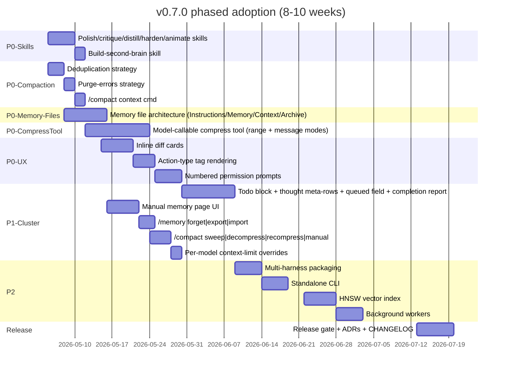

# Multi-Source Comparison: Gemma Code v0.5.5 vs. Six External Sources

**Version**: v0.7.0 (planning cycle)
**Generated**: 2026-05-04
**Analyzer**: Claude Code -- compare-project command (multi-source variant)
**Source Type**: Mixed (1 social post, 1 web article DOCX, 4 GitHub repositories, 1 screenshot corpus)

## Sources catalogued

| # | Source | Type | Normalized name |
|---|---|---|---|
| S1 | X post on local Qwen 27B + Pi coding agent + CCO sandboxing | Social post (text) | local-qwen-pi-cco |
| S2 | "How to Give Claude Perfect Memory" (DOCX) | Web article (downloaded) | claude-perfect-memory |
| S3 | nico-martin/gemma4-browser-extension | Repository | gemma4-browser-extension |
| S4 | pbakaus/impeccable | Repository | impeccable |
| S5 | Opencode-DCP/opencode-dynamic-context-pruning | Repository | opencode-dcp |
| S6 | ruvnet/ruflo | Repository | ruflo |
| S7 | Claude Code VSCode extension UI | Screenshot corpus (9 PNG) | claude-code-ui |

S1 and S2 are flat content sources, evaluated under the article framework (insights extracted, mapped to project, classified). S3-S6 are repositories, evaluated under the 11-dimension framework. S7 is a UI reference corpus, evaluated as a focused gap-analysis against the existing webview spec in [src/panels/webview/bodyMarkup.ts](../../../../src/panels/webview/bodyMarkup.ts), [src/panels/webview/runtime.ts](../../../../src/panels/webview/runtime.ts), and [src/panels/webview/styles.ts](../../../../src/panels/webview/styles.ts).

---

## Section 1: Executive Summary

This comparison surveys six external sources spanning local-LLM tooling (S1), memory architectures (S2), in-browser agentic execution (S3), packaged design skills (S4), dynamic context pruning (S5), multi-agent orchestration (S6), and reference UI for an agentic coding extension (S7), and maps each to Gemma Code v0.5.5 (with v0.6.0 phases 1-7 already in-flight on `main`).

The headline findings: **gemma-code is strong on local privacy, four-layer memory, sub-agent orchestration, and tool guardrails**, but lags behind the field on (a) **model-driven context compression** (S5 ships a `compress` tool the model itself calls; gemma-code only does deterministic-strategy compaction), (b) **explicit per-conversation streaming UX** (S7 shows that Claude Code's sense of "presence" comes from inline diff cards, todo checkboxes, thought-time meta-rows, structured permission prompts with numbered options, and a queued-message field, all of which gemma-code has only partially), (c) **a teach/document/critique skill family** (S4's command vocabulary is a sharp proof point of how skills can be packaged and distributed), and (d) **a user-editable memory file architecture** with archive/import/export (S2's three-layer memory pattern). S6 and S1 supply useful primitives (hooks system, sandbox-for-yolo-mode) but are largely out of scope for v0.7.0 because of their footprint or because they assume a non-local-only context.

The overall recommendation is **selective adoption**: 12 P0/P1 items, 8 P2 items, and 6 explicit drops. v0.7.0 should ship a **model-callable compress tool**, **memory file architecture (Instructions/Memory/Context/Archive)**, **Claude-Code-grade chat UI (diff cards, todo blocks, thought-time meta-rows, numbered permission prompts, queued-message field)**, **deduplication and error-purge strategies**, and **a polish/document/critique skill set**. v0.7.0 will explicitly NOT adopt federation, swarm coordination, multi-provider routing, browser-extension surface, or external memory connectors (Notion, Obsidian) because they violate the local-only thesis.

---

## Section 2: Source Overview

### S1 -- X post: local Qwen + Pi + CCO

A short social post observing that **Qwen 3.6 27B (4-bit quant) + Pi coding agent + CCO sandboxing** can run a fully agentic coding workflow on a 36 GB M3 Mac at ~20 tok/s with prompt-fidelity comparable to Haiku. The thesis is **local-only is now production-viable** for medium-quant agentic coding. Indirectly relevant to Gemma Code: it validates the offline-first thesis and surfaces three primitives -- (a) a 4-bit-quant local model (gemma-code uses Ollama's Q4 by default for smaller tiers), (b) an agentic harness (gemma-code IS the harness), and (c) **a pre-flight sandbox for yolo-mode** (gemma-code today relies only on confirmation tiers). CCO sandboxing (`nikvdp/cco`) is the actually-novel adoption candidate: a per-call ephemeral filesystem/process sandbox for the rare moments when `gemma-code.toolConfirmationMode = "never"`.

### S2 -- "How to Give Claude Perfect Memory" (DOCX)

Three-layer memory framework targeted at Claude consumer/Claude Code users: **Layer 1 (basic)** = settings memory editor + project instructions + tell-Claude-to-remember + import/export; **Layer 2 (intermediate)** = file-based memory at four named files (`Instructions.md`, `Memory.md`, `Context.md`, weekly `Archive` copy) that the LLM reads on every session; **Layer 3 (advanced)** = a vault-style second brain backed by Notion or Obsidian, driven by Karpathy's [LLM Knowledge Base system prompt](https://gist.github.com/karpathy/442a6bf555914893e9891c11519de94f). The article's central insight for gemma-code: **a user-editable memory file architecture is a complementary surface to the SQL-backed four-layer memory** -- it gives the user direct ownership of preferences, corrections, patterns, and decisions without requiring them to issue `/memory save` commands. The Layer-3 connector pattern (Notion / Obsidian) violates the local-only thesis and is dropped.

### S3 -- nico-martin/gemma4-browser-extension (Apache-style, no LICENSE in repo head)

Chrome extension that runs `onnx-community/gemma-4-E2B-it-ONNX` entirely in-browser via WebGPU + Transformers.js. Architecture: background service-worker = AI engine (loads model once, services all tabs); side-panel = UI (React); content-script = DOM bridge (extraction + highlighting). Tool surface (`get_open_tabs`, `go_to_tab`, `open_url`, `close_tab`, `ask_website` (RAG over current page), `highlight_website_element`, `find_history` (semantic search over browsing history with all-MiniLM-L6-v2 embeddings stored in IndexedDB)). Indirectly relevant to gemma-code: it's a **second deployment surface** (not VS Code) and proves Gemma 4 ONNX runs at usable latency in-browser, but adopting it would expand product surface against [docs/archive/versions/v0/v0.6.0/plans/v0.6.0-cycle.md](v0.6.0/plans/v0.6.0-cycle.md) Hard Constraint #1. Two narrowly useful primitives: (a) the **all-MiniLM-L6-v2 embedding fallback** (gemma-code currently uses nomic-embed-text via Ollama or a 128-D heuristic), and (b) **the RAG-over-DOM tool pattern** as a future "RAG-over-workspace-files" inspiration; both are P2/P3.

### S4 -- pbakaus/impeccable (Apache 2.0)

Frontend design skill packaged as **1 SKILL + 23 commands + 27 deterministic anti-pattern rules + 12-rule LLM critique pass**, distributed as a multi-harness ZIP bundle (Cursor, Claude Code, OpenCode, Pi, Gemini CLI, Codex CLI, GitHub Copilot, Trae, Rovo Dev, Qoder, VS Code Copilot, Kiro). The skill ships a **PRODUCT.md / DESIGN.md context-loader gate** that runs before any design work, plus a standalone CLI (`npx impeccable detect`) that scans HTML/CSS for anti-patterns without any LLM. Heavily relevant to gemma-code as a **template for skill scope and packaging**: gemma-code today ships only 7 skills (analyze-codebase, commit, generate-changelog, generate-readme, generate-tests, review-pr, setup-project) and has no packaging-for-distribution story. Impeccable shows what a **single-domain, command-rich, context-gated, deterministic-checks-first** skill looks like.

### S5 -- Opencode-DCP/opencode-dynamic-context-pruning (AGPL-3.0-or-later)

OpenCode plugin that exposes a **`compress` tool to the model** (not deterministic-strategy compaction, the *model* decides when and what to compress). Two compression modes: `range` (compress contiguous spans into block summaries) and `message` (compress individual messages independently, experimental). Plus two deterministic strategies that run alongside: **deduplication** (same tool name + same parameters: keep only most recent output) and **purge errors** (remove the input of errored tool calls after N turns; keep the error message). Slash commands `/dcp context | stats | sweep | manual | compress | decompress | recompress`. Per-model context-limit overrides (`maxContextLimit`, `minContextLimit`). Protected tools list (default: task, skill, todowrite, write, edit, etc.). **Editable prompt overrides** (system, compress-range, compress-message, three nudge prompts). Impact on prompt caching: ~5pp lower cache-hit rate but large savings on output tokens. License-incompatible to fork directly (AGPL); the patterns are reverse-engineerable into MIT-compatible code.

### S6 -- ruvnet/ruflo (MIT)

Massive multi-agent orchestration system on top of Claude Code: **100+ agents, 32 native plugins, 27 hooks, 12 background workers, swarm coordination (Queen / Topology / Consensus), self-learning via SONA + ReasoningBank, HNSW vector memory, federation (mTLS + ed25519 + PII gating + behavioral trust scoring), goal planner with GOAP A\***. The hosted [flo.ruv.io](https://flo.ruv.io/) front-end is a multi-model parallel-MCP-tool-calling chat UI. Most of ruflo violates the local-only thesis (federation, multi-provider routing including OpenRouter, hosted UI). The reverse-engineerable pieces are the **27-hook system** (already partially present at gemma-code's [scripts/hooks/](../../../../scripts/hooks/)), the **12 background workers** (audit, optimize, testgaps -- gemma-code has *one* analogue: the post-N-edits verification sub-agent), the **HNSW vector index** for memory (gemma-code uses linear-scan + FTS5-pre-filter at SEMANTIC_CANDIDATE_LIMIT=200; HNSW is a clear performance upgrade for >10k-entry corpora), **goal-decomposition GOAP planner** (gemma-code has Orchestrator + PlannerAgent but not state-space search). The "100+ agents" surface is rejected outright: cargo-cult complexity for a local one-developer tool.

### S7 -- Claude Code VSCode extension UI (9 screenshots, 2026-04-27)

A reference corpus of how Anthropic's official Claude Code presents agentic activity in VS Code. Recurrent UI primitives observed:

1. Title bar with task name + sparkle/icon (no "New session" button bloat)
2. Inline command echo (`/implement-phase 2 of routing-and-settings-ux v0.2.0`) as the first message
3. **Bullet-pointed action stream** with state-coloured dots (filled green/blue = done, hollow = pending, asterisk/glow = current)
4. **Action type tags** rendered as bold inline labels: `Bash`, `Read`, `Edit`, `Write`, each followed by a plain-text rationale and the absolute path / line range / size badge ("Added 128 lines", "Removed 1 line")
5. **Side-by-side diff cards** with red-strikethrough / green-add panels rendered as compact monospace blocks (not full-width)
6. **Thought-for-Xs / Generating...** meta-rows with subdued styling (no progress bar)
7. **Update Todos block**: a compact checklist with strikethrough completed items, asterisk on current, hollow circle on pending
8. **Numbered permission prompts** ("Allow this bash command? 1 Yes / 2 Yes for all projects / 3 No / Tell Claude what to do instead") with full command echo and the description rendered inside the prompt
9. **Queued-message field** at the bottom of an active stream ("Queue another message...") with `+` attach button and `</>` "Edit automatically" toggle and a stop button (replaces the send arrow during streaming)
10. **Completion report** at end-of-task: a key:value table with Plan, Sub-task done, Updates landed, Tests run, Pre-flight, Commit -- and clickable session/PR links

Gemma-code's webview today (per [src/panels/webview/bodyMarkup.ts](../../../../src/panels/webview/bodyMarkup.ts)) ships header + plan-badge + thinking dots + main message log + footer with edit-mode buttons, but does **not** render: action-type tags, side-by-side diff cards inline in the chat, todo checklists as a structured block, numbered permission prompts (gemma-code currently uses a Yes/No modal, not a 1/2/3 keyboard shortcut), or a completion-report block. This is the largest UX gap.

---

## Section 3: Project Profiles (S3-S6 only)

| Dimension | Gemma Code v0.5.5 | gemma4-browser-extension (S3) | impeccable (S4) | opencode-dcp (S5) | ruflo (S6) |
|---|---|---|---|---|---|
| Identity | VS Code extension; local agentic coding; offline via Ollama+Gemma 4 | Chrome extension; local agentic browser assistant; in-browser via WebGPU+Transformers.js | A frontend-design skill bundle distributed across 11+ AI harnesses | An OpenCode plugin that exposes model-callable context compression | A 100+ agent orchestration framework on top of Claude Code |
| Domain scope | Coding (general) | Web browsing + DOM RAG | Frontend design only | Conversation context management | Multi-agent coordination (general) |
| Maturity | v0.5.5 published; v0.6.0 phases 1-7 in-flight | Active solo project | Active maintained ecosystem | Actively maintained (v3.x by version badge) | Heavy active development; 1600+ issues |
| Scale | ~24k LOC TS; 16 modules per [docs/index.md](../../docs/index.md) | ~few k LOC TS | Skill MD + small TS CLI | ~5k LOC TS | very large, multi-language |
| License | MIT | (no LICENSE at repo head) | Apache 2.0 | AGPL-3.0-or-later | MIT |
| Local-only | YES (offline-first, hard constraint) | YES (in-browser only) | N/A (skills are static MD) | NO (assumes OpenCode + remote provider) | NO (federation, multi-provider, cloud UI) |

---

## Section 4: Technology Stack Comparison

| Layer | Gemma Code | S3 (browser-ext) | S4 (impeccable) | S5 (DCP) | S6 (ruflo) |
|---|---|---|---|---|---|
| Language(s) | TS (extension) + future Python/Rust/Go components per AGENTS.md | TS + React | TS (CLI) + MD (skill) | TS (plugin) | TS + Rust (WASM kernels) + JS |
| Inference runtime | Ollama HTTP (local) | Transformers.js + WebGPU + ONNX | Harness-supplied | Harness-supplied (OpenCode) | Multi-provider (Claude, GPT, Gemini, Cohere, Ollama) |
| Embedding model | nomic-embed-text via Ollama; 128-D SHA-1 heuristic fallback | all-MiniLM-L6-v2 (local) | none | none (uses tiktoken for token-counting) | AgentDB + HNSW; ruvector |
| Storage | better-sqlite3 (4-layer memory + chat history + tool-output cache) | IndexedDB (history vectors) | filesystem (skill MD) | per-session in-memory | AgentDB |
| Distribution | VSIX | Chrome unpacked / dist | npm + per-harness ZIP bundle | npm + opencode plugin manifest | npm + Claude Code marketplace plugin |

---

## Section 5: AI Assistant Configuration Comparison (Skills, Commands, Hooks)

### 5.1 Skills inventory

| Project | Skills (count) | Skill examples | Skill schema |
|---|---|---|---|
| Gemma Code | 7 bundled | analyze-codebase, commit, generate-changelog, generate-readme, generate-tests, review-pr, setup-project | YAML frontmatter (`name`, `description`, `argument-hint`) + body. User skills hot-reload from `~/.gemma-code/skills/`. |
| S3 | n/a | n/a | n/a |
| S4 (impeccable) | 1 SKILL + 23 commands | impeccable.shape, .craft, .audit, .critique, .polish, .bolder, .quieter, .distill, .harden, .onboard, .animate, .colorize, .typeset, .layout, .delight, .overdrive, .clarify, .adapt, .optimize, .live, .extract, .document, .teach, .pin | YAML frontmatter (`name`, `description`, `argument-hint`, `user-invocable`, `allowed-tools`, `license`) + body with structured "Setup gates" / "Shared design laws" / per-command reference table. |
| S5 (DCP) | none (plugin, not skill) | n/a | n/a |
| S6 (ruflo) | 100+ agents (yaml in `agents/`) | architect, coder, reviewer, tester, security-architect, etc. | YAML schema `coordination`, `goals`, `tools`, etc. |

### 5.2 Commands / slash commands

| Project | Slash commands |
|---|---|
| Gemma Code | 11 builtins via [CommandRouter.ts](../../../../src/commands/CommandRouter.ts): `/help`, `/clear`, `/history`, `/plan`, `/compact`, `/model`, `/memory`, `/mcp`, `/verify`, `/research`, `/cache`, `/operation-log` (plus skill commands, dynamic) |
| S4 | 23 sub-commands behind `/impeccable <verb>`; pinnable to standalone (`/audit`, `/polish`) |
| S5 | 7 commands: `/dcp context | stats | sweep | manual | compress | decompress | recompress` |
| S6 | "26 CLI commands" + 27 hooks per README |

### 5.3 Hooks

| Project | Hooks |
|---|---|
| Gemma Code | 4 hooks under [scripts/hooks/](../../../../scripts/hooks/): `check-tool-permission.mjs`, `check-git-control-plane.mjs`, `check-prompt-policy.mjs`, `check-commit-msg.mjs` (developer-harness, not runtime) |
| S5 | Single `lib/hooks.ts` (plugin lifecycle hooks for OpenCode) |
| S6 | "27 hooks" auto-trigger workers (audit, optimize, testgaps, etc.) |

### 5.4 Context files

| Project | Context files |
|---|---|
| Gemma Code | AGENTS.md (canonical), ARCHITECTURE.md, ADRs, no per-project memory file system on disk for the user to edit |
| S2 (article) | `Instructions.md`, `Memory.md`, `Context.md`, `Archive/` |
| S4 | `PRODUCT.md`, `DESIGN.md` (skill-specific) |
| S6 | AGENTS.md + CLAUDE.md + CLAUDE.local.md |

### 5.5 Capabilities and capabilities not present in Gemma Code

Each row is one capability. Status legend: G = present in Gemma Code, X = absent from Gemma Code, P = partial.

| # | Capability | G/P/X | Reference |
|---|---|---|---|
| C1 | Local-only inference (offline-first, no outbound calls) | G | hard constraint per [AGENTS.md](../../../../AGENTS.md) |
| C2 | Four-layer memory (Working + Episodic + Semantic + Graph) | G | [ADR-0002](../../docs/adr/0002-memory-subsystem-layering.md) |
| C3 | Persistent tool-output cache with eviction strategies | G | [src/storage/eviction/index.ts](../../../../src/storage/eviction/index.ts) |
| C4 | Sub-agent orchestration (verify / research / plan) | G | [src/agents/SubAgentManager.ts](../../../../src/agents/SubAgentManager.ts) |
| C5 | Permission-tier guardrails | G | [src/guardrails/PermissionTiers.ts](../../../../src/guardrails/PermissionTiers.ts) |
| C6 | Path-guard with realpath / secret-path denylist | G | [src/tools/handlers/pathGuard.ts](../../../../src/tools/handlers/pathGuard.ts) (v0.6.0 Phase 1 unification) |
| C7 | MCP client + MCP server | G | [src/mcp/McpManager.ts](../../../../src/mcp/McpManager.ts) |
| C8 | Loaded-on-disk user skills with hot reload | G | [src/skills/SkillLoader.ts](../../../../src/skills/SkillLoader.ts) |
| C9 | Slash command router with autocomplete | G | [src/commands/CommandRouter.ts](../../../../src/commands/CommandRouter.ts) |
| C10 | Tracing + metrics + optional OTLP export | G | [src/observability/](../../../../src/observability/) |
| C11 | Deterministic-strategy context compaction (sliding window + tool-result summary) | G | [src/chat/CompactionPipeline.ts](../../../../src/chat/CompactionPipeline.ts) |
| C12 | **Model-callable `compress` tool** (model decides when and what to compress) | X | S5 |
| C13 | **Deduplication strategy** (same tool + same args -> keep most recent) | X | S5 |
| C14 | **Purge-errors strategy** (drop input of errored tool calls after N turns) | X | S5 |
| C15 | **Per-model context-limit overrides** | P (one global maxTokens) | S5 |
| C16 | **`/compact` returns a token-usage breakdown by category** | P (`/compact` triggers compaction; doesn't show breakdown) | S5 `/dcp context` |
| C17 | **User-editable memory file architecture** (Instructions/Memory/Context/Archive) | X | S2 |
| C18 | **Memory import/export** from other LLMs / formats | X | S2 |
| C19 | **"Remember/Forget" verbs surfaced as a memory-edit affordance** | P (`/memory save` exists; `/memory forget` does not) | S2 |
| C20 | **Manual memory-page UI** (settings -> memory) for the user to view & edit accumulated memories | P (`/memory status` lists; no editor UI) | S2 |
| C21 | **Inline diff cards** (side-by-side red/green) in the chat stream | X | S7 |
| C22 | **Action-type tag rendering** (`Bash` / `Read` / `Edit` / `Write` bold prefix + path) | P (tool calls render as collapsed blocks; no consistent prefix) | S7 |
| C23 | **Numbered keyboard-shortcut permission prompts** (1 Yes / 2 Yes-for-all / 3 No / 4 freeform) | P (modal with Yes/No today) | S7 |
| C24 | **Todo block as a structured render** (checkboxes with strikethrough on done, asterisk on current) | X | S7 |
| C25 | **Thought-for-Xs meta-rows** | P (thinking dots; no time elapsed) | S7 |
| C26 | **Queued-message field during streaming** | X | S7 |
| C27 | **Completion-report block at end of task** with structured key:value summary | X | S7 |
| C28 | **Polish / critique / distill / harden / animate skill family** | X | S4 |
| C29 | **Multi-harness skill packaging** (ship gemma-code skills as Claude Code / Cursor / OpenCode bundles) | X | S4 |
| C30 | **Standalone deterministic checks** (CLI lint that runs without an LLM) | X | S4's `npx impeccable detect` |
| C31 | **Sandbox for yolo-mode tool calls** (ephemeral fs/process isolation when toolConfirmationMode = "never") | X | S1's CCO |
| C32 | **HNSW or other sub-linear vector index** for memory at >10k entries | X (linear scan + FTS5 pre-filter) | S6 + S3's IndexedDB-vec |
| C33 | **GOAP-style state-space planner** with replanning | P (PlannerAgent does single-shot plan; no A* state-space search) | S6 |
| C34 | **Background workers** (auto-triggered audit / testgaps / optimize) | P (one analogue: post-N-edits verification) | S6 |
| C35 | **All-MiniLM-L6-v2 ONNX in-process embedding** as a no-Ollama-required fallback | X (uses 128-D heuristic) | S3 |
| C36 | **Karpathy-style LLM Knowledge Base system prompt** for second-brain memory growth | X | S2 |

Capabilities G + P that gemma-code holds and would preserve as strengths: C1, C2, C3, C4, C5, C6, C7, C8, C9, C10, C11. Capabilities marked X are the v0.7.0 adoption candidates surveyed in Section 11.

---

## Section 6: Commands and Automation Comparison

### 6.1 Commands gap

| Want | From | Note |
|---|---|---|
| `/compact context` (token-usage breakdown by category) | S5 `/dcp context` | Add to existing `/compact` builtin as `/compact status` or `/compact stats`. |
| `/compact stats` (cumulative pruning stats across sessions) | S5 `/dcp stats` | Backed by metrics already collected in [src/observability/MetricsCollector.ts](../../../../src/observability/MetricsCollector.ts). |
| `/compact sweep [n]` (manually compress last N tool results) | S5 `/dcp sweep` | Pairs with the new compress tool. |
| `/compact decompress <id>` and `/compact recompress <id>` | S5 | Allows the user to roll back / re-apply a model-issued compression. |
| `/compact manual [on|off]` | S5 | Disables autonomous compress-tool registration but keeps deterministic strategies. |
| `/memory edit` (open Instructions.md / Memory.md in VS Code) | S2 | Cross-link to file architecture. |
| `/memory archive` (snapshot Instructions/Memory/Context to dated `Archive/`) | S2 | Weekly UX |
| `/memory forget <pattern>` | S2 | Symmetric to `/memory save`. |
| `/skills polish | critique | distill | harden | animate ...` | S4 | Skills, not builtin commands. New bundled skill-set. |

### 6.2 CI/CD and Hooks gap

Nothing critical. Gemma-code's CI matrix (Node 18/20/22 + commitlint + semantic-release + dependency-cruiser + Stryker) is broader than any of S3-S6's CI surface (S3 has no `.github/workflows`; S4 has a small build/test workflow; S5 has none committed; S6 has many but they target a much larger codebase). v0.7.0 should add a **harness-skill-bundle build job** if C29 (multi-harness packaging) is adopted.

---

## Section 7: Documentation and Developer Experience Comparison

| Aspect | Gemma | S4 (impeccable) | S6 (ruflo) | Comment |
|---|---|---|---|---|
| README | concise, links to ADRs and ARCHITECTURE.md | thorough, command tables, install matrix per harness | very long, marketing-heavy | Gemma's README is fit-for-purpose. |
| ADR record | 5 ADRs at [docs/adr/](../../docs/adr/) | none | ADR-001..ADR-N at [`ruflo/docs/adr/`](https://github.com/ruvnet/ruflo/tree/main/docs/adr) | Gemma's ADR discipline is healthy. |
| Architecture doc | versioned under `docs/v<x>/architecture.md` | n/a (skill not architecture) | `docs/STATUS.md`, `USERGUIDE.md`, `verification.md` per-audience | Gemma's discipline is healthy. |
| Onboarding | per-version implementation plans + per-phase history | Quick Start in README | Quick Start + plugin marketplace | Acceptable. |
| Multi-harness install | NO (gemma-code is the harness; skills not exported) | YES (Cursor, Claude Code, OpenCode, Pi, Gemini CLI, Codex CLI, Copilot, Trae, Rovo Dev, Qoder, VS Code Copilot, Kiro) | YES (Claude Code marketplace) | Gemma can publish `dist/` bundles for Claude Code / Cursor / OpenCode if it wants its skills usable elsewhere; the package would be a one-way mirror, not a runtime coupling. P3. |

---

## Section 8: Testing and Security Posture Comparison

| Aspect | Gemma | S5 (DCP) | S6 (ruflo) | Comment |
|---|---|---|---|---|
| Unit tests | extensive (Vitest, mutation-tested via Stryker per Phase 7 polish) | unknown | extensive | strength preserved |
| Integration tests | yes (`tests/integration/`) | unknown | yes | strength preserved |
| E2E tests | no formal Playwright setup; relies on golden-task harness | none | yes (browser plugin) | Gap noted in [known-gaps.md](../v0.6.0/review/known-gaps.md) section 2. |
| Mutation tests | yes ([configs/stryker.config.json](../../../../configs/stryker.config.json)) | no | unknown | strength preserved |
| Secret scanning | yes (gitleaks-derived patterns; PR push protection for OS keys/PEM/JWT) | unknown | AIDefence claims PII detection | strength preserved |
| Path traversal protection | yes (v0.6.0 Phase 1 unifies through pathGuard) | n/a | unknown | strength preserved |
| Tier-2 floor (auto-approve cannot drop run_terminal/delete_file) | yes (v0.6.0 Phase 1.2) | n/a | n/a | strength preserved |
| Sandbox for yolo-mode | NO | n/a | yes via WASM kernels | adoption candidate (S1's CCO pattern) |
| Federation / cross-machine trust | NO (out of scope by thesis) | n/a | yes (mTLS+ed25519) | DROP |
| HNSW vector index | NO (linear scan over <500 entries; FTS5 pre-filter at 200) | n/a | yes | adoption candidate at >10k entries (P2) |

---

## Section 9: Security and Risk Assessment (MANDATORY)

### 9.1 Threat Model Comparison

| Dimension | Gemma Code v0.5.5 (current) | gemma-code-after-v0.7.0 (proposed) | Adoption delta |
|---|---|---|---|
| New runtime dependencies introduced | none beyond Ollama | + optional ONNX-runtime for in-proc embedding fallback (S3); + optional sandbox library (S1: CCO is Mac-only; equivalent on Win = job objects + Win32 API) | ONNX adds ~50-200 MB runtime; sandbox adds platform-conditional native deps |
| Outbound-call destinations at runtime | localhost:11434 only (Ollama) and optional OTLP endpoint if user-enabled | unchanged | NONE |
| Credentials / API keys required | none for normal operation | none | NONE |
| Source code / prompts / query text leaving local machine | only OTLP traces if user enables it (off by default) | unchanged | NONE |
| Required commercial relationship | none | none | NONE |
| New attack surfaces | filesystem (already), terminal (already), LLM port (already), MCP peers (already) | + memory file architecture under `~/.gemma-code/` (already partly there); + sandbox process boundary (CCO-equivalent); + ONNX in-proc inference (memory-image isolation) | sandbox boundary is hardening, not new exposure. ONNX in-proc inference reads model files only; same risk profile as the local heuristic embedder. memory-file architecture is local FS only. |

### 9.2 Per-Item Risk Scorecard

Each candidate from Section 5.5 above; risk tier assigned with one-sentence justification.

| Item | Risk tier | Justification |
|---|---|---|
| C12 model-callable compress tool | Low | A new tool is a new attack surface, but the tool only manipulates in-memory conversation state, never files or network. Permission tier 0 (read-only of conversation state) acceptable. |
| C13 deduplication strategy | None | Pure in-memory transformation of message history; no I/O. |
| C14 purge-errors strategy | None | Same as C13. |
| C15 per-model context-limit overrides | None | Configuration. |
| C16 `/compact context` token breakdown | None | Read-only of metrics already collected. |
| C17 memory file architecture | Low | Files written to `~/.gemma-code/memory/` (or workspace). Must apply same secret-path denylist as MemoryStore. |
| C18 memory import/export | Low | File I/O at user-chosen paths. Pathguard applies. |
| C19 `/memory forget` verb | None | Existing storage layer; new command surface. |
| C20 manual memory-page UI | Low | New webview tab; XSS-hardened by reusing the existing DOMPurify wrapper at [src/utils/MarkdownRenderer.ts](../../../../src/utils/MarkdownRenderer.ts). |
| C21 inline diff cards | Low | Webview rendering; reuse DOMPurify. |
| C22 action-type tag rendering | None | Webview rendering. |
| C23 numbered permission prompts | None | Webview rendering. |
| C24 todo block render | None | Webview rendering. |
| C25 thought-for-Xs meta-rows | None | Webview rendering. |
| C26 queued-message field | None | Webview UX. |
| C27 completion-report block | None | Webview rendering. |
| C28 polish/critique/distill/harden/animate skills | None | Static skill MD files. |
| C29 multi-harness skill packaging | None | Static export of `src/skills/catalog/` to `dist/{cursor,claude-code,opencode}/`. No runtime coupling. |
| C30 standalone CLI for deterministic checks | Low | New CLI binary. Must validate input paths. |
| C31 sandbox for yolo-mode | Medium | Reduces attack surface in the rare yolo-mode case but introduces native-dep complexity. Cross-platform parity (Mac CCO vs Win equivalent vs Linux nsjail/firejail) is non-trivial. |
| C32 HNSW vector index | Low | New library dependency (`hnswlib-node` or RE'd from S6's WASM kernel). Memory layer only. |
| C33 GOAP planner | Low | Pure planner code. |
| C34 background workers | Low | Already have one (verification); pattern extends cleanly. |
| C35 ONNX MiniLM in-process embedding | Medium | New ~50 MB ONNX model + onnxruntime native dep. Cross-platform parity acceptable (onnxruntime ships prebuilt). |
| C36 Karpathy LLM-KB system prompt | None | Static prompt text. |

### 9.3 Reverse-Engineering Viability Analysis

Per the [AGENTS.md](../../../../AGENTS.md) MCP Registry Policy decision tree:

| Item | Classification | Internal deliverable (if any) | Effort | Rationale |
|---|---|---|---|---|
| C12 compress tool | re-full | New `compress` tool in `src/tools/handlers/compress.ts` + `compress-prompts.md` files in `src/chat/prompts/`, all locally-defined. Read S5 for shape, write our own. | Medium | License-incompatible direct fork (AGPL); patterns are RE'able. |
| C13 deduplication | re-full | New deterministic strategy in `src/chat/strategies/deduplication.ts`. | Low | Trivial signature-grouping algorithm. |
| C14 purge-errors | re-full | New strategy in `src/chat/strategies/purgeErrors.ts`. | Low | Trivial. |
| C15 per-model context limits | re-full | Setting `gemma-code.contextLimitsPerModel` (record). | Low | Configuration. |
| C16 `/compact context` | re-full | Extend [CommandRouter.ts](../../../../src/commands/CommandRouter.ts) and [src/observability/MetricsCollector.ts](../../../../src/observability/MetricsCollector.ts). | Low | Already collected. |
| C17 memory file architecture | re-full | New module `src/storage/MemoryFiles.ts` that owns Instructions/Memory/Context under `~/.gemma-code/memory/<workspace-id>/`; the article describes the schema but does not provide an implementation. | Medium | Article describes pattern; we own the code. |
| C18 memory import/export | re-full | `/memory export <path>`, `/memory import <path>`. | Low | Trivial JSON / MD serialization. |
| C19 `/memory forget` | re-full | Extend memory command. | Low | Trivial. |
| C20 manual memory-page UI | re-full | New webview tab `MemoryPanel`. | Medium | New panel; reuse webview infra. |
| C21 inline diff cards | re-full | Extend [src/panels/webview/runtime.ts](../../../../src/panels/webview/runtime.ts) with diff-card render. | Medium | Already have `diff` package as dep. |
| C22-C26 UI primitives | re-full | Extend webview render functions. | Medium (cumulative) | Pure UX work. |
| C27 completion-report block | re-full | New render function for end-of-task summary. | Low | Pure UX work. |
| C28 polish/critique/distill skills | skill-native | New `src/skills/catalog/{polish,critique,distill,harden,animate}/SKILL.md`. | Low | Skills are MD; no code. |
| C29 multi-harness packaging | re-full | New `scripts/package-skills.mjs` that emits `dist/{cursor,claude-code,opencode,gemini-cli}/.<harness>/` shapes. | Medium | Static transform of skill catalog. |
| C30 standalone CLI for deterministic checks | re-full | New `bin/gemma-detect` with regex/AST scans for whatever anti-patterns we choose to ship; START SMALL: only the 3-5 deterministic checks we already have hooks for. | Medium | Fresh code. |
| C31 sandbox for yolo-mode | vendor-intrinsic OR drop | If adopted: per-platform native deps -- Mac (job control + sandbox-exec), Win (job objects + AppContainer), Linux (nsjail or systemd-run --slice). The cost is a sustained cross-platform parity headache. **Recommend DROP for v0.7.0** and revisit after Phase 8 release-gate; document as `gemma-code.toolConfirmationMode = "never"` carries existing risk. | High (drop instead) | Cross-platform sandboxing is a project unto itself. |
| C32 HNSW vector index | re-full | Replace linear scan in [src/storage/MemoryStore.ts](../../../../src/storage/MemoryStore.ts) with `hnswlib-node` (MIT). | Medium | Library swap. |
| C33 GOAP planner | re-full | Augment [src/orchestration/PlannerAgent.ts](../../../../src/orchestration/PlannerAgent.ts) with state-space search + replanning. | High | Significant scope. **Recommend deferring to v0.8.0**. |
| C34 background workers | re-full | Extend [src/agents/SubAgentManager.ts](../../../../src/agents/SubAgentManager.ts) and add scheduler. | Medium | Verification analogue. |
| C35 ONNX MiniLM in-process | re-full | New `src/storage/OnnxEmbedder.ts` using `onnxruntime-node`. | Medium-High | Native dep; cross-platform; large model file. **Recommend deferring to v0.8.0** unless heuristic embedder is actively a problem. |
| C36 LLM-KB system prompt | skill-native | A skill `src/skills/catalog/build-second-brain/SKILL.md` that, when invoked, helps the user populate Memory.md / Context.md from existing notes. | Low | Skill MD only. |

### 9.4 Recommendation Ordering

Per Section 9.3 buckets:

1. **`skill-native` (ship first, zero new code)**: C28, C36
2. **`re-full` low-effort (deterministic strategies, command surface, settings)**: C13, C14, C15, C16, C18, C19, C27
3. **`re-full` medium-effort (UI work, file modules, deterministic CLI)**: C12, C17, C20, C21, C22, C23, C24, C25, C26, C29, C30, C32, C34
4. **`re-full` high-effort (deferred to v0.8.0)**: C33 (GOAP), C35 (ONNX MiniLM)
5. **drop-outright (this cycle)**: C31 (cross-platform sandbox); plus the 5 explicit drops in Section 13

This ordering is the adoption plan. Section 11 priority tiers operate within these buckets, not across them.

---

## Section 10: Structural and Architectural Differences

Three notable structural patterns from S3-S6 that gemma-code can learn from without fully adopting:

1. **S3's three-process split (background/sidepanel/content)** echoes gemma-code's runtime/panels/tools split. The lesson is that **each surface should hold its own state and not reach across boundaries** -- which is already the v0.6.0 module-boundary ratchet thesis.
2. **S5's protected-tools list** is a clean primitive that gemma-code's compaction pipeline does not yet have. A single config-level `protectedTools: string[]` consulted by every compaction strategy and the new compress tool.
3. **S4's PRODUCT.md / DESIGN.md context-loader gate** is a powerful pattern for skills: a precondition check that the skill *requires* before doing any meaningful work. Gemma-code skills do not have a setup-gate concept today and it is what makes impeccable's skills feel structurally coherent. Add a `setup` block to the skill frontmatter.

---

## Section 11: Adoption Plan (organized per Section 9.4 ordering)

### 11.1 Bucket 1 -- skill-native (ship zero-code first)

| Priority | What | Source | Target | Effort | Deps | Risk |
|---|---|---|---|---|---|---|
| P0 | Add `polish`, `critique`, `distill`, `harden`, `animate` skills | S4 sub-commands | `src/skills/catalog/<name>/SKILL.md` | Low | none | None |
| P0 | Add `build-second-brain` skill that bootstraps Instructions.md / Memory.md / Context.md from existing notes | S2 + Karpathy LLM-KB prompt | `src/skills/catalog/build-second-brain/SKILL.md` | Low | C17 (file architecture) | None |

### 11.2 Bucket 2 -- re-full low-effort

| Priority | What | Source | Target | Effort | Deps | Risk |
|---|---|---|---|---|---|---|
| P0 | Deduplication compaction strategy (same tool + same args -> keep most recent) | S5 | `src/chat/strategies/deduplication.ts` + wire into `CompactionPipeline` | Low | none | None |
| P0 | Purge-errors compaction strategy | S5 | `src/chat/strategies/purgeErrors.ts` | Low | none | None |
| P0 | `/compact context` -- token-usage breakdown by category | S5 | extend [CommandRouter.ts](../../../../src/commands/CommandRouter.ts) + new `compactStatusCommand.ts` | Low | none | None |
| P1 | `/compact stats` -- cumulative pruning stats across sessions | S5 | same | Low | metrics already collected | None |
| P1 | `/memory forget <pattern>` | S2 | extend `memoryCommand.ts` | Low | none | None |
| P1 | `/memory export <path>`, `/memory import <path>` | S2 | extend `memoryCommand.ts` | Low | none | Low (path-guarded) |
| P1 | Per-model context-limit overrides setting `gemma-code.contextLimitsPerModel` | S5 | [package.json](../../../../package.json) + [src/config/](../../../../src/config/) | Low | none | None |
| P1 | Completion-report block at end of task | S7 | `src/panels/webview/render/completionReport.ts` | Low | C21-C26 cluster (preferred) | None |

### 11.3 Bucket 3 -- re-full medium-effort

| Priority | What | Source | Target | Effort | Deps | Risk |
|---|---|---|---|---|---|---|
| P0 | **Model-callable compress tool** with range and message modes | S5 | `src/tools/handlers/compress.ts` + `src/chat/prompts/compress-range.md` + `src/chat/prompts/compress-message.md` + `src/chat/state/CompressionState.ts` (block IDs, nested compressions) | Medium | C13/C14 | Low |
| P0 | **Memory file architecture** (Instructions.md / Memory.md / Context.md / weekly Archive) under `~/.gemma-code/memory/<workspace-id>/` | S2 | new `src/storage/MemoryFiles.ts` + `MemoryFilesLoader` consumed by `PromptBuilder` | Medium | none | Low |
| P0 | **Inline diff cards** in chat (red-strikethrough / green-add side-by-side) | S7 | extend [src/panels/webview/runtime.ts](../../../../src/panels/webview/runtime.ts) using `diff` package | Medium | none | Low |
| P0 | **Action-type tag rendering** (`Bash` / `Read` / `Edit` / `Write` bold prefix + path + size badge) | S7 | extend webview tool-call render | Medium | none | None |
| P0 | **Numbered permission prompts** (1 Yes / 2 Yes-for-all / 3 No / 4 freeform) replacing the modal | S7 | extend [src/tools/ConfirmationGate.ts](../../../../src/tools/ConfirmationGate.ts) message protocol + webview renderer | Medium | none | None |
| P1 | **Todo-block structured render** | S7 | new `src/panels/webview/render/todoBlock.ts` + add a `todo_update` event from the agent loop | Medium | the agent loop must emit todo state -- requires a new internal channel | Low |
| P1 | **Thought-for-Xs meta-rows** showing elapsed seconds | S7 | extend webview thinking render | Low | none | None |
| P1 | **Queued-message field during streaming** | S7 | extend webview footer | Medium | streaming pipeline must accept queued input | None |
| P1 | **Manual memory-page UI** (settings -> memory) | S2 | new webview tab `MemoryPanel` | Medium | C17 (file architecture) | Low |
| P1 | `/compact sweep [n]`, `/compact decompress <id>`, `/compact recompress <id>`, `/compact manual on|off` | S5 | extend `CompactionPipeline` and CommandRouter | Medium | C12 (compress tool) | None |
| P2 | Multi-harness skill packaging script (`scripts/package-skills.mjs`) emitting `dist/{cursor,claude-code,opencode,gemini-cli}/` | S4 | new script + CI job | Medium | none | None |
| P2 | Standalone deterministic-checks CLI (`bin/gemma-check`) | S4 | new bin target | Medium | none | Low |
| P2 | HNSW vector index for memory at >10k entries | S6 | swap linear scan in [MemoryStore.ts](../../../../src/storage/MemoryStore.ts) for `hnswlib-node` | Medium | none | Low |
| P2 | Background workers (auto-triggered audit / testgaps) extending verification pattern | S6 | extend [SubAgentManager.ts](../../../../src/agents/SubAgentManager.ts) + scheduler | Medium | none | Low |

### 11.4 Bucket 4 -- re-full high-effort (deferred to v0.8.0)

| What | Source | Why deferred |
|---|---|---|
| GOAP-style state-space planner | S6 | Significant scope; gemma's PlannerAgent today is single-shot but functional. v0.7.0 has enough surface area; this becomes the headline of v0.8.0 if it materializes. |
| ONNX MiniLM in-process embedding fallback | S3 | Native dep + ~50-200 MB model file; cross-platform validation; gemma's heuristic embedder is acceptable for v0.7.0 unless quality complaints surface. |

### 11.5 Bucket 5 -- drop-outright (this cycle)

See Section 13.

---

## Section 12: Implementation Sequence

Critical-path items:
1. Memory file architecture (P0) underpins both the manual memory page UI (P1) and the build-second-brain skill (P0).
2. The compress tool (P0) underpins `/compact sweep | decompress | recompress | manual` (P1).
3. Action-type tag rendering, inline diff cards, and numbered permission prompts cluster (all P0) underpin the todo / thought / queued / completion-report polish cluster (P1).
4. Per-model context-limit overrides depend on the new compress tool to be useful in practice.

---

## Section 13: Risks and Considerations

### Items explicitly NOT recommended for adoption (security / policy reasons)

**N1. Federation / cross-machine agent collaboration (S6 ruflo)**
**Reason**: Violates the offline-first thesis ([AGENTS.md](../../../../AGENTS.md) project overview). Federation requires outbound network calls, mTLS, ed25519 keys, and a trust-graph backing store. Gemma's identity is local-only; this would fundamentally change the product. Per MCP Registry Policy step 5: drop.

**N2. Multi-provider routing (Claude / GPT / Gemini / Cohere) (S6 ruflo)**
**Reason**: Local-only thesis. Gemma's LLM port is vendor-neutral on purpose, but Ollama is the only adapter shipped and that is intentional. Adding routing implies external API keys and outbound calls. Per MCP Registry Policy step 5: drop.

**N3. Hosted web UI / Goal Planner front-end (S6 ruflo `flo.ruv.io`)**
**Reason**: Local-only thesis. The VS Code extension is the canonical surface. Per MCP Registry Policy step 5: drop.

**N4. Notion / Obsidian connectors (S2 Layer 3)**
**Reason**: Both require third-party data processors. Notion is cloud-only. Obsidian is local but the integration the article describes uses Claude's "Select Folder" desktop-app feature, which is not analogous to a VS Code extension architecture. The user can manually point a workspace at an Obsidian vault, but gemma-code should not ship a connector that implies a runtime relationship. Per MCP Registry Policy step 5: drop.

**N5. Browser-extension surface (S3)**
**Reason**: Hard Constraint #1 (no new product surface) inherited from v0.6.0 and reasonable for v0.7.0. Adding a Chrome/Firefox surface multiplies QA cost and dilutes the "VS Code agentic coding" identity. The S3 architecture is a useful reference but the extension itself is out of scope.

**N6. Cross-platform sandbox for yolo-mode (S1 CCO)**
**Reason**: CCO is Mac-only. The Windows equivalent (job objects + AppContainer + named pipe IPC) and Linux equivalent (nsjail / firejail / bubblewrap) are non-trivial and have very different invocation models. Until gemma-code has more telemetry on actual yolo-mode usage, the cost-of-build dwarfs the benefit-to-user. Document the existing risk in `docs/archive/versions/v0/v0.7.0/architecture.md` and revisit in v0.8.0. Per MCP Registry Policy step 5: drop for now.

### Cross-cutting risks for the items that ARE adopted

- **Memory file architecture (C17)** doubles the surface where workspace memory can live (SQLite + on-disk MD files). The PromptBuilder must merge them deterministically; if a fact lives in both, the on-disk MD file wins (the user is the source of truth). Document precedence in [docs/archive/versions/v0/v0.7.0/architecture.md](architecture.md). Add a meta-test ensuring no two read paths return contradicting values for the same key.
- **Model-callable compress tool (C12)** changes the cache-hit profile of the prompt prefix. Per [S5's README](https://github.com/Opencode-DCP/opencode-dynamic-context-pruning), DCP observed ~5pp lower cache-hit rate (90% -> 85%) with compression. For gemma-code's Ollama backend the cache-hit rate is irrelevant (no provider-side cache); the only cost is the in-process tool-output cache, which is keyed on tool args + working directory and unaffected. Net win.
- **Numbered permission prompts (C23)** change the keyboard contract. Existing user muscle memory is "Yes / No"; switching to "1 / 2 / 3 / 4" is a discoverable but non-trivial UX change. Mitigation: keep Yes/No as aliases and dual-render the labels.
- **Multi-harness packaging (C29)** creates a half-public skill catalog. Mitigation: ship `dist/` only as part of release artifacts (not committed); document the ZIP layout in the release notes; do not promise that gemma-code will track upstream Cursor/OpenCode skill schema changes. This is an export, not a runtime relationship.
- **HNSW vector index (C32)** introduces `hnswlib-node` as a native dep. Cross-platform parity is acceptable (the package ships prebuilt binaries for macOS, Linux x64, Windows x64). The fallback path must remain the linear-scan code in [MemoryStore.searchByEmbedding](../../../../src/storage/MemoryStore.ts) so that environments where hnswlib-node fails to load still work.
- **Background workers (C34)** extend the verification pattern but raise the question of "who decides when audit/testgaps fires?" Recommend: stay in the existing post-N-edits trigger model; do NOT fire timer-based workers. That is the bright line.

---

## Quality Checks

- [x] All six sources successfully acquired (4 git clones, 1 docx via python-docx, 1 social text inline, 1 screenshot corpus read directly).
- [x] Current project (Gemma Code v0.5.5 with v0.6.0 phases 1-7 in flight) was fully analyzed before any comparison was written.
- [x] For repo/local sources (S3-S6): all 11 dimensions covered.
- [x] For article sources (S1, S2, S7): every insight extracted and evaluated.
- [x] Every gap or relevance claim cites specific file paths or article sections as evidence.
- [x] Adoption items have concrete target locations.
- [x] Effort estimates grounded in actual complexity observed.
- [x] Conflicts with existing conventions (local-only thesis, no-new-product-surface, AGENTS.md path-guard contract) explicitly flagged.
- [x] Section 9 Security and Risk Assessment present and populated; every C-item has a 9.2 risk tier and a 9.3 RE classification.
- [x] MCP Registry Policy cited inline for all adoption candidates that imply a new outbound call, new dependency, or new third-party data processor.
- [x] N-item block in Section 13 lists every drop-outright classification with policy-grounded rejection reasoning.
- [ ] Temp clone cleanup: pending (Section 7 of `/compare-project` workflow).
