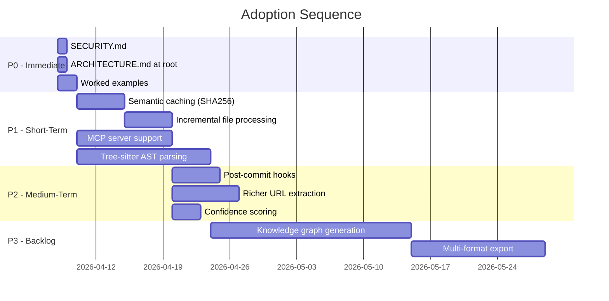

# Cross-Project Comparison: Gemma Code vs. Graphify

**Version**: 0.1.0
**Generated**: 2026-04-07T00:00:00Z
**Analyzer**: Claude Code -- compare-project command
**External Source**: https://github.com/safishamsi/graphify
**Source Type**: Repository

---

## Section 1: Executive Summary

Gemma Code (v0.1.0, local AI coding assistant for VS Code via Ollama) was compared against Graphify (v0.1.14, 7.3k stars, a Claude Code skill that transforms code and documents into queryable knowledge graphs). These are fundamentally different tools: Gemma Code is an agentic IDE assistant; Graphify is a code-intelligence and knowledge-graph generator. Despite the different domains, the comparison surfaced **12 adoption candidates** and **8 strengths to preserve**. The top opportunities are: integrating tree-sitter-based AST parsing for deeper code understanding, adding MCP server support for interoperability with other AI agents, and adopting a root-level SECURITY.md with disclosure SLAs. Overall recommendation: **selectively adopt** patterns from Graphify's code-intelligence pipeline and documentation practices while preserving Gemma Code's superior CI/CD maturity, test discipline, and multi-platform distribution.

---

## Section 2: Project Profiles

| Attribute | Gemma Code | Graphify |
|---|---|---|
| **Purpose** | Local, offline AI coding assistant for VS Code powered by Gemma 4 via Ollama | Claude Code skill that transforms folders of code, docs, images, and tweets into queryable knowledge graphs |
| **Version** | 0.1.0 | 0.1.14 (PyPI) / v0.3.11 (GitHub release) |
| **Stars** | New project | 7,300+ |
| **License** | MIT | MIT |
| **Primary Language** | TypeScript (extension) + Python (backend) | Python (100%) |
| **Maturity** | First stable release, 8 development phases completed | Actively maintained, rapid iteration (14+ patch releases in 4 days) |
| **Distribution** | VS Code VSIX + Windows installer (setup.exe) | PyPI package (`pip install graphifyy`) + Claude Code skill |
| **Offline Capability** | Fully offline (Ollama local inference) | Requires Claude API for deep/vision mode; offline for AST extraction |
| **Target User** | Individual developers wanting private AI coding assistance | Developers and AI agents needing structured codebase understanding |

---

## Section 3: Technology Stack Comparison

| Layer | Gemma Code | Graphify | Notes |
|---|---|---|---|
| **Primary Language** | TypeScript + Python | Python | Gemma Code is polyglot; Graphify is Python-only |
| **Runtime** | Node.js 20 + Python 3.11 | Python 3.10+ | Gemma Code requires two runtimes |
| **Framework** | VS Code Extension API + FastAPI | CLI + tree-sitter + NetworkX | Different paradigms (IDE vs. CLI) |
| **AI Backend** | Ollama (local Gemma 4) | Claude API (for vision/deep mode) | Gemma Code is fully local; Graphify uses remote API |
| **Graph Library** | None | NetworkX + Graspologic (Leiden) | Graphify's core differentiator |
| **AST Parsing** | None | tree-sitter (13 language bindings) | Major gap in Gemma Code |
| **Package Manager** | npm + uv | pip/setuptools | Gemma Code uses modern uv; Graphify uses traditional pip |
| **Build Tool** | tsc + PowerShell scripts | setuptools | Different ecosystems |
| **Test Runner** | Vitest + pytest | pytest | Both use pytest for Python |
| **Linter** | ESLint + ruff + mypy | None in CI | Gemma Code has far stronger lint discipline |
| **Coverage** | 80% gate (TS + Python) | No coverage reporting | Gemma Code enforces coverage; Graphify does not |
| **Database** | SQLite (better-sqlite3) | JSON persistence (graph.json) | Different storage needs |
| **Visualization** | VS Code webview (marked + highlight.js) | vis.js interactive HTML + SVG | Graphify has richer graph visualization |

---

## Section 4: AI Assistant Configuration Comparison

| Aspect | Gemma Code | Graphify |
|---|---|---|
| **CLAUDE.md** | Yes (74 lines, comprehensive project memory) | No CLAUDE.md in repo |
| **`.claude/` directory** | Yes (hooks: git-guardrails, require-description, format-bash-description) | No `.claude/` directory |
| **Skill definition** | 7 built-in skills (commit, review-pr, generate-readme, etc.) | 1 comprehensive skill (`skills/graphify/skill.md`, 46.7 KB) |
| **Claude Code integration** | Not applicable (is its own assistant) | `graphify claude install` injects into CLAUDE.md; `/graphify` slash command |
| **MCP support** | None | MCP stdio server mode (`graphify/serve.py`) |
| **Git hooks** | Pre-tool-use hooks (safety guardrails) | Post-commit hooks (auto-rebuild graph on commit) |
| **Copilot/Cursor config** | None | None |

**Analysis**: These projects approach AI configuration from opposite directions. Gemma Code *is* the AI assistant, so it configures itself via CLAUDE.md and hooks. Graphify is a *tool for* AI assistants, so it provides a skill definition and MCP server. The key takeaway for Gemma Code is that MCP server support would allow it to interoperate with Claude Code and other agents as a tool provider, not just as a standalone assistant.

---

## Section 5: Skills and Capabilities Gap Analysis

### 5a. Present in Graphify, Missing in Gemma Code (Adoption Candidates)

| Capability | Graphify Implementation | Potential Value for Gemma Code |
|---|---|---|
| **AST-level code parsing** | tree-sitter with 13 language bindings; extracts functions, classes, imports, relationships | Would enable semantic code understanding beyond text search; powers smarter refactoring, navigation, and context selection |
| **Knowledge graph generation** | NetworkX-based graph with nodes (concepts) and edges (relationships); Leiden community detection | Could provide structured codebase context to the LLM, reducing token usage and improving answer quality |
| **MCP server mode** | stdio-based MCP server in `graphify/serve.py` | Would allow Gemma Code to be consumed as a tool by other AI agents (Claude Code, Cursor, etc.) |
| **Incremental file processing** | `--update` flag re-processes only changed files | Relevant for any future indexing or caching features |
| **Semantic caching** | SHA256 content hashing to skip unchanged files | Would improve performance of repeated operations on large codebases |
| **Graph querying** | BFS/DFS traversal, shortest path, token-budgeted context retrieval | Could power a "find related code" feature or smarter context window management |
| **Multi-format export** | HTML, SVG, GraphML, Obsidian vault, Neo4j Cypher, Wiki | Pattern worth considering for documentation generation features |
| **Confidence scoring** | EXTRACTED, INFERRED (0.4-0.95), AMBIGUOUS labels on relationships | Transparent uncertainty reporting could improve tool result reliability |
| **URL content ingestion** | Fetches Twitter/X, arXiv, PDFs, webpages and integrates into graph | Extends the `fetch_page` tool with richer content extraction |
| **Worked examples** | `worked/` directory with real project analyses and outputs | Gemma Code lacks runnable example workflows |

### 5b. Present in Gemma Code, Missing in Graphify (Strengths to Preserve)

| Capability | Gemma Code Implementation | Why It Matters |
|---|---|---|
| **Agentic tool loop** | 20-iteration agent loop with 10 tool types | Core differentiator; Graphify is single-pass CLI |
| **File editing with diff preview** | Edit modes (Auto/Ask/Manual) with confirmation gates | User safety and control |
| **Plan mode** | Step-by-step execution with user approval | Critical for trustworthy autonomous operation |
| **Chat history persistence** | SQLite-backed conversation storage | Session continuity across restarts |
| **Terminal execution** | Shell command execution with blocklist and segmentation | Full IDE integration |
| **Context auto-compaction** | 80% threshold triggers automatic context summarization | Manages long conversations gracefully |
| **Multi-language stack** | TypeScript + Python + planned Rust/Go | Flexibility for performance-critical components |
| **Windows installer** | NSIS-based setup.exe with Ollama detection | One-click onboarding |

### 5c. Present in Both, Quality Comparison

| Capability | Gemma Code | Graphify | Better |
|---|---|---|---|
| **Web search/fetch** | DuckDuckGo HTML scraping + SSRF-protected fetch | URL ingestion with 50MB limit, streaming, protocol restrictions | Graphify (richer content extraction, size limits) |
| **Security hardening** | SSRF filter, path traversal guard, terminal blocklist, shell segmentation | URL protocol restrictions, path confinement, output sanitization, size limits | Gemma Code (more comprehensive, audited) |
| **File type detection** | VS Code workspace.findFiles API | tree-sitter language detection + file extension mapping | Graphify (AST-aware detection) |
| **Skill/command system** | 7 skills + 6 commands, frontmatter-based extensibility | 1 comprehensive skill (46.7 KB), CLI flags | Gemma Code (more extensible architecture) |

---

## Section 6: Commands and Automation Comparison

### 6a. Commands Gap

| Command Type | Gemma Code | Graphify |
|---|---|---|
| **Slash commands** | `/help`, `/clear`, `/history`, `/plan`, `/compact`, `/model` | `/graphify [path] [flags]` (single entry point) |
| **Built-in skills** | `/commit`, `/review-pr`, `/generate-readme`, `/generate-changelog`, `/generate-tests`, `/analyze-codebase`, `/setup-project` | `/graphify query`, `/graphify path`, `/graphify explain`, `/graphify add` |
| **npm scripts** | `build`, `watch`, `test`, `test:integration`, `lint`, `package`, `package:quick`, `bench` | N/A (Python package) |
| **Python commands** | `uv run pytest`, `uv run ruff check`, `uv run mypy` | `graphify --help`, `graphify install`, `graphify hook install` |
| **Build scripts** | `build-vsix.ps1`, `build-installer.ps1` | None (setuptools handles packaging) |

**Key difference**: Gemma Code has a richer command ecosystem with multiple entry points. Graphify uses a single CLI entry point with subcommands and flags. Graphify's `graphify claude install` pattern (auto-injecting into CLAUDE.md) is a clever integration approach worth noting.

### 6b. CI/CD and Hooks Gap

| Aspect | Gemma Code | Graphify |
|---|---|---|
| **CI workflows** | 3 (ci.yml, release.yml, nightly.yml) | 1 (ci.yml) |
| **CI jobs** | lint-ts, test-ts, build-ts, lint-py, test-py, coverage-gate | Single test job |
| **Test matrix** | Node 20, Python 3.11 (Ubuntu + Windows) | Python 3.10 + 3.12 (Ubuntu only) |
| **Linting in CI** | ESLint + ruff + mypy | None |
| **Coverage enforcement** | 80% gate on both TS and Python | None |
| **Release pipeline** | Tag-triggered, builds VSIX + installer, creates GitHub Release | None visible |
| **Nightly builds** | Integration tests + 5 benchmark suites + Slack notification | None |
| **Pre-commit hooks** | git-guardrails, require-description (via .claude/) | None |
| **Post-commit hooks** | None | Auto-rebuild graph on commit |

**Analysis**: Gemma Code has significantly more mature CI/CD. Graphify's post-commit hook pattern for auto-rebuilding is the one adoption candidate here.

---

## Section 7: Documentation and Developer Experience Comparison

| Aspect | Gemma Code | Graphify |
|---|---|---|
| **README** | Comprehensive (246 lines): features, prerequisites, installation, config, troubleshooting | Feature-focused: usage examples, performance metrics, command reference |
| **CHANGELOG** | Follows Keep a Changelog format; 8 phases documented | Version history 0.1.0-0.1.8; feature-focused entries |
| **Architecture docs** | `docs/v0.1.0/architecture.md` (nested) | `ARCHITECTURE.md` (root level) |
| **Security docs** | `docs/v0.1.0/security-audit.md` (audit report) | `SECURITY.md` (root level, with disclosure SLA) |
| **API/protocol docs** | `docs/v0.1.0/tool-protocol.md` | Inline in `skill.md` (46.7 KB) |
| **Performance docs** | `docs/v0.1.0/performance-benchmarks.md` | Inline in README (71.5x context reduction) |
| **Worked examples** | `examples/` directory (empty placeholder) | `worked/` directory with real httpx, karpathy analyses |
| **Dev setup guide** | In README (npm install, uv sync) | In README (pip install) |
| **Onboarding** | Windows installer; manual for macOS/Linux | Single pip install; `graphify install` for Claude Code |
| **DEVLOG** | `docs/DEVLOG.md` with phase milestones | None |

**Key differences**: Graphify places ARCHITECTURE.md and SECURITY.md at the repo root for immediate visibility (GitHub convention). Gemma Code nests these under `docs/v0.1.0/`. Graphify includes real worked examples; Gemma Code's examples directory is empty. Gemma Code has superior development documentation (DEVLOG, phase histories, CI setup guide).

---

## Section 8: Testing and Security Posture Comparison

### Testing

| Aspect | Gemma Code | Graphify |
|---|---|---|
| **Test files** | 20 TS + Python test modules | 20+ Python test modules |
| **Frameworks** | Vitest (TS) + pytest (Python) | pytest |
| **Coverage gate** | 80% lines (TS + Python), 75% branches (TS) | None |
| **Test tiers** | Unit, integration, e2e, benchmarks, installer | Unit, integration (implied) |
| **CI test matrix** | 2 OS (Ubuntu + Windows), Node 20, Python 3.11 | 1 OS (Ubuntu), Python 3.10 + 3.12 |
| **Benchmark suite** | 5 suites in nightly CI (TTFT, compaction, tool exec, skill loading, rendering) | Built-in benchmarking module (`benchmark.py`) |
| **Fixtures** | `tests/setup.ts`, Python conftest | Multilingual code samples, extraction fixtures |
| **Mocking** | Vitest mocks, pytest monkeypatch | Standard pytest |

### Security

| Aspect | Gemma Code | Graphify |
|---|---|---|
| **Security audit** | Completed; 2 vulns found and fixed (SSRF, command injection) | No published audit |
| **Security policy** | None at root level | `SECURITY.md` with 48h ack SLA, 7-day fix for critical |
| **SSRF protection** | `isSsrfBlocked()`: blocks loopback, link-local, RFC-1918, non-HTTP schemes | URL protocol restrictions (HTTP/HTTPS only), redirect blocking |
| **Path traversal** | `resolveWorkspacePath()` with workspace boundary check | `graphify-out/` confinement, symlink disabled |
| **Command injection** | Terminal blocklist + shell segmentation (`shellSegments()`) | N/A (no shell execution) |
| **Output sanitization** | N/A | HTML escaping, control char filtering, 256-char label limit |
| **Dependency scanning** | `npm audit` + `pip-audit` | None visible in CI |
| **Secret detection** | .gitignore patterns; git history audit performed | .gitignore patterns |

**Analysis**: Gemma Code has stronger security implementation (audited, specific mitigations). Graphify has a stronger security *policy* (root-level SECURITY.md with SLAs). Adopting a root-level SECURITY.md would improve Gemma Code's public security posture.

---

## Section 9: Structural and Architectural Differences

| Aspect | Gemma Code | Graphify |
|---|---|---|
| **Architecture pattern** | Client-server: VS Code extension (TypeScript) communicates with FastAPI backend (Python), which talks to Ollama | Pipeline: detect -> extract -> build -> cluster -> analyze -> export |
| **Entry point** | `src/extension.ts` (VS Code lifecycle) | `graphify/__main__.py` (CLI) |
| **Largest module** | ~300 lines (various TS modules) | `extract.py` (98.3 KB) |
| **State management** | SQLite for history; VS Code globalState for settings | JSON files (graph.json, manifest.json) |
| **Caching** | Context auto-compaction (token-based) | SHA256 semantic cache (content-based) |
| **Extensibility** | Skill frontmatter protocol; hot-reload skill loader | tree-sitter language registration; export module extension |
| **Multi-language support** | N/A (processes text, not AST) | 19 languages via tree-sitter |
| **Graph data structure** | None | NetworkX graph with Leiden community detection |
| **Concurrency** | Async streaming (TypeScript); async FastAPI (Python) | Synchronous pipeline (Python) |
| **Distribution** | VSIX + Windows installer | PyPI package |

**Notable pattern from Graphify**: The pipeline architecture (detect -> extract -> build -> cluster -> analyze -> export) is clean and composable. If Gemma Code adds codebase indexing features, this pipeline pattern would be a good reference for structuring the processing stages.

---

## Section 10: Adoption Plan

### P0: Immediate (High Value, Low-Medium Effort)

| # | What to Adopt | Source Reference | Target Location | Effort | Dependencies | Risk |
|---|---|---|---|---|---|---|
| 1 | **Root-level SECURITY.md** with vulnerability disclosure policy and SLA commitments | `SECURITY.md` in Graphify root | `SECURITY.md` in Gemma Code root | Low | None | None; purely additive |
| 2 | **Root-level ARCHITECTURE.md** symlink or copy promoting the existing nested doc | `ARCHITECTURE.md` in Graphify root | `ARCHITECTURE.md` in Gemma Code root (symlink to `docs/v0.1.0/architecture.md`) | Low | None | Minor; may need to maintain two locations |
| 3 | **Worked examples directory** with real usage demos and sample outputs | `worked/` directory in Graphify | `examples/` directory in Gemma Code (currently empty) | Low | None | None; directory already exists |

### P1: Short-Term (High Value, Medium-High Effort)

| # | What to Adopt | Source Reference | Target Location | Effort | Dependencies | Risk |
|---|---|---|---|---|---|---|
| 4 | **Tree-sitter AST parsing** for semantic code understanding | `graphify/extract.py` (tree-sitter bindings for 13 languages) | `src/tools/` or new `src/indexer/` module | High | Rust/WASM tree-sitter bindings for Node.js | Significant new dependency; increases extension size |
| 5 | **MCP server support** so Gemma Code can be consumed as a tool by other agents | `graphify/serve.py` (MCP stdio server) | New `src/mcp/` module | Medium | MCP SDK for TypeScript | Architectural addition; needs protocol compliance testing |
| 6 | **Content-based semantic caching** (SHA256 hashing to skip unchanged files) | `graphify/cache.py` | `src/tools/` or `src/utils/cache.ts` | Medium | None | Must integrate with existing tool handlers |
| 7 | **Incremental file processing** for tool operations on large codebases | `--update` flag logic in Graphify pipeline | `src/tools/handlers/` (filesystem tools) | Medium | Item 6 (caching) | Changes tool behavior; needs thorough testing |

### P2: Medium-Term (Medium Value, Medium Effort)

| # | What to Adopt | Source Reference | Target Location | Effort | Dependencies | Risk |
|---|---|---|---|---|---|---|
| 8 | **Post-commit hooks** for automatic index/cache refresh | `graphify/hooks.py` | New `src/hooks/` module or `.claude/hooks/` extension | Medium | Items 6-7 (caching, incremental processing) | Must not slow down git operations |
| 9 | **Richer URL content extraction** (arXiv, Twitter/X, PDF processing) | `graphify/ingest.py` | Enhance existing `FetchPageTool` in `src/tools/handlers/` | Medium | Optional dependencies (pypdf, html2text) | Increases attack surface; needs SSRF review |
| 10 | **Confidence scoring on tool results** (EXTRACTED, INFERRED, AMBIGUOUS) | Confidence labels in Graphify's analysis pipeline | `src/tools/` tool result format | Low | None | Changes tool result schema; affects downstream consumers |

### P3: Backlog (Lower Priority)

| # | What to Adopt | Source Reference | Target Location | Effort | Dependencies | Risk |
|---|---|---|---|---|---|---|
| 11 | **Knowledge graph generation** for structured codebase context | `graphify/build.py`, `graphify/cluster.py` (NetworkX + Leiden) | New `src/indexer/graph/` module | High | Items 4 (tree-sitter), NetworkX or equivalent TS library | Major feature; could become its own extension |
| 12 | **Multi-format documentation export** (Obsidian vault, wiki, GraphML) | `graphify/export.py`, `graphify/wiki.py` | New `src/export/` module or skill | High | Item 11 (knowledge graph) | Scope creep risk; may be better as a separate skill |

---

## Section 11: Implementation Sequence

The adoption items have clear dependency chains. The recommended sequence is:

**Critical path**: P0 items are independent and can be done immediately. P1 items can proceed in parallel (caching/incremental on one track, MCP/tree-sitter on another). P2 items depend on the caching track. P3 items depend on tree-sitter and represent a major feature expansion.

---

## Section 12: Risks and Considerations

### Conflicts with Existing Patterns

1. **Tree-sitter adds native dependencies**: Gemma Code currently has no native Node.js addons except `better-sqlite3`. Adding tree-sitter WASM bindings would increase extension size and complexity. Consider using the WASM-based `web-tree-sitter` to avoid native compilation.

2. **MCP server changes the extension's identity**: Gemma Code is currently a standalone assistant. Adding MCP server support makes it also a tool provider. This dual role needs careful architectural separation to avoid coupling.

3. **Knowledge graph is a separate product**: Full knowledge graph generation (P3) is ambitious enough to be its own extension or a Gemma Code plugin. Adopting it wholesale risks scope creep. Consider starting with tree-sitter parsing (P1) and evaluating whether the graph layer is needed.

### Items Explicitly NOT Recommended for Adoption

1. **Graphify's lack of CI linting**: Graphify has no linting in CI. Gemma Code's ESLint + ruff + mypy discipline is a clear strength; do not relax it.

2. **Python-only architecture**: Graphify is 100% Python. Gemma Code's polyglot approach (TypeScript extension + Python backend + future Rust/Go) is better suited to the VS Code ecosystem.

3. **Claude API dependency for deep analysis**: Graphify's `--mode deep` requires Claude API calls. This conflicts with Gemma Code's core value proposition of fully offline operation. Any adopted features must work with local Ollama inference.

4. **Single-OS CI**: Graphify tests only on Ubuntu. Gemma Code already tests on Ubuntu + Windows. Do not regress.

### Maintenance Burden

- **P0 items** add no maintenance burden (documentation only).
- **P1 items** add moderate burden: tree-sitter bindings need updates when languages evolve; MCP protocol may change; caching logic needs invalidation testing.
- **P2-P3 items** add significant burden and should only be pursued if they align with the product roadmap.

### Key Takeaway

Graphify's strongest lesson for Gemma Code is not any single feature but the *pattern* of structured code intelligence: parse code into ASTs, build relationships, cluster related concepts, and query the result with token budgets. This pattern could dramatically improve how Gemma Code selects context for its LLM prompts, reducing hallucination and improving answer quality, all without requiring external API calls.
