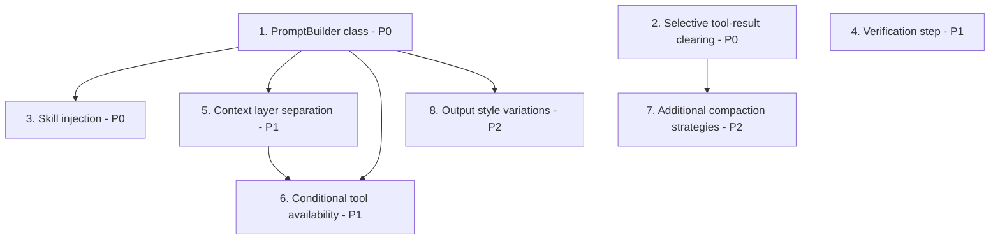

# Source Analysis: Gemma Code vs. "How Claude Code Builds a System Prompt"

**Version**: 0.1.0
**Generated**: 2026-04-07
**Analyzer**: Claude Code -- compare-project command
**External Source**: https://www.dbreunig.com/2026/04/04/how-claude-code-builds-a-system-prompt.html
**Source Type**: Web Article

---

## Section 1: Executive Summary

Drew Breunig's article reverse-engineers how Claude Code dynamically assembles its system prompt from 30+ conditional components across multiple context layers. Of the 13 actionable insights extracted, 5 are missing from Gemma Code, 4 are partially implemented, 3 are not applicable to the current architecture, and 1 is a straightforward gap. The highest-impact adoption candidate is replacing Gemma Code's single static `SYSTEM_PROMPT` constant with a dynamic `PromptBuilder` that assembles sections conditionally; this single change unlocks most other improvements. Overall recommendation: **selectively adopt** -- the dynamic prompt assembly pattern and selective tool-result clearing are high-value, low-risk wins, while MCP support and sub-agent awareness are premature for v0.1.x.

---

## Section 2: Source Overview

- **Title**: How Claude Code Builds a System Prompt
- **Author**: Drew Breunig
- **Publication Date**: April 4, 2026
- **Topic**: Context engineering in agentic coding assistants
- **Key Thesis**: Claude Code's sophisticated behavior emerges not from model capability alone but from deliberate context engineering -- a dynamic harness that assembles 30+ prompt components, manages ~50 tools with conditional descriptions, and uses roughly a dozen conversation compaction strategies, all governed by runtime conditions such as output style, user type, session mode, and tool availability.

---

## Section 3: Key Insights Extracted

1. **Dynamic prompt assembly** -- The system prompt is built from 30+ distinct components, not a static string. Each component has an inclusion rule (always, conditional, or per-turn). *(Section: Key System Prompt Components)*

2. **Always-included vs. conditional sections** -- Components are classified: always-included (intro, system rules, risk assessment), conditional (coding philosophy, tool preferences, tone), and per-turn (MCP instructions). *(Section: Key System Prompt Components)*

3. **Multi-layer context assembly** -- Beyond the system prompt, Claude Code assembles tool definitions, user content (CLAUDE.md/AGENT.md), conversation history, attachments (plan mode, task lists, @-mentions), and skills as separate layers. *(Section: Context Assembly Layers)*

4. **Variation patterns** -- Output style configurations alter introduction wording; user type (employee vs. external) triggers different verbosity; interactive vs. non-interactive sessions remove certain guidance; "undercover mode" suppresses identifiers. *(Section: Notable Techniques -- Variation Patterns)*

5. **Verification agent** -- A verification step is triggered for "3+ file edits, backend/API changes, or infrastructure changes" to catch errors before committing. *(Section: Notable Techniques -- Conditional Logic Examples)*

6. **Cache boundary markers** -- A separator divides globally cacheable content from session-specific content, enabling LLM prompt cache optimization. *(Section: Key System Prompt Components)*

7. **Function result clearing** -- Old tool outputs are cleared from conversation history while preserving the 5 most recent results, reducing context usage without losing recent working memory. *(Section: Optimization Features)*

8. **MCP delta mode** -- MCP server instructions are delivered per-turn instead of in the cached system prompt, keeping the stable portion cacheable. *(Section: Optimization Features)*

9. **~50 tools with conditional descriptions** -- Tool availability and descriptions vary by context (REPL mode, interactive vs. non-interactive, sub-agent mode). *(Section: Context Assembly Layers -- Tool Definitions)*

10. **~12 conversation compaction methods** -- "About a dozen different methods for compaction, offloading, and summarizing" the conversation history. *(Section: Context Assembly Layers -- Conversation History)*

11. **Conditional tool activation** -- Tools are enabled or disabled based on session state (e.g., AskUserQuestion depends on tool availability; Explore/Plan agent guidance omitted in fork mode). *(Section: Notable Techniques -- Conditional Logic Examples)*

12. **Skill injection per interaction** -- Relevant and user-specified skills are appended dynamically to each interaction, not statically loaded. *(Section: Context Assembly Layers -- Skills)*

13. **Sub-agent mode awareness** -- Prompt sections are omitted when Claude Code runs as a fork/sub-agent, reducing noise and focusing the sub-agent on its task. *(Section: Notable Techniques -- Conditional Logic Examples)*

---

## Section 4: Relevance Analysis

| # | Insight | Status | Evidence / Notes |
|---|---------|--------|-----------------|
| 1 | Dynamic prompt assembly | **Missing** | `src/chat/ConversationManager.ts:6-40` defines a single static `SYSTEM_PROMPT` constant. No conditional assembly logic. |
| 2 | Always vs. conditional sections | **Missing** | The entire prompt is always-included. No distinction between stable and conditional sections. |
| 3 | Multi-layer context assembly | **Partially Implemented** | Tool definitions are baked into the system prompt string (ConversationManager.ts:29-39). Skills are loaded by `src/skills/SkillLoader.ts` but invoked as commands, not injected into the prompt. No user-content layer (no workspace CLAUDE.md equivalent for end users). |
| 4 | Variation patterns | **Missing** | `src/config/settings.ts` exposes model name, temperature, and tool confirmation mode, but nothing that alters the system prompt's wording or tone. |
| 5 | Verification agent | **Missing** | `src/tools/AgentLoop.ts:45-99` executes all tool calls in sequence without counting file-edit operations or triggering a verification pass. |
| 6 | Cache boundary markers | **Not Applicable** | Ollama's local inference does not support prompt caching. This becomes relevant if Gemma Code later supports API-cached providers. |
| 7 | Function result clearing | **Partially Implemented** | `src/chat/ContextCompactor.ts:49-97` performs full summary compaction (preserving 4 recent messages). `src/backend/services/prompt.py:47-73` trims oldest non-system messages. Neither selectively strips tool-result blocks while keeping reasoning text. |
| 8 | MCP delta mode | **Not Applicable** | Gemma Code does not implement the MCP protocol. Out of scope for v0.1.x. |
| 9 | ~50 tools with conditional descriptions | **Partially Implemented** | 10 tools exist (`src/tools/handlers/`), all statically described in the system prompt. No mechanism to vary tool descriptions or availability by context. |
| 10 | ~12 compaction methods | **Partially Implemented** | 3 methods exist: (a) LLM-generated summary compaction (`ContextCompactor.compact`), (b) oldest-first trimming (`ConversationManager.trimToContextLimit`), (c) backend history trimming (`prompt.py:trim_history`). Claude Code reportedly uses ~12. |
| 11 | Conditional tool activation | **Missing** | `src/tools/ToolRegistry.ts` registers all tools unconditionally. No `isEnabled(context)` mechanism. All 10 tools are always listed in the system prompt. |
| 12 | Skill injection per interaction | **Missing** | `src/skills/SkillLoader.ts` loads skills into a `Map` and exposes them via `getSkill(name)`, but they are only used when the user invokes a slash command (`src/commands/CommandRouter.ts`). No per-turn prompt injection. |
| 13 | Sub-agent mode awareness | **Not Applicable** | Gemma Code has no sub-agent or fork architecture. Relevant only after multi-agent orchestration is designed. |

**Summary**: 5 missing, 4 partially implemented, 3 not applicable, 1 missing (easy win). The most impactful gap is the absence of dynamic prompt assembly (#1), which is the prerequisite for adopting insights #2, #3, #4, #11, and #12.

---

## Section 5: Adoption Plan

### P0 -- Immediate (High Value, Low-Medium Effort)

| What | Source (Article Section) | Target (Project Location) | Effort | Dependencies | Risk |
|------|--------------------------|---------------------------|--------|--------------|------|
| **Dynamic prompt builder** -- Refactor the static `SYSTEM_PROMPT` into a `PromptBuilder` class that assembles sections conditionally based on session state | Key System Prompt Components: "30+ distinct components organized by inclusion rules" | New file: `src/chat/PromptBuilder.ts`. Refactor `src/chat/ConversationManager.ts` to call `PromptBuilder.build(context)` instead of using the constant. | Medium | None | Must preserve existing prompt content as baseline. Add unit tests for PromptBuilder before refactoring ConversationManager. |
| **Selective tool-result clearing** -- Strip `<tool_result>` blocks from older messages while preserving reasoning text and the 5 most recent tool results | Optimization Features: "function result clearing removes old tool outputs while preserving 5 most recent" | `src/chat/ContextCompactor.ts` -- add a `clearStaleToolResults(keepCount: number)` method. Call it before full compaction triggers. | Low | None | Lower risk than summary compaction. Regex-based stripping of `<tool_result>` tags is straightforward. Improves context efficiency immediately. |
| **Skill injection into prompt** -- When a skill is active (user invoked a slash command), append the skill's prompt to the system message for that turn | Context Assembly Layers -- Skills: "relevant and user-specified capabilities appended per interaction" | `src/chat/ConversationManager.ts` (or PromptBuilder once built). Add an `injectSkill(skillPrompt: string)` method that appends to the system message. | Low | PromptBuilder (recommended but not strictly required -- can append to the existing static prompt as a first pass) | Increases system prompt size. Measure token impact; large skills may need truncation for the 8K context window. |

### P1 -- Short-term (High Value, Medium-High Effort)

| What | Source (Article Section) | Target (Project Location) | Effort | Dependencies | Risk |
|------|--------------------------|---------------------------|--------|--------------|------|
| **Verification step for multi-file edits** -- Count file-edit tool calls during an agent loop run; after 3+ edits, inject a verification prompt asking the model to review its changes before continuing | Conditional Logic Examples: "Verification Agent required for 3+ file edits, backend/API changes, or infrastructure changes" | `src/tools/AgentLoop.ts:45-99` -- add a `_fileEditCount` tracker. After threshold, inject a verification user message and stream one more turn before committing. | Medium | None | Adds one extra LLM turn (latency cost). Make the threshold configurable via `src/config/settings.ts` (default: 3). Allow users to disable. |
| **Context layer separation** -- Refactor the system prompt into distinct layers: base instructions, tool catalog, user configuration, and conversation history | Context Assembly Layers: "system prompt, tool definitions, user content, conversation history, attachments, skills" | `src/chat/PromptBuilder.ts` -- define layers as separate builder methods (`buildBaseInstructions()`, `buildToolCatalog(enabledTools)`, `buildUserConfig()`, `buildSkillLayer()`). | High | PromptBuilder (P0) | Architectural change. Requires updating all tests that assert on the system prompt content. |
| **Conditional tool availability** -- Enable or disable tools based on context (offline mode disables `web_search`/`fetch_page`; read-only sessions disable `write_file`/`edit_file`/`delete_file`/`create_file`) | Conditional Logic Examples: "tools enabled/disabled based on session state" | `src/tools/ToolRegistry.ts` -- add `setEnabled(name, enabled)` and `getEnabledTools()`. PromptBuilder uses `getEnabledTools()` to build the tool catalog section. | Medium | PromptBuilder (P0) | Must regenerate the system prompt when tool availability changes mid-session. |

### P2 -- Medium-term (Medium Value, Medium Effort)

| What | Source (Article Section) | Target (Project Location) | Effort | Dependencies | Risk |
|------|--------------------------|---------------------------|--------|--------------|------|
| **Additional compaction strategies** -- Implement sliding-window, topic-boundary, and importance-weighted compaction alongside the existing LLM summary method | Conversation History: "about a dozen different methods for compaction, offloading, and summarizing" | `src/chat/ContextCompactor.ts` -- refactor to a strategy pattern (`CompactionStrategy` interface). Add `SlidingWindowStrategy`, `TopicBoundaryStrategy`. | High | None | Complexity increase. With an 8K context window, diminishing returns beyond 3-4 strategies. Prioritize sliding-window (cheapest, no LLM call). |
| **Output style variations** -- Add a `promptStyle` setting (e.g., `concise`, `detailed`, `beginner`) that alters the system prompt's instruction sections | Variation Patterns: "output style configurations alter introduction wording" | `src/config/settings.ts` -- add `promptStyle` enum. PromptBuilder selects section variants based on this setting. | Medium | PromptBuilder (P0) | Low risk. Purely additive. Requires writing alternative prompt text for each style variant. |

### P3 -- Backlog (Lower Priority or Not Yet Applicable)

| What | Source (Article Section) | Target (Project Location) | Effort | Dependencies | Risk |
|------|--------------------------|---------------------------|--------|--------------|------|
| **Cache boundary markers** -- Insert a separator between globally stable and session-specific prompt content to enable prompt caching | Optimization Features: cache scope marker | `src/chat/PromptBuilder.ts` | Low | Ollama or backend provider must support prompt caching | Not useful until caching is supported upstream. Note for future provider integrations. |
| **MCP protocol support** -- Implement MCP server connections with per-turn delta instruction delivery | Optimization Features: MCP delta mode | New module under `src/mcp/` | High | MCP specification implementation; significant new surface area | Major feature. Out of scope for v0.1.x. Track as a v0.2.0+ candidate. |
| **Sub-agent mode awareness** -- When running as a sub-agent, omit irrelevant prompt sections (tone, style, session guidance) to reduce noise | Conditional Logic Examples: fork sub-agent mode | `src/chat/PromptBuilder.ts` -- add `isSubAgent` flag to build context | Medium | Sub-agent/multi-agent orchestration architecture | Requires designing multi-agent architecture first. |

---

## Section 6: Implementation Sequence

The dependency graph determines the optimal order:

**Recommended order:**

1. **PromptBuilder class** (P0) -- Foundation for items 3, 5, 6, 8. Create with tests; initially reproduce the existing static prompt exactly.
2. **Selective tool-result clearing** (P0) -- Independent of PromptBuilder. Immediate context efficiency improvement.
3. **Skill injection** (P0) -- Builds on PromptBuilder. Small change with visible impact.
4. **Verification step** (P1) -- Independent of PromptBuilder. Can be implemented any time.
5. **Context layer separation** (P1) -- Refactors PromptBuilder internals into distinct layers.
6. **Conditional tool availability** (P1) -- Depends on layer separation (tool catalog as a separate layer).
7. **Additional compaction strategies** (P2) -- Independent. Start with sliding-window (no LLM call needed).
8. **Output style variations** (P2) -- Depends on PromptBuilder. Requires writing prompt text variants.

---

## Section 7: Risks and Considerations

### Risks of Adoption

- **Context window budget**: Gemma Code operates with an 8K token default (`src/config/settings.ts:11`). Dynamic prompt assembly that adds conditional sections must be carefully budgeted. Claude Code can afford a larger system prompt because it targets models with 128K-1M context windows. Every section added to Gemma Code's prompt directly reduces conversation capacity.

- **Model capability gap**: Claude Code's conditional sections (tone adjustment, verification prompts, variation patterns) assume a frontier-class model that can reliably follow nuanced instructions. Gemma 4 (especially smaller variants like 2B-12B) may not benefit from or reliably follow complex conditional instructions. Test each prompt variation empirically with the target model before shipping.

- **Compaction quality**: Claude Code's ~12 compaction strategies were developed for models that produce high-quality summaries. Gemma 4's summary quality at smaller parameter counts may not preserve critical context reliably. The selective tool-result clearing (insight #7) is safer because it is deterministic (regex-based), not model-dependent.

- **Test maintenance**: Refactoring the static system prompt into a dynamic builder will require updating all tests that assert on prompt content (`tests/unit/chat/`, `tests/unit/tools/`). Plan for this test update work in the PromptBuilder implementation phase.

### Insights Not Recommended for Adoption

- **MCP delta mode** (#8): Requires implementing the full MCP protocol, which is a major feature with its own design constraints. Not justified for v0.1.x when the primary goal is a single-model, offline-first assistant.

- **Sub-agent mode awareness** (#13): Requires a multi-agent orchestration layer that does not exist. Adopting this prematurely would be designing for hypothetical requirements.

- **Cache boundary markers** (#6): Ollama does not support prompt caching. Adding markers would be dead code with no runtime benefit. Revisit when provider support materializes.

- **All 12 compaction methods** (#10): Diminishing returns for an 8K context window. 3-4 well-chosen strategies (summary, sliding-window, selective result clearing, oldest-first trim) cover the practical needs. The remaining strategies likely optimize for 128K+ windows where token waste is more consequential.
