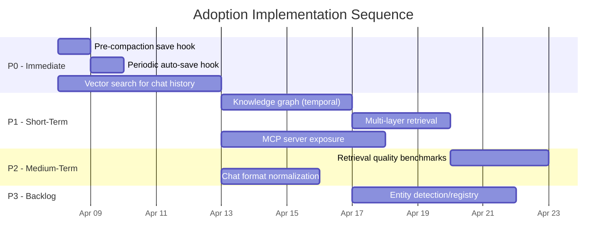

# Cross-Project Comparison: Gemma Code vs. MemPalace

**Version**: v0.1.0
**Generated**: 2026-04-07T00:00:00Z
**Analyzer**: Claude Code -- compare-project command
**External Source**: https://github.com/milla-jovovich/mempalace
**Source Type**: Repository

---

## Section 1: Executive Summary

Gemma Code (a local VS Code coding assistant, TypeScript + Python, v0.1.0) was compared against MemPalace (a local AI memory system, Python, v3.0.0, 18.1k stars) across 11 dimensions. The projects serve different primary purposes (coding assistance vs. persistent memory management), but share a strong philosophical overlap: both are local-first, zero-API-key, privacy-preserving tools for AI workflows. The comparison identified **9 adoption candidates** from MemPalace, with 3 rated P0 (immediate value). Gemma Code holds clear strengths in security hardening, multi-tier testing, CI/CD maturity, and multi-language architecture that MemPalace does not match. The overall recommendation is **selective adoption**: integrate MemPalace's memory persistence patterns, hook-based auto-save, and benchmarking methodology to give Gemma Code durable cross-session memory, which is its most significant capability gap.

---

## Section 2: Project Profiles

| Attribute | Gemma Code | MemPalace |
|-----------|-----------|-----------|
| **Purpose** | Local agentic coding assistant for VS Code | Persistent AI memory system (conversation + project knowledge) |
| **Domain** | IDE extension, code editing, terminal | Memory management, retrieval, knowledge graphs |
| **Version** | 0.1.0 (initial release, 2026-04-05) | 3.0.0 (mature, multiple major versions) |
| **License** | MIT | MIT |
| **Stars** | New project | 18.1k |
| **Languages** | TypeScript (primary), Python (backend) | Python (sole language) |
| **LOC** | ~7,000 (6,000 TS + 1,000 Python) | ~5,500 Python (23 source files) |
| **Git-Tracked Files** | 130 | ~50 |
| **Maturity** | v0.1.0, 8 development phases completed | v3.0.0, established project with community |
| **Target Users** | Individual developers wanting local AI coding | AI assistant users wanting persistent memory |
| **Deployment** | VS Code extension (VSIX) + Windows installer | pip package + MCP server + CLI |
| **Core Dependency** | Ollama (local LLM inference) | ChromaDB (local vector store) |
| **Philosophy** | Privacy-first, offline coding assistant | Verbatim-first, local-only memory |

---

## Section 3: Technology Stack Comparison

| Layer | Gemma Code | MemPalace | Notes |
|-------|-----------|-----------|-------|
| **Primary Language** | TypeScript 5.4.0 | Python 3.9+ | Different ecosystems |
| **Secondary Language** | Python 3.11+ (backend) | None | Gemma Code is polyglot |
| **Runtime** | Node.js 20+ (VS Code Extension Host) | CPython | Different runtimes |
| **LLM Integration** | Ollama REST API (local HTTP) | None (memory layer only) | MemPalace is model-agnostic |
| **Vector Database** | None | ChromaDB 0.5-0.6 | Key gap for Gemma Code |
| **Relational Database** | SQLite (better-sqlite3, chat history) | SQLite (knowledge graph) | Both use SQLite; different purposes |
| **Web Framework** | FastAPI 0.111.0 (optional backend) | None | Gemma Code has HTTP backend |
| **Package Manager** | npm + uv | pip/uv | Both support uv for Python |
| **Build System** | tsc (TypeScript) | hatchling | Different build tools |
| **Test Framework** | Vitest 1.0.0 (TS), pytest 8.2.0 (Python) | pytest 7.0+ | Both use pytest for Python |
| **Linter** | ESLint 8.57.0 (TS), ruff 0.4.0 (Python) | ruff 0.4.0 | Both use ruff for Python |
| **Line Length** | 88 (Python) | 100 (Python) | Minor style difference |
| **CI Platform** | GitHub Actions (3 workflows) | GitHub Actions (1 workflow) | Gemma Code has more CI depth |
| **Distribution** | VSIX + NSIS installer | PyPI package | Different distribution channels |
| **Serialization** | JSON (tool calls, messages) | YAML + JSON (config, results) | MemPalace also uses YAML |

---

## Section 4: AI Assistant Configuration Comparison

### Gemma Code

- **`.claude/` directory**: Present with 3 hooks in `.claude/hooks/`
  - `format-bash-description.py` (PreToolUse) -- formats Bash tool descriptions into bordered boxes, auto-approves matching patterns
  - `git-guardrails.sh` (PreToolUse) -- blocks dangerous git operations (force push, hard reset, force-delete)
  - `require-description.sh` (PreToolUse) -- enforces Bash command descriptions
- **CLAUDE.md**: Comprehensive (3.4 KB) with project overview, tech stack, commands, conventions, critical rules, output minimization
- **Skills**: 7 built-in skills loaded from `src/skills/catalog/` with hot-reload from `~/.gemma-code/skills/`
- **Commands**: 6 built-in slash commands (`/help`, `/clear`, `/history`, `/plan`, `/compact`, `/model`)
- **MCP Integration**: None (Gemma Code is itself a tool provider, not an MCP client or server)
- **Hook Events Covered**: PreToolUse only

### MemPalace

- **`hooks/` directory**: 2 hooks + README documentation
  - `mempal_save_hook.sh` (Stop event) -- auto-saves key topics/decisions every 15 human messages
  - `mempal_precompact_hook.sh` (PreCompact event) -- emergency save of all context before compaction
- **No CLAUDE.md**: MemPalace is a library, not a development project with AI instructions
- **Skills**: None (MemPalace is consumed as a tool, not a skill provider)
- **Commands**: CLI commands (`mempalace mine`, `mempalace search`, `mempalace status`)
- **MCP Integration**: Full MCP server (`mcp_server.py`) exposing 19 tools via JSON-RPC 2.0 stdin/stdout
- **Hook Events Covered**: Stop and PreCompact (lifecycle events)

### Classification

| Aspect | Bucket | Notes |
|--------|--------|-------|
| Hook system | Both present, different approach | Gemma Code: pre-execution validation; MemPalace: lifecycle auto-save. MemPalace's approach is complementary |
| CLAUDE.md | Current-only | Gemma Code's developer instructions are a strength |
| MCP server | External-only | **Adoption candidate**: exposing tools via MCP enables cross-tool interoperability |
| Skill system | Current-only | Gemma Code's hot-reload skill loader is a strength |
| CLI interface | External-only | MemPalace has a full CLI; Gemma Code's CLI is VS Code commands only |

---

## Section 5: Skills and Capabilities Gap Analysis

### 5a. Present in External, Missing in Current (Adoption Candidates)

| # | Capability | MemPalace Implementation | Relevance to Gemma Code |
|---|-----------|------------------------|------------------------|
| 1 | **Persistent memory system** | Wings/Rooms/Drawers hierarchy with ChromaDB vector search | High: Gemma Code only has flat chat history; no cross-session knowledge retention |
| 2 | **MCP server** | 19 tools exposed via JSON-RPC 2.0 stdin/stdout protocol | High: enables other AI tools (Claude Code, Cursor, etc.) to use Gemma Code's capabilities |
| 3 | **Knowledge graph** | SQLite-backed temporal entity-relationship store with validity windows | Medium: would enable Gemma Code to track project entities, decisions, and their evolution |
| 4 | **Vector search** | ChromaDB semantic search with wing/room filtering, similarity scoring | High: semantic retrieval over past conversations and code context |
| 5 | **Auto-save hooks** | Stop-event hook saves every 15 messages; PreCompact hook emergency-saves before compaction | High: directly applicable pattern for preserving context in Gemma Code sessions |
| 6 | **Multi-layer memory retrieval** | L0 Identity (100 tokens) + L1 Essential Story (500-800) + L2 On-Demand + L3 Deep Search | Medium: tiered retrieval with token budgeting would improve context quality |
| 7 | **Benchmarking suite** | 4 scripts (LongMemEval, LoCoMo, ConvoMem, MemBench) with reproducible methodology | Medium: Gemma Code has performance benchmarks but no retrieval/memory quality benchmarks |
| 8 | **Chat format normalization** | Converts Claude JSONL, OpenAI Codex JSONL, ChatGPT JSON, Slack JSON, plain text | Low: could enable Gemma Code to ingest conversation history from other tools |
| 9 | **Entity detection and registry** | Disambiguates people/places/concepts with Wikipedia lookup fallback | Low: useful for project entity tracking but adds complexity |

### 5b. Present in Current, Missing in External (Strengths to Preserve)

| # | Capability | Gemma Code Implementation | Notes |
|---|-----------|--------------------------|-------|
| 1 | **Agentic tool loop** | AgentLoop with streaming, tool calls, iteration, cancellation | Core value; MemPalace has no agent capability |
| 2 | **File editing with diff preview** | Auto/ask/manual edit modes, unified diff generation, confirmation gate | IDE-specific strength |
| 3 | **SSRF protection** | Comprehensive IP blocklist (loopback, link-local, RFC-1918, IPv6) | Security strength |
| 4 | **Command injection hardening** | Blocklist + shell segment splitting + user confirmation | Security strength |
| 5 | **Multi-tier testing** | Unit, integration, e2e, installer, benchmark tiers with coverage gating | Testing maturity |
| 6 | **Plan mode** | Step-by-step execution with user approval gates | Workflow control |
| 7 | **Hot-reload skill system** | Extensible user skills with frontmatter parsing, file watcher | Extensibility |
| 8 | **Server-side Markdown rendering** | Extension renders HTML before webview display | Performance pattern |
| 9 | **Context compaction** | Auto-summarize at 80% token threshold, preserve recent messages | Token management |
| 10 | **Multi-language stack** | TypeScript + Python + planned Rust/Go components | Architectural breadth |

### 5c. Present in Both, Quality Comparison

| Capability | Gemma Code | MemPalace | Better? |
|-----------|-----------|-----------|---------|
| **SQLite usage** | Chat history (sessions + messages, WAL mode) | Knowledge graph (entities + triples, WAL mode) | Equivalent quality; different purposes |
| **Configuration** | VS Code settings API with typed defaults | YAML/JSON config with env var override | Gemma Code: more integrated with IDE |
| **Error handling** | Graceful degradation throughout (DB, backend, ripgrep fallbacks) | Exception-based with helpful hints | Gemma Code: more resilient |
| **Python linting** | ruff (line-length 88, select E,F,I,UP,B,SIM) | ruff (line-length 100, select E,F,W) | Gemma Code: stricter rule set |
| **Documentation** | 21+ files (architecture, security audit, dev history, guides) | README + CONTRIBUTING + benchmarks | Gemma Code: significantly more comprehensive |

---

## Section 6: Commands and Automation Comparison

### 6a. Commands Gap

| Command Type | Gemma Code | MemPalace |
|-------------|-----------|-----------|
| **IDE commands** | 6 slash commands (`/help`, `/clear`, `/history`, `/plan`, `/compact`, `/model`) | N/A (not an IDE extension) |
| **CLI** | None (VS Code only) | `mempalace mine`, `mempalace search`, `mempalace status` + subcommands |
| **MCP tools** | None | 19 tools (6 read, 3 graph nav, 2 write, 5 KG, 2 diary, 1 duplicate check) |
| **npm scripts** | 8 (`build`, `watch`, `test`, `test:integration`, `lint`, `package`, `package:quick`, `bench`) | N/A |
| **Skills** | 7 built-in (`/commit`, `/review-pr`, `/generate-readme`, `/generate-changelog`, `/generate-tests`, `/analyze-codebase`, `/setup-project`) | N/A |

**Gap**: MemPalace's MCP server pattern is an adoption candidate. Gemma Code could expose its tools (file operations, search, terminal) via MCP for interoperability with other AI assistants.

### 6b. CI/CD and Hooks Gap

| Aspect | Gemma Code | MemPalace |
|--------|-----------|-----------|
| **CI workflows** | 3 (ci, release, nightly) | 1 (ci) |
| **Test matrix** | Node 20 (single) | Python 3.9, 3.11, 3.13 (multi-version) |
| **Coverage gate** | 80% line coverage (TS + Python, enforced in CI) | None (no coverage enforcement) |
| **Release automation** | VSIX + NSIS installer + GitHub Release with changelog extraction | None visible (PyPI presumably manual) |
| **Nightly builds** | Integration tests + benchmarks with Ollama + Slack notifications | None |
| **Pre-tool hooks** | 3 (description formatting, git guardrails, description enforcement) | None |
| **Lifecycle hooks** | None | 2 (auto-save on Stop, emergency save on PreCompact) |

**Gap**: MemPalace's lifecycle hooks (Stop and PreCompact) address a real need. Gemma Code could adopt this pattern to auto-save conversation context before session end or context compaction. Conversely, MemPalace lacks Gemma Code's CI maturity (coverage gates, release automation, nightly tests).

---

## Section 7: Documentation and Developer Experience Comparison

| Aspect | Gemma Code | MemPalace |
|--------|-----------|-----------|
| **README** | 8.8 KB, comprehensive (features, install, config, troubleshooting, dev setup) | Extensive (claims, architecture, benchmarks, installation, integration methods) |
| **Architecture docs** | `docs/v0.1.0/architecture.md` (system diagrams, component flow) | In-README only (palace metaphor explanation) |
| **API documentation** | `docs/v0.1.0/tool-protocol.md` (tool-call XML format, agent loop) | MCP tool descriptions in `mcp_server.py` docstrings |
| **Security audit** | `docs/v0.1.0/security-audit.md` (formal audit with findings) | None |
| **Testing guide** | `docs/v0.1.0/testing.md` (tier breakdown, running instructions) | In CONTRIBUTING.md (brief pytest instructions) |
| **Development history** | 8 phase-specific documents in `docs/v0.1.0/development/history/` | None |
| **Changelog** | CHANGELOG.md (Keep a Changelog format, detailed v0.1.0) | None visible |
| **Contributing guide** | Implied by CLAUDE.md conventions | CONTRIBUTING.md (setup, PR guidelines, code style, architecture principles) |
| **Benchmark docs** | `docs/v0.1.0/performance-benchmarks.md` | `benchmarks/README.md` (reproduction methodology, 3 benchmark suites) |
| **CI setup guide** | `docs/v0.1.0/ci-setup.md` | None |
| **Onboarding** | README "Development" section | `mempalace/onboarding.py` (interactive CLI wizard) |

**Gemma Code has significantly stronger documentation.** MemPalace's strength is its interactive onboarding wizard and detailed benchmark reproduction instructions.

---

## Section 8: Testing and Security Posture Comparison

### Testing

| Aspect | Gemma Code | MemPalace |
|--------|-----------|-----------|
| **Framework** | Vitest (TS) + pytest (Python) | pytest only |
| **Test files** | 25+ across multiple tiers | 11 in flat structure |
| **Test tiers** | Unit, integration, e2e, installer, benchmarks | Unit only (flat) |
| **Coverage enforcement** | 80% line, 75% branch (CI gate) | None |
| **Test isolation** | Setup files, mock workspace paths | HOME redirection (`conftest.py`), temp dirs |
| **CI test matrix** | Single Node version | Python 3.9, 3.11, 3.13 |
| **Integration tests** | Require Ollama (nightly CI) | No external service dependency |
| **Benchmark suite** | Vitest bench (performance timing) | 4 scripts (retrieval quality: LongMemEval, LoCoMo, ConvoMem, MemBench) |

**Gemma Code has broader test coverage and CI enforcement.** MemPalace's strength is its retrieval quality benchmarking (measuring recall, NDCG, temporal accuracy) which is more sophisticated than timing-only benchmarks.

### Security

| Aspect | Gemma Code | MemPalace |
|--------|-----------|-----------|
| **Formal audit** | Yes (`security-audit.md`) | None |
| **SSRF protection** | Comprehensive IP blocklist | N/A (no HTTP fetching) |
| **Command injection** | Blocklist + segment splitting + confirmation | N/A (no shell execution) |
| **Path traversal** | Workspace boundary enforcement | N/A (operates in `~/.mempalace/` only) |
| **Dependency scanning** | `npm audit` + `pip-audit` in CI | None visible |
| **Secret detection** | `.gitignore` patterns for secrets | None visible |
| **eval/exec** | Banned via ESLint `no-eval` | Not observed |

**Gemma Code has a significantly stronger security posture**, which is expected given it executes user commands and accesses the filesystem. MemPalace's attack surface is smaller (local-only, no shell execution, no web fetching).

---

## Section 9: Structural and Architectural Differences

### 1. Storage Philosophy

**Gemma Code**: Stores flat chat history (sessions with messages) in SQLite via better-sqlite3. No semantic indexing, no cross-session retrieval, no entity tracking. Each conversation is an independent silo.

**MemPalace**: Stores verbatim content in ChromaDB (vector-indexed), structured facts in SQLite (temporal knowledge graph), and compressed summaries in AAAK dialect format. Content is organized into a navigable hierarchy (Wings > Rooms > Halls > Drawers) with cross-domain connections (Tunnels).

**Implication**: Gemma Code cannot currently answer "What did we discuss about authentication last week?" or "What decisions were made about the database schema?" These are high-value queries for a coding assistant.

### 2. Integration Model

**Gemma Code**: Monolithic VS Code extension. The extension IS the AI assistant. Tools are internal (filesystem, terminal, web search). No external protocol for other tools to consume Gemma Code's capabilities.

**MemPalace**: Library + MCP server + CLI. Multiple consumption modes: import as Python package, run as MCP server for any AI tool, or use CLI directly. The MCP server is the primary integration point for Claude Code, ChatGPT, Cursor, and Gemini.

**Implication**: Adding an MCP server to Gemma Code would allow it to be consumed by other AI tools, and adding an MCP client would allow it to consume tools like MemPalace.

### 3. Context Management

**Gemma Code**: Reactive compaction (summarize when 80% full, preserve last 4 messages). Information is lost during compaction (summary replaces detailed history).

**MemPalace**: Proactive preservation (auto-save every 15 messages via hook, emergency save before compaction). Information is preserved in persistent storage before any lossy operation occurs.

**Implication**: MemPalace's hook pattern directly addresses the information loss problem in Gemma Code's compaction flow.

### 4. Retrieval Model

**Gemma Code**: No retrieval. The model sees only the current conversation window. Past sessions can be loaded but not searched semantically.

**MemPalace**: Multi-layer retrieval (L0 identity + L1 essential story + L2 on-demand + L3 deep search) with token budgeting. Semantic search across all stored content with wing/room filtering.

**Implication**: Adding vector search would enable Gemma Code to surface relevant past context automatically, improving response quality for recurring tasks.

---

## Section 10: Adoption Plan

### P0 -- Immediate (High Value, Low-Medium Effort)

| # | What to Adopt | Source Reference | Target Location | Effort | Dependencies | Risk |
|---|--------------|-----------------|-----------------|--------|-------------|------|
| 1 | **Pre-compaction save hook** | `hooks/mempal_precompact_hook.sh` | New `.claude/hooks/pre-compact-save.sh` or integrated into `ContextCompactor.ts` | Low | None | Low: additive behavior, no breaking changes |
| 2 | **Periodic auto-save hook** | `hooks/mempal_save_hook.sh` (message counting, session state tracking) | New `.claude/hooks/auto-save.sh` or integrated into `AgentLoop.ts` | Low | Item 1 (shared save logic) | Low: additive behavior |
| 3 | **Vector search for chat history** | `mempalace/searcher.py` (ChromaDB query interface with similarity scoring) | New `src/storage/VectorStore.ts` wrapping ChromaDB or similar local vector DB | Medium | ChromaDB or alternative (e.g., `vectra`, `lancedb`) as new dependency | Medium: adds dependency; must not break offline-first guarantee |

### P1 -- Short-Term (High Value, Medium-High Effort)

| # | What to Adopt | Source Reference | Target Location | Effort | Dependencies | Risk |
|---|--------------|-----------------|-----------------|--------|-------------|------|
| 4 | **Knowledge graph with temporal facts** | `mempalace/knowledge_graph.py` (SQLite schema, temporal queries, invalidation) | New `src/storage/KnowledgeGraph.ts` using existing SQLite infrastructure | Medium | None (reuses better-sqlite3) | Low: additive; can share DB file with chat history |
| 5 | **MCP server exposure** | `mempalace/mcp_server.py` (JSON-RPC 2.0 stdin/stdout, 19 tool definitions) | New `src/mcp/McpServer.ts` exposing Gemma Code tools via MCP protocol | High | MCP SDK (`@modelcontextprotocol/sdk`) | Medium: new protocol surface area; security review needed |
| 6 | **Multi-layer retrieval with token budgeting** | `mempalace/layers.py` (L0-L3 stack, token estimation, wake-up context) | Enhance `ContextCompactor.ts` with retrieval-augmented context injection | Medium | Items 3, 4 (vector search + KG) | Low: enhances existing compaction flow |

### P2 -- Medium-Term (Medium Value, Medium Effort)

| # | What to Adopt | Source Reference | Target Location | Effort | Dependencies | Risk |
|---|--------------|-----------------|-----------------|--------|-------------|------|
| 7 | **Retrieval quality benchmarks** | `benchmarks/` (LongMemEval, LoCoMo, ConvoMem methodology) | New `tests/benchmarks/retrieval/` with adapted benchmark scripts | Medium | Items 3, 6 (vector search + retrieval layers) | Low: testing infrastructure only |
| 8 | **Chat format normalization** | `mempalace/normalize.py` (multi-format converter) | New `src/utils/chatImporter.ts` for importing external chat history | Medium | Item 3 (vector store to index imported content) | Low: additive feature |

### P3 -- Backlog (Lower Value or High Effort)

| # | What to Adopt | Source Reference | Target Location | Effort | Dependencies | Risk |
|---|--------------|-----------------|-----------------|--------|-------------|------|
| 9 | **Entity detection and registry** | `mempalace/entity_registry.py`, `entity_detector.py` | New `src/storage/EntityRegistry.ts` | High | Item 4 (knowledge graph) | Medium: complexity vs. value tradeoff; Wikipedia lookup adds network dependency |

### Not Recommended for Adoption

| Item | Reason |
|------|--------|
| AAAK compression dialect | Lossy format showing performance regression (84.2% vs. 96.6% in raw mode). MemPalace authors acknowledge this. Not suitable for a coding assistant where precision matters |
| Palace metaphor (Wings/Rooms/Halls) | Overly specific organizational scheme. Gemma Code should use simpler project/topic taxonomy aligned with VS Code workspace structure |
| Onboarding wizard | MemPalace's CLI-based onboarding assumes standalone tool usage. Gemma Code should use VS Code's native settings UI and walkthrough API |
| Room detector / spellcheck | Too domain-specific to MemPalace's conversation memory use case |

---

## Section 11: Implementation Sequence

The recommended order accounts for dependencies between adoption items:

**Recommended sequence:**

1. **P0a + P0b**: Auto-save hooks (1-2 days). Zero dependencies, immediate value. Can be implemented as standalone bash scripts in `.claude/hooks/` or integrated into the extension's compaction flow.

2. **P0c**: Vector search (3-5 days). Evaluate ChromaDB vs. lighter alternatives (vectra for Node.js, lancedb). Must maintain offline-first guarantee. Store embeddings alongside existing SQLite chat history.

3. **P1a**: Knowledge graph (3-4 days). Extend existing SQLite infrastructure (better-sqlite3) with MemPalace's schema pattern (entities + triples + temporal windows). No new dependencies.

4. **P1b**: Multi-layer retrieval (2-3 days). Wire vector search + KG into the context compaction flow. Inject relevant past context before model calls.

5. **P1c**: MCP server (4-5 days). Expose Gemma Code's existing tools (file read/write/edit, grep, terminal) via MCP protocol. Enables interoperability.

6. **P2a + P2b**: Benchmarks and import (3-6 days). Add retrieval quality metrics and chat history import.

---

## Section 12: Risks and Considerations

### Dependency Risk

Adding ChromaDB (or a vector database) introduces a significant new dependency. ChromaDB requires `onnxruntime` for embeddings, which is a large binary (~200MB). For a VS Code extension targeting lightweight local deployment, consider alternatives:
- **vectra** (Node.js, ~50KB, uses OpenAI-compatible embeddings or local models)
- **lancedb** (Rust-backed, lightweight, columnar)
- **SQLite FTS5** (zero new dependencies, keyword search only, no semantic)

Recommendation: start with SQLite FTS5 for keyword search (zero dependencies), then evaluate vectra or lancedb for semantic search.

### Architectural Tension

MemPalace is a Python library; Gemma Code's primary runtime is TypeScript/Node.js. Adopting MemPalace patterns requires re-implementing in TypeScript, not importing the Python library. The Python backend could host vector search, but that would make the backend mandatory (currently optional).

### Offline-First Guarantee

Any vector search solution must work entirely offline. ChromaDB's default embedding model (`all-MiniLM-L6-v2`) runs locally, but some alternatives require API calls. Ensure the chosen solution includes a local embedding model.

### Information Overload

Injecting past context automatically could overwhelm the model's context window or confuse it with stale information. MemPalace's token budgeting approach (L0: 100 tokens, L1: 500-800 tokens) is a good mitigation, but Gemma Code's smaller context window (8192 tokens default with Gemma models) means budget management is even more critical.

### MCP Security Surface

Exposing tools via MCP creates a new attack surface. Any MCP client can request file reads, writes, and terminal execution. The existing confirmation gate and tool validation must be preserved in the MCP pathway. Consider read-only MCP mode as a safe default.

### Scope Creep

MemPalace is a mature v3.0.0 project with features accumulated over multiple major versions. Gemma Code should adopt patterns selectively, not try to replicate the entire memory system. The goal is to add durable context to an existing coding assistant, not to build a general-purpose memory palace.

### AAAK Compression Caveat

MemPalace's own benchmarks show AAAK compression reduces retrieval accuracy from 96.6% to 84.2%. The authors added a transparency note (April 7, 2026) acknowledging overstated claims. This validates the recommendation to skip AAAK adoption and store verbatim content.
