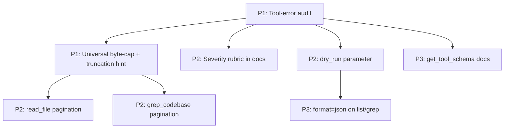

# Source Analysis: Gemma Code vs. "7 Principles for Agent-Friendly CLIs"

**Version**: v0.5.0
**Generated**: 2026-04-24T00:00:00Z
**Analyzer**: Claude Code -- compare-project command
**External Source**: https://trevinsays.com/p/7-principles-for-agent-friendly-clis
**Source Type**: Web Article

---

## Section 1: Executive Summary

Trevin Chow's article articulates seven design principles for command-line interfaces that AI agents can use reliably: non-interactive defaults, structured parseable output, fail-fast actionable errors, safe retries with explicit mutation boundaries, progressive help discovery, composable predictable structure, and bounded high-signal responses. Although Gemma Code is a VS Code extension rather than a shell-facing CLI, the principles apply directly to two surfaces it owns: (a) the **tool catalogue exposed to Gemma 4** (each tool is effectively a CLI for the agent) and (b) the **terminal commands the agent invokes via `run_terminal`**. Of the seven principles, five are **already implemented or partially implemented** in Gemma Code (#2, #4, #5, #6, #7), one is **largely already implemented** (#1), and one is **partially implemented** (#3). Two adoption candidates rise to P1: an audit of tool-error messages for actionable phrasing and a hard-cap + truncation hint on every tool's output bytes. Recommendation: **selectively adopt** — most of the value is in formalizing what already exists rather than building new infrastructure.

## Section 2: Source Overview

**Title:** 7 Principles for Agent-Friendly CLIs
**Author / Date:** Trevin Chow, March 26, 2026
**Topic:** How to design CLIs (and CLI-like tool surfaces) so that AI agents can call them reliably without hangs, brittle parsing, or wasted retries.
**Key thesis:** Designing for agents also improves CLIs for humans; the two are not in tension. Each finding can be classified as **Blocker** (prevents reliable agent use), **Friction** (works but inefficiently), or **Optimization** (works fine, could be better). The article frames idiomatic recommendations across Click, argparse, Cobra, clap, Commander, yargs, oclif, and Thor.

## Section 3: Key Insights Extracted

| # | Insight | Source section |
|---|---------|----------------|
| 1 | **Non-interactive by default.** Commands should run without prompts when called by agents. Detection: suppress prompts when stdin isn't a TTY; support `--no-input` / `--non-interactive`; accept `--yes` / `--force` for confirmations. | Principle 1 |
| 2 | **Structured, parseable output.** Add `--json` to data-bearing commands; write data to stdout and diagnostics to stderr; suppress ANSI / colour / decorative output when not TTY. "A nicely aligned table is great for humans and useless for an agent." | Principle 2 |
| 3 | **Fail fast with actionable errors.** Errors should teach the agent how to retry: include the specific problem, the correct invocation syntax, valid value suggestions, and examples. Bad: "Error: missing required arguments." Better: "Error: --content is required. Usage: blog-cli publish --content <file>". | Principle 3 |
| 4 | **Safe retries and explicit mutation boundaries.** Mutating commands must handle agent retries safely: support `--dry-run`, gate destructive actions behind explicit flags, return identifiers that prove what occurred, aim for idempotence or duplicate-detection. | Principle 4 |
| 5 | **Progressive help discovery.** `--help` at every level. Each subcommand's help should show one-line purpose, concrete invocation pattern, required arguments / flags, important modifiers. Examples in help materially improve agent usage. | Principle 5 |
| 6 | **Composable and predictable structure.** Agents chain via stdin/stdout pipes. Accept input via flags, files, or stdin; support `-` as stdin/stdout alias; consistent naming across resources; prefer flags for ambiguous multi-field operations. | Principle 6 |
| 7 | **Bounded, high-signal responses.** Agents pay context costs. Support filtering, pagination, and limits on large result sets. When truncating, explain how to narrow or page further. Default to narrow relevant responses, not exhaustive dumps. | Principle 7 |
| 8 | **Severity rubric: Blocker / Friction / Optimization.** A single rubric for every CLI finding. | "Severity Rubric" section |
| 9 | **Framework-idiomatic enforcement.** Apply principles using each framework's conventions (Click decorators, Cobra's RunE, clap's `ArgAction`, etc.) rather than inventing new patterns. | Framework Support callout |

## Section 4: Relevance Analysis

The Gemma Code project has two CLI-shaped surfaces:

- **A.** The catalogue of tools Gemma 4 calls via `<|tool_call>` blocks (`read_file`, `edit_file`, `run_terminal`, `grep_codebase`, `web_search`, etc.) registered in `src/tools/ToolRegistry.ts` and `src/tools/ToolCatalog.ts`.
- **B.** The shell commands the agent invokes through `run_terminal`, gated by the allowlist in `src/tools/handlers/terminal.ts`.

These are evaluated separately because the principles apply differently.

| # | Insight | Surface A (tool catalogue) | Surface B (run_terminal) | Status | Evidence / Notes |
|---|---------|---------------------------|--------------------------|--------|-----------------|
| 1 | Non-interactive by default | Tools are non-interactive by construction; `ConfirmationGate` operates in the host extension, not in the tool process | Allowlist (git, npm, pnpm, yarn, node, python, pytest, cargo, go, make, ls, cat, echo, pwd) is mostly non-interactive. `git` could prompt for credentials in obscure cases | Already implemented (A) / Already implemented (B with caveat) | `src/tools/ConfirmationGate.ts`; `src/tools/handlers/terminal.ts` allowlist |
| 2 | Structured, parseable output | Every tool returns a typed `ToolResult` (`{ ok: boolean, output: string, error?: string }`) consumed by `AgentLoop.ts`. The `<|tool_result>` envelope is structured | `run_terminal` returns the raw stdout/stderr text as the agent expects it; this is a deliberate trade-off (the agent often *wants* the human-formatted output) | Already implemented (A) / Already implemented (B by design) | `src/tools/types.ts` (`ToolResult`); `src/tools/Gemma4ToolFormat.ts` |
| 3 | Fail fast with actionable errors | Mixed quality: `read_file` returns "ENOENT: no such file or directory, open '...'" (passes path, fails to suggest a `list_directory` or fuzzy lookup); `edit_file` returns clear diff-context errors; `grep_codebase` rejects bad regex without showing valid syntax | `run_terminal` returns the underlying shell's error verbatim — no agent-targeted hint | **Partially implemented** | `src/utils/errors.ts` (`formatForUser`/`formatForLog`); audit needed across `src/tools/handlers/*.ts` |
| 4 | Safe retries and mutation boundaries | `write_file` and `edit_file` are idempotent in content terms; `delete_file` is gated through `ConfirmationGate` and `ActionClassifier`; `plan` mode acts as project-wide `--dry-run` | `run_terminal` allowlist blocks `rm -rf /` and friends via `BLOCKED_PATTERNS` in `src/guardrails/policy.ts`; no per-call dry-run support | Already implemented (A) / Partially implemented (B) | `src/tools/ConfirmationGate.ts`, `src/guardrails/ActionClassifier.ts`, `src/chat/PlanMode.ts` |
| 5 | Progressive help discovery | The internal tool `get_tool_schema` returns parameter schemas; system prompt enumerates every tool with a brief description; slash command `/help` lists user-facing commands | N/A | Already implemented (A) | `src/tools/ToolCatalog.ts`, `src/commands/CommandRouter.ts` (`/help`) |
| 6 | Composable and predictable structure | Tool naming is consistent (snake_case verbs: `read_file`, `write_file`, `list_directory`, `grep_codebase`); inputs are JSON objects, not positional args, so stdin-piping doesn't apply | `run_terminal` receives a single command string, not piped — the agent composes its own pipelines | Already implemented (A) / N/A (B) | `src/tools/ToolRegistry.ts` |
| 7 | Bounded, high-signal responses | `OutputRedirector.ts` exists; `grep_codebase` has a 500 ms time budget and a max-pattern-length guard; `read_file` *currently has no max-bytes cap*; tool outputs are not Brotli-compressed (see token-optimizer-mcp comparison) | `run_terminal` already truncates excessively long stdout via `OutputRedirector` | **Partially implemented** | `src/tools/OutputRedirector.ts`, `src/tools/handlers/filesystem.ts` |
| 8 | Severity rubric | Not adopted as a vocabulary | N/A | Missing | Worth borrowing the labels (Blocker / Friction / Optimization) for tool-audit notes |
| 9 | Framework-idiomatic enforcement | Tools are registered idiomatically within Gemma's own framework (`ToolRegistry.register`); no external-framework dependence | N/A | Already implemented | `src/tools/ToolRegistry.ts` |

## Section 5: Adoption Plan

### P0 (Immediate)

_None. The strongest principles (#3 actionable errors, #7 bounded responses) are P1 audits, not single drop-ins._

### P1 (Short-term)

| What | Source | Target | Effort | Dependencies | Risk |
|------|--------|--------|--------|--------------|------|
| Audit every tool error message in `src/tools/handlers/*.ts` and rewrite for actionability: include the failing parameter name, the corrected invocation pattern, and one concrete suggestion or example. Add `errors.test.ts` cases that assert each error string contains the parameter name + a usage hint | Principle 3 ("Fail fast with actionable errors") | `src/tools/handlers/filesystem.ts`, `terminal.ts`, `webSearch.ts`, `secretPaths.ts`, `pathGuard.ts`; `src/utils/errors.ts`; new `tests/unit/tools/errors.test.ts` | Medium (1 day) | None | Low — pure phrasing change; easy to land incrementally |
| Add a hard byte-cap to every tool output (e.g. 64 KB default, configurable) with a truncation footer that explains how to narrow: "Output truncated at 64 KB; pass `range_start=N, range_end=M` to fetch a window, or `grep_codebase` to filter" | Principle 7 ("Bounded, high-signal responses") | `src/tools/OutputRedirector.ts` (already exists; extend with truncation hint); apply uniformly across all tools | Low (half day) | None | Medium — must not break the agent's ability to receive long outputs when needed; provide a `max_bytes` parameter override |

### P2 (Medium-term)

| What | Source | Target | Effort | Dependencies | Risk |
|------|--------|--------|--------|--------------|------|
| Adopt the Blocker / Friction / Optimization rubric for tool-handler audit notes; tag any new tool ticket with one of the three | Principle 8 (severity rubric) | Add a "Severity rubric" section to `docs/v0.4.0/test-pyramid.md` or a new `docs/v0.4.0/tool-audit.md` | Low | None | Low — pure documentation |
| Add a `--dry-run` (`dry_run: true` parameter) to `run_terminal` that prints what would run without executing, and to `delete_file` that returns the file's size + contents-hash without removing | Principle 4 ("Safe retries and explicit mutation boundaries") | `src/tools/handlers/terminal.ts`, `filesystem.ts`; surface as a tool-schema field | Medium | None | Medium — increases the tool surface; low actual usage but valuable when the agent is pre-flight-checking a destructive command |
| Add a `range_start` / `range_end` parameter to `read_file` for pagination of long files | Principle 7 | `src/tools/handlers/filesystem.ts` | Low | Byte-cap (P1) | Low |
| Pagination on `grep_codebase` results: `max_results` (already implicit via time budget) and a `next_offset` field in the result so the agent can continue | Principle 7 | `src/tools/handlers/filesystem.ts` | Low | None | Low |

### P3 (Backlog / If easy)

| What | Source | Target | Effort | Dependencies | Risk |
|------|--------|--------|--------|--------------|------|
| Add a `format=json` parameter to `list_directory`, `grep_codebase` so the agent can choose structured output explicitly (today the format is fixed) | Principle 2 | `src/tools/handlers/filesystem.ts` | Low | None | Low — Gemma 4 already parses tool results structurally; mostly a future-proofing move |
| Document the tool catalogue's `--help` analog (`get_tool_schema`) in README or `ARCHITECTURE.md` so future contributors can see the "progressive help" mapping | Principle 5 | `ARCHITECTURE.md` | Low | None | Low |

## Section 6: Implementation Sequence

Recommended order: do the error-message audit first (lowest risk, immediate agent benefit); the byte-cap follows naturally and unlocks pagination work; the dry-run and rubric are cleanup / formalization that can land any time.

## Section 7: Risks and Considerations

1. **Error-message rewrites are easy to over-engineer.** Aim for one concrete suggestion per error, not a tutorial. The article's example is a single sentence: "Error: --content is required. Usage: blog-cli publish --content <file>". Match that brevity.

2. **Hard byte-caps risk silent data loss.** A truncation hint that reads "Output truncated at 64 KB; ..." is the bare minimum. Also surface in trace metadata (`MetricsCollector.ts`) so we can measure how often the cap fires; if it fires constantly, the cap is too small.

3. **Agent-targeted errors are not necessarily good for humans reading transcripts.** "Use `read_file(path=..., range_start=0, range_end=4096)`" is great for the model and tedious for a human reviewer. Keep them short, especially in `formatForLog`.

4. **`--dry-run` for `run_terminal` is a trap if the agent reasons about side effects from the dry-run output.** The dry-run should print what *would* run (the parsed command-line tokens) and explicitly say "no execution occurred". Don't simulate exit codes or stdout.

5. **The article is opinionated about ANSI / colour suppression.** Gemma Code's tool outputs do not contain ANSI today (they're consumed by the model, not a terminal). If `run_terminal` ever stops stripping ANSI, this becomes a real concern.

6. **Principle #6 (composable / stdin-pipe) is a poor fit.** Gemma's tool inputs are JSON objects, not stdin streams; the principle's stdin / `-` alias does not translate. Skip; not relevant.

7. **Don't introduce a `--non-interactive` flag — Gemma's tools are non-interactive by construction.** The principle is satisfied by the absence of prompts inside tool handlers, not by an explicit flag.

8. **Principle #8's severity rubric is most valuable as shared vocabulary for tool-quality discussions, not as CI gates.** Don't ship a Blocker-fails-CI check; use the labels as comment metadata.

---
