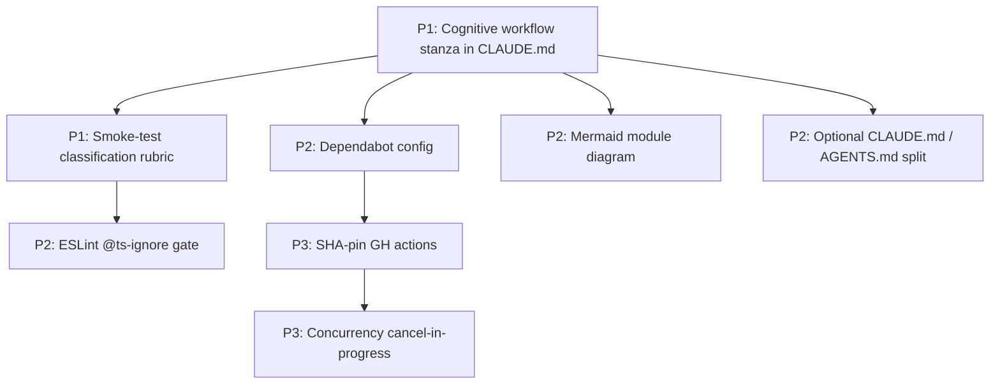

# Cross-Project Comparison: Gemma Code vs. free-claude-code

**Version**: v0.5.0
**Generated**: 2026-04-24T00:00:00Z
**Analyzer**: Claude Code -- compare-project command
**External Source**: https://github.com/Alishahryar1/free-claude-code
**Source Type**: Repository

---

## Section 1: Executive Summary

free-claude-code is a Python 3.14 / FastAPI proxy that translates Claude Code's Anthropic protocol to free or cheap LLM backends (NVIDIA NIM, OpenRouter, DeepSeek, LM Studio, llama.cpp). Gemma Code is a VS Code extension that calls Ollama directly. The two projects share an audience (developers who want Claude-style agentic coding without paying Anthropic) but solve the problem at different layers. The comparison surfaces ~12 adoption candidates, of which only 4 are P0/P1; most of free-claude-code's surface area (Discord/Telegram bots, voice transcription, multi-provider proxying) does not align with Gemma Code's offline-first, single-runtime thesis. Recommendation: **selectively adopt** a small number of CI/code-quality patterns and a CLAUDE.md cognitive-workflow stanza; preserve Gemma Code's significantly deeper memory, compaction, sub-agent, and security architecture as the differentiator.

## Section 2: Project Profiles

| Attribute | Gemma Code (current) | free-claude-code |
|-----------|----------------------|------------------|
| **Identity** | Local agentic VS Code extension | API translation proxy / middleware |
| **Form factor** | VS Code extension (TS) + optional MCP server + PyQt5 installer | FastAPI server + CLI entrypoint + Discord/Telegram bots |
| **Inference path** | Direct → Ollama @ localhost:11434 | Anthropic-protocol client → proxy → 5 backends |
| **Privacy stance** | Strictly offline; no network calls by default; opt-in OTLP | Cloud-capable (NIM, OpenRouter, DeepSeek) and local-capable (LM Studio, llama.cpp) |
| **Maturity** | v0.4.0, 14 P0 findings closed; 90 Vitest files / 1,168 cases | v2.0.0, MIT (2026); 68 deterministic + 35 smoke tests |
| **License** | MIT | MIT (Ali Khokhar, 2026) |
| **LOC scale** | ~90 src/*.ts files; multi-module TS | ~1,800 LOC across 7 Python modules |
| **Distribution** | VSIX + cross-platform installer | uv + pyproject.toml + entrypoints |
| **Audience** | Privacy-conscious individual devs in VS Code | Cost-conscious devs already using Claude Code CLI |

The two projects collide in motivation (free Claude-style coding) but diverge in form. Gemma Code reimplements the agent loop natively against a single open-weights model; free-claude-code keeps Anthropic's surface area intact and rotates the underlying model.

## Section 3: Technology Stack Comparison

| Layer | Gemma Code | free-claude-code | Notes |
|-------|------------|------------------|-------|
| Primary language | TypeScript 5.4 | Python 3.14 | Different runtimes |
| HTTP layer | Direct fetch to Ollama (`src/llm/OllamaHttp.ts`) | FastAPI 0.136 + Uvicorn + httpx | Server vs. embedded |
| Storage | better-sqlite3 12.x (chat, memory, traces, graph) | None — stateless proxy | Gemma far more stateful |
| Test runner | Vitest 1.x + MSW | pytest 9.x + xdist + pytest-asyncio | Both modern |
| Lint | ESLint 8 + @typescript-eslint | Ruff 0.15 (lint + format + isort + bugbear + perf) | Ruff is broader-scope |
| Type checker | tsc strict | ty (strict 3.14) | Both gate CI |
| Validation | Zod 3.23 | Pydantic 2.13 | Equivalent role |
| Package manager | npm | uv (Astral) | uv enforces lockfile |
| Build artifact | VSIX + .exe/.dmg/.AppImage installers | Python wheel + entrypoint scripts | Different distribution |
| MCP support | Client + Server (`src/mcp/`) | Not present | External-only feature for Gemma |
| Streaming | SSE-style chunks via `OllamaClient` | SSE primitives in `core/anthropic/sse.py` | Equivalent |
| Tool format | Gemma 4 native (`<|tool_call>...<tool_call|>`) + heuristic JSON parser | Heuristic text-output parser for tool calls | Both handle tool-format drift |
| Voice input | Not supported | Whisper local + Riva via NIM | External-only; out of scope |
| Messaging | None | Discord.py + python-telegram-bot | External-only; out of scope |

## Section 4: AI Assistant Configuration Comparison

| Aspect | Gemma Code | free-claude-code |
|--------|------------|------------------|
| `CLAUDE.md` | Present at repo root: tech stack, project layout, communication style, critical rules, output minimization | Present (105 lines) — duplicate of AGENTS.md |
| `AGENTS.md` | Absent | Present (88 lines) — canonical agentic directive: ANALYZE → PLAN → EXECUTE → VERIFY → SPECIFICITY → PROPAGATION cognitive workflow |
| `PLAN.md` | Absent at root (architecture in `ARCHITECTURE.md`) | Present (88 lines) — module dependency direction + smoke coverage policy |
| `.claude/` directory | Absent (no project-local skills, commands, hooks, settings) | Absent |
| `.cursor/`, Copilot config | Absent | Absent |
| Cognitive workflow stanza | Implicit ("Verify work before marking complete", "Find root causes; no temporary fixes") in `CLAUDE.md` | Explicit 6-step phase-name stanza in `AGENTS.md` |
| Settings hooks | None | None |

Both projects are agent-aware but neither uses a `.claude/` settings folder. free-claude-code's main innovation here is the explicit `AGENTS.md` workflow vocabulary, which is more prescriptive than Gemma's `CLAUDE.md` rules.

## Section 5: Skills and Capabilities Gap Analysis

### 5a. Present in External, Missing in Current

| Item | External evidence | Adoption signal |
|------|-------------------|-----------------|
| Multi-provider abstraction (`BaseProvider` ABC, `providers/registry.py`) | `providers/base.py`, `providers/nvidia_nim/`, `providers/open_router/`, `providers/deepseek/` | Conflicts with Gemma's offline-first thesis; **skip** unless adding optional fallback profile |
| OpenAI ↔ Anthropic protocol translator (`core/anthropic/conversion.py`) | `core/anthropic/conversion.py`, `core/anthropic/sse.py` | Not relevant; Gemma speaks Gemma 4 native format |
| Cognitive-workflow stanza (`AGENTS.md` ANALYZE → PLAN → EXECUTE → VERIFY) | `AGENTS.md` lines 21-66 | **P1**: a short prescriptive workflow stanza in `CLAUDE.md` would tighten agent discipline |
| Smoke-test classification policy (skip on `missing_env`/`upstream_unavailable`, fail on `product_failure`/`harness_bug`) | `PLAN.md`, `smoke/conftest.py` | **P1**: tests/integration currently lack a uniform skip/fail rubric |
| Trivial-request optimization (intercept title generation, prefix detection, quota probes locally) | `api/optimization_handlers.py`, `api/detection.py` | Mostly N/A; Gemma is already local. Internal analog: short prompts could skip thinking-mode |
| `claude-pick` fzf model selector | `claude-pick` (5645-byte shell script) | Gemma already has `/model <name>` slash command — **already implemented** |
| Discord/Telegram remote-control bot | `messaging/platforms/`, `messaging/rendering/` | Out of scope (offline-first); **skip** |
| Voice transcription (Whisper local + Riva via NIM) | `pyproject.toml` voice deps; `messaging/` voice handlers | Out of scope; **skip** |
| Dependabot for weekly auto-updates of toolchain | `.github/dependabot.yml` | **P2**: Gemma uses `npm audit` in CI but no Dependabot config |
| "No `# type: ignore`" CI gate (rejects suppressions) | `.github/workflows/tests.yml` "Fail on type ignore" step | **P2** (TypeScript analog): block `// @ts-ignore` and `// @ts-expect-error` without an attached issue link |
| Architecture diagram in `PLAN.md` (mermaid module-dependency graph) | `PLAN.md` mermaid block | **P2**: Gemma has `ARCHITECTURE.md` text but no mermaid module-dependency graph |
| Action-pinned CI checkouts (commit SHA, not tag) | `.github/workflows/tests.yml` | **P3**: supply-chain hardening for Gemma's 5 workflows |

### 5b. Present in Current, Missing in External (strengths to preserve)

| Capability | Where in Gemma Code |
|------------|---------------------|
| 4-layer memory system (Working/Episodic/Semantic/Graph) | `src/storage/WorkingMemory.ts`, `EpisodicMemory.ts`, `MemoryStore.ts`, `GraphMemory.ts` |
| 6-stage compaction pipeline | `src/chat/CompactionStrategy.ts` |
| Sub-agents (verification/research/planning) with scoped tools | `src/agents/SubAgentManager.ts` |
| Plan/execute orchestration with DAG + Reflexion | `src/orchestration/Orchestrator.ts`, `DAGExecutor.ts`, `ReflexionEngine.ts` |
| Hardware-tier auto-detection | `src/config/GpuDetector.ts`, `HardwareTier.ts` |
| MCP client and MCP server | `src/mcp/McpClient.ts`, `McpServer.ts`, `McpManager.ts` |
| Golden-task evaluation framework | `tests/golden/` (Python pytest harness + 24 YAML tasks + baselines) |
| Comprehensive security architecture | SSRF (`src/utils/ssrf.ts`), path guard, shell allowlist, secret denylist, ReDoS defense, CSP, DOMPurify |
| Persistent SQLite stores with chmod 0o600 | `src/storage/dbPermissions.ts` |
| OTLP optional trace export | `src/observability/OtlpExporter.ts` |
| Cross-platform PyQt5 installer | `scripts/installer/pyqt/` |

### 5c. Present in Both, Quality Comparison

| Capability | Gemma Code | free-claude-code | Verdict |
|------------|------------|------------------|---------|
| Tool-call format parsing | `src/tools/Gemma4ToolFormat.ts`, `ToolCallParser.ts` (native + heuristic JSON) | `core/anthropic/tools.py` (heuristic text→Anthropic) | Both project-specific; equivalent quality |
| Streaming primitives | `OllamaHttp.ts`, `StreamingPipeline.ts` | `core/anthropic/sse.py` | Equivalent; Gemma is more integrated |
| Thinking-mode token handling | `src/chat/PromptBuilder.ts` (Gemma 4 `<|think|>`) | `core/anthropic/thinking.py` (`<think>` → Anthropic blocks) | Both handle reasoning tokens; Gemma is native |
| Test stratification | unit / integration / e2e / golden / benchmarks | unit / contracts / smoke (live) | Gemma's pyramid is more explicit; free-claude-code's smoke discipline is more articulated |
| CI gate | lint + test + build + audit + nightly + golden | format + lint + type + tests + no-type-ignore | Comparable; free-claude-code is stricter on suppressions |

## Section 6: Commands and Automation Comparison

### 6a. Commands Gap

| Command surface | Gemma Code | free-claude-code |
|-----------------|------------|------------------|
| Slash commands | 18 (e.g. `/help`, `/plan`, `/compact`, `/memory`, `/mcp`, `/research`, `/verify`, `/commit`, `/review-pr`, `/generate-readme`, `/generate-tests`) per `README.md` lines 138-158 | None |
| npm/uv scripts | 10 npm scripts (build, test, lint, package, bench, generate:golden-tasks) | 5 uv-run commands (format, lint, type, pytest) + 2 entrypoints (`free-claude-code`, `fcc-init`) |
| Interactive helpers | None at repo level | `claude-pick` (fzf model picker) |

Gemma Code's slash-command surface is far richer; no adoption gap on the command axis.

### 6b. CI/CD and Hooks Gap

| CI element | Gemma Code | free-claude-code | Adoption candidate |
|------------|------------|------------------|--------------------|
| Workflows | 5 (ci, nightly, golden-tasks, release, installer-smoke) | 1 (tests, 15-min timeout) | Gemma is broader |
| Dependabot | Not configured | Weekly for uv + actions | **P2** add `.github/dependabot.yml` |
| Action SHA pinning | Tag-based | Commit-SHA pinned | **P3** harden supply chain |
| "No suppression" gate | Not present | `# type: ignore` rejected | **P2** block `// @ts-ignore` |
| pre-commit/husky hooks | None | None | Neither has hooks |
| Concurrency control | Not visible | `concurrency: cancel-in-progress` | **P3** cancel superseded runs |

## Section 7: Documentation and Developer Experience Comparison

| Item | Gemma Code | free-claude-code |
|------|------------|------------------|
| README quality | Comprehensive; install, slash commands, troubleshooting, dev | 635 lines; provider tables, voice setup, extension guides |
| Architecture doc | `ARCHITECTURE.md` + per-version `docs/v0.X.0/architecture.md` | `PLAN.md` (88 lines) with mermaid module graph |
| ADRs | `docs/adr/` (1 ADR + template + index) | Absent |
| CHANGELOG | `CHANGELOG.md` (Keep-a-Changelog) | Absent |
| Security policy | `SECURITY.md` (detailed: SSRF, path guard, shell, secrets, MCP, CSP) | Absent |
| Contribution guide | `CONTRIBUTING.md` | Absent at repo root |
| Versioned doc tree | `docs/v0.1.0/` through `docs/v0.4.0/` (architecture, implementation plans, dev history, security audits, performance benchmarks, golden tasks) | None |
| One-command setup | `scripts/dev-setup.sh` / `scripts/dev-setup.ps1` | uv install + `cp .env.example .env` |
| Devcontainer / Docker | None | Author explicitly rejects Docker PRs |
| Env-var reference | 30+ extension settings in `package.json` `contributes.configuration` | `.env.example` (97 lines) |

Gemma Code is significantly stronger on documentation discipline (versioned trees, ADRs, security policy, changelog). free-claude-code is stronger on a single-file env-var reference and module-dependency diagram.

## Section 8: Testing and Security Posture Comparison

| Aspect | Gemma Code | free-claude-code |
|--------|------------|------------------|
| Unit/integration/e2e split | 78/6/6 (86.7/6.7/6.7%) per `docs/v0.4.0/test-pyramid.md` | 68 deterministic + 35 smoke files |
| Live-vs-deterministic policy | Implicit (skip when Ollama unreachable) | Explicit `FCC_LIVE_SMOKE=1` opt-in + skip classes (`missing_env`, `upstream_unavailable`) |
| Coverage tool | `@vitest/coverage-v8` | pytest-cov (no enforced threshold) |
| Coverage threshold | Target 80% per `CONTRIBUTING.md` | Not enforced |
| Benchmarks | Yes (`tests/benchmarks/`) | None |
| Golden-task framework | Yes (`tests/golden/`) | None |
| Mocking | MSW for HTTP | pytest fixtures + httpx mocks |
| Security policy | `SECURITY.md` (full architecture) | None |
| SAST scanning | None visible (relies on ESLint + npm audit) | None |
| Dep auditing | `npm audit --production --audit-level=high` in CI | Dependabot |
| Action pinning | Tag-based | SHA pinned |

## Section 9: Structural and Architectural Differences

1. **Distribution model.** Gemma is a VS Code extension surfaced via Activity Bar webview; free-claude-code is a process-level proxy listening on `:8082`. The two projects do not target the same form factor and many free-claude-code patterns (FastAPI middleware, env-var injection, subprocess registry) do not translate.

2. **Provider topology.** Gemma is single-vendor by design (Ollama + Gemma 4). free-claude-code is multi-vendor by necessity (its value proposition is rotating among free tiers). Adopting free-claude-code's `BaseProvider` abstraction would invert Gemma's offline-first stance and is **not recommended**.

3. **Module-dependency hygiene.** free-claude-code's `PLAN.md` is unusually disciplined: explicit "no cross-provider imports" rule, neutral protocol layer (`core/anthropic/`), and a mermaid graph the author maintains by hand. Gemma has analogous separation (`src/llm/` is the only Ollama caller; `src/tools/` does not import from `src/panels/`) but does not document it.

4. **CLAUDE.md authoring style.** free-claude-code splits agent rules between `CLAUDE.md` (mirror) and `AGENTS.md` (canonical). Gemma keeps everything in one `CLAUDE.md`. Both work; free-claude-code's split has the advantage that non-Claude agents (Cursor, Copilot, etc.) can read the same `AGENTS.md`.

5. **Voice and remote-control surfaces.** free-claude-code's Discord/Telegram bots and voice transcription are deliberate scope expansions for "remote coding from a phone". Gemma is local to the editor and does not need them.

## Section 10: Adoption Plan

### P0 (Immediate)

_None. The most impactful patterns from free-claude-code (CI suppression gate, Dependabot, cognitive-workflow stanza) are P1/P2 quality-of-life improvements, not blockers._

### P1 (Short-term)

| What | Source | Target | Effort | Dependencies | Risk |
|------|--------|--------|--------|--------------|------|
| Add a "Cognitive workflow" stanza (ANALYZE → PLAN → EXECUTE → VERIFY) to `CLAUDE.md` | `AGENTS.md` lines 21-66 | `CLAUDE.md` (after Critical Rules) | Low | None | Low — additive guidance for the agent |
| Adopt smoke-test classification rubric (skip on `missing_env`/`upstream_unavailable`, fail on `product_failure`/`harness_bug`) | `PLAN.md` smoke coverage policy + `smoke/conftest.py` | `tests/integration/` test docstrings + `docs/v0.4.0/test-pyramid.md` addendum | Medium | None | Low — formalizes existing skip behavior |

### P2 (Medium-term)

| What | Source | Target | Effort | Dependencies | Risk |
|------|--------|--------|--------|--------------|------|
| Add Dependabot config for weekly toolchain updates | `.github/dependabot.yml` | `.github/dependabot.yml` (new) | Low | None | Low |
| Block `// @ts-ignore` / `// @ts-expect-error` without linked-issue suppression | `.github/workflows/tests.yml` "Fail on type ignore" step | `.github/workflows/ci.yml` add a grep gate; or ESLint rule `@typescript-eslint/ban-ts-comment` | Low | None | Medium — may flag legitimate suppressions; require linked issue |
| Add a mermaid module-dependency diagram to `ARCHITECTURE.md` | `PLAN.md` mermaid block | `ARCHITECTURE.md` after current diagram | Low | None | Low |
| Split `CLAUDE.md` into `CLAUDE.md` (project rules) and `AGENTS.md` (agent-agnostic directive) | free-claude-code's CLAUDE/AGENTS split | New `AGENTS.md`; trim `CLAUDE.md` to a pointer | Medium | Cognitive-workflow stanza (P1) | Medium — duplicates rules across files; only worth it if the project starts being used with non-Claude agents |

### P3 (Backlog / If easy)

| What | Source | Target | Effort | Dependencies | Risk |
|------|--------|--------|--------|--------------|------|
| Pin GitHub Actions to commit SHAs instead of tags | `.github/workflows/tests.yml` | All 5 workflows in `.github/workflows/` | Medium | None | Low — tooling support via Renovate/Dependabot |
| Add `concurrency: cancel-in-progress` to long workflows | `.github/workflows/tests.yml` | `nightly.yml`, `golden-tasks.yml` | Low | None | Low |

## Section 11: Implementation Sequence

Recommended order: start with the cognitive-workflow stanza (zero-risk, immediate agent benefit), then add the smoke-test rubric and Dependabot in parallel; defer the CLAUDE/AGENTS split until a non-Claude agent is actually being used against the repo.

## Section 12: Risks and Considerations

1. **Do not adopt the multi-provider proxy.** free-claude-code's `BaseProvider` ABC + `providers/` directory is its core thesis; importing it into Gemma Code would invalidate the offline-first promise documented in `README.md` and `SECURITY.md`. If a fallback path is ever desired, it should be an opt-in provider profile, not a default.

2. **Do not adopt Discord/Telegram messaging.** Out of scope. The maintenance burden (bot tokens, webhook security, Discord/Telegram API drift) is large and the audience overlap with VS Code-bound users is small.

3. **Do not adopt voice transcription.** Whisper-local introduces a 2GB+ dependency (torch + transformers + librosa); Riva via NIM is cloud-only. Both conflict with the offline-first installer footprint.

4. **The `// @ts-ignore` gate has a sharp edge.** Some legitimate suppressions exist (e.g. wrapping untyped third-party APIs). Implement as ESLint `@typescript-eslint/ban-ts-comment` with `"ts-ignore": "allow-with-description"` so suppressions still pass but require a justification comment.

5. **CLAUDE.md / AGENTS.md split adds maintenance overhead.** If only Claude is used, keeping a single file is simpler. The split is only worth doing once a second agent (Cursor, Copilot, Gemini CLI) is actually consuming the directives.

6. **Gemma Code's testing pyramid is already stronger.** The smoke-test classification rubric is worth borrowing as a documentation pattern, but the underlying test discipline is not behind free-claude-code's.

---
