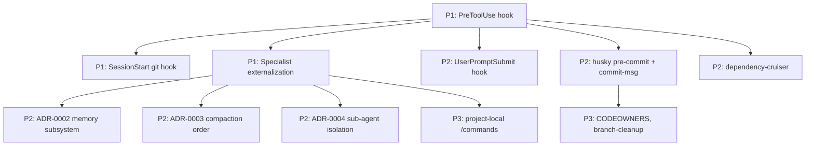

# Cross-Project Comparison: Gemma Code vs. Routa

**Version**: v0.5.0
**Generated**: 2026-04-24T00:00:00Z
**Analyzer**: Claude Code -- compare-project command
**External Source**: https://github.com/phodal/routa
**Source Type**: Repository

---

## Section 1: Executive Summary

Routa (v0.18.0, by Phodal Huang) is a workspace-first multi-agent coordination platform. It treats a Kanban board as the planning surface and event bus, runs specialist roles (ROUTA / CRAFTER / GATE / DEVELOPER) externalized as Markdown+YAML, normalizes provider differences via an ACP (Agent Client Protocol) layer, and gates progression on evidence collected through fitness checks (Entrix). Routa ships dual-backend semantic parity (Next.js web + Tauri/Axum desktop) governed by a 203 KB `api-contract.yaml`, 16 GitHub workflows, 7 ADRs, 249 unit tests, and a hardened `.claude/settings.local.json` with PreToolUse / SessionStart / UserPromptSubmit hooks. Comparison surfaces ~14 adoption candidates; the strongest are **specialist externalization for sub-agents**, **Claude Code harness hooks for tool/git/prompt validation**, and **ADR + dependency-cruiser discipline**. Recommendation: **selectively adopt** the externalization + hook patterns; do not import Routa's Kanban runtime (out of scope) or its dual-backend api-contract.yaml (Gemma is single-process).

## Section 2: Project Profiles

| Attribute | Gemma Code (current) | Routa |
|-----------|----------------------|-------|
| **Identity** | Local agentic VS Code extension (Gemma 4 / Ollama) | Multi-agent coordination platform with Kanban event bus |
| **Form factor** | Single-process VS Code extension + optional MCP server | Next.js web app + Tauri desktop + Axum/Rust backend + 11 Rust crates |
| **Maturity** | v0.4.0; 90 Vitest files, 1,168 cases, 5 GH workflows, 1 ADR | v0.18.0; 249 unit `.test.ts` files, 20+ Playwright E2E, 16 GH workflows, 7 ADRs |
| **Languages** | TypeScript (single) | TypeScript + Rust (dual) |
| **Persistence** | better-sqlite3 (chat, memory, traces, graph) | PostgreSQL (cloud) + SQLite (desktop), Drizzle ORM |
| **Audience** | Solo developer, privacy-first | Teams using AI agents for end-to-end delivery, governance-focused |
| **License** | MIT | MIT |
| **Author intent** | "Claude-Code-style workflow without external API calls" | "AI Coding's bottleneck is moving from 'can we write' to 'can we deliver' — Routa solves the latter" (`routa-desktop.md`) |

The two are different **kinds** of project. Gemma Code is an in-editor agent runtime; Routa is a delivery-orchestration platform. Their overlap is in the *agent runtime* concerns: how specialists are defined, how providers are normalized, how the harness is governed. That overlap is where the adoption candidates concentrate.

## Section 3: Technology Stack Comparison

| Layer | Gemma Code | Routa | Notes |
|-------|------------|-------|-------|
| Languages | TypeScript 5.4 | TypeScript + Rust | Routa's Rust crates handle local desktop server + fitness engine + harness monitor |
| Web framework | None (VS Code webview only) | Next.js 16.2 + React + Tailwind | Out of scope for Gemma |
| Desktop | VS Code extension host | Tauri shell with bundled Axum server | Different form factor |
| Backend HTTP | None | Axum (Rust) | N/A for Gemma |
| Database | better-sqlite3 12 | Postgres (cloud) + SQLite (desktop) via Drizzle ORM | Gemma's lone-SQLite is fine for single-user scope |
| Test runner | Vitest 1 + MSW | Vitest + Playwright + Cargo test | Routa adds E2E browser automation |
| Lint | ESLint 8 | ESLint + Cargo clippy | Equivalent |
| Linter for module structure | None | `dependency-cruiser.cjs` | **Adoption candidate** |
| Static analysis | None | `.semgrepignore` + Entrix fitness checks | **Adoption candidate** |
| Build system | tsc + vsce + PyQt5 installer | Next.js build + Cargo build + Tauri bundler + cross-env | Routa is heavier |
| Test categories | unit / integration / e2e / golden / benchmarks | unit / api-contract / E2E / fitness / smoke / characterization | Both rich |
| Storybook | None | Yes, with governance workflow | Out of scope |

## Section 4: AI Assistant Configuration Comparison

| Aspect | Gemma Code | Routa |
|--------|------------|-------|
| `CLAUDE.md` | Project root (rules, tech stack, communication style) | Project root (governance, baby-step commits, conventional commits) |
| `AGENTS.md` | Absent | Present — canonical multi-agent coordination guide, lane contracts, role reminders |
| `.claude/settings.json` | Absent | `.claude/settings.local.json` with PreToolUse / SessionStart / UserPromptSubmit hooks |
| Project-local skills | Absent | `.claude/skills/` for project-local agent skills |
| Specialist definitions | Hardcoded prompts in `src/agents/SubAgentPrompts.ts` | Externalized as Markdown+YAML in `resources/specialists/core/*.md` with priority chain (DB → user filesystem → bundled → hardcoded fallback) |
| Specialist loader | None (prompts compiled in) | `src/core/specialists/specialist-db-loader.ts` |
| Hooks: tool permission validation | None | `scripts/check-tool-permission.js` (PreToolUse → Bash/Write/Edit) |
| Hooks: prompt-policy validation | None | `scripts/check-prompt-policy.js` (UserPromptSubmit) |
| Hooks: git control-plane validation | None | `scripts/check-git-control-plane.js` (SessionStart) |

This is the highest-signal section: Routa has a *production-grade Claude Code harness* with a reusable hook pattern and externalizable specialist roles. Gemma Code has comparable internal mechanisms (`SubAgentManager`, `GitSafetyNet`) but the harness layer is empty.

## Section 5: Skills and Capabilities Gap Analysis

### 5a. Present in External, Missing in Current

| Item | External evidence | Adoption signal |
|------|-------------------|-----------------|
| Externalized specialist roles (Markdown+YAML) | `resources/specialists/core/*.md`; loader at `src/core/specialists/specialist-db-loader.ts`; ADR-0005 | **P1**: Gemma's sub-agent prompts are hardcoded in `src/agents/SubAgentPrompts.ts`; externalizing as `assets/specialists/*.md` would let users tune role prompts without recompiling |
| `.claude/settings.local.json` PreToolUse hook to validate Bash/Write/Edit before execution | `.claude/settings.local.json` + `scripts/check-tool-permission.js` | **P1**: Gemma's `ConfirmationGate` and `ActionClassifier` operate inside the agent loop, not at the harness level. Adding a project-local hook that validates outgoing edits against `secretPathDenyExtra` and the workspace root would belt-and-suspenders the existing path guard |
| `.claude/settings.local.json` SessionStart hook to enforce git control-plane | `scripts/check-git-control-plane.js` | **P1**: Gemma's `GitSafetyNet.ts` creates checkpoints inside the agent; a SessionStart hook can also assert "branch != main", "no uncommitted changes" and block before the model is even loaded |
| `.claude/settings.local.json` UserPromptSubmit hook for prompt policy | `scripts/check-prompt-policy.js` | **P2**: useful for redacting / blocking secrets from outgoing prompts; not currently a problem for Gemma but a clean integration point |
| ADR discipline (7 ADRs covering dual-backend parity, ACP, workspace scope, Kanban, externalization, orchestration shell, transition policies) | `docs/adr/0001-` through `0007-` | **P2**: Gemma has 1 ADR. Adding ADRs for memory subsystem, compaction strategy, sub-agent isolation, and tool permission tiers would close documentation debt |
| `dependency-cruiser.cjs` for module-boundary validation | `.dependency-cruiser.cjs` | **P2**: Gemma has implicit boundaries (e.g. `src/llm/` is the only Ollama caller). Codifying as dependency-cruiser rules would catch regressions |
| Husky pre-commit / pre-push / commit-msg hooks | `.husky/` | **P2**: Gemma uses `npm run lint` manually; pre-commit hook would prevent mis-formatted commits. Note: project requires ASCII-only commit messages — perfect candidate for a `commit-msg` hook |
| Conventional Commits enforcement | `.husky/commit-msg` + `commitlint` | **P3**: not strictly necessary; combine with the ASCII-only rule if adopted |
| Storybook governance workflow | `.github/workflows/storybook-governance.yml` | N/A (no UI components beyond the webview) |
| Issue-enricher / issue-garbage-collector workflows | `.github/workflows/issue-enricher.yml`, `issue-garbage-collector.yml` | **P3**: useful once issue volume grows; defer |
| `ci-red-fixer.yml` automated CI failure diagnostics | `.github/workflows/ci-red-fixer.yml` | **P3**: experimental; observe before adopting |
| Per-tier fitness check engine (`fast` < 30s, `normal` < 5min, `complete`) | `crates/entrix/`, `docs/fitness/README.md` | **P3**: heavy infrastructure; Gemma's existing CI tier (fast unit, nightly integration, weekly installer) already mirrors this |
| Page-snapshot validation (visual regression) | `.github/workflows/page-snapshot-validation.yml` | N/A — Gemma webview has minimal visual surface |
| Dual-backend `api-contract.yaml` | `api-contract.yaml` (203 KB OpenAPI) | N/A — single-process extension |
| Local issue tracking with YAML frontmatter (`docs/issues/`) | `docs/issues/` | **P3**: pattern is interesting but mirrors GitHub Issues |
| Characterization tests on long files before refactor | `docs/REFACTOR.md`, `tests/api-contract/` | **P3**: pattern that could enrich Gemma's pre-refactor discipline |
| Workspace-first scope (sessions, codebases, worktrees, memories all under workspace) | ADR-0003 | **already implemented** — Gemma is workspace-scoped via VS Code workspace state |
| Provider-normalization layer (ACP) | ADR-0002, `src/core/acp/provider-registry.ts` | **already partial** — Gemma has `src/llm/` as a vendor-neutral port; only Ollama is implemented today |

### 5b. Present in Current, Missing in External (strengths to preserve)

| Capability | Where in Gemma Code | Why it matters |
|------------|---------------------|----------------|
| Local Gemma 4 inference via Ollama | `src/llm/OllamaClient.ts` | Routa is provider-agnostic but doesn't ship a local model loop |
| 4-layer memory (Working/Episodic/Semantic/Graph) | `src/storage/` | Routa has session traces but no semantic/graph memory |
| 6-stage compaction pipeline | `src/chat/CompactionStrategy.ts` | Routa relies on session traces; no compaction strategy comparable |
| MCP client + server | `src/mcp/` | Routa speaks ACP, not MCP — different protocol |
| GPU detection + hardware-tier configs | `src/config/GpuDetector.ts`, `HardwareTier.ts` | Routa is platform-agnostic but doesn't tier limits by hardware |
| SSRF DNS validation | `src/utils/ssrf.ts` | Routa has private security policy but no comparable SSRF guard documented |
| Secret-path denylist + `allow_secrets: true` confirmation | `src/tools/handlers/secretPaths.ts` | Routa has tool-permission hooks but no secret-path category |
| ReDoS defense in grep tool | `src/tools/handlers/filesystem.ts` | Specific to Gemma's local-grep capability |
| Webview CSP + DOMPurify | `src/panels/GemmaCodePanel.ts`, `src/utils/MarkdownRenderer.ts` | Routa's UI is Next.js with React safety; not directly comparable |
| Cross-platform PyQt5 installer | `scripts/installer/pyqt/` | Routa ships Tauri bundles; Gemma's installer covers the model + Ollama too |
| Golden-task framework with Python pytest harness | `tests/golden/` | Routa has fitness/parity tests; no equivalent task-level golden eval |

### 5c. Present in Both, Quality Comparison

| Capability | Gemma Code | Routa | Verdict |
|------------|------------|-------|---------|
| Workspace scope | VS Code workspace via `workspaceState` | Workspace as top-level domain entity | Equivalent for single-user; Routa's is better for multi-workspace teams |
| Sub-agent / specialist isolation | `SubAgentManager` with scoped tools | ROUTA/CRAFTER/GATE/DEVELOPER role boundaries (e.g. ROUTA never codes) | Routa has a stricter, externally-articulated role contract; Gemma's is implicit in `SubAgentManager` |
| Provider abstraction | `src/llm/` port (1 implementation: Ollama) | ACP adapter pattern (Claude Code SDK + Docker) | Equivalent design; Routa is exercised across more providers |
| Trace recording | `src/observability/TraceStore.ts` + OTLP export | `routa-monitor` Rust crate; harness-monitor signals | Equivalent; Gemma is in-process, Routa is observable across runtimes |
| Hooks and gates | Internal: `ConfirmationGate`, `ActionClassifier`, `LoopDetector`, `BudgetEnforcer`, `GitSafetyNet` | External: `.claude/settings.local.json` PreToolUse/SessionStart/UserPromptSubmit | Different layers — internal gating is in agent loop, harness gating is at Claude Code level. Both are valuable; Gemma is missing the harness layer |
| ADR practice | 1 ADR (`docs/adr/0001-python-backend-disposition.md`) + template | 7 ADRs in `docs/adr/` | Routa is materially ahead |
| Conventional commits / commit-msg discipline | Project requires ASCII-only commits (`CLAUDE.md`); no automated enforcement | `.husky/commit-msg` + commitlint enforces conventional commits | Routa enforces; Gemma documents only |

## Section 6: Commands and Automation Comparison

### 6a. Commands Gap

| Command surface | Gemma Code | Routa | Adoption signal |
|-----------------|------------|-------|-----------------|
| Slash commands (in-extension) | 18 (per `README.md`) | None at extension level | Gemma is richer in-context |
| Project-local Claude Code commands (`.claude/commands/`) | None | Some agent skills under `.agents/skills/` and `.claude/commands/` | **P3** — could expose project-specific automation as Claude Code commands |
| npm scripts | 10 (build, test, lint, package, bench, generate:golden-tasks) | 30+ (api:test:nextjs, db:migrate, release:*, db:studio, lint:css, harness inspect) | Routa is broader; most are out of scope |
| Rust CLI commands | None | `cargo run -p routa-cli -- entrix run --tier fast\|normal\|complete`, `fitness fluency`, `harness evolve` | Out of scope (no Rust components) |

### 6b. CI/CD and Hooks Gap

| CI element | Gemma Code | Routa | Adoption candidate |
|------------|------------|-------|--------------------|
| Number of workflows | 5 | 16 | Routa overbuilt for Gemma's scope |
| Pre-commit hooks | None | `.husky/pre-commit` (lint, format) | **P2** add husky for lint-on-commit |
| Pre-push hooks | None | `.husky/pre-push` (additional validation) | **P3** |
| Commit-msg hook | None | `.husky/commit-msg` (conventional commits) | **P2** — combine with ASCII-only rule |
| Prepare-commit-msg hook | None | `.husky/prepare-commit-msg` (co-author template) | **P3** — Gemma forbids co-author lines, this hook would conflict |
| `.claude/settings.local.json` hooks | None | PreToolUse / SessionStart / UserPromptSubmit | **P1** add tool-permission, git-state, and prompt-policy checks |
| Codeowners | Not visible | Yes (`.github/CODEOWNERS`) | **P3** — single-author repo, low priority |
| Branch cleanup | None | `.github/workflows/branch-cleanup.yml` | **P3** |
| Issue enrichment | None | `issue-enricher.yml`, `issue-garbage-collector.yml` | **P3** |

## Section 7: Documentation and Developer Experience Comparison

| Item | Gemma Code | Routa |
|------|------------|-------|
| README quality | Comprehensive | Comprehensive (English + Chinese) |
| Architecture doc | `ARCHITECTURE.md` + `docs/v0.X.0/architecture.md` | `docs/ARCHITECTURE.md` (canonical topology) |
| ADRs | 1 (`docs/adr/0001-python-backend-disposition.md`) | 7 (dual-backend parity, ACP, workspace scope, Kanban automation, specialist externalization, orchestration shell, transition policies) |
| Refactor playbook | None | `docs/REFACTOR.md` (long-file refactor guide) |
| Contribution guide | `CONTRIBUTING.md` | `CONTRIBUTING.md` |
| Code-of-conduct | Not visible | `CODE_OF_CONDUCT.md` |
| Security policy | `SECURITY.md` (detailed: SSRF, path guard, shell, secrets, MCP, CSP) | `SECURITY.md` (private vulnerability reporting) |
| Coding-style guide | Implicit in `CLAUDE.md` | `docs/coding-style.md` (Rust + TS + frontend) |
| Versioned doc tree | Yes (`v0.1.0` → `v0.4.0`) | No (`CHANGELOG.md` only) |
| Issue records | None | `docs/issues/` (YAML frontmatter, mirrors GitHub) |
| Release checklist | `docs/v0.3.0/release-checklist.md` | `docs/release-guide.md` + `RELEASE_CHECKLIST.md` |

## Section 8: Testing and Security Posture Comparison

| Aspect | Gemma Code | Routa |
|--------|------------|-------|
| Unit test files | 78 Vitest | 249 Vitest (across `src/`, `tests/`, `crates/`) |
| Integration tests | 6 (config-reload, ollama-client, prompt-composition, installer, safety) | API-contract tests (`tests/api-contract/`) for dual-backend parity |
| E2E tests | 6 | 20+ Playwright specs + Tauri smoke |
| Benchmarks | Yes (`tests/benchmarks/`) | Entrix tier checks (`fast` / `normal` / `complete`) |
| Golden tasks | Yes (`tests/golden/` + 24 YAML tasks + baselines) | None analogous |
| Mocking | MSW | Vitest mocks; Playwright fixtures |
| Coverage gate | Target 80% per `CONTRIBUTING.md` | Not enforced; Entrix uses tier-based fitness instead |
| Static analysis | None | `.semgrepignore` + Entrix |
| Module-boundary validation | None | `.dependency-cruiser.cjs` |
| Security scanning | `npm audit --production` | Default GitHub Dependabot (implied via `.github/`) |
| Secret reporting | `SECURITY.md` (public) | `SECURITY.md` (private channel) |

## Section 9: Structural and Architectural Differences

1. **Process topology.** Gemma is a single VS Code extension process. Routa is a 4-process system (web SSR + browser + desktop shell + Rust backend) with a 203 KB `api-contract.yaml` enforcing parity. Almost no Routa infrastructure (Drizzle migrations, Tauri bundling, Axum HTTP, Storybook governance) translates.

2. **Specialist boundary contract.** Routa explicitly forbids ROUTA from coding, GATE from implementing, and CRAFTER from refactoring outside scope. These rules are enforced via system prompts loaded from `resources/specialists/`. Gemma's `SubAgentManager` has scoped tools (research has no write tools, verification has no delete tools) but the role contract is implicit and inside compiled code. **This is the single most adoptable pattern.**

3. **Harness vs. agent boundary.** Routa puts validation at the harness layer (Claude Code hooks fire before tools run), while Gemma puts it inside the agent loop (`ConfirmationGate`, `ActionClassifier`). Belt-and-suspenders adoption is cheap and aligns with defense-in-depth.

4. **ADR culture.** Routa records decisions as soon as they cross 50 lines of explanation. Gemma has 1 ADR. The cost of one ADR is one Markdown file; the value compounds.

5. **Issue-as-document pattern.** Routa keeps `docs/issues/*.md` with YAML frontmatter mirroring GitHub Issues. This works for a project that wants traceable post-mortems but adds a write burden. Defer.

6. **Conventional commits + co-author template.** Routa enforces conventional commits and *requires* a co-author template. Gemma's `CLAUDE.md` *forbids* `Co-Authored-By` lines, so the prepare-commit-msg hook from Routa is a direct conflict and **must not be adopted**.

## Section 10: Adoption Plan

### P0 (Immediate)

_None. The most impactful adoptions (specialist externalization, harness hooks) are P1 because each takes more than a half-day of work and benefits from being designed against the existing `SubAgentManager` and `ConfirmationGate`._

### P1 (Short-term)

| What | Source | Target | Effort | Dependencies | Risk |
|------|--------|--------|--------|--------------|------|
| Externalize sub-agent specialist prompts as `assets/specialists/*.md` with frontmatter (role, modelTier, systemPrompt, roleReminder); load via `src/agents/SpecialistLoader.ts` with priority chain (workspace override → bundled → hardcoded fallback) | `resources/specialists/core/*.md`; `src/core/specialists/specialist-db-loader.ts`; ADR-0005 | New `assets/specialists/`; new `src/agents/SpecialistLoader.ts`; refactor `src/agents/SubAgentPrompts.ts` | Medium (1-2 days) | None | Medium — must keep behavior identical for hardcoded fallback path; add unit test for loader priority chain |
| Add `.claude/settings.local.json` PreToolUse hook validating Bash/Write/Edit against secret-path denylist and workspace root | `.claude/settings.local.json`; `scripts/check-tool-permission.js` | New `.claude/settings.local.json`; new `scripts/hooks/check-tool-permission.mjs` | Low (half-day) | None | Low — additive defense in depth; existing `pathGuard.ts` and `secretPaths.ts` already encode the rules to mirror |
| Add `.claude/settings.local.json` SessionStart hook asserting branch != main and no uncommitted changes | `scripts/check-git-control-plane.js` | New `scripts/hooks/check-git-control-plane.mjs` | Low (half-day) | None | Low — matches existing `GitSafetyNet` policy |

### P2 (Medium-term)

| What | Source | Target | Effort | Dependencies | Risk |
|------|--------|--------|--------|--------------|------|
| Add husky pre-commit hook running `npm run lint` and an ASCII-only commit-msg hook | `.husky/pre-commit`, `.husky/commit-msg` | New `.husky/` directory | Low | None | Low — must allow `--no-verify` escape for hot-fixes; document in `CONTRIBUTING.md` |
| Add `dependency-cruiser` config codifying `src/llm/` as the only Ollama caller, `src/tools/` cannot import from `src/panels/`, etc. | `.dependency-cruiser.cjs` | New `configs/dependency-cruiser.cjs`; npm script `lint:deps` | Medium | None | Medium — initial baseline may flag legitimate imports; ratchet over time |
| Expand ADR catalog: ADR-0002 (memory subsystem layering), ADR-0003 (compaction strategy ordering), ADR-0004 (sub-agent isolation contract), ADR-0005 (tool permission tiers) | `docs/adr/0002-` through `0007-` (Routa) | `docs/adr/` | Medium (one ADR per session) | None | Low — pure documentation work |
| Add UserPromptSubmit hook for prompt-policy validation (e.g. block prompts containing API keys, redact common secret patterns) | `scripts/check-prompt-policy.js` | New `scripts/hooks/check-prompt-policy.mjs` | Low | PreToolUse hook adoption (P1) | Low |
| Document module-dependency graph as a mermaid block in `ARCHITECTURE.md` | Routa's mermaid diagrams in `docs/ARCHITECTURE.md` | `ARCHITECTURE.md` | Low | None | Low |

### P3 (Backlog / If easy)

| What | Source | Target | Effort | Dependencies | Risk |
|------|--------|--------|--------|--------------|------|
| Add `.github/CODEOWNERS` | Routa CODEOWNERS | New file | Low | None | Low (but redundant for solo author today) |
| Branch-cleanup workflow for stale `dependabot/`/`copilot/`/`feature/` branches | `.github/workflows/branch-cleanup.yml` | New workflow | Low | Dependabot adoption | Low |
| Project-local `.claude/commands/` (e.g. `/dev-setup`, `/run-golden`, `/bench-context`) | Routa `.agents/skills/` and `.claude/commands/` | New `.claude/commands/` | Medium | None | Low |
| Issue-as-markdown pattern in `docs/issues/` | Routa `docs/issues/` | New `docs/issues/` | Medium | None | Medium — extra maintenance burden; only valuable once issue volume grows |
| Characterization-test playbook | `docs/REFACTOR.md` | New `docs/refactor-playbook.md` | Low | None | Low |

### Explicitly Not Recommended

| Item | Reason |
|------|--------|
| `.husky/prepare-commit-msg` co-author template | **Direct conflict** with `CLAUDE.md` rule "Never add `Co-Authored-By` lines" |
| Tauri / Axum / Drizzle / Postgres infrastructure | Out of scope (single-process VS Code extension) |
| `api-contract.yaml` and dual-backend parity tests | Out of scope (no second backend) |
| Storybook + governance workflow | Out of scope (no UI component library) |
| Entrix fitness engine (Rust crate) | Existing CI already provides tiered checks (fast/nightly/weekly); the Rust crate's complexity is not warranted |
| Page-snapshot visual regression | Webview's surface area is too small to justify |

## Section 11: Implementation Sequence

Phase 1 (week 1): two harness hooks + one specialist refactor.
Phase 2 (weeks 2-3): ADR backfill + husky + dependency-cruiser.
Phase 3 (later): if/when it becomes useful, add custom commands and issue-as-markdown.

## Section 12: Risks and Considerations

1. **Hook layering must not duplicate cost.** The PreToolUse hook validates the same rules as `pathGuard.ts` and `secretPaths.ts`. That is the point — defense in depth — but the hook **must short-circuit fast** (no SQLite open, no large file reads) so it doesn't add latency to every Bash/Edit call. Target < 50 ms per check.

2. **Specialist externalization needs a backwards-compatibility test.** The hardcoded `SubAgentPrompts.ts` is exercised by existing tests. Add a "specialist roundtrip" test that loads the bundled Markdown and asserts the assembled system prompt matches the legacy hardcoded string.

3. **Husky requires Node availability before lint runs.** This is fine on developer machines but can break in environments where someone clones the repo with `--depth 1` and an old npm. Document the workaround.

4. **dependency-cruiser baseline will be noisy.** Run with `--no-config` to capture the existing graph as the baseline before activating rules. Otherwise CI will turn red on day one.

5. **Do not adopt the conventional-commits + co-author hook combination.** `CLAUDE.md` explicitly forbids `Co-Authored-By` lines and AI attribution footers. The conventional-commits rule alone is fine; the co-author template is forbidden.

6. **Routa's specialist contract (ROUTA never codes) is stricter than Gemma's needs.** Adopt the *mechanism* (externalized prompts) but not necessarily the *contract* (ROUTA-style hierarchy). Gemma's existing tool-scoping (research = read-only, verification = no delete) is already adequate.

7. **ADR backfill is documentation work, not code.** Resist the urge to refactor while writing each ADR; the ADR records what *is*, not what *should be*.

---
