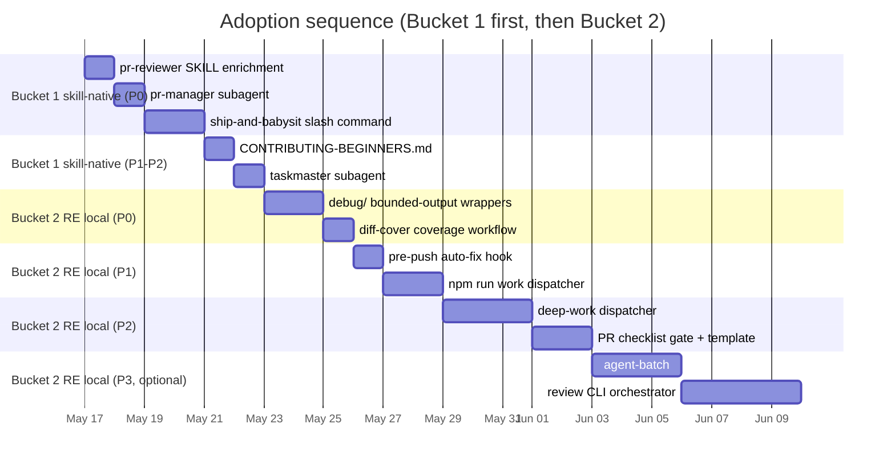

# Cross-Project Comparison: Gemma-Code vs. OpenHuman

**Version**: v0.8.0 (active doc cycle; product version 0.15.0)
**Generated**: 2026-05-16T00:00:00Z
**Analyzer**: Claude Code -- compare-project command
**External Source**: https://github.com/tinyhumansai/openhuman
**Source Type**: Repository

---

## Section 1: Executive Summary

OpenHuman and Gemma-Code occupy adjacent but distinct product spaces (a desktop personal-AI shell vs. a local-first VS Code coding extension), so the comparison surface is **not the product, but the AI-agent development workflow** wrapped around each codebase. Gemma-Code is a single-package TypeScript VS Code extension at v0.15.0 with a mature local-first architecture (19 ADRs, MCP support, FTS5+HNSW hybrid memory, deterministic linter, mutation testing). OpenHuman is a pnpm + Cargo monorepo at v0.53.49 powering a Tauri v2 desktop shell with 118+ OAuth integrations, voice, and a Python skills runtime; ~80% of its surface (mascot, Google Meet, 118 integrations, Remotion, Whisper TTS, sentry/prometheus telemetry) is **out-of-scope** for Gemma-Code. The high-signal adoption candidates cluster in **dev-loop ergonomics**: bounded-output test wrappers ([scripts/debug/](scripts/debug/)), CodeRabbit-style PR review agents ([.claude/agents/pr-reviewer.md](.claude/agents/pr-reviewer.md), [pr-manager.md](.claude/agents/pr-manager.md)), `ship-and-babysit` PR-monitoring slash command, `deep-work` issue->worktree->agent dispatcher, `diff-cover` 80% changed-lines coverage gate, and the auto-fix-then-retry pre-push hook pattern. Overall recommendation: **selectively adopt 7-10 dev-workflow patterns** by reverse-engineering them into local artifacts; reject all product-facing surfaces (integrations, voice, mascot, vendor telemetry) as scope-mismatched per the MCP Registry Policy.

---

## Section 2: Project Profiles

| Attribute | Gemma-Code | OpenHuman |
|---|---|---|
| **Identity** | Local agentic coding assistant (VS Code extension) | Personal AI desktop shell ("super-intelligence") |
| **Purpose** | Code with a local Ollama/LM Studio model, offline-first | Cross-domain personal agent: email, calendar, code, voice, meetings |
| **Maturity** | v0.15.0 (Phase 7 of v0.8.0 cycle) | v0.53.49 (Early Beta, public Trendshift presence) |
| **Scale** | Solo dev, ~28 src modules, 17 built-in skills | Multi-contributor org product, ~40 Rust domains, external skills registry |
| **License** | MIT | GNU GPLv3 |
| **Distribution** | VSIX (VS Code Marketplace) | DMG/EXE/Linux installers + Homebrew + deb + npm |
| **Primary stack** | TypeScript / Node 20+ / Vitest / ESLint / better-sqlite3 / MCP SDK | TypeScript + React 19 / Rust 1.93 / Tauri v2 / Vite / Vitest + WDIO + cargo / SQLite + Whisper + Sentry |
| **Architecture posture** | Single-process VS Code extension host | Tauri shell + in-process Rust core (HTTP/JSON-RPC on localhost) |
| **AI assistant config** | Lean: AGENTS.md + 17 skills in [src/skills/catalog/](src/skills/catalog/) + 3 `.claude/hooks/` | Rich: 14 agents in [.claude/agents/](.claude/agents/), 2 commands, mcp.json, memory.md, AGENTS.md + CLAUDE.md + CODEX_WORKPAD.md |

---

## Section 3: Technology Stack Comparison

| Layer | Gemma-Code | OpenHuman | Notes |
|---|---|---|---|
| Language(s) | TypeScript (strict) | TypeScript + Rust | OpenHuman's hybrid stack is product-driven (offline native binaries needed for voice / encryption / system tray). |
| Runtime | VS Code extension host (Node 20+) | Tauri v2 desktop with in-process Rust core on `127.0.0.1:<port>/rpc` | Different runtime classes; no cross-pollination viable. |
| Package mgr | npm (single package) | pnpm 10.10.0 workspace | Migration to pnpm not justified for a single-package repo. |
| Test runner | Vitest 1.x | Vitest 4.x + WDIO 9 (E2E) + `cargo test` | OpenHuman's WDIO layer drives a real Tauri window; not portable to a VS Code extension. |
| Lint | ESLint 8.57 (`--max-warnings=0`) | ESLint + Prettier + `cargo fmt` + `clippy` | Both strict; OpenHuman adds Prettier (Gemma-Code intentionally formats via ESLint only). |
| Dependency analysis | dependency-cruiser 16.10 | knip + cargo features | Different tooling, equivalent purpose. |
| Mutation testing | Stryker 8.7 + vitest-runner | None visible | Strength in Gemma-Code. |
| Native deps | better-sqlite3, hnswlib-node (optional), tiktoken | rusqlite (bundled), whisper-rs, cpal, image, prometheus, sentry | OpenHuman pulls heavy native deps (Whisper STT, audio capture). |
| Observability | Local TraceStore + opt-in OTLP exporter | Sentry 0.47 + tracing + prometheus 0.14 | OpenHuman defaults to vendor telemetry; Gemma-Code is offline-first by policy. |
| MCP | `@modelcontextprotocol/sdk@^1.29` (client + opt-in server) | `.claude/mcp.json` pointing at `openhuman.readme.io/mcp` only | Gemma-Code's MCP surface is materially deeper. |
| Coverage gate | 80% lines / 75% branches (global, vitest threshold) | **80% on changed lines** via `diff-cover` (Python) | OpenHuman's diff-cover gate is sharper feedback per-PR. |

---

## Section 4: AI Assistant Configuration Comparison

| Surface | Gemma-Code | OpenHuman |
|---|---|---|
| Tool-agnostic guide | [AGENTS.md](AGENTS.md) (11 KB, agent-agnostic by design) | [AGENTS.md](AGENTS.md) (46 KB; OpenHuman-specific) |
| Claude-specific guide | Intentionally **absent** | [CLAUDE.md](CLAUDE.md) (25 KB) |
| Codex log | None | [CODEX_WORKPAD.md](CODEX_WORKPAD.md) (5.8 KB chronological sweeps) |
| `.claude/` agents | None (uses [src/skills/catalog/](src/skills/catalog/) for built-in skills) | **14 subagents** under [.claude/agents/](.claude/agents/): `pr-reviewer.md`, `pr-manager.md`, `pr-manager-lite.md`, `taskmaster.md`, `architectobot.md`, `codecrusher.md`, `qualityqueen.md`, `designguru.md`, `dev-agent.md`, `test-agent.md`, `build-agent.md`, `deploy-agent.md`, `memory-keeper.md`, `mobile-agent.md` |
| `.claude/commands/` | None | 2: `ship-and-babysit.md` (commit -> push -> PR -> CI/CodeRabbit babysit loop), `ws-reset.md` (workspace reset) |
| `.claude/rules/` | None (rules live in [AGENTS.md](AGENTS.md) and global `~/.claude/rules/`) | Directory exists (README only) |
| `.claude/hooks/` | **3 hooks** (`format-bash-description.py`, `require-description.sh`, `git-guardrails.sh`) -- enforce shell-tool description discipline + destructive-git guardrails | None |
| `.claude/settings.json` | `.claude/settings.local.json` (gitignored, local AI config) | `.claude/settings.json` minimal: only `attribution.commit`/`attribution.pr` strings |
| `.claude/mcp.json` | None (MCP servers configured via VS Code settings UI) | Single `alphahuman` HTTP MCP server at `openhuman.readme.io/mcp` |
| `.codex/`, `.agents/` | None | `.codex/commands/ship-and-babysit.md` + `.agents/agents/pr-manager*.md` (cross-tool agent shims) |
| Skills system | 17 built-in [src/skills/catalog/<name>/SKILL.md](src/skills/catalog/), bundled with extension, harvested via `WorkflowDetector` (3rd recurrence) | **External registry** [tinyhumansai/openhuman-skills](https://github.com/tinyhumansai/openhuman-skills); Python subprocess + JSON-RPC; execution currently dormant (QuickJS runtime removed) |
| Hooks pattern | Pre-commit (lint, build), commit-msg (commitlint), pre-push absent | Pre-push hook with auto-fix-then-retry (`pnpm format:check` -> auto-fix -> re-run; same for lint; then `compile`, `rust:check`) |

**Where the two diverge most:** Gemma-Code keeps AI-assistant config **agent-agnostic** (no `CLAUDE.md`) and builds skills **into the binary** (callable as slash commands). OpenHuman maintains parallel **per-tool** dirs (`.claude/`, `.codex/`, `.agents/`) and externalizes skills into a separate repo. The Gemma-Code direction is more disciplined; OpenHuman's `pr-reviewer` / `pr-manager` / `ship-and-babysit` content is reusable **regardless** of its container.

---

## Section 5: Skills and Capabilities Gap Analysis

### 5a. Present in OpenHuman, missing in Gemma-Code (adoption candidates)

#### Dev-loop ergonomics
- **[scripts/debug/cli.sh](scripts/debug/cli.sh)** + `unit.sh`, `e2e.sh`, `rust.sh`, `logs.sh` -- bounded-output test runners that tee full logs to `target/debug-logs/<kind>-<ts>.log` and print only summary + failure blocks unless `--verbose`. Designed for agents that drown in vitest's noisy output.
- **`pnpm debug logs [list|last|<id>] [--head N | --tail N]`** -- inspect prior log files without re-running tests.

#### AI agent prompts
- **[.claude/agents/pr-reviewer.md](.claude/agents/pr-reviewer.md)** (11.5 KB) -- CodeRabbit-style fresh review specialist: produces walkthrough + per-file analysis + classified findings (severity x confidence), confirms with user, applies approved suggestions, runs checks, commits, pushes.
- **[.claude/agents/pr-manager.md](.claude/agents/pr-manager.md)** (16 KB) + `pr-manager-lite.md` (9 KB) -- addresses existing reviewer comments (CodeRabbit threads + human reviews), distinct from `pr-reviewer` which generates fresh reviews.
- **[.claude/agents/taskmaster.md](.claude/agents/taskmaster.md)** (10 KB) -- task tracking + issue management.
- **[.claude/agents/codecrusher.md](.claude/agents/codecrusher.md)**, **designguru.md**, **qualityqueen.md**, **memory-keeper.md** -- domain specialists each <10 KB.

#### Slash commands
- **[.claude/commands/ship-and-babysit.md](.claude/commands/ship-and-babysit.md)** -- end-to-end flow: commit -> push -> open PR -> poll every ~270s for CI failures and CodeRabbit comments -> resolve them -> exit clean (12-tick hard cap ~60 min).
- **[.claude/commands/ws-reset.md](.claude/commands/ws-reset.md)** -- workspace reset helper.

#### Workflow CLIs (`pnpm <cmd>`)
- **`pnpm deep-work {start|pick|continue|status|list|cleanup}`** -- GitHub issue -> git worktree -> agent dispatch lifecycle.
- **`pnpm shortcuts review {sync|review|fix|coverage|merge}`** -- one-command PR lifecycle.
- **`pnpm shortcuts work <issue>`** -- issue -> branch -> agent prompt in one shot.
- **`pnpm agent-batch {validate|overlap|launch|status}`** -- multi-agent batch orchestration over a JSON spec.
- **`pnpm rabbit {run|list}`** -- CodeRabbit Pro auto-retrigger on PRs whose rate-limit window has elapsed.

#### Coverage gating
- **`diff-cover` 80% changed-lines gate** in [.github/workflows/coverage.yml](.github/workflows/coverage.yml) -- merges Vitest + cargo-llvm-cov lcov, applies threshold to *changed lines only*, uploads `diff-coverage.md` artifact.

#### Contributor docs
- **[CONTRIBUTING-BEGINNERS.md](CONTRIBUTING-BEGINNERS.md)** -- zero-experience walkthrough complementary to [CONTRIBUTING.md](CONTRIBUTING.md). Procedural, no architectural detail.
- **[CODEX_WORKPAD.md](CODEX_WORKPAD.md)** -- chronological log of AI-driven sweep sessions (date / Scope / Validation / Follow-up). A lightweight session-history pattern.

#### CI/dev hygiene
- **Pre-push hook with auto-fix retry** ([.husky/pre-push](.husky/pre-push), 125 lines) -- runs `format:check` -> auto-fix -> re-run; same for `lint`; then `compile` + `rust:check`. Catches the "I forgot to format" case before it costs a CI cycle.
- **`pnpm pr:checklist`** ([scripts/check-pr-checklist.mjs](scripts/check-pr-checklist.mjs)) -- validates the PR template's `Submission Checklist` was filled out; conventional `N/A: <reason>` marker accepted.

### 5b. Present in Gemma-Code, missing in OpenHuman (strengths to preserve)

These are deliberate Gemma-Code investments. OpenHuman has no equivalent; **do not regress them**:

- **Deterministic `gemma-check` CLI** ([bin/gemma-check.mjs](bin/gemma-check.mjs)) -- 10 in-tree rules (no-secret-patterns, no-math-random-for-tokens, no-committed-console-log, no-env-file-leakage, no-bare-promise-rejection, prompt-no-ascii-violation, prompt-oversized, prompt-trailing-whitespace, prompt-bom, skill-duplicate-name) with ESLint-style exit semantics.
- **Mutation testing** (`npm run mutate` -> Stryker 8.7) -- catches lazy assertions.
- **Module catalog auto-regen** (`npm run catalog{:check}`) generating [docs/index.md](docs/index.md) -- CI-gated drift detector for module inventories.
- **Tool permission table generator** (`npm run perm-tier{:check}`) -- per-tool tier matrix as ground truth.
- **19 ADRs** under [docs/adr/](docs/adr/) covering compaction (ADR-0003), memory architecture (ADR-0002, ADR-0014, ADR-0018), permission tiers (ADR-0005/0007), MCP, etc.
- **Golden task suite** (25+ snapshot scenarios under [tests/golden/snapshots/](tests/golden/snapshots/)).
- **6-stage compaction pipeline** (ADR-0003) + **hybrid RRF memory scoring** (ADR-0018) -- OpenHuman has Memory Tree + TokenJuice but no equivalent compaction strategy stack with named stages.
- **MCP client + opt-in server** -- OpenHuman currently lists a single remote HTTP MCP server; Gemma-Code can connect to any stdio MCP server *and* expose its own tools.
- **Offline-first telemetry posture** -- TraceStore + optional OTLP; no Sentry, no Prometheus, no third-party telemetry.
- **`.claude/hooks/` enforcing shell-description discipline + git guardrails** -- OpenHuman has no equivalent harness-side enforcement.

### 5c. Present in both, quality comparison

| Capability | Gemma-Code | OpenHuman | Verdict |
|---|---|---|---|
| Tool-agnostic agent guide | [AGENTS.md](AGENTS.md) 11 KB, deliberately tool-neutral | [AGENTS.md](AGENTS.md) 46 KB, OpenHuman-specific | Gemma-Code's discipline is better; **do not split** into per-tool variants. |
| Memory architecture | 4-layer (working, episodic, semantic, graph) + RRF fusion + frozen-snapshot semantics | Memory Tree -> Obsidian wiki + 20-min auto-fetch | Different domains. Gemma-Code's coding-focused stack is more rigorous; OpenHuman's tree is broader but shallower per chunk. |
| Memory file architecture | `Instructions.md` / `Memory.md` / `Context.md` per workspace (ADR-0014) | `.openhuman/obsidian-vault/*.md` user-browsable wiki | Equivalent at the per-file-on-disk layer. |
| Memory panel UI | Webview MemoryPanel under [src/panels/](src/panels/) | React `MemoryTreePage` in [app/src/](app/src/) | Equivalent; both render local SQLite contents. |
| Trace/observability | TraceStore + JSONL trace files + `/trace` slash command + opt-in OTLP | Sentry + tracing + prometheus | **Gemma-Code's offline-first stance is preferable** for a coding extension. |
| Skills system | 17 in-tree SKILL.md files, callable as slash commands; auto-harvest via WorkflowDetector | External GitHub registry, Python subprocess, JSON-RPC bridge; execution currently dormant | Gemma-Code's bundled-and-typed approach is more dependable. |
| Commit-msg + conventional-commits gate | commitlint + husky | commitlint + husky | Equivalent. |
| Coverage gate | 80% lines + 75% branches (global vitest threshold) | 80% on changed lines (diff-cover) | OpenHuman's `diff-cover` is sharper and complements Gemma-Code's existing global thresholds. Adopt as additional gate. |
| Pre-push hook | Pre-commit only (build, lint via lint-staged) | Pre-push: format -> auto-fix -> re-run -> lint -> auto-fix -> re-run -> compile -> rust:check | OpenHuman's auto-fix-retry pattern is worth porting. |
| ADR / decision log | 19 ADRs in [docs/adr/](docs/adr/) | No ADR directory; decisions live inline in docs and PRs | Gemma-Code's discipline is superior; preserve. |
| Versioned docs cycle | [docs/v0.1.0/](docs/v0.1.0/) through [docs/v0.8.0/](docs/v0.8.0/) with phased planning | No versioned doc cycles | Gemma-Code is superior. |
| Issue/worktree workflow | Manual (no scripted dispatcher) | `pnpm deep-work` automates issue -> worktree -> agent | Adopt the pattern. |
| Multi-agent batch | None | `pnpm agent-batch` | Adopt as P2 (lower value for a solo dev). |
| Beginner contributor guide | [CONTRIBUTING.md](CONTRIBUTING.md) only | Two-tier: CONTRIBUTING + CONTRIBUTING-BEGINNERS | Adopt the split. |

---

## Section 6: Commands and Automation Comparison

### 6a. Commands gap

| Category | Gemma-Code has | Gemma-Code is missing (vs OpenHuman) |
|---|---|---|
| Built-in slash commands | `/memory`, `/verify`, `/research`, `/commit`, `/review-pr` (5 in-extension); 17 SKILL.md skills | Standalone `.claude/commands/ship-and-babysit.md` for `claude` CLI integration; `ws-reset.md` |
| Subagents | 6 src/agents/ files (SubAgentManager, SpecialistLoader, BackgroundWorkers) | 14 `.claude/agents/` personas including `pr-reviewer`, `pr-manager`, `taskmaster`, `codecrusher`, etc. |
| Issue automation | None | `pnpm deep-work`, `pnpm work`, `pnpm agent-batch`, `pnpm rabbit` |
| PR review | `/review-pr` skill (in-extension) | `pr-reviewer` agent (fresh review) + `pr-manager` agent (existing-comments) + `ship-and-babysit` command (end-to-end ship) |
| Debug runners | npm test, npm bench | `pnpm debug {unit,e2e,rust,logs}` -- bounded output with `target/debug-logs/` archive |

### 6b. CI/CD and hooks gap

| CI feature | Gemma-Code | OpenHuman | Gap |
|---|---|---|---|
| Workflows count | 8 (ci, release, semantic-release, golden-tasks, nightly, installer-smoke, commitlint, branch-cleanup) | 17 (build, build-desktop, build-windows, coverage, e2e, e2e-reusable, e2e-agent-review, pr-quality, test-reusable, test, release-staging, release-production, release-packages, deploy-smoke, docker-ci-image, installer-smoke, contributor-rewards) | OpenHuman's surface is product-driven (multi-platform desktop). Most are not portable. |
| Coverage gate | global vitest thresholds (lines 80 / branches 75) | `diff-cover` 80% on changed lines + lcov merge | **Add diff-cover as a second gate.** |
| PR checklist gate | None | `scripts/check-pr-checklist.mjs` validates PR template | Adopt. |
| Pre-push auto-fix retry | None (pre-commit only) | Yes, with format -> lint -> compile sequence | Adopt. |
| Contributor rewards | None | `contributor-rewards.yml` (11.7 KB) | Skip -- product-driven. |
| Multi-platform desktop builds | N/A (VSIX target) | build-desktop, build-windows, release-packages | N/A. |

---

## Section 7: Documentation and Developer Experience Comparison

| Dimension | Gemma-Code | OpenHuman |
|---|---|---|
| Root README | Comprehensive, version-cycle-aware | Marketing-led with comparison-vs-others table; Discord/Reddit/X links |
| AGENTS.md | 11 KB, tool-agnostic by policy | 46 KB, OpenHuman-specific |
| CLAUDE.md | Absent by design | 25 KB |
| CONTRIBUTING | One-tier ([CONTRIBUTING.md](CONTRIBUTING.md), 13 KB) | Two-tier: CONTRIBUTING + CONTRIBUTING-BEGINNERS (8.5 KB beginner-friendly) |
| Architecture docs | 19 ADRs + versioned `docs/v0.*/architecture.md` | `gitbooks/developing/architecture.md` + subpages (frontend, tauri-shell, agent-harness, CEF, observability) |
| Decision discipline | ADR template + 19 numbered ADRs | None (decisions in PR descriptions / inline docs) |
| Setup script | `scripts/dev-setup.{sh,ps1}` one-command setup | `git submodule update --init --recursive && pnpm install` + multiple ensure-* helpers |
| Onboarding for AI agents | AGENTS.md (canonical) | AGENTS.md + CLAUDE.md + CODEX_WORKPAD.md + .claude/memory.md (more entry points, harder to keep in sync) |
| Public docs site | None (in-repo docs only) | gitbooks.io public site |
| Devcontainer | None | None (Dockerfile + docker-compose.yml are for cloud self-host) |
| `.vscode/` workspace config | Implicit | Present (standard workspace config) |

---

## Section 8: Testing and Security Posture Comparison

| Dimension | Gemma-Code | OpenHuman |
|---|---|---|
| Unit framework | Vitest 1.x with coverage thresholds (lines 80, branches 75) | Vitest 4.x with `diff-cover` 80% changed-lines |
| Integration framework | Vitest integration suite under [tests/integration/](tests/integration/) | Vitest + WDIO E2E + cargo integration tests |
| E2E framework | Golden task snapshot suite (25+ scenarios) under [tests/golden/](tests/golden/) | WDIO 9.24 driving real Tauri window |
| Mutation testing | Stryker 8.7 + vitest-runner | None |
| Native tests | N/A (TypeScript-only) | `cargo test` + cargo-llvm-cov via `scripts/test-rust-with-mock.sh` |
| Test wrappers | None (raw `npm test`, `vitest`) | `pnpm debug {unit,e2e,rust,logs}` bounded-output wrappers |
| SECURITY.md | 9 KB; scope, response timeline, vulnerability channels | 2.7 KB; OS keychain credentials, sandboxed skills, safe harbor |
| Dependency audit gate | `depcruise` for architecture, no `npm audit` in CI | Implicit via ecosystem (no explicit SAST workflow) |
| SAST gating | None (CodeQL marked as known gap 10.O.AE) | None visible |
| Secret-path blocking | Unified `pathGuard.ts` (ADR-0006) + 13 src references | OS-level keychain reliance; no in-code path guard visible |
| Deterministic linter | `gemma-check` 10 rules + CI gate | None |

---

## Section 9: Security and Risk Assessment

> **Mandatory gate.** This section determines which Section 5 candidates may appear in Section 11.

### 9.1 Threat Model Comparison

| Dimension | Gemma-Code | OpenHuman | Adoption delta |
|---|---|---|---|
| New runtime dependencies if blindly adopted | -- | Python interpreter + Tauri runtime + Whisper + Sentry SDK + 100+ Rust crates | **Avoid wholesale runtime adoption.** Only adopt workflow scripts and markdown content. |
| Outbound calls at runtime | Ollama (loopback), LM Studio (loopback), optional fetch_page (user-initiated), optional OTLP (opt-in) | Sentry telemetry by default; 118 third-party OAuth APIs; auto-fetch every 20 min; ElevenLabs TTS; "alphahuman" HTTP MCP at `openhuman.readme.io/mcp` | Adopting any of OpenHuman's network paths would shatter Gemma-Code's offline-first posture. |
| Credentials / API keys required | None (local-only) | OAuth tokens for 118 vendors stored in OS keychain | Out-of-scope. |
| Source code / prompts leaving the local machine | None | Anything routed through Sentry / model-routing / TokenJuice cloud | Out-of-scope. |
| Third-party data processor relationship | None | OpenHuman cloud (model routing), Sentry, ElevenLabs, dozens of OAuth vendors | Out-of-scope. |
| New CI dependencies | -- | `diff-cover` (Python), Husky pre-push, `gh` CLI for PR ops, CodeRabbit Pro account (rabbit script only) | `diff-cover` is local-only Python; safe. CodeRabbit is opt-in for the user, not a Gemma-Code dependency. |

### 9.2 Per-Item Risk Scorecard

For each adoption candidate from Section 5a:

| # | Item | Risk tier | Justification |
|---|---|---|---|
| A1 | `scripts/debug/cli.sh` bounded-output test wrappers | **None** | Local bash/node wrapper around existing vitest binary; no new outbound calls. |
| A2 | `.claude/agents/pr-reviewer.md` agent prompt | **None** | Markdown instructions consumed by the user's Claude Code session; no runtime change to Gemma-Code. |
| A3 | `.claude/agents/pr-manager.md` agent prompt | **None** | Same as A2. |
| A4 | `.claude/agents/taskmaster.md` agent prompt | **None** | Same as A2. |
| A5 | `.claude/commands/ship-and-babysit.md` slash command | **Low** | Markdown only; executes `gh` and `git` on the user's behalf; user-initiated. No new dependencies if the user already has `gh`. |
| A6 | `pnpm deep-work` issue-worktree-agent CLI | **Low** | Bash scripts wrapping `git worktree` + `gh issue`; local-only. Worth porting to PowerShell-equivalent for Windows. |
| A7 | `pnpm work` issue-to-branch dispatcher | **Low** | Same family as A6. |
| A8 | `pnpm agent-batch` multi-agent orchestrator | **Low** | Node script over a JSON spec; runs claude/codex CLIs locally. |
| A9 | `pnpm rabbit` CodeRabbit retrigger | **Medium** | Requires CodeRabbit Pro account; adopting means recommending a paid third-party. Gemma-Code does not use CodeRabbit today. |
| A10 | `diff-cover` 80% changed-lines coverage gate | **None** | Python tool; local-only; reads existing lcov. Pure CI improvement. |
| A11 | `CONTRIBUTING-BEGINNERS.md` two-tier docs | **None** | Markdown content split. |
| A12 | `CODEX_WORKPAD.md` chronological sweep log | **None** | Optional markdown convention. |
| A13 | Pre-push hook with auto-fix retry | **None** | Local husky hook; no new dependencies (Gemma-Code already uses husky and ESLint). |
| A14 | `scripts/check-pr-checklist.mjs` PR checklist gate | **Low** | Requires defining a PR template with checkboxes first (small upfront work). |
| A15 | `pnpm shortcuts review {sync,review,fix,coverage,merge}` orchestrator | **Low** | Bash scripts wrapping `gh` + agent CLIs; local-only. |

No item rated **High**; no item is gated out by Section 9.3 risk-tier override.

### 9.3 Reverse-Engineering Viability Analysis

Per the [AGENTS.md](AGENTS.md) MCP Registry Policy decision tree (also referenced in `~/.claude/CLAUDE.md` "MCP Registry Policy"), every candidate is classified:

| # | Item | Classification | Internal deliverable | Effort | Rationale |
|---|---|---|---|---|---|
| A1 | debug/cli.sh wrappers | `re-full` | `scripts/debug/{cli,unit,e2e,rust,logs}.{sh,ps1}` reading `out/test-logs/` archive | Low (1-2h) | Pure local bash/node; trivial Windows-friendly port. **MCP Policy: bucket 3 (reverse-engineer to local internal artifact).** |
| A2 | pr-reviewer.md | `skill-native` | New SKILL.md under [src/skills/catalog/review-pr/](src/skills/catalog/review-pr/) (Gemma-Code already has a `review-pr` skill -- enrich its prompt with the OpenHuman walkthrough/per-file/severity-classification structure) OR a thin Claude Code subagent under `.claude/agents/pr-reviewer.md` mirroring OpenHuman's pattern | Low (1h) | Markdown content adapted to Gemma-Code conventions (strict TS, ADR mentions, no em-dashes). **MCP Policy: bucket 2 (LLM-native skill).** |
| A3 | pr-manager.md | `skill-native` | New SKILL.md or `.claude/agents/pr-manager.md` | Low (1h) | Same as A2. |
| A4 | taskmaster.md | `skill-native` | Optional `.claude/agents/taskmaster.md` -- Gemma-Code already maintains [docs/todos.md](docs/todos.md), this would just be the agent prompt | Low (30m) | **MCP Policy: bucket 2.** |
| A5 | ship-and-babysit.md | `skill-native` | `.claude/commands/ship-and-babysit.md` adapted to Gemma-Code repo conventions (no fork-flow, no CodeRabbit polling if not in use; substitute with semantic-release / nightly / installer-smoke poll) | Low (2h) | **MCP Policy: bucket 2.** |
| A6 | deep-work CLI | `re-full` | `scripts/deep-work/{cli,start,pick,continue,status,list,cleanup}.{sh,ps1}` | Medium (4-6h, includes Windows port) | Pure local bash + `gh` + `git worktree`. **MCP Policy: bucket 3.** |
| A7 | pnpm work | `re-full` | `scripts/work.{sh,ps1}` | Low (1h) | Same as A6, smaller scope. **MCP Policy: bucket 3.** |
| A8 | agent-batch | `re-full` | `scripts/agent-batch/cli.mjs` + `validate.mjs`, `overlap.mjs`, `launch.mjs`, `status.mjs` | Medium (4-6h) | Node script with a JSON spec contract. **MCP Policy: bucket 3.** Optional for solo dev. |
| A9 | rabbit (CodeRabbit retrigger) | `vendor-intrinsic` (CodeRabbit) **OR** `drop-outright` | -- | -- | Only useful if Gemma-Code adopts CodeRabbit. Gemma-Code's `gemma-check` deterministic linter + Stryker mutation testing + golden-task suite already covers a lot of what CodeRabbit catches. **Recommend: `drop-outright` unless a separate decision is made to onboard CodeRabbit.** **MCP Policy: bucket 4 fails -- not "extremely worth it" given the existing toolchain.** |
| A10 | diff-cover coverage gate | `re-full` | New `.github/workflows/coverage-diff.yml` calling `diff-cover` on the existing Vitest lcov output | Low (2h) | Python `diff-cover` tool runs locally / in CI; no telemetry. **MCP Policy: bucket 3.** |
| A11 | CONTRIBUTING-BEGINNERS.md | `skill-native` | New [CONTRIBUTING-BEGINNERS.md](CONTRIBUTING-BEGINNERS.md) authored for Gemma-Code's setup (Ollama install, F5 Extension Development Host, etc.) | Low (3h) | Pure docs. **MCP Policy: bucket 1 (local-only).** |
| A12 | CODEX_WORKPAD.md pattern | `skill-native` | Optional [docs/SWEEPS.md](docs/SWEEPS.md) following the date / Scope / Validation / Follow-up format -- competes with existing [docs/DEVLOG.md](docs/DEVLOG.md) | Low (1h) | Likely redundant given DEVLOG. **Recommend: skip unless DEVLOG diverges.** |
| A13 | Pre-push hook with auto-fix retry | `re-full` | Update [.husky/pre-commit](.husky/pre-commit) or add `.husky/pre-push` that runs `npm run lint` (with auto-fix), re-runs to confirm, then `npm run build` and `npm run check` | Low (1-2h) | Pure local husky shell. **MCP Policy: bucket 1/3.** |
| A14 | PR-checklist gate | `re-full` | `scripts/check-pr-checklist.mjs` + `.github/PULL_REQUEST_TEMPLATE.md` with `Submission Checklist` block | Medium (3h, includes template authoring) | Pure local node. **MCP Policy: bucket 3.** Only valuable once Gemma-Code starts taking external PRs at scale. |
| A15 | shortcuts/review {sync,review,fix,coverage,merge} | `re-full` | `scripts/review/{cli,sync,review,fix,coverage,merge}.{sh,ps1}` | Medium-High (8h, includes Windows port) | Pure local bash. **MCP Policy: bucket 3.** Heavy work for a small return given Gemma-Code's existing `/review-pr` skill. |

### 9.4 Recommendation Ordering

Per [AGENTS.md](AGENTS.md) MCP Registry Policy, candidates are ordered: `skill-native` first, then `re-full`/`re-partial`, then `vendor-intrinsic`, then `drop-outright`. This ordering structures Section 11.

**Bucket 1 -- skill-native (ship zero-code replacements first):**
- A2 pr-reviewer SKILL/agent
- A3 pr-manager SKILL/agent
- A4 taskmaster agent
- A5 ship-and-babysit slash command
- A11 CONTRIBUTING-BEGINNERS.md

**Bucket 2 -- re-full / re-partial (build internal equivalents):**
- A1 debug wrappers (re-full)
- A10 diff-cover gate (re-full)
- A13 pre-push auto-fix hook (re-full)
- A7 pnpm work dispatcher (re-full)
- A6 deep-work CLI (re-full)
- A8 agent-batch orchestrator (re-full, optional)
- A14 PR checklist gate (re-full)
- A15 shortcuts/review CLI (re-full, heavy)

**Bucket 3 -- vendor-intrinsic (only with all three conditions justified):**
- None apply. The `alphahuman` HTTP MCP and OpenHuman cloud routing are scope-mismatched.

**Bucket 4 -- drop-outright (Section 13):**
- A9 CodeRabbit retrigger (rabbit) -- not adopting CodeRabbit; would introduce a paid third-party for marginal gain over `gemma-check` + Stryker + golden tasks.
- A12 CODEX_WORKPAD pattern -- redundant with DEVLOG.
- All OpenHuman product surfaces (118 OAuth integrations, voice/whisper-rs/ElevenLabs, mascot/Remotion, model routing, Memory Tree replication, Obsidian wiki replication, TokenJuice replication, Sentry, Prometheus, .claude/mcp.json `alphahuman` server) -- scope mismatch.

---

## Section 10: Structural and Architectural Differences

- **Single-package npm vs. pnpm + Cargo workspace.** Migrating Gemma-Code to pnpm offers no payoff at single-package scale and would churn lint-staged / husky / semantic-release wiring.
- **Tauri v2 + Rust core vs. VS Code extension host.** Different runtime classes. OpenHuman's `core_process::CoreProcessHandle` (in-process Rust as a tokio task) is the right call for a desktop shell but irrelevant to a VS Code extension that runs in the extension host.
- **External skills registry vs. in-tree skill catalog.** OpenHuman's externalization (`tinyhumansai/openhuman-skills`) introduces a submodule + Python `.venv` dependency chain that creates documented setup failures (per [.claude/skills-system-troubleshooting.md](.claude/skills-system-troubleshooting.md)). Gemma-Code's bundled-and-typed skill catalog ([src/skills/catalog/](src/skills/catalog/)) is operationally more robust. **Preserve Gemma-Code's design.**
- **Per-tool AI config dirs (`.claude/`, `.codex/`, `.agents/`) vs. tool-agnostic AGENTS.md.** OpenHuman's pattern creates synchronization overhead between three copies of `pr-manager`. Gemma-Code's AGENTS.md-only policy is cleaner; **do not regress** -- but `.claude/agents/*.md` for *Claude-specific subagent prompts* (which AGENTS.md is too generic to express) is a defensible addition.
- **Diff-cover changed-lines gate vs. global coverage thresholds.** Complementary, not competing. Adopt diff-cover as a second gate without dropping global thresholds.
- **CONTRIBUTING split (advanced vs. beginner).** Low-cost ergonomic win.

---

## Section 11: Adoption Plan

Organized per Section 9.4: **skill-native first, then re-full/re-partial, then drops in Section 13.** Priority tiers (P0-P3) apply *within* each RE bucket, not across.

### Bucket 1: Skill-native (zero-code, ship first)

| Priority | What | Source | Target | Effort | Dependencies | Risk |
|---|---|---|---|---|---|---|
| **P0** | Adopt the CodeRabbit-style PR review specialist pattern | [.claude/agents/pr-reviewer.md](.claude/agents/pr-reviewer.md) | Enrich [src/skills/catalog/review-pr/SKILL.md](src/skills/catalog/review-pr/SKILL.md) with: walkthrough section, change-summary table, per-file analysis, severity x confidence classification, "review-first, edits-after-confirm" two-phase rule. Drop fork-flow language (Gemma-Code targets `bendourthe/Gemma-Code` directly). | Low (1h) | None | None |
| **P0** | Add `pr-manager` subagent for resolving existing reviewer comments | [.claude/agents/pr-manager.md](.claude/agents/pr-manager.md) + `pr-manager-lite.md` | New [.claude/agents/pr-manager.md](.claude/agents/pr-manager.md) (Claude Code-specific, complements Gemma-Code's own `/review-pr` skill) | Low (1h) | None | None |
| **P0** | Add `ship-and-babysit` slash command for end-to-end PR + CI shepherd | [.claude/commands/ship-and-babysit.md](.claude/commands/ship-and-babysit.md) | New `.claude/commands/ship-and-babysit.md` adapted to Gemma-Code: target `bendourthe/Gemma-Code:main`, poll Gemma-Code's `ci.yml` / `installer-smoke.yml` / `golden-tasks.yml` instead of CodeRabbit, use the existing semantic-release flow | Low (2h) | `gh` CLI on user machine | None |
| **P1** | Add a beginner contributor doc | [CONTRIBUTING-BEGINNERS.md](CONTRIBUTING-BEGINNERS.md) | New [CONTRIBUTING-BEGINNERS.md](CONTRIBUTING-BEGINNERS.md) covering: install Node + Ollama, clone + `npm install`, F5 Extension Development Host, npm test, conventional commit, open PR | Low (3h) | None | None |
| **P2** | Add a `taskmaster` subagent for issue/todos.md maintenance | [.claude/agents/taskmaster.md](.claude/agents/taskmaster.md) | New `.claude/agents/taskmaster.md` referencing [docs/todos.md](docs/todos.md) | Low (30m) | None | None |

### Bucket 2: Reverse-engineer to local internal artifacts

| Priority | What | Source | Target | Effort | Dependencies | Risk |
|---|---|---|---|---|---|---|
| **P0** | `npm run debug {unit,e2e,golden,bench,logs}` bounded-output test wrappers | [scripts/debug/cli.sh](scripts/debug/cli.sh) + sibling .sh files | `scripts/debug/{cli,unit,e2e,golden,bench,logs}.mjs` (cross-platform Node port) tee-ing to `out/debug-logs/<kind>-<ts>.log`; surface `last`, `--head N`, `--tail N`, `--verbose` | Low (3h) | None | Low. Adds one CLI surface; doesn't change existing `npm test`. |
| **P0** | Add `diff-cover` 80%-on-changed-lines coverage gate alongside existing global thresholds | [.github/workflows/coverage.yml](.github/workflows/coverage.yml) | New [.github/workflows/coverage-diff.yml](.github/workflows/coverage-diff.yml): install Python `diff-cover`, run on the `coverage/lcov.info` already produced by Vitest, fail under `--fail-under=80`, upload diff-coverage.md as PR artifact | Low (2h) | Python in CI image (already available on `ubuntu-latest`) | None |
| **P1** | Pre-push hook with auto-fix-then-retry | [.husky/pre-push](.husky/pre-push) | New `.husky/pre-push` running: `npm run lint -- --fix` then `npm run lint`, then `npm run build`, then `npm run check`. Auto-fix recovery before requiring re-push. | Low (2h) | Husky already wired | Low. If a fix changes files, user must re-stage; add a clear message. |
| **P1** | `npm run work <issue>` issue-to-branch dispatcher | [scripts/shortcuts/work/cli.sh](scripts/shortcuts/work/cli.sh) | New `scripts/work.mjs` (cross-platform) that resolves a GitHub issue, creates `feat/issue-<num>-<slug>` from main, optionally appends issue body to clipboard or `.claude/`-style prompt scratch file | Medium (4h) | `gh` CLI | Low |
| **P2** | `npm run deep-work {start,pick,continue,status,list,cleanup}` worktree dispatcher | [scripts/deep-work/cli.sh](scripts/deep-work/cli.sh) | New `scripts/deep-work/*.mjs` cross-platform port using `git worktree` + `gh` | Medium (6h) | `gh` CLI | Low |
| **P2** | `scripts/check-pr-checklist.mjs` + `.github/PULL_REQUEST_TEMPLATE.md` with `Submission Checklist` block | [scripts/check-pr-checklist.mjs](scripts/check-pr-checklist.mjs) | New PR template + checker script + new `pr-quality.yml` workflow gating on the checklist | Medium (3h) | None | Low. Only adopt once Gemma-Code starts accepting external PRs. |
| **P3** | `npm run agent-batch {validate,overlap,launch,status}` | [scripts/agent-batch/cli.mjs](scripts/agent-batch/cli.mjs) | Port of the dispatcher + spec contract | Medium (6h) | claude/codex CLIs | Low. Diminishing returns for a solo dev; defer until multi-agent batches become common. |
| **P3** | `npm run review {sync,review,fix,coverage,merge}` PR-lifecycle orchestrator | [scripts/shortcuts/review/cli.sh](scripts/shortcuts/review/cli.sh) | Cross-platform port of the 5 sub-commands | High (8h) | `gh` CLI | Medium. Significant overlap with Gemma-Code's existing `/review-pr` skill + `ship-and-babysit`. Consider folding into `ship-and-babysit` instead. |

### Bucket 3: Vendor-intrinsic

None apply.

---

## Section 12: Implementation Sequence

Recommended order honors Section 9.4 ordering (skill-native first) and within each bucket prefers P0 -> P1 -> P2 -> P3, with dependencies resolved.

**Phasing note for the implementation plan:**
- Phase A (Bucket 1, P0-P2): 6 days. Pure markdown. No test surface to gate.
- Phase B (Bucket 2, P0): 3 days. `debug/` wrappers + diff-cover. Add Vitest snapshot tests for the wrappers + a CI run to verify diff-cover output on a noop change.
- Phase C (Bucket 2, P1): 3 days. Pre-push + `work` dispatcher. Integration test for hook behavior in a throwaway commit.
- Phase D (Bucket 2, P2): 5 days. `deep-work` + PR checklist. Cross-platform tests on Windows + Linux.
- Phase E (Bucket 2, P3, optional): 7 days. `agent-batch` and full `review` CLI. Defer unless solo-dev throughput becomes a bottleneck.

---

## Section 13: Risks and Considerations

### General risks of adoption

- **Cross-platform port cost.** OpenHuman's scripts are bash-only and assume macOS/Linux. Gemma-Code is Windows-primary. Every `re-full` item must be ported to PowerShell or written as cross-platform Node (`.mjs`). Budget +30% effort vs. the source.
- **Tooling sprawl.** Adding `deep-work`, `work`, `review`, `agent-batch`, `ship-and-babysit`, `pr-reviewer`, `pr-manager`, `taskmaster` simultaneously is overkill for a solo project. Phase A + Phase B + Phase C is sufficient for the next cycle.
- **Behavioral drift in agent prompts.** OpenHuman's agent prompts reference OpenHuman-specific rules (controllers via `schemas.rs`, `app/src-tauri` desktop-only, `VITE_*` via `config.ts`). Each adopted agent prompt must be rewritten against Gemma-Code conventions (strict TS, ESLint `--max-warnings=0`, no `console.*`, Zod at boundaries, ADR refs).
- **Conflict with existing skills.** Gemma-Code already has [src/skills/catalog/review-pr/SKILL.md](src/skills/catalog/review-pr/SKILL.md) and a `/commit` skill. Adopting OpenHuman's `pr-reviewer.md` must *enrich* not *duplicate* these; otherwise the agent gets confused about which to use.
- **CI runtime impact.** Adding `diff-cover` + WDIO-style E2E is +30-60s per CI run. Acceptable.

### Items explicitly NOT recommended for adoption (security / policy reasons)

The following are tagged `drop-outright` per Section 9.3 and the [AGENTS.md](AGENTS.md) / `~/.claude/CLAUDE.md` **MCP Registry Policy** (bucket 5):

- **N1: `pnpm rabbit` CodeRabbit Pro retrigger script** -- introduces a paid third-party (CodeRabbit Pro, 5 PRs/hr quota) for code review that Gemma-Code already covers with `gemma-check` (10 deterministic rules), Stryker mutation testing, golden-task snapshots, and the existing `/review-pr` skill. **Rejection reason: MCP Registry Policy bucket 4 fails** -- not "extremely worth it" given the existing local toolchain. Optional reconsideration if Gemma-Code separately decides to onboard CodeRabbit for community-contributed PRs.
- **N2: Sentry observability stack** (`sentry-rust` 0.47, error reporting on by default) -- direct violation of Gemma-Code's offline-first policy. Gemma-Code already has [src/observability/TraceStore.ts](src/observability/TraceStore.ts), [TraceFile.ts](src/observability/TraceFile.ts), and an opt-in OTLP exporter. **Rejection reason: MCP Registry Policy bucket 5** (data leaves the local machine to a third-party processor); displaces an existing internal artifact.
- **N3: Prometheus metrics exporter** (`prometheus` 0.14 in OpenHuman Cargo.toml) -- duplicates internal trace infrastructure with an additional outbound surface. **Rejection reason: MCP Registry Policy bucket 4 fails** (not intrinsic for an offline coding extension).
- **N4: ElevenLabs TTS + Whisper STT voice stack** (`whisper-rs`, `cpal`, audio capture, ElevenLabs cloud API) -- entirely off-scope for a VS Code coding assistant. **Rejection reason: MCP Registry Policy bucket 5** (third-party cloud API for generation-as-service).
- **N5: 118+ third-party OAuth integrations** (Gmail, Slack, Notion, GitHub, Stripe, Calendar, Drive, Linear, Jira, etc.) -- entirely product-domain mismatched. **Rejection reason: MCP Registry Policy bucket 5** (vendor-sprawl, credential storage, third-party data processors).
- **N6: Mascot + Remotion video rendering** -- product feature, not a coding-assistant feature. **Rejection reason: scope mismatch.**
- **N7: Google Meet agent participation** -- off-scope. **Rejection reason: MCP Registry Policy bucket 5.**
- **N8: TokenJuice token compression** (HTML->Markdown, URL shortening, non-ASCII stripping) -- Gemma-Code already has a multi-stage compaction pipeline (ADR-0003) including `Compressor` ([src/utils/Compressor.ts](src/utils/Compressor.ts)) and a model-callable `compress_range`/`compress_message` tool (ADR-0012). Adopting TokenJuice's heuristics would conflict with the existing 6-stage strategy ordering. **Rejection reason: MCP Registry Policy bucket 4 fails** (existing internal artifact is more rigorous).
- **N9: External skills registry pattern** (`tinyhumansai/openhuman-skills` as a submodule + Python `.venv`) -- documented to cause setup failures per OpenHuman's own [.claude/skills-system-troubleshooting.md](.claude/skills-system-troubleshooting.md). Gemma-Code's bundled `src/skills/catalog/` + `WorkflowDetector` auto-harvest design is operationally simpler. **Rejection reason: regression of an existing superior internal design.**
- **N10: `.claude/mcp.json` pointing at `openhuman.readme.io/mcp` (single remote HTTP MCP server)** -- introduces an outbound HTTP MCP dependency. Gemma-Code's MCP support is configured per-workspace via VS Code settings UI and prefers stdio servers. **Rejection reason: MCP Registry Policy bucket 5.**
- **N11: Per-tool AI-config split (`.claude/`, `.codex/`, `.agents/` parallel dirs with duplicated content)** -- regresses Gemma-Code's intentional AGENTS.md-only / tool-agnostic stance. **Rejection reason: regression of existing superior internal design.**
- **N12: `CODEX_WORKPAD.md` chronological sweep log** -- duplicates [docs/DEVLOG.md](docs/DEVLOG.md). **Rejection reason: redundant.**
- **N13: Docker / docker-compose / `.do/app.yaml` for cloud self-host** -- Gemma-Code is a VS Code extension, not a server. **Rejection reason: scope mismatch.**

---

## Quality Checks

- [x] Both projects analyzed across all 11 dimensions.
- [x] Every gap claim cites a file path.
- [x] Adoption items list concrete target locations.
- [x] Effort estimates grounded in source-script complexity.
- [x] Section 9 Security and Risk Assessment populated; every Section 5a candidate has a 9.2 risk tier AND a 9.3 RE classification.
- [x] Section 9.4 ordering structures Section 11.
- [x] MCP Registry Policy cited inline for every drop-outright item in Section 13.
- [x] No recommendation conflicts with Gemma-Code's existing conventions without explicit conflict flag.
